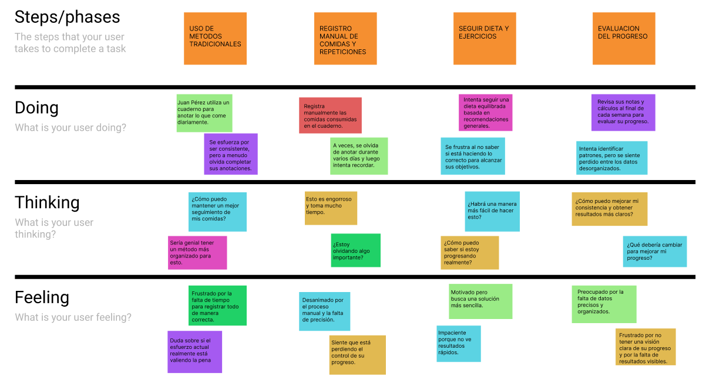

<h1 style="text-align: center;"> Informe del Trabajo Final </h1>
<h3 style="text-align: center;"> Universidad Peruana de Ciencias Aplicadas </h3>

<h5 style="text-align: center"> Área: Ingeniería de Software </h5>

<h5 style="text-align: center"> Curso: Desarrollo de Aplicaciones Open Source </h5>
<h5 style="text-align: center"> Sección: SW51 </h5>

<h5 style="text-align: center"> Docente: Hugo Allan Mori Paiva </h5>

<h5 style="text-align: center"> Startup: VidaActiva </h5>

<h5 style="text-align: center"> Producto: NutriMove </h5>

## Team members:

|                Nombre                 |   Código   |
| :-----------------------------------: | :--------: |
| Bohorquez Lerzundi, Gerardo Sebastián | U202224149 |
|     Luza Carhuamaca, Jose Adrian      | U202213404 |
|    Jimenez Melgar, Daniel Luciano     | U20221a569 |
|   Silva Tirado, Sebastián Valentino   | U20211g296 |
|     Uribe Quispe, Jesús Guillermo     | U202221876 |

<h5 style="text-align: center"> Ciclo 2024-02 </h5>

# Registro de Versiones del Informe
El objetivo de esta sección es resumir las modificaciones relevantes que se realizan al informe durante el ciclo de vida del proyecto. Esta sección inicia en una página nueva y se incluye un cuadro con la siguiente estructura:

| **Versión** | **Fecha** | **Autor** | **Descripción de Modificación** |
|-------------|-----------|-----------|---------------------------------|
|    TB1      |     4/09/2024      |    Todos        |      Añadimos los capítulos 1, 2, 3, 4 y 5. Además se tomó en cuenta la creación de los prototipos en dispositivos móviles. |

## Project Report Collaboration Insights

URL del repositorio para el reporte del proyecto:

  

  

  

**TB1**

Para el desarrollo del informe perteneciente a la entrega TB1, se dividió la implementación de secciones de la siguiente forma para cada integrante del equipo:

| Integrante | Tareas Asignadas |
| ---------- | ---------------- |

**Github Collaboration Insights**

Github también presenta un timeline de las ramas principales y los procesos de merge a los que se han sometido. Todas las ramas se crearon tomando en cuenta el diseño de GitFlow para una buena organización cuando se usa un software de control de versiones.

Los integrantes son:

## STUDENT OUTCOME
<b>ABET – EAC - Student Outcome 3</b>

| Criterio específico                                                                                                                                              | Acciones realizadas                                                                                                                                                      | Conclusiones                                                                                                                                   |
|------------------------------------------------------------------------------------------------------------------------------------------------------------------|--------------------------------------------------------------------------------------------------------------------------------------------------------------------------|-----------------------------------------------------------------------------------------------------------------------------------------------|
| Comunica oralmente con efectividad a diferentes rangos de audiencia.      | **Luza Carhuamaca, Jose Adrian**   **TB1:**   (TB1)       **Bohorquez Lerzundi, Gerardo Sebastián**   **TB1:**   (TB1)       **Jimenez Melgar, Daniel Luciano**   **TB1:**   (TB1)       **Silva Tirado, Sebastián Valentino**   **TB1:**   (TB1)       **Uribe Quispe, Jesús Guillermo**   **TB1:**   (TB1)  | **Luza Carhuamaca, Jose Adrian**   **TB1:**   (TB1)       **Bohorquez Lerzundi, Gerardo Sebastián**   **TB1:**   (TB1)       **Jimenez Melgar, Daniel Luciano**   **TB1:**   (TB1)       **Silva Tirado, Sebastián Valentino**   **TB1:**   (TB1)       **Uribe Quispe, Jesús Guillermo**   **TB1:**   (TB1)  |.                  Para                                                                                                                  |
| Comunica por escrito con efectividad a diferentes rangos de audiencia.  | **Luza Carhuamaca, Jose Adrian**   **TB1:**   (TB1)       **Bohorquez Lerzundi, Gerardo Sebastián**   **TB1:**   (TB1)       **Jimenez Melgar, Daniel Luciano**   **TB1:**   (TB1)       **Silva Tirado, Sebastián Valentino**   **TB1:**   (TB1)       **Uribe Quispe, Jesús Guillermo**   **TB1:**   (TB1)   | **Luza Carhuamaca, Jose Adrian**   **TB1:**   (TB1)       **Bohorquez Lerzundi, Gerardo Sebastián**   **TB1:**   (TB1)       **Jimenez Melgar, Daniel Luciano**   **TB1:**   (TB1)       **Silva Tirado, Sebastián Valentino**   **TB1:**   (TB1)       **Uribe Quispe, Jesús Guillermo**   **TB1:**   (TB1)  

## Contenido

1. [**Capítulo I: Introducción.**](#1.)  
   1.1. [Startup Profile.](#1.1.)  
   1.1.1. [Descripción del startup.](#1.1.1.) 
   1.1.2.[Perfiles de los integrantes del equipo.](#1.1.2.) 
   1.2. [Solution Profile.](#1.2.) 
   1.2.1. [Antecedentes y Problemática.](#1.2.1.) 
   1.2.2. [Lean UX Process.](#1.2.2.) 
   1.2.2.1 [Lean UX Problem Statements.](#1.2.2.1.) 
   1.2.2.2. [Lean UX Assumptions.](#1.2.2.2.) 
   1.2.2.3 [Lean UX Hypothesis Statements.](#1.2.2.3.) 
   1.2.2.4 [Lean UX Canvas.](#1.2.2.4.) 
   1.2.2.5. [Segmentos objetivo.](#1.2.2.5.)  
2. [**Capítulo II: Requirements Elicitation & Analysis.**](#2.) 
   2.1. [Competidores.](#2.1.) 
   2.1.1. [Análisis competitivo.](#2.1.1.) 
   2.1.2. [Estrategias y tácticas frente a competidores.](#2.1.2.) 
   2.2. [Entrevistas.](#2.2.) 
   2.2.1. [Diseño de entrevistas.](#2.2.1.) 
   2.2.2. [Registro de entrevistas.](#2.2.2.) 
   2.2.3. [Análisis de entrevistas.](#2.2.3.) 
   2.3. [Needfinding.](#2.3.) 
   2.3.1. [User Personas.](#2.3.1.) 
   2.3.2. [User Task Matrix.](#2.3.2.) 
   2.3.3. [User Journey Mapping.](#2.3.3.) 
   2.3.4. [Empathy Mapping.](#2.3.4.) 
   2.3.5. [As-is Scenario Mapping.](#2.3.5.) 
3. [**Capítulo III: Requirements Specification.**](#3.) 
   4.1. [To-Be Scenario Mapping.](#3.1.) 
   4.2. [User Stories.](#3.2.) 
   4.3. [Impact Mapping.](#3.3.) 
   4.4. [Product Backlog.](#3.4.) 
4. [**Capítulo IV: Product Design.**](#4.) 
   4.1. [Style Guidelines.](#4.1.) 
   4.1.1. [General Style Guidelines.](#4.1.1.) 
   4.1.2. [Web Style Guidelines.](#4.1.2.) 
   4.2. [Information Architecture.](#4.2.) 
   4.2.1. [Organization Systems.](#4.2.1.) 
   4.2.2. [Labeling Systems.](#4.2.2.) 
   4.2.3. [SEO Tags and Meta Tags](#4.2.3.) 
   4.2.4. [Searching Systems.](#4.2.4.) 
   4.2.5. [Navigation Systems.](#4.2.5.) 
   4.3. [Landing Page UI Design.](#4.3.) 
   4.3.1. [Landing Page Wireframe.](#4.3.1.) 
   4.3.2. [Landing Page Mock-up.](#4.3.2.) 
   4.4. [Web Applications UX/UI Design.](#4.4.) 
   4.4.1. [Web Applications Wireframes.](#4.4.1.) 
   4.4.2. [Web Applications Wireflow Diagrams.](#4.4.2.) 
   4.4.3. [Web Applications Mock-ups.](#4.4.3.) 
   4.4.4. [Web Applications User Flow Diagrams.](#4.4.4.) 
   4.5. [Web Applications Prototyping.](#4.5.) 
   4.6. [Domain-Driven Software Architecture.](#4.6.) 
   4.6.1. [Software Architecture Context Diagram.](#4.6.1.) 
   4.6.2. [Software Architecture Container Diagrams.](#4.6.2.) 
   4.6.3. [Software Architecture Components Diagrams.](#4.6.3.) 
   4.7. [Software Object-Oriented Design.](#4.7.) 
   4.7.1. [Class Diagrams.](#4.7.1.) 
   4.7.2. [Class Dictionary.](#4.7.2.) 
   4.8. [Database Design.](#4.8.) 
   4.8.1. [Database Diagram.](#4.8.1.) 
5. [**Capítulo V: Product Implementation, Validation & Deployment.**](#5.) 
   5.1. [Software Configuration Management.](#5.1.) 
   5.1.1. [Software Development Environment Configuration.](#5.1.1.) 
   5.1.2. [Source Code Management.](#5.1.2.) 
   5.1.3. [Source Code Style Guide & Conventions.](#5.1.3.) 
   5.1.4. [Software Deployment Configuration.](#5.1.4.) 
   5.2. [Landing Page, Services & Applications Implementation.](#5.2.) 
   5.2.1. [Sprint 1.](#5.2.1.) 
   5.2.1.1. [Sprint Planning 1.](#5.2.1.1.) 
   5.2.1.2. [Sprint Backlog 1.](#5.2.1.2.) 
   5.2.1.3. [Development Evidence for Sprint Review.](#5.2.1.3.) 
   5.2.1.4. [Testing Suite Evidence for Sprint Review.](#5.2.1.4.) 
   5.2.1.5. [Execution Evidence for Sprint Review.](#5.2.1.5.) 
   5.2.1.6. [Services Documentation Evidence for Sprint Review.](#5.2.1.6.) 
   5.2.1.7. [Software Deployment Evidence for Sprint Review.](#5.2.1.7.) 
   5.2.1.8. [Team Collaboration Insights during Sprint.](#5.2.1.8.) 
6. [**Conclusiones.**](#6.) 
6.1. [Conclusiones y recomendaciones](#6.1.)
6.2. [Video About-The-Team](#6.2.)
8. [**Bibliografía.**](#7.) 
9. [**Anexos.**](#8.) 

<h2>Capítulo I: Introducción</h2>

<h3> 1.1 Startup Profile.</h3>

En esta sección se presenta la descripción del startup y los perfiles de los miembros del equipo.

<h4> 1.1.1. Descripción del startup.</h4>

VidaActiva es una startup tecnológica enfocada en transformar la manera en que las personas gestionan su bienestar personal. Nuestro producto, NutriMove, es una aplicación web integral diseñada para registrar y analizar actividades diarias relacionadas con la salud y el bienestar, como el ejercicio, la alimentación y el sueño.

**Misión:** Nuestra misión es empoderar a las personas para que tomen el control de su bienestar físico y mental, proporcionando herramientas intuitivas y datos personalizados que les permitan alcanzar sus metas de salud de manera efectiva.

**Visión:** Nuestra visión es convertirnos en la plataforma líder en bienestar personal, reconocida por su capacidad para ofrecer soluciones innovadoras y personalizadas que mejoren la calidad de vida de nuestros usuarios a nivel global.

<h4> 1.1.2. Perfiles de los integrantes del equipo.</h4>

<table align="center"  border="1" width="70%" style="text-align:center;">
    <tr align="center">
        <td rowspan="3">
             
        </td>
        <td align="left">
            <b>Nombre y Apellido:</b>
             
            Bohorquez Lerzundi, Gerardo Sebastián
        </td>
    </tr>
    <tr>
        <td align="left">
        <b>Carrera:</b>
         
        Ingeniería de Software
        </td>
    </tr>
    <tr>
        <td align="left">
        <b>Acerca de:</b>
         
        (Texto)
        </td>
    </tr>
    <tr align="center">
        <td rowspan="3">
            
        </td>
        <td align="left">
            <b>Nombre y Apellido:</b>
             
            Luza Carhuamaca, Jose Adrian
        </td>
    </tr>
    <tr>
        <td align="left">
        <b>Carrera:</b>
         
        Ingeniería de Software
        </td>
    </tr>
    <tr>
        <td align="left">
        <b>Acerca de:</b>
         
       Me encuentro cursando el 6to ciclo de mi carrera de Ingeniería de Software. Me gusta la idea de que con la programación se pueden llegar a crear muchas cosas útiles. Soy una persona ágil, responsable y transparente que trabaja bien en equipo. 
        </td>
    </tr>
    <tr align="center">
        <td rowspan="3">
            
        </td>
        <td align="left">
            <b>Nombre y Apellido:</b>
             
            Jimenez Melgar, Daniel Luciano
        </td>
    </tr>
    <tr>
        <td align="left">
        <b>Carrera:</b>
         
        Ingeniería de Software
        </td>
    </tr>
    <tr>
        <td align="left">
        <b>Acerca de:</b>
         
        (Texto)
        </td>
    </tr>
    <tr align="center">
        <td rowspan="3">
            
        </td>
        <td align="left">
            <b>Nombre y Apellido: </b>
             
            Silva Tirado, Sebastián Valentino
        </td>
    </tr>
    <tr>
        <td align="left">
        <b>Carrera:</b>
         
        Ingeniería de Software
        </td>
    </tr>
    <tr>
        <td align="left">
        <b>Acerca de:</b>
         
         Soy estudiante del 6to ciclo de la carrera de Ingeniería de Software en UPC. Opté por estudiar esta carrera porque me gusta la idea de programar y crear algo que pueda llegar a funcionar y ser útil en el mundo. Por lo cual, la universidad me da la posibilidad de estudiar y ser un profesional exitoso. Deseo ser buen integrante para mi equipo y me comprometo en hacer el mejor trabajo posible, y poder superarme más que el ciclo anterior.
        </td>
    </tr>
    <tr align="center">
        <td rowspan="3">
            
        </td>
        <td align="left">
            <b>Nombre y Apellido:</b>
             
            Uribe Quispe, Jesús Guillermo
        </td>
    </tr>
    <tr>
        <td align="left">
        <b>Carrera:</b>
         
        Ingeniería de Software
        </td>
    </tr>
    <tr>
        <td align="left">
        <b>Acerca de:</b>
         
        (Texto)
        </td>
    </tr>
	 
</table>

<h3> 1.2. Solution Profile.</h3>

<h4> 1.2.1. Antecedentes y Problemática.</h4>

**Antecedentes:**
En todo el mundo, muchas personas expresan un deseo de mejorar su salud a través del ejercicio y una alimentación más saludable. Sin embargo, aunque reconocen la importancia de la dieta en la pérdida de peso, tienden a enfocarse más en reducir o eliminar el azúcar en lugar de seguir una dieta estricta. (N.d.). Ipsos.com. (2021, Enero 18).

**Problemática:**

A pesar del interés generalizado en mejorar la salud, las personas encuentran difícil adoptar cambios sostenibles en su dieta, enfocándose principalmente en la reducción del azúcar en lugar de adoptar una estrategia más equilibrada para la pérdida de peso.

**WHAT (Qué): ¿Cuál es el problema?**
El problema es que muchas personas quieren mejorar su salud, pero no están dispuestas o no saben cómo hacer cambios dietéticos más amplios, centrándose solo en la reducción de azúcar.

**WHEN (Cuándo): ¿Cuándo sucede el problema?**
El problema surge cuando las personas deciden perder peso o mejorar su salud, pero no saben cómo hacerlo de manera efectiva y sostenible.

**WHERE (Dónde): ¿Dónde surge el problema?**
El problema se presenta en todo el mundo, pero es especialmente común en sociedades donde el acceso a información sobre salud y nutrición es limitado o confuso.

**WHO (Quién): ¿A quiénes les sucede el problema?**
El problema afecta a personas de todas las edades y géneros que están buscando perder peso o mejorar su salud, pero carecen de las herramientas o el conocimiento adecuado para hacerlo.

**WHY (Por qué): ¿Cuál es la causa del problema?**
La causa principal es la falta de conocimiento o acceso a estrategias dietéticas completas y efectivas, lo que lleva a las personas a enfocarse únicamente en reducir el azúcar en lugar de adoptar cambios dietéticos más amplios.

**HOW (Cómo): ¿Cómo llevó a los involucrados a llegar a esta situación?**
La influencia de dietas de moda, publicidad, y la falta de educación nutricional adecuada ha llevado a las personas a simplificar el proceso de pérdida de peso, enfocándose en la eliminación del azúcar como la única solución.

**HOW MUCH (Cuánto): ¿Cuánto afecta el problema?**
El problema tiene un impacto significativo en la efectividad de los esfuerzos de las personas para perder peso y mejorar su salud, ya que una reducción de azúcar por sí sola puede no ser suficiente para lograr los resultados deseados. Esto puede llevar a frustración y abandono de los esfuerzos de mejora de la salud.

<h4> 1.2.2. Lean UX Process</h4>

<h5> 1.2.2.1. Lean UX Problem Statements</h5>

<h5> 1.2.2.2. Lean UX Assumptions.</h5>

<h5> 1.2.2.3. Lean UX Hypothesis Statements.</h5>

<h5> 1.2.2.4. Lean UX Canvas.</h5>

Después de completar los pasos del proceso Lean UX, se dispone a crear el Lean UX Canvas, el cual nos permitirá obtener una perspectiva completa del problema y comenzar la investigación inicial antes de diseñar la propuesta de solución.

---

<h2>Capítulo II: REQUIREMENTS ELICITATION & ANALYSIS</h2>

En esta sección, nos adentraremos en el proceso de identificar y comprender los requisitos necesarios para un producto o servicio. Este proceso implica técnicas como entrevistas, encuestas y análisis de datos para recopilar información relevante de los usuarios y stakeholders. Luego, estos requisitos se analizan y priorizan para convertirlos en especificaciones claras y alcanzables que guíen el desarrollo del producto. Este enfoque es fundamental para asegurar que el producto final satisfaga las necesidades del usuario y cumpla con los objetivos del negocio de manera efectiva.

<h3> 2.1. Competidores.</h3>

 

Estos son:

  

- **Competidor 1:**
   

   

  

  

- **Competidor 2:**
   

  
   

  

  

- **Competidor 3:**
   

   

  

  

<h4> 2.1.1. Análisis competitivo.</h4>

<h4> 2.1.2. Estrategias y tácticas frente a competidores.</h4>

<h4>2.2. Entrevistas.</h4>

<h4> 2.2.1. Diseño de Entrevistas.</h4>

**Preguntas para el Segmento #1: Dieta saludable, comer bien, bajar de peso**

1. ¿Qué tipo de dietas ha probado en el pasado y con qué resultados?
2. ¿Qué información busca cuando está planificando sus comidas diarias?
3. ¿Con qué frecuencia revisa el contenido nutricional de los alimentos que consume?
4. ¿Cuáles son los principales desafíos que enfrenta al intentar seguir una dieta saludable?
5. ¿Cómo monitorea actualmente su progreso en la pérdida de peso?
6. ¿Qué funcionalidades desearía tener en una app para ayudarle a cumplir sus objetivos de pérdida de peso?
7. ¿Qué tan importante es para usted la personalización de recomendaciones en función de sus preferencias alimenticias?
8. ¿Le gustaría recibir alertas o recordatorios para registrar sus comidas?
9. ¿Utiliza algún dispositivo o app actualmente para rastrear su ingesta calórica? ¿Cuáles?
10. ¿Qué factores le motivan más a seguir una dieta saludable?

**Preguntas para el Segmento #2: Hacer ejercicio, rutinas**

1. ¿Qué tipo de ejercicios prefiere realizar y con qué frecuencia los practica?
2. ¿Cómo planifica sus rutinas de ejercicio semanalmente?
3. ¿Qué herramientas utiliza actualmente para seguir su progreso en el ejercicio?
4. ¿Cuáles son los mayores obstáculos que enfrenta al intentar mantener una rutina de ejercicios?
5. ¿Qué funcionalidades le gustaría ver en una app para ayudarle a mejorar su rutina de ejercicios?
6. ¿Qué tan importante es para usted la integración con dispositivos de seguimiento de fitness?
7. ¿Le gustaría recibir sugerencias personalizadas de ejercicios en función de su historial de actividad?
8. ¿Qué tan motivador le resultaría recibir notificaciones cuando alcance un nuevo objetivo de ejercicio?
9. ¿Utiliza actualmente aplicaciones para planificar o registrar sus ejercicios? ¿Cuáles?
10. ¿Qué tipo de métricas le gustaría ver en gráficos para monitorizar su progreso físico?

<h4> 2.2.2. Registro De Entrevistas.</h4>

<h4> 2.2.3. Análisis De Entrevistas.</h4>

<h3> 2.3. NeedFinding.</h4>

<h4> 2.3.1. User Persona.</h4>

En esta sección, nos adentraremos en el concepto de User Personas, una herramienta crucial en el diseño centrado en el usuario. Las User Personas son representaciones ficticias de segmentos clave de usuarios, creadas a partir de datos reales y observaciones. Cada persona encapsula las características demográficas, comportamientos, necesidades, objetivos y frustraciones de un grupo específico de usuarios.
  

**Segmento 1:**

- Nombre: María López
- Edad: 29 años
- Ocupación: Ama de casa
- Segmento: Dieta saludable, comer bien, bajar de peso
- Antecedentes: María ha ganado peso después de tener a su segundo hijo. Aunque ha intentado varias dietas, no ha logrado mantener una pérdida de peso constante.
- Comportamientos: Le gusta cocinar comidas saludables para su familia y suele buscar recetas nuevas en internet. María se siente motivada cuando ve su progreso en gráficos y desea recibir recomendaciones que se ajusten a su rutina diaria.
- Objetivos:

  - Perder peso de manera saludable.
  - Aprender más sobre nutrición.
  - Inculcar buenos hábitos alimenticios en su familia.
  - Frustraciones: María siente que las aplicaciones de dieta no consideran su estilo de vida y la necesidad de cocinar para toda la familia. Busca una solución que le ofrezca sugerencias personalizadas y realistas.

  

**Segmento 2:**

- Nombre: Juan Pérez
- Edad: 35 años
- Ocupación: Ejecutivo de ventas
- Segmento: Hacer ejercicio, rutinas
- Antecedentes: Lleva 5 años trabajando en una oficina, lo que le ha llevado a un estilo de vida sedentario. En el pasado, practicaba deportes regularmente, pero ahora le cuesta encontrar tiempo para ejercitarse.
- Comportamientos: Juan utiliza su smartphone para casi todo, desde la gestión de su agenda hasta el seguimiento de sus hábitos alimenticios. Sin embargo, no ha encontrado una aplicación que integre de manera efectiva su seguimiento de ejercicios con su dieta.
- Objetivos: - Mejorar su salud física. - Mantener un seguimiento de su dieta. - Mejorar la calidad del sueño. - Recuperar la fuerza y resistencia que tenía antes.
  Frustraciones: No le gusta tener que usar múltiples aplicaciones para diferentes aspectos de su salud y bienestar. Encuentra tedioso registrar manualmente sus rutinas de ejercicio y comidas.

   

<h4> 2.3.2. User Task Matrix.</h4>

En esta sección, nos centraremos en la User Task Matrix, una herramienta utilizada en el diseño centrado en el usuario para organizar y priorizar las tareas que los usuarios realizan al interactuar con un producto o servicio. La matriz muestra las diferentes tareas que los usuarios necesitan completar, así como la importancia y la frecuencia de cada una. 
  

| **Tareas**                   | **Marcos - propietario** |                 |
| ---------------------------- | ------------------------ | --------------- |
|                              | **Frecuencia**           | **Importancia** |
| Registrar Actividad Física   | Alta                     | Alta            |
| Seguir Recomendaciones       | Media                    | Media           |
| Visualizar Gráficos de Sueño | Media                    | Media           |
| Registrar Comidas Diarias    | Alta                     | Alta            |
| Recibir Sugerencias          | Media                    | Alta            |
| Sincronizar con Dispositivos | Media                    | Alta            |
| Personalizar Rutinas         | Media                    | Muy Alta        |
| Ajustar Ingesta Calórica     | Alta                     | Alta            |

<h4> 2.3.3. User Journey Mapping.</h4>

<h4> 2.3.4. Empathy Mapping.</h4>

<h4> 2.3.5. As-Is Scenario Mapping.</h4>

Este subapartado se centra en documentar y analizar la situación actual de los usuarios al realizar sus actividades normales sin un sistema de prevención de robos. A través de esta técnica, se identifican los procesos, comportamientos y experiencias existentes, destacando los problemas, ineficiencias y oportunidades de mejora. Este mapeo permite que el equipo de desarrollo comprenda mejor las limitaciones del contexto actual y diseñe soluciones que ofrezcan una mejora significativa en la experiencia del usuario, guiando el desarrollo hacia intervenciones más efectivas y centradas en el usuario.
  

URL del As-is Scenario Mapping: [https://www.figma.com/design/urPCgABvckNHizpcQwv44Q/%5BAs-is-Scenario-Map%5D-template-(Community)?t=N8I9BTsdEllEMynj-1]

<h4> 2.4. Ubiquitous Language.</h4>

<h2>CAPÍTULO III: REQUIREMENTS SPECIFICATION</h4>

<h3> 3.1. To-Be Scenario Mapping.</h3>

<h3> 3.2. User Stories.</h3>

<h4> 3.2.1 User Stories.</h4>

<h4> 3.2.2 Epics.</h4>

En la gestión de proyectos de desarrollo de software, los "Epics" representan una capa crucial de planificación que agrupa varias User Stories relacionadas bajo un objetivo común más amplio.

| Epic ID | Título                           | Descripción                                                                                           | Criterios de Aceptación                                                                                  | Relacionado con (User Stories)     |
|---------|----------------------------------|-------------------------------------------------------------------------------------------------------|------------------------------------------------------------------------------------------------------------|------------------------------------|
| EP001   | Gestión de Actividades de Salud  | Agrupa todas las funcionalidades relacionadas con el registro y seguimiento de actividades diarias, como alimentación, ejercicio, así como la revisión del historial | Los usuarios pueden registrar y revisar sus actividades diarias. El historial debe ser accesible y editable. | HU01, HU05, HU09, HU10            |
| EP002   | Visualización y Análisis de Progreso | Incluye las funcionalidades para visualizar gráficos y estadísticas que ayuden al usuario a analizar su progreso en términos de salud y ejercicio | Los usuarios pueden seleccionar períodos de tiempo para visualizar su progreso. Las estadísticas se deben mostrar en gráficos detallados. | HU02, HU11                        |
| EP003   | Recomendaciones y Objetivos de Salud | Se enfoca en ofrecer recomendaciones personalizadas basadas en las actividades registradas por el usuario, así como la configuración y seguimiento de objetivos de salud | Los usuarios reciben recomendaciones basadas en su progreso. Los objetivos de salud pueden configurarse y seguirse. | HU03, HU07                        |
| EP004   | Integración y Sincronización     | Este Epic cubre la integración de la aplicación con dispositivos de seguimiento y otras aplicaciones de salud para sincronizar automáticamente los datos de actividades y bienestar | Los usuarios pueden conectar sus dispositivos y aplicaciones de salud para sincronización automática. La aplicación debe manejar errores de conexión y notificar al usuario en caso de fallas. | HU04, HU12                        |
| EP005   | Gestión de Perfil de Privacidad  | Agrupa las funcionalidades relacionadas con la creación, actualización y configuración de la privacidad del perfil de usuario | Los usuarios pueden crear y actualizar su perfil con información personal. Los ajustes de privacidad se deben poder configurar y aplicar de inmediato. | HU06, HU14                        |
| EP006   | Notificaciones y Recordatorios   | Se enfoca en la funcionalidad de enviar notificaciones y recordatorios a los usuarios para el registro de sus actividades diarias | Los recordatorios deben enviarse automáticamente según la configuración del usuario. Los recordatorios adicionales se envían si el usuario no registra la actividad en el tiempo especificado. | HU08                               |
| EP007   | Comunidad y Contenido Educativo  | Funcionalidades que permiten a los usuarios acceder a una comunidad para compartir experiencias y obtener apoyo, así como acceder a contenido educativo | Los usuarios pueden interactuar con la comunidad y reportar contenido inapropiado. El contenido debe ser accesible y marcar como visto tras ser consumido. | HU13, HU15                        |
| EP008   | Landing Page                     | Funcionalidades pertenecientes a la Landing Page de NutriMove                                          | Los usuarios pueden interactuar con la Landing Page para conocer más acerca del producto                                                         | HU20, HU21, HU22, HU23, HU24, HU25 |

<h3> 3.3 Impact Mapping.</h4>

<h3> 3.4 Product Backlog.</h4>

<h2> CAPÍTULO IV: PRODUCT DESIGN</h2>

<h3> 4.1. Style Guidelines.</h3>

Nuestra paleta de colores se ha seleccionado para proporcionar un entorno digital de apoyo a la salud mental y el bienestar, tanto para los psiquiatras como para sus pacientes. El objetivo principal de nuestra plataforma es crear un espacio donde la confianza, la claridad y la seguridad sean primordiales, asegurando que la interacción entre profesionales y pacientes sea fluida y efectiva. Este enfoque se refleja en la selección de colores, que buscan transmitir calma, confiabilidad y profesionalismo. A continuación, se presenta una breve descripción de los colores que se utilizarán en nuestra aplicación:

<h4> 4.1.1. General Style Guidelines</h4>

Nuestra paleta de colores se ha seleccionado para proporcionar un entorno digital de apoyo a las personas que desean registrar o usar la aplicación. El objetivo principal de nuestra plataforma es crear un espacio donde la confianza, la claridad y la seguridad sean primordiales, asegurando que la interacción entre profesionales y pacientes sea fluida y efectiva. Este enfoque se refleja en la selección de colores, que buscan transmitir calma, confiabilidad y profesionalismo. A continuación, se presenta una breve descripción de los colores que se utilizarán en nuestra aplicación:

  

**Chromatic Colors:**

- #308C83 (Teal Profundo): Tono principal de la plataforma, evocando tranquilidad y estabilidad. Ideal para encabezados, botones de acción y elementos destacados.
- #69BFB7 (Teal Suave): Para elementos secundarios y destacados sutiles, complementando el color primario.
- #C2F2ED (Aqua Ligero): Utilizado en fondos y áreas extensas, proporcionando un entorno relajante.

**Achromatic Colors:**

- #F2F2F2 (Gris Claro): Tono neutro ideal para separar y organizar la información de manera clara.
- #0D0D0D (Negro Intenso): Principalmente para texto y detalles cruciales, asegurando legibilidad y contraste.

Estos colores están diseñados para proporcionar un ambiente calmado y profesional, adecuado al tipo de aplicación que queremos manejar.

- Typography: Montserrat

- Tipografía principal por su diseño moderno, limpio y altamente legible.

###### Scale:

- Base: El tamaño base es de 18px.
- Ratio: Utilizaremos un ratio de escala de 1.2.

###### Nomenclature:

- Heading 0: 22px / Medium
- Heading 1: 38px / Medium
- Heading 2: 34px / Medium
- Heading 3: 25px / Medium
- Heading 4: 22px / Medium
- Base: 18px / Light
- Body 1: 10px / Regular

<h4> 4.1.2. Web Style Guidelines</h4>

Las Web Style Guidelines de nuestra aplicación han sido desarrolladas con el objetivo de ofrecer una experiencia de usuario óptima y consistente en todos los dispositivos. Nuestra plataforma está diseñada bajo los principios de Web Responsive Design, asegurando que cada elemento se ajuste fluidamente a diferentes tamaños de pantalla.

Uno de los enfoques clave en el diseño de nuestra interfaz es la implementación del patrón de diseño en forma de Z. Este patrón guía intuitivamente el ojo del usuario a través de la página, comenzando desde la esquina superior izquierda y terminando en la esquina inferior derecha, facilitando el acceso rápido a la información más importante.

<h3> 4.2. Information Architecture</h4>

Esta sección se enfoca en los elementos esenciales de contenido visual, estilos, etiquetas, y más, que se considerarán en el desarrollo de la web y la landing page.

<h4> 4.2.1 Organization Systems</h4>

**Menú Principal:**

- Home: Vista general del servicio y características clave.
  Suscripciones: Página que ofrece los planes de suscripción con beneficios exclusivos.
- Testimonials: Página de testimonios con comentarios y calificaciones sobre el servicio.
- Contact: Página de contacto con diferentes métodos de interacción.
- Log In: Página de inicio de sesión y registro.

**Page of Subscriptions:**

- Lista de planes de suscripción: Muestra todos los planes disponibles.
- Detalles de planes: Información detallada de cada plan.

**Page of Testimonials:**

- Lista de comentarios: Títulos de los comentarios más recientes.
- Detalles de los comentarios: Descripción detallada del comentario seleccionado.

**Page of Contact:**

- Lista de Contactos: Métodos de contacto disponibles.

**Page of Log In:**

- Registro y Autenticación: Vista general del servicio con opción de iniciar sesión o registrarse.
