<h1 style="text-align: center;"> Informe del Trabajo Final </h1>
<h3 style="text-align: center;"> Universidad Peruana de Ciencias Aplicadas </h3>

<h5 style="text-align: center"> Área: Ingeniería de Software </h5>

<h5 style="text-align: center"> Curso: Desarrollo de Aplicaciones Open Source </h5>
<h5 style="text-align: center"> Sección: SW51 </h5>

<h5 style="text-align: center"> Docente: Hugo Allan Mori Paiva </h5>

<h5 style="text-align: center"> Startup: VidaActiva </h5>

<h5 style="text-align: center"> Producto: NutriMove </h5>

## Team members:

|                Nombre                 |   Código   |
| :-----------------------------------: | :--------: |
| Bohorquez Lerzundi, Gerardo Sebastián | U202224149 |
|     Luza Carhuamaca, Jose Adrian      | U202213404 |
|   Silva Tirado, Sebastián Valentino   | U20211g296 |
|     Uribe Quispe, Jesús Guillermo     | U202221876 |

<h5 style="text-align: center"> Ciclo 2024-02 </h5>

# Registro de Versiones del Informe

El objetivo de esta sección es resumir las modificaciones relevantes que se realizan al informe durante el ciclo de vida del proyecto. Esta sección inicia en una página nueva y se incluye un cuadro con la siguiente estructura:

| Versión |   Fecha    |                 Autor                 | Descripción de modificación                                                                                                                                                          |
| :-----: | :--------: | :-----------------------------------: | ------------------------------------------------------------------------------------------------------------------------------------------------------------------------------------ |
|   TB1   | 06/09/2024 | Bohórquez Lerzundi, Gerardo Sebastián | Startup Profile, Lean UX Assumptions, Solution Profile, Lean UX Process, To-Be Scenario Mapping, Registro de entrevistas                                                             |
|   TB1   | 06/09/2024 |    Jimenez Melgar, Daniel Luciano     | Lean UX, Hypothesis Statements, LEntrevistasts, Descripción de la Startup, Análisis competitivo, Empathy Mapping, User Stories, Capítulo 4                                           |
|   TB1   | 06/09/2024 |     Luza Carhuamaca, Jose Adrian      | User Personas, Diseño de entrevistas, Epics, User Task Matrix, As-is Scenario, Mapping, Lean UX Canvas, Capítulo 4                                                                   |
|   TB1   | 06/09/2024 |   Silva Tirado, Sebastian Valentino   | Entrevistas, Impact Mapping, Antecedentes y problemática, User Journey Mapping, Análisis de entrevistas, Ubiquitous Language, Capítulo 5                                             |
|   TB1   | 06/09/2024 |     Uribe Quispe, Jesús Guillermo     | Product Backlog, Estrategias y tácticas frente a competidores, Competidores, Segmentos objetivos, Needfinding, Capítulo 4                                                            |
|   TP1   | 26/09/2024 | Bohórquez Lerzundi, Gerardo Sebastián | Sprint 2, Execution Evidence for Sprint Review.                                                                                                                                      |
|   TP1   | 26/09/2024 |    Jimenez Melgar, Daniel Luciano     | Sprint Planning 2, Services Documentation Evidence for Sprint Review.                                                                                                                |
|   TP1   | 26/09/2024 |     Luza Carhuamaca, Jose Adrian      | Sprint Backlog 2, Software Deployment Evidence for Sprint Review.                                                                                                                    |
|   TP1   | 26/09/2024 |   Silva Tirado, Sebastian Valentino   | Development Evidence for Sprint Review, Team Collaboration Insights during Sprint                                                                                                    |
|   TP1   | 26/09/2024 |     Uribe Quispe, Jesús Guillermo     | Testing Suite Evidence for Sprint Review, Team Collaboration Insights during Sprint                                                                                                  |
|   TB2   | 29/10/2024 | Bohorquez Lerzundi Gerardo Sebastian  | Sprint Planning #3 - Services Documentation Evidence for Sprint Review - Registro de Entrevistas - Video About-the-Team                                                              |
|   TB2   | 29/10/2024 |     Luza Carhuamaca, Jose Adrian      | Sprint Backlog #3 - Software Deployment Evidence for Sprint Review - Evaluaciones según heurísticas - Funcionalidad Actividades - Funcionalidad de Perfil - funcionalidad de rutinas |
|   TB2   | 29/10/2024 |   Silva Tirado, Sebastian Valentino   | Testing Suite Evidence for Sprint Review - Team Collaboration Insights during Sprint - Video About-the-Product - Funcionalidad de Dieta - Funcionalidad de rutinas                   |
|   TB2   | 29/10/2024 |     Uribe Quispe, Jesús Guillermo     | Execution Evidence for Sprint Review - Diseño de Entrevistas - Conclusiones y recomendaciones - Funcionalidad de análisis - Funcionalidad Dashboard |
|   TF1   | 12/11/2024 | Bohorquez Lerzundi Gerardo Sebastian  | Sprint Planning 4, Services Documentation Evidence for Sprint Review.  |
|   TF1   | 12/11/2024 |     Luza Carhuamaca, Jose Adrian      | Development Evidence for Sprint Review, Team Collaboration Insights during Sprint  |
|   TF1   | 12/11/2024 |   Silva Tirado, Sebastian Valentino   | Testing Suite Evidence for Sprint Review, Team Collaboration Insights during Sprint  |
|   TF1   | 12/11/2024 |     Uribe Quispe, Jesús Guillermo     | Sprint Backlog 4, Software Deployment Evidence for Sprint Review.  |

## Project Report Collaboration Insights

URL del repositorio para el reporte del proyecto: https://github.com/TFOpenSource

  

**TB1**

Para el desarrollo del informe perteneciente a la entrega TB1, se dividió la implementación de secciones de la siguiente forma para cada integrante del equipo:

| Integrante                            | Tareas Asignadas                                                                                                                           |
| ------------------------------------- | ------------------------------------------------------------------------------------------------------------------------------------------ |
| Bohórquez Lerzundi, Gerardo Sebastián | Startup Profile, Lean UX Assumptions, Solution Profile, Lean UX Process, To-Be Scenario Mapping, Registro de entrevistas                   |
| Jimenez Melgar, Daniel Luciano        | Lean UX, Hypothesis Statements, LEntrevistasts, Descripción de la Startup, Análisis competitivo, Empathy Mapping, User Stories, Capítulo 4 |
| Luza Carhuamaca, Jose Adrian          | User Personas, Diseño de entrevistas, Epics, User Task Matrix, As-is Scenario, Mapping, Lean UX Canvas, Capítulo 4                         |
| Silva Tirado, Sebastian Valentino     | Entrevistas, Impact Mapping, Antecedentes y problemática, User Journey Mapping, Análisis de entrevistas, Ubiquitous Language, Capítulo 5   |
| Uribe Quispe, Jesús Guillermo         | Product Backlog, Estrategias y tácticas frente a competidores, Competidores, Segmentos objetivos, Needfinding, Capítulo 4                  |

**TP1**

Para la elaboración del informe correspondiente a la entrega TP1, la implementación de las secciones se asignó a cada integrante del equipo de la siguiente manera:

| Integrante                            | Tareas Asignadas                                                                    |
| ------------------------------------- | ----------------------------------------------------------------------------------- |
| Bohórquez Lerzundi, Gerardo Sebastián | Sprint 2, Execution Evidence for Sprint Review.                                     |
| Jimenez Melgar, Daniel Luciano        | Sprint Planning 2, Services Documentation Evidence for Sprint Review.               |
| Luza Carhuamaca, Jose Adrian          | Sprint Backlog 3, Software Deployment Evidence for Sprint Review.                   |
| Silva Tirado, Sebastian Valentino     | Development Evidence for Sprint Review, Team Collaboration Insights during Sprint   |
| Uribe Quispe, Jesús Guillermo         | Testing Suite Evidence for Sprint Review, Team Collaboration Insights during Sprint |

**TB2**

Para la elaboración del informe correspondiente a la entrega TB2, la implementación de las secciones se asignó a cada integrante del equipo de la siguiente manera:

| Integrante                           | Tareas Asignadas                                                                                                                                                                     |
| ------------------------------------ | ------------------------------------------------------------------------------------------------------------------------------------------------------------------------------------ |
| Bohorquez Lerzundi Gerardo Sebastian | Sprint Planning #3 - Services Documentation Evidence for Sprint Review - Registro de Entrevistas - Video About-the-Team                                                              |
| Luza Carhuamaca, Jose Adrian         | Sprint Backlog #3 - Software Deployment Evidence for Sprint Review - Evaluaciones según heurísticas - Funcionalidad Actividades - Funcionalidad de Perfil - funcionalidad de rutinas |
| Silva Tirado, Sebastian Valentino    | Testing Suite Evidence for Sprint Review - Team Collaboration Insights during Sprint - Video About-the-Product - Funcionalidad de Dieta - Funcionalidad de rutinas                   |
| Uribe Quispe, Jesús Guillermo        | Execution Evidence for Sprint Review - Diseño de Entrevistas - Conclusiones y recomendaciones - Funcionalidad de análisis - Funcionalidad Dashboard |

**TF1**

Para la elaboración del informe correspondiente a la entrega TF1, la implementación de las secciones se asignó a cada integrante del equipo de la siguiente manera:

| Integrante                            | Tareas Asignadas                                                                    |
| ------------------------------------- | ----------------------------------------------------------------------------------- |
| Bohórquez Lerzundi, Gerardo Sebastián | Sprint Planning 4, Services Documentation Evidence for Sprint Review.   |
| Luza Carhuamaca, Jose Adrian          | Development Evidence for Sprint Review, Team Collaboration Insights during Sprint   |
| Silva Tirado, Sebastian Valentino     | Testing Suite Evidence for Sprint Review, Team Collaboration Insights during Sprint   |
| Uribe Quispe, Jesús Guillermo         | Sprint Backlog 4, Software Deployment Evidence for Sprint Review.   |

**Github Collaboration Insights**

Github también presenta un timeline de las ramas principales y los procesos de merge a los que se han sometido. Todas las ramas se crearon tomando en cuenta el diseño de GitFlow para una buena organización cuando se usa un software de control de versiones.

  

Los integrantes son:

- Bohórquez Lerzundi, Gerardo Sebastián | (Sebasbl562)
- Luza Carhuamaca, Jose Adrian | (Adrianluza1)
- Silva Tirado, Sebastian Valentino | (SebasSilvaT)
- Uribe Quispe, Jesús Guillermo | (JesusU27)

## STUDENT OUTCOME

ABET – EAC - Student Outcome 3: Capacidad de comunicarse efectivamente con un rango de audiencias.
<b>ABET – EAC - Student Outcome 3</b>

<table style="border-collapse:collapse;border-spacing:0" class="tg"><thead><tr><th style="border-color:inherit;border-style:solid;border-width:1px;font-family:Arial, sans-serif;font-size:14px;font-weight:normal;overflow:hidden;padding:10px 5px;text-align:left;vertical-align:top;word-break:normal">Criterio específico</th><th style="border-color:inherit;border-style:solid;border-width:1px;font-family:Arial, sans-serif;font-size:14px;font-weight:normal;overflow:hidden;padding:10px 5px;text-align:left;vertical-align:top;word-break:normal">Acciones realizadas</th><th style="border-color:inherit;border-style:solid;border-width:1px;font-family:Arial, sans-serif;font-size:14px;font-weight:normal;overflow:hidden;padding:10px 5px;text-align:left;vertical-align:top;word-break:normal">Conclusiones</th></tr></thead>
<tbody>
<tr><td style="border-color:inherit;border-style:solid;border-width:1px;font-family:Arial, sans-serif;font-size:14px;overflow:hidden;padding:10px 5px;text-align:left;vertical-align:top;word-break:normal">Comunica oralmente con efectividad a diferentes rangos de audiencia.</td>
<td style="border-color:inherit;border-style:solid;border-width:1px;font-family:Arial, sans-serif;font-size:14px;overflow:hidden;padding:10px 5px;text-align:left;vertical-align:top;word-break:normal">Luza Carhuamaca, Jose Adrian  TB1:  Me enfoqué en transmitir de manera clara las ideas del proyecto a todos los involucrados. Organicé presentaciones sobre los perfiles de usuario para asegurar que el equipo comprendiera las necesidades y expectativas de quienes utilizarán la plataforma. Expliqué de forma detallada el marco estratégico del Lean UX Canvas y los principios de diseño visual, permitiendo que los conceptos complejos fueran entendidos de forma sencilla. Además, guié al equipo a través de la estructura de navegación de la plataforma, facilitando una visión común del flujo del usuario.     Bohorquez Lerzundi, Gerardo Sebastián  TB1:  Participé en la elaboración y presentación del proyecto, incluyendo la descripción, el Lean UX Process, y los diagramas de arquitectura, comunicando nuestras ideas y avances claramente a diferentes audiencias.     Jimenez Melgar, Daniel Luciano  TB1:  Realicé los Lean UX Hypothesis Statements y los Problem Statements, una descripción detallada de la startup, realicé un análisis competitivo, elaboré los Empathy Mapping de los usuarios, creé User Stories basadas en sus expectativas y diseñe wireframe y el mockup de la landing page, así como el wireframe de la aplicación web.     Silva Tirado, Sebastián Valentino  TB1:   En el primer entregable me encargué de recopilar los antecedentes y problemáticas enfocados a nuestro proyecto y así sustentarlo, entrevistas y lo que depende de ello y la unidad cinco.      Uribe Quispe, Jesús Guillermo  TB1:  Mediante llamados, organicé al equipo para poder completar exitosamente este primer entregable. La comunicación nos ayudó a entendernos mejor y a ir todos en una misma dirección, asi como también generar un buen entorno.   Luza Carhuamaca, Jose Adrian  TP1: Mostré habilidades sólidas al adaptar su lenguaje y tono al tipo de audiencia durante las presentaciones grupales, empleando ejemplos claros y relevantes para cada contexto. Además, utilizó herramientas visuales efectivas para transmitir sus ideas.   Bohorquez Lerzundi, Gerardo Sebastián  TP1:  Destaqué por la claridad y precisión en sus exposiciones, logrando captar la atención de audiencias técnicas y no técnicas. Fue capaz de responder preguntas y clarificar dudas de manera adecuada durante las sesiones de feedback.   Jimenez Melgar, Daniel Luciano  TP1:  Mostré un dominio significativo en sus presentaciones orales, empleando un lenguaje técnico cuando se dirigía a sus compañeros y simplificando conceptos para un público más general. Utilizó recursos multimedia para mejorar su exposición.   Silva Tirado, Sebastián Valentino  TP1:  Me preparé para organizar y desarrollar parte del Web App   Uribe Quispe, Jesús Guillermo  TP1: Distinguí por su habilidad para conectar con la audiencia a través de un lenguaje claro y un enfoque estructurado. Adaptó su tono y profundidad de los temas según las necesidades del público, logrando un alto grado de interacción.     Luza Carhuamaca, Jose Adrian  TB2:  Durante el Sprint Review, presenté los avances en la funcionalidad de Actividades, Perfil y Rutinas, explicando de manera clara y adaptada a cada tipo de audiencia los beneficios y el estado de cada funcionalidad. Enfaticé cómo estas mejoras cumplirían con los criterios de evaluación según las heurísticas y detallé su impacto en la experiencia del usuario. Mi objetivo fue asegurarme de que tanto los miembros técnicos como no técnicos del equipo comprendieran los objetivos alcanzados y los próximos pasos en el desarrollo, promoviendo un entendimiento común y fomentando la retroalimentación efectiva.     Bohorquez Lerzundi, Gerardo Sebastián  TB2:  En este sprint, me esforcé en comunicarme claramente con mi equipo, participando activamente en discusiones y análisis durante el Sprint Planning #3 y el video "About-the-Team".     Silva Tirado, Sebastian Valentino  TB2:  Como este tercer entregable aporté con la actualización del documento e implementación para el front y back end.      Uribe Quispe, Jesús Guillermo  TB2:   Para este entregable me propuse gestionar las tareas para cada uno de los integrantes realizandolo de manera oral clara y concisa para el desarrollo exitoso del proyecto Nutrimove.   Luza Carhuamaca, Jose Adrian  TF1: Durante el Sprint Review, presenté ...   Bohorquez Lerzundi, Gerardo Sebastián TF1: En este sprint, ...  Silva Tirado, Sebastian Valentino TF1: Para este último entregable completé efectivamente mis tareas y a tiempo como las creación y configuración de tres endpoints. Además de ayudar a mis compañeros.   Uribe Quispe, Jesús Guillermo TF1: Para este entregable ...</td>
<td style="border-color:inherit;border-style:solid;border-width:1px;font-family:Arial, sans-serif;font-size:14px;overflow:hidden;padding:10px 5px;text-align:left;vertical-align:top;word-break:normal">Luza Carhuamaca, Jose Adrian TB1:  Estas acciones me permitieron conectar con los miembros del equipo, garantizando que todos compartieran una visión clara del proyecto. La comunicación cara a cara ayudó a fomentar un ambiente colaborativo, donde las ideas y sugerencias podían fluir libremente, mejorando así la toma de decisiones y la eficiencia del equipo.    Bohorquez Lerzundi, Gerardo Sebastián TB1:  Esta experiencia fortaleció mi capacidad para explicar conceptos de manera efectiva a diversos grupos, adaptando mi comunicación para asegurar que todos comprendieran y se alinearan con los objetivos del proyecto.    Jimenez Melgar, Daniel Luciano TB1:  Gracias a estas acciones, logré comunicar mis ideas y avances a diferentes tipos de audiencia, adaptando algunos detalles. Esto me permitió presentar una propuesta bien estructurada para la startup.    Silva Tirado, Sebastián Valentino TB1:  Se realizó un excelente primer avance del trabajo, cumpliendo con todos los aspectos del proyecto, lo que nos permitió entregar un resultado de calidad.    Uribe Quispe, Jesús Guillermo TB1:  Acerca de este trabajo aprendí más sobre la colaboración y organización con un equipo, a pesar de inconvenientes que pudimos tener, logramos completar exitosamente este primer entregable.  Luza Carhuamaca, Jose Adrian  TP1: Demostré una comunicación oral efectiva al presentar conceptos técnicos de manera comprensible para diversos tipos de audiencia, desde compañeros hasta profesores, ajustando su estilo según el público.  Bohorquez Lerzundi, Gerardo Sebastián  TP1:  Comuniqué ideas con éxito, demostrando su habilidad para ajustar su discurso a diferentes públicos y manteniendo un alto nivel de efectividad en la transmisión de información compleja.   Jimenez Melgar, Daniel Luciano  TP1:  Comuniqué de manera efectiva a diversos rangos de audiencia, demostrando una flexibilidad en su forma de presentación y garantizando que su mensaje fuera entendido por todos los participantes.   Silva Tirado, Sebastián Valentino  TP1: Concluyo que fue conveniente el entregable para actualizar la pagina web siendo intuitivo   Uribe Quispe, Jesús Guillermo  TP1: Demostré ser un comunicador oral efectivo al transmitir información técnica a audiencias con distintos niveles de conocimiento, manteniendo un enfoque adecuado y comprensible.      Luza Carhuamaca, Jose Adrian  TB2:  Al final del Sprint Review, logré comunicar efectivamente los avances y la relevancia de cada funcionalidad desarrollada, adaptando mi mensaje según las necesidades de cada audiencia. Esto facilitó una comprensión más profunda de los objetivos y resultados del sprint, asegurando el alineamiento de todos los involucrados y logrando una retroalimentación valiosa que guiará las próximas iteraciones.     Bohorquez Lerzundi, Gerardo Sebastián  TB2:  En este sprint, me esforcé en comunicarme claramente con mi equipo, participando activamente en discusiones y análisis durante el Sprint Planning #3 y el video "About-the-Team".)     Silva Tirado, Sebastián Valentino  TB2:  Concluyo que me ayudó mucho en organizarme mejor y distribuir mejor las tareas.      Uribe Quispe, Jesús Guillermo  TB2:  Como conclusión, he podido aprender que la mejor forma de avanzar juntos como equipo en el proyecto es hablar de forma clara.  Luza Carhuamaca, Jose Adrian TF1: Durante el Sprint Review, presenté ...   Bohorquez Lerzundi, Gerardo Sebastián TF1: En este sprint, ...  Silva Tirado, Sebastian Valentino TF1: Como conclusión de este último entregable me ayudó mucho a comunicarme con mi grupo para las diversas tareas, también en mejorar nuestra organización.   Uribe Quispe, Jesús Guillermo TF1: Para este entregable ...</td>
</tr>
<tr><td style="border-color:inherit;border-style:solid;border-width:1px;font-family:Arial, sans-serif;font-size:14px;overflow:hidden;padding:10px 5px;text-align:left;vertical-align:top;word-break:normal">Comunica por escrito con efectividad a diferentes rangos de audiencia.</td>
<td style="border-color:inherit;border-style:solid;border-width:1px;font-family:Arial, sans-serif;font-size:14px;overflow:hidden;padding:10px 5px;text-align:left;vertical-align:top;word-break:normal">Luza Carhuamaca, Jose Adrian TB1:  Preparé documentación exhaustiva para respaldar cada fase del proyecto, asegurando que la información fuera comprensible y accesible para todos. Desarrollé perfiles detallados de los usuarios y guías de entrevistas. Creé descripciones claras y completas de las tareas principales y las funciones del usuario para guiar el desarrollo. También redacté el Lean UX Canvas y las directrices de estilo, detallando desde los colores y la tipografía hasta la estructura de la información, lo cual ayudó a mantener la coherencia en el diseño y la implementación del proyecto.    Bohorquez Lerzundi, Gerardo Sebastián TB1:  Redacté documentos clave como el Startup Profile, Lean UX Assumptions y el registro de entrevistas, asegurando que la información fuera clara y comprensible para todos.    Jimenez Melgar, Daniel Luciano TB1:  Redacté el Lean UX Hypothesis Statements y Problem Statements, realicé una descripción detallada de la startup, redacté el análisis competitivo y las User Stories.    Silva Tirado, Sebastián Valentino TB1:  En la primera etapa, me encargué de recopilar los antecedentes y las problemáticas relevantes para nuestro proyecto, proporcionando así una base sólida para su sustento, también en la comunicación escrita por medio del informe.   Uribe Quispe, Jesús Guillermo TB1:  Preparé la esquematización del informe, la realización de competidores, estrategias frente a estas, user stories, product backlog, diseño de base de datos y diagrama de clases, asi como también el diseño y realización de la landing page y web application.  Luza Carhuamaca, Jose Adrian  TP1: Redacté la documentación técnica de la Web App, utilizando un lenguaje claro y detallado para los desarrolladores, y un tono más accesible en los informes dirigidos a los stakeholders. Además, realizó reportes claros sobre los avances del proyecto en el Sprint #2.   Bohorquez Lerzundi, Gerardo Sebastián  TP1:  Me encargué de escribir las guías de usuario para la Web App, dirigiéndose a usuarios finales con instrucciones simples y precisas. Además, redactó tickets detallados para los desarrolladores con especificaciones técnicas en términos más especializados.   Jimenez Melgar, Daniel Luciano  TP1:  Fuí responsable de crear el informe final del Sprint #2 y redactar la documentación de la API, empleando un lenguaje técnico adecuado para los desarrolladores. También escribió resúmenes ejecutivos accesibles para los stakeholders no técnicos.   Silva Tirado, Sebastián Valentino  TP1:  Elaboré de manera efectiva la comunicación del proyecto ya sea en el informe y aplicación    Uribe Quispe, Jesús Guillermo  TP1: Redacté el plan de pruebas de la Web App y un informe general de los resultados de las pruebas. Utilizó un lenguaje preciso y técnico para el equipo de desarrollo, mientras que los reportes entregados a los stakeholders fueron más concisos y comprensibles.      Luza Carhuamaca, Jose Adrian  TB2:   Para documentar el Sprint Review y las evaluaciones realizadas según las heurísticas, redacté un informe que detalla el estado actual de las funcionalidades de Actividades, Perfil y Rutinas. En el informe, utilicé un lenguaje accesible para todos los niveles de audiencia, incluyendo detalles técnicos cuando era relevante para el equipo de desarrollo y resúmenes claros para otros stakeholders.      Bohorquez Lerzundi, Gerardo Sebastián  TB2:  En este sprint, me esforcé en comunicarme claramente con mi equipo, participando activamente en discusiones y análisis durante el Sprint Planning #3 y el video "About-the-Team".     Silva Tirado, Sebastián Valentino  TB2:  Aprendí más para que sirve los sprrint y como ayuda a lo largo de los entregable junto a los user stories.      Uribe Quispe, Jesús Guillermo  TB2:  redacté las tareas asignadas mediante grupos de aplicaciones de mensajería y llamadas, así como también en los reportes entregados anteriormente.   Luza Carhuamaca, Jose Adrian TF1: Durante el Sprint Review, presenté ...   Bohorquez Lerzundi, Gerardo Sebastián TF1: En este sprint, ...  Silva Tirado, Sebastian Valentino TF1: Como último entregable logré mis tareas efectivamente y transmitiendo completamente en el documento del trabajo, completando varios campos y asentando las bases.  Uribe Quispe, Jesús Guillermo TF1: Para este entregable ...</td>
<td style="border-color:inherit;border-style:solid;border-width:1px;font-family:Arial, sans-serif;font-size:14px;overflow:hidden;padding:10px 5px;text-align:left;vertical-align:top;word-break:normal">Luza Carhuamaca, Jose Adrian TB1:  La creación de estos documentos me permitió transmitir ideas complejas de una manera estructurada, facilitando el entendimiento y la colaboración entre todos. La documentación escrita proporcionó una base sólida para el desarrollo del proyecto, ayudando a prevenir malentendidos y asegurando que todos los involucrados estuvieran alineados con los objetivos.    Bohorquez Lerzundi, Gerardo Sebastián  TB1:  Este trabajo me permitió mejorar mi habilidad para comunicarme por escrito de manera efectiva, ajustando el contenido y el tono según la audiencia para facilitar el entendimiento y la toma de decisiones.    Jimenez Melgar, Daniel Luciano  TB1:  Estas acciones me permitieron mejorar mis habilidades de comunicación escrita, adaptando cada mensaje a la audiencia específica y garantizando que la información fuera  precisa.    Silva Tirado, Sebastián Valentino  TB1: Como equipo, logramos este primer entregale establecer un landing page comunicando efectivamente que nos permitirá entregar un trabajo completo a posteriormene a pesar del desafío que representaban los plazos cortos para la entrega del proyecto.    Uribe Quispe, Jesús Guillermo TB1:  Mediante la herramienta MarkDown he podido transmitir las ideas de buena manera estructuralmente hablando, ya que, la base para todo informe es el orden y la estructura de esta.      Luza Carhuamaca, Jose Adrian  TP1: Demostré una excelente capacidad para comunicar por escrito a diferentes audiencias, entregando documentos comprensibles tanto para técnicos como para no técnicos, lo que facilitó la comprensión del desarrollo de la Web App por todos los involucrados.   Bohorquez Lerzundi, Gerardo Sebastián  TP1:  Comuniqué por escrito de manera efectiva, ajustando su estilo de redacción según el público objetivo, lo que permitió una mejor implementación de las tareas del equipo y una correcta comprensión de la Web App por parte de los usuarios finales.   Jimenez Melgar, Daniel Luciano  TP1:  Mostré una alta efectividad en la comunicación escrita, adaptando su redacción tanto a desarrolladores como a partes interesadas con distintos niveles de conocimiento técnico, lo que mejoró la transparencia y comprensión del progreso del proyecto.   Silva Tirado, Sebastián Valentino  TP1: Concluyo que me ayudó este entregable a organizarnos mejor y repartirnos con tiempo para que el proyecto se raelice a tiempo.   Uribe Quispe, Jesús Guillermo  TP1:  Logré comunicar por escrito con gran efectividad, adaptando sus reportes y documentación a diferentes tipos de audiencia, lo que facilitó tanto la implementación técnica como el seguimiento del proyecto por parte de los stakeholders.     Luza Carhuamaca, Jose Adrian  TB2:  La documentación escrita que elaboré fue efectiva en comunicar el estado de desarrollo y evaluación de las funcionalidades de manera accesible y completa para diferentes niveles de audiencia. Gracias a esta claridad en la comunicación, el equipo y los stakeholders tienen ahora una referencia detallada y comprensible sobre el progreso y los pasos futuros     Bohorquez Lerzundi, Gerardo Sebastián  TB2:  Mejorar esta habilidad asegura mensajes claros y accesibles, facilitando una comunicación eficiente.     Silva Tirado, Sebastián Valentino  TB2:  Concluyo que este tercer entregable resultó mucho mejor que el anterior pudiendo presentar más avances y complementos para el front y back end.      Uribe Quispe, Jesús Guillermo  TB2: Comunicar por escrito de manera efectiva a diferentes rangos de audiencia es esencial para transmitir mensajes claros y lograr los objetivos de comunicación. Esta habilidad no solo mejora la comprensión, sino que también facilita la toma de decisiones y fomenta relaciones de confianza.  Luza Carhuamaca, Jose Adrian TF1: Durante el Sprint Review, presenté ...   Bohorquez Lerzundi, Gerardo Sebastián TF1: En este sprint, ...  Silva Tirado, Sebastian Valentino TF1: Concluyo que este entregable y finalización del trabajo me ayudó mucho en aprender del front y back end, sobretodo al completar las tareas y documentos en markdown.   Uribe Quispe, Jesús Guillermo TF1: Para este entregable ...</td>
</tr>
</tbody></table>

## Contenido

1. [**Capítulo I: Introducción.**](#1.)  
   1.1. [Startup Profile.](#1.1.)  
   1.1.1. [Descripción del startup.](#1.1.1.) 
   1.1.2.[Perfiles de los integrantes del equipo.](#1.1.2.) 
   1.2. [Solution Profile.](#1.2.) 
   1.2.1. [Antecedentes y Problemática.](#1.2.1.) 
   1.2.2. [Lean UX Process.](#1.2.2.) 
   1.2.2.1 [LEntrevistasts.](#1.2.2.1.) 
   1.2.2.2. [Lean UX Assumptions.](#1.2.2.2.) 
   1.2.2.3 [Lean UX Hypothesis Statements.](#1.2.2.3.) 
   1.2.2.4 [Lean UX Canvas.](#1.2.2.4.) 
   1.3. [Segmentos objetivo.](#1.3.) 
2. [**Capítulo II: Requirements Elicitation & Analysis.**](#2.) 
   2.1. [Competidores.](#2.1.) 
   2.1.1. [Análisis competitivo.](#2.1.1.) 
   2.1.2. [Estrategias y tácticas frente a competidores.](#2.1.2.) 
   2.2. [Entrevistas.](#2.2.) 
   2.2.1. [Diseño de entrevistas.](#2.2.1.) 
   2.2.2. [Registro de entrevistas.](#2.2.2.) 
   2.2.3. [Análisis de entrevistas.](#2.2.3.) 
   2.3. [Needfinding.](#2.3.) 
   2.3.1. [User Personas.](#2.3.1.) 
   2.3.2. [User Task Matrix.](#2.3.2.) 
   2.3.3. [User Journey Mapping.](#2.3.3.) 
   2.3.4. [Empathy Mapping.](#2.3.4.) 
   2.3.5. [As-is Scenario Mapping.](#2.3.5.) 
   2.4. [Ubiquitous Language](#2.4.) 
3. [**Capítulo III: Requirements Specification.**](#3.) 
   3.1. [To-Be Scenario Mapping.](#3.1.) 
   3.2. [User Stories.](#3.2.) 
   3.3. [Impact Mapping.](#3.3.) 
   3.4. [Product Backlog.](#3.4.) 
4. [**Capítulo IV: Product Design.**](#4.) 
   4.1. [Style Guidelines.](#4.1.) 
   4.1.1. [General Style Guidelines.](#4.1.1.) 
   4.1.2. [Web Style Guidelines.](#4.1.2.) 
   4.2. [Information Architecture.](#4.2.) 
   4.2.1. [Organization Systems.](#4.2.1.) 
   4.2.2. [Labeling Systems.](#4.2.2.) 
   4.2.3. [SEO Tags and Meta Tags](#4.2.3.) 
   4.2.4. [Searching Systems.](#4.2.4.) 
   4.2.5. [Navigation Systems.](#4.2.5.) 
   4.3. [Landing Page UI Design.](#4.3.) 
   4.3.1. [Landing Page Wireframe.](#4.3.1.) 
   4.3.2. [Landing Page Mock-up.](#4.3.2.) 
   4.4. [Web Applications UX/UI Design.](#4.4.) 
   4.4.1. [Web Applications Wireframes.](#4.4.1.) 
   4.4.2. [Web Applications Wireflow Diagrams.](#4.4.2.) 
   4.4.3. [Web Applications Mock-ups.](#4.4.3.) 
   4.4.4. [Web Applications User Flow Diagrams.](#4.4.4.) 
   4.5. [Web Applications Prototyping.](#4.5.) 
   4.6. [Domain-Driven Software Architecture.](#4.6.) 
   4.6.1. [Software Architecture Context Diagram.](#4.6.1.) 
   4.6.2. [Software Architecture Container Diagrams.](#4.6.2.) 
   4.6.3. [Software Architecture Components Diagrams.](#4.6.3.) 
   4.7. [Software Object-Oriented Design.](#4.7.) 
   4.7.1. [Class Diagrams.](#4.7.1.) 
   4.7.2. [Class Dictionary.](#4.7.2.) 
   4.8. [Database Design.](#4.8.) 
   4.8.1. [Database Diagram.](#4.8.1.) 
5. [**Capítulo V: Product Implementation, Validation & Deployment.**](#5.) 
   5.1. [Software Configuration Management.](#5.1.) 
   5.1.1. [Software Development Environment Configuration.](#5.1.1.) 
   5.1.2. [Source Code Management.](#5.1.2.) 
   5.1.3. [Source Code Style Guide & Conventions.](#5.1.3.) 
   5.1.4. [Software Deployment Configuration.](#5.1.4.) 
   5.2. [Landing Page, Services & Applications Implementation.](#5.2.) 
   5.2.1. [Sprint 1.](#5.2.1.) 
   5.2.1.1. [Sprint Planning 1.](#5.2.1.1.) 
   5.2.1.2. [Sprint Backlog 1.](#5.2.1.2.) 
   5.2.1.3. [Development Evidence for Sprint Review.](#5.2.1.3.) 
   5.2.1.4. [Testing Suite Evidence for Sprint Review.](#5.2.1.4.) 
   5.2.1.5. [Execution Evidence for Sprint Review.](#5.2.1.5.) 
   5.2.1.6. [Services Documentation Evidence for Sprint Review.](#5.2.1.6.) 
   5.2.1.7. [Software Deployment Evidence for Sprint Review.](#5.2.1.7.) 
   5.2.1.8. [Team Collaboration Insights during Sprint.](#5.2.1.8.) 
   5.2.2. [Sprint 2.](#5.2.2.) 
   5.2.2.1. [Sprint Planning 2.](#5.2.2.1.) 
   5.2.2.2. [Sprint Backlog 2.](#5.2.2.2.) 
   5.2.2.3. [Development Evidence for Sprint Review.](#5.2.2.3.) 
   5.2.2.4. [Testing Suite Evidence for Sprint Review.](#5.2.2.4.) 
   5.2.2.5. [Execution Evidence for Sprint Review.](#5.2.2.5.) 
   5.2.2.6. [Services Documentation Evidence for Sprint Review.](#5.2.2.6.) 
   5.2.2.7. [Software Deployment Evidence for Sprint Review.](#5.2.2.7.) 
   5.2.2.8. [Team Collaboration Insights during Sprint.](#5.2.2.8.) 
   5.2.3. [Sprint 3.](#5.2.3.) 
   5.2.3.1. [Sprint Planning 3.](#5.2.3.1.) 
   5.2.3.2. [Sprint Backlog 3.](#5.2.3.2.) 
   5.2.3.3. [Development Evidence for Sprint Review.](#5.2.3.3.) 
   5.2.3.4. [Testing Suite Evidence for Sprint Review.](#5.2.3.4.) 
   5.2.3.5. [Execution Evidence for Sprint Review.](#5.2.3.5.) 
   5.2.3.6. [Services Documentation Evidence for Sprint Review.](#5.2.3.6.) 
   5.2.3.7. [Software Deployment Evidence for Sprint Review.](#5.2.3.7.) 
   5.2.3.8. [Team Collaboration Insights during Sprint.](#5.2.3.8.) 
   5.2.4. [Sprint 4.](#5.2.4.) 
   5.2.4.1. [Sprint Planning 4.](#5.2.4.1.) 
   5.2.4.2. [Sprint Backlog 4.](#5.2.4.2.) 
   5.2.4.3. [Development Evidence for Sprint Review.](#5.2.4.3.) 
   5.2.4.4. [Testing Suite Evidence for Sprint Review.](#5.2.4.4.) 
   5.2.4.5. [Execution Evidence for Sprint Review.](#5.2.4.5.) 
   5.2.4.6. [Services Documentation Evidence for Sprint Review.](#5.2.4.6.) 
   5.2.4.7. [Software Deployment Evidence for Sprint Review.](#5.2.4.7.) 
   5.2.4.8. [Team Collaboration Insights during Sprint.](#5.2.4.8.) 
   5.3. [Validation Interviews](#5.3.) 
   5.3.1 [Diseño de Entrevistas](#5.3.1.) 
   5.3.2. [Registro de Entrevistas](#5.3.2.) 
   5.3.3. [Evaluaciones segun Heurísticas](#5.3.3.) 
   5.4. [About The Product](#5.4.) 
6. [**Conclusiones.**](#6.) 
   6.1. [Conclusiones y recomendaciones](#6.1.) 
   6.2. [Video About-The-Team](#6.2.) 
7. [**Bibliografía.**](#7.) 
8. [**Anexos.**](#8.) 

<h2>Capítulo I: Introducción</h2>

<h3> 1.1 Startup Profile.</h3>

En esta sección se presenta la descripción del startup y los perfiles de los miembros del equipo.

<h4> 1.1.1. Descripción del startup.</h4>

VidaActiva es una startup tecnológica enfocada en transformar la manera en que las personas gestionan su bienestar personal. Nuestro producto, NutriMove, es una aplicación web integral diseñada para registrar y analizar actividades diarias relacionadas con la salud y el bienestar, como el ejercicio, la alimentación y el sueño.

**Misión:** Nuestra misión es empoderar a las personas para que tomen el control de su bienestar físico y mental, proporcionando herramientas intuitivas y datos personalizados que les permitan alcanzar sus metas de salud de manera efectiva.

**Visión:** Nuestra visión es convertirnos en la plataforma líder en bienestar personal, reconocida por su capacidad para ofrecer soluciones innovadoras y personalizadas que mejoren la calidad de vida de nuestros usuarios a nivel global.

<h4> 1.1.2. Perfiles de los integrantes del equipo.</h4>

<table align="center"  border="1" width="70%" style="text-align:center;">
    <tr align="center">
        <td rowspan="3">
             
        </td>
        <td align="left">
            <b>Nombre y Apellido:</b>
             
            Bohorquez Lerzundi, Gerardo Sebastián
        </td>
    </tr>
    <tr>
        <td align="left">
        <b>Carrera:</b>
         
        Ingeniería de Software
        </td>
    </tr>
    <tr>
        <td align="left">
        <b>Acerca de:</b>
          
	Estoy cursando el quinto semestre de Ingeniería de Software en la Universidad UPC. Me distingo por ser una persona 		ágil, comprometida, asertiva y profundamente ética. En este proyecto, me comprometo a aportar lo mejor de mí, no solo 		para alcanzar los objetivos del equipo, sino también para fomentar un ambiente de trabajo positivo y colaborativo.
        </td>
    </tr>
    <tr align="center">
        <td rowspan="3">
            
        </td>
        <td align="left">
            <b>Nombre y Apellido:</b>
             
            Luza Carhuamaca, Jose Adrian
        </td>
    </tr>
    <tr>
        <td align="left">
        <b>Carrera:</b>
         
        Ingeniería de Software
        </td>
    </tr>
    <tr>
        <td align="left">
        <b>Acerca de:</b>
         
       Me encuentro cursando el 6to ciclo de mi carrera de Ingeniería de Software. Me gusta la idea de que con la programación se pueden llegar a crear muchas cosas útiles. Soy una persona ágil, responsable y transparente que trabaja bien en equipo. 
        </td>
    </tr>
    <tr align="center">
        <td rowspan="3">
            
        </td>
        <td align="left">
            <b>Nombre y Apellido:</b>
             
            Jimenez Melgar, Daniel Luciano
        </td>
    </tr>
    <tr>
        <td align="left">
        <b>Carrera:</b>
         
        Ingeniería de Software
        </td>
    </tr>
    <tr>
        <td align="left">
        <b>Acerca de:</b>
         
        Me encuentro cursando el 6to ciclo de mi carrera de Ingeniería de Software. Disfruto ayudando a mis compañeros en todo lo que me sea posible. Creo en la importancia de la colaboración y el poder del trabajo en equipo para superar nuevos desafíos.
        </td>
    </tr>
    <tr align="center">
        <td rowspan="3">
            
        </td>
        <td align="left">
            <b>Nombre y Apellido: </b>
             
            Silva Tirado, Sebastián Valentino
        </td>
    </tr>
    <tr>
        <td align="left">
        <b>Carrera:</b>
         
        Ingeniería de Software
        </td>
    </tr>
    <tr>
        <td align="left">
        <b>Acerca de:</b>
         
         Soy estudiante del 6to ciclo de la carrera de Ingeniería de Software en UPC. Opté por estudiar esta carrera porque me gusta la idea de programar y crear algo que pueda llegar a funcionar y ser útil en el mundo. Por lo cual, la universidad me da la posibilidad de estudiar y ser un profesional exitoso. Deseo ser buen integrante para mi equipo y me comprometo en hacer el mejor trabajo posible, y poder superarme más que el ciclo anterior.
        </td>
    </tr>
    <tr align="center">
        <td rowspan="3">
            
        </td>
        <td align="left">
            <b>Nombre y Apellido:</b>
             
            Uribe Quispe, Jesús Guillermo
        </td>
    </tr>
    <tr>
        <td align="left">
        <b>Carrera:</b>
         
        Ingeniería de Software
        </td>
    </tr>
    <tr>
        <td align="left">
        <b>Acerca de:</b>
         
        Soy estudiante de Ingenieria de Software en la UPC y actualmente estoy en el 5to ciclo. Elegí esta carrera porque me interesó el campo del software y la matemáticas. Me comprometo a
		ayudar a mis compañeros con el trabajo asi como también fuera de este.
        </td>
    </tr>
	 
</table>

<h3> 1.2. Solution Profile.</h3>

<h4> 1.2.1. Antecedentes y Problemática.</h4>

**Antecedentes:**
En todo el mundo, muchas personas expresan un deseo de mejorar su salud a través del ejercicio y una alimentación más saludable. Sin embargo, aunque reconocen la importancia de la dieta en la pérdida de peso, tienden a enfocarse más en reducir o eliminar el azúcar en lugar de seguir una dieta estricta. (N.d.). Ipsos.com. (2021, Enero 18).

**Problemática:**

A pesar del interés generalizado en mejorar la salud, las personas encuentran difícil adoptar cambios sostenibles en su dieta, enfocándose principalmente en la reducción del azúcar en lugar de adoptar una estrategia más equilibrada para la pérdida de peso.

**WHAT (Qué): ¿Cuál es el problema?**
El problema es que muchas personas quieren mejorar su salud, pero no están dispuestas o no saben cómo hacer cambios dietéticos más amplios, centrándose solo en la reducción de azúcar.

**WHEN (Cuándo): ¿Cuándo sucede el problema?**
El problema surge cuando las personas deciden perder peso o mejorar su salud, pero no saben cómo hacerlo de manera efectiva y sostenible.

**WHERE (Dónde): ¿Dónde surge el problema?**
El problema se presenta en todo el mundo, pero es especialmente común en sociedades donde el acceso a información sobre salud y nutrición es limitado o confuso.

**WHO (Quién): ¿A quiénes les sucede el problema?**
El problema afecta a personas de todas las edades y géneros que están buscando perder peso o mejorar su salud, pero carecen de las herramientas o el conocimiento adecuado para hacerlo.

**WHY (Por qué): ¿Cuál es la causa del problema?**
La causa principal es la falta de conocimiento o acceso a estrategias dietéticas completas y efectivas, lo que lleva a las personas a enfocarse únicamente en reducir el azúcar en lugar de adoptar cambios dietéticos más amplios.

**HOW (Cómo): ¿Cómo llevó a los involucrados a llegar a esta situación?**
La influencia de dietas de moda, publicidad, y la falta de educación nutricional adecuada ha llevado a las personas a simplificar el proceso de pérdida de peso, enfocándose en la eliminación del azúcar como la única solución.

**HOW MUCH (Cuánto): ¿Cuánto afecta el problema?**
El problema tiene un impacto significativo en la efectividad de los esfuerzos de las personas para perder peso y mejorar su salud, ya que una reducción de azúcar por sí sola puede no ser suficiente para lograr los resultados deseados. Esto puede llevar a frustración y abandono de los esfuerzos de mejora de la salud.

<h4> 1.2.2. Lean UX Process</h4>

<h5> 1.2.2.1. Lean UX Problem Statements</h5>

Nuestro servicio se enfoca en promover el bienestar y la salud a través de una aplicación que permite a los usuarios registrar actividades como la alimentación y el ejercicio para llevar un seguimiento constante de su progreso.

Hemos identificado un desafío crítico que afecta la efectividad del servicio y la satisfacción del usuario: la falta de constancia y motivación para registrar las actividades diariamente. A pesar de los múltiples métodos de registro que existen, muchas personas no logran mantener un registro continuo, lo que reduce su progreso.

¿Cómo podemos mejorar la constancia de los usuarios en el registro de sus actividades diarias y, al mismo tiempo, incrementar su motivación para mantener un seguimiento regular de su bienestar, logrando que se sientan más comprometidos y satisfechos con el servicio?

<h5> 1.2.2.2. Lean UX Assumptions.</h5>

**Business Assumptions** 

- Creemos que nuestros usuarios necesitan una manera más eficiente y personalizada de gestionar su bienestar físico y mental.
- Estas necesidades se pueden resolver mediante el uso de una aplicación web que registre y analice actividades diarias como ejercicio, alimentación y sueño, ofreciendo recomendaciones personalizadas basadas en estos datos.
- Los usuarios iniciales son personas activas o que desean mejorar su salud y bienestar mediante el seguimiento y análisis de sus actividades diarias.
- El valor #1 que un usuario busca en el servicio es la capacidad de tener un control integral sobre su bienestar, con información y recomendaciones que les permitan alcanzar sus objetivos de salud de manera efectiva.
- El usuario también puede obtener beneficios adicionales con funcionalidades como el seguimiento de metas, alertas para hábitos saludables, y la integración con dispositivos de fitness, lo que les permitirá mejorar su estilo de vida de manera continua y holística.
- Vamos a adquirir la mayoría de los usuarios a través de campañas de marketing digital, asociaciones con gimnasios y nutricionistas, y la creación de contenido educativo sobre salud y bienestar que aumente la visibilidad de la aplicación.
- Se hará dinero a través de las ventas de suscripciones a diferentes niveles de acceso a la plataforma, incluyendo planes premium con características avanzadas y personalización adicional.
  -Nuestra competencia principal en el mercado serán otras aplicaciones de bienestar que no ofrecen una personalización profunda o que carecen de análisis detallados de actividades diarias.
- Los superaremos mediante el uso de tecnologías avanzadas de análisis de datos, un enfoque centrado en el usuario, y la integración con múltiples dispositivos y plataformas, ofreciendo un servicio que se adapta continuamente a las necesidades de los usuarios.
- Nuestro mayor riesgo es la falta de adherencia por parte de los usuarios, quienes podrían desmotivarse si no ven resultados rápidos o si la aplicación es demasiado compleja de usar.
- Resolveremos esto mediante un diseño intuitivo y motivador, además de proporcionar guías y soporte continuo para que los usuarios puedan aprovechar al máximo la aplicación desde el primer día.

**Assumptions worksheet** 

- ¿Quién es el usuario?
  Personas activas o que buscan mejorar su salud y bienestar mediante el seguimiento de sus actividades diarias.\*\*
- ¿Dónde encaja nuestro producto en su vida?
  Nuestra aplicación se integra en la vida diaria de los usuarios para registrar y analizar sus actividades de ejercicio, alimentación y sueño, ofreciendo recomendaciones que los ayudan a mejorar su bienestar general.\*\*
- ¿Qué problemas tiene nuestro producto? ¿Resolver?
  La falta de motivación y adherencia a largo plazo puede ser un desafío para algunos usuarios. También, la complejidad de uso podría desanimar a usuarios menos tecnológicos.
- ¿Cuándo y cómo es nuestro producto usado?
  La aplicación se utiliza a diario para registrar actividades, revisar gráficos de progreso, y recibir recomendaciones personalizadas. Los usuarios pueden acceder a ella desde cualquier dispositivo conectado a internet.
- ¿Qué características son importantes?
  Personalización de recomendaciones, integración con dispositivos de fitness, accesibilidad en múltiples plataformas, gráficos de progreso intuitivos, y alertas automáticas para hábitos saludables.
- ¿Cómo debe verse nuestro producto y cómo comportarse?
  Debe tener un diseño limpio, motivador y fácil de usar, con una interfaz que promueva la acción y el seguimiento continuo. La aplicación debe ser rápida, fiable y ofrecer una experiencia de usuario fluida en cualquier dispositivo.

<h5> 1.2.2.3. Lean UX Hypothesis Statements.</h5>

Creemos que al implementar un sistema de recompensas por cumplir con metas de actividad diaria, los usuarios estarán más motivados para mantener un registro constante en la aplicación de bienestar y salud. Sabremos que estamos en lo correcto cuando veamos un aumento del 20% en la cantidad de metas alcanzadas por los usuarios.

Creemos que al integrar gráficos de progreso más visuales y fáciles de entender, los usuarios se sentirán más incentivados a continuar registrando sus actividades diarias. Sabremos que estamos en lo correcto cuando veamos un incremento del 15% en la frecuencia con la que los usuarios revisan su progreso, medido a través de métricas de interacción con los gráficos.

Creemos que al ofrecer recomendaciones personalizadas basadas en los patrones de actividad y preferencias individuales, los usuarios encontrarán más valor en la aplicación y serán más constantes en su uso. Sabremos que estamos en lo correcto cuando veamos un aumento del 25% en la tasa de adopción de las recomendaciones sugeridas por la aplicación.

<h5> 1.2.2.4. Lean UX Canvas.</h5>

Después de completar los pasos del proceso Lean UX, se dispone a crear el Lean UX Canvas, el cual nos permitirá obtener una perspectiva completa del problema y comenzar la investigación inicial antes de diseñar la propuesta de solución.

<h3> 1.3. Segmentos objetivos</h3>

En esta sección, nos centraremos en definir los grupos específicos de personas quienes son identificados como el público objetivo principal de un producto o servicio. Estos grupos se caracterizan por compartir características demográficas, comportamientos, necesidades o preferencias similares, lo que los distingue de otros segmentos del mercado.
● Segmento demográfico
Personas que realizan actividad física moderada o que simplemente quieren tener un cuerpo saludable gracias a dietas específicas.

● Segmento geográfico
Personas pertenecientes a una región con alta demanda de salud y bienestar física.

● Segmento psicográfico
Entusiastas y principiantes en el mundo del fitness.

● Segmento Conductual
Personas que regularmente necesitan de planes alimenticios o rutinas de ejercicios para mejorar continuamente su salud física.

<h2>Capítulo II: REQUIREMENTS ELICITATION & ANALYSIS</h2>

En esta sección, nos adentraremos en el proceso de identificar y comprender los requisitos necesarios para un producto o servicio. Este proceso implica técnicas como entrevistas, encuestas y análisis de datos para recopilar información relevante de los usuarios y stakeholders. Luego, estos requisitos se analizan y priorizan para convertirlos en especificaciones claras y alcanzables que guíen el desarrollo del producto. Este enfoque es fundamental para asegurar que el producto final satisfaga las necesidades del usuario y cumpla con los objetivos del negocio de manera efectiva.

<h3> 2.1. Competidores.</h3>

 

Estos son:

  

- **Competidor 1:**
   
  Descripción: Sitio web diseñado para ayudar a los usuarios a llevar un registro detallado de sus actividades diarias relacionadas con la alimentación y el ejercicio.
    

Características: Posee un registro para ver el progreso de tus actividades físicas y tu alimentación.
Canal de distribución principal: Web  

Posee un registro para ver el progreso de tus actividades físicas y tu alimentación

   

  

  

- **Competidor 2:**
   
  Descripción: Sitio web dedicado a ayudar a los usuarios a perder peso y mantener un estilo de vida saludable mediante el seguimiento de calorías y actividades físicas.
   
  Características: Enfocado más en la pérdida de peso mediante el registro de calorías diarias

Canal de distribución principal: Web  

Enfocado más en la pérdida de peso mediante el registro de calorías diarias
 

  

  

- **Competidor 3:**
   
  Descripción: Sitio web que ofrece herramientas de seguimiento de salud y fitness, junto con una comunidad activa para el soporte mutuo. 

Características: Canal de distribución principal: Web  

Comunidad altamente activa y la ayuda mutua de los clientes mediante recomendaciones de alimentación o rutinas de ejercicios
 

  

  

<h4> 2.1.1. Análisis competitivo.</h4>

El análisis de la competencia en el mercado nos permite entender mejor el entorno en el que competirá nuestro producto. Esto nos ayuda a desarrollar estrategias basadas en la información recopilada sobre su posicionamiento actual en el mercado.

| Aspecto                      | **NutriMove**                                                                                                                                        | **Cronometer**                                                                                        | **Lose It!**                                                                                                  | **SparkPeople**                                                                                                                |
| ---------------------------- | ---------------------------------------------------------------------------------------------------------------------------------------------------------------------------------------------------- | ----------------------------------------------------------------------------------------------------------------------------------------------------------------- | ----------------------------------------------------------------------------------------------------------------------------------------------------------------- | --------------------------------------------------------------------------------------------------------------------------------------------------------------------------------------- |
| **Overview**                 | Sitio web diseñado para ayudar a los usuarios a llevar un registro detallado de sus actividades diarias relacionadas con la alimentación y el ejercicio.                                             | Sitio web que permite a los usuarios hacer un seguimiento detallado de su ingesta de alimentos y nutrientes, así como de sus actividades físicas.                 | Sitio web dedicado a ayudar a los usuarios a perder peso y mantener un estilo de vida saludable mediante el seguimiento de calorías y actividades físicas.        | Sitio web que ofrece herramientas de seguimiento de salud y fitness, junto con una comunidad activa para el soporte mutuo.                                                              |
| **Ventaja Competitiva**      | Personalización profunda que ofrece en las recomendaciones de salud y bienestar, utilizando datos recogidos de la actividad diaria de los usuarios.                                                  | Enfoque en la precisión del seguimiento de micronutrientes y base de datos científica.                                                                            | Simplicidad y enfoque en la pérdida de peso.                                                                                                                      | Comunidad activa y soporte social, lo que fomenta la motivación y la adherencia a los programas de salud y bienestar.                                                                   |
| **Mercado Objetivo**         | Personas preocupadas por su alimentación y personas que desean llevar un control de sus entrenamientos.                                                                                              | Usuarios interesados en un control detallado de su dieta y usuarios preocupados por su salud general.                                                             | Personas que desean perder peso de manera sencilla.                                                                                                               | Personas que buscan perder peso, mejorar su salud general, y aquellos que valoran el soporte comunitario en su búsqueda de bienestar.                                                   |
| **Estrategias de Marketing** | Campañas digitales dirigidas, utilizando redes sociales, publicidad en motores de búsqueda, y marketing de contenido para atraer a usuarios que busquen mejorar su salud.                            | Publicidad, marketing de contenidos que resalta la precisión y el rigor científico de su plataforma, y colaboración con profesionales de la salud y la nutrición. | Publicidad en redes sociales, marketing de afiliación, y colaboraciones con influencers en el ámbito del fitness y la pérdida de peso.                            | Publicidad digital, y programas de afiliación que incentivan la participación comunitaria.                                                                                              |
| **Productos & Servicios**    | Registro diario de actividades, gráficos de progreso, recomendaciones personalizadas y planes de salud personalizados.                                                                               | Seguimiento de alimentos, actividades, peso, análisis de nutrientes, informes detallados de salud, sincronización con aplicaciones y dispositivos de fitness.     | Seguimiento de calorías, análisis de nutrientes, sincronización con dispositivos de fitness, planes de pérdida de peso, recetas saludables, y foros comunitarios. | Seguimiento de calorías y ejercicio, planes de dieta, artículos y recursos educativos, desafíos de fitness, recetas saludables, y una red social para compartir logros y recibir apoyo. |
| **Precios & Costos**         | Por un costo de $4.99 al mes por alimentación o ejercicio, $8.99 por ambos planes.                                                                                                                   | Versión gratuita con características básicas, y una versión premium (Cronometer Gold) por $5.99 al mes o $34.95 al año.                                           | Versión gratuita con funcionalidades básicas, y una versión premium (Lose It! Premium) por $39.99 al año.                                                         | Acceso básico gratuito, pero también ofrecen una versión premium por $4.99 al mes o $29.99 al año.                                                                                      |
| **Canales de Distribución**  | Aplicación accesible a través de un sitio web.                                                                                                                                                       | Disponible en la web y como una aplicación móvil, accesible a través de suscripción online.                                                                       | Disponible a través de su sitio web y como una aplicación móvil.                                                                                                  | Disponible en la web y a través de una aplicación móvil.                                                                                                                                |
| **Fortalezas**               | La aplicación ofrece recomendaciones y planes personalizados que se adaptan a las necesidades individuales de los usuarios, y diseño intuitivo que facilita el uso diario de la aplicación.          | Precisión y profundidad en el seguimiento de nutrientes, base de datos científicamente respaldada y confianza de los profesionales de la salud.                   | Interfaz amigable y fácil de usar, enfoque específico en la pérdida de peso, y una comunidad activa.                                                              | Comunidad sólida y activa, gran cantidad de recursos educativos, y una interfaz fácil de usar.                                                                                          |
| **Debilidades**              | El mercado de aplicaciones de bienestar y salud es altamente competitivo, el éxito de la aplicación depende en gran medida de la constancia y motivación del usuario para registrar sus actividades. | Interfaz poco amigable para usuarios casuales, y versión gratuita con limitaciones significativas.                                                                | Menor profundidad en el análisis de nutrientes en comparación con otros competidores, y la versión gratuita tiene menos funcionalidades.                          | La versión gratuita posee anuncios y menos funcionalidades, y algunas partes de la interfaz pueden parecer anticuadas.                                                                  |
| **Oportunidades**            | Crecimiento en mercados de habla hispana, y posibilidad de asociarse con nutricionistas y entrenadores personales para ofrecer servicios complementarios.                                            | Expansión en mercados internacionales y integración con más dispositivos de fitness.                                                                              | Ampliación de las funcionalidades de la versión gratuita, expansión en mercados, y desarrollo de integraciones con más dispositivos de fitness.                   | Mejorar la interfaz y la experiencia de usuario, expandir la comunidad a nivel internacional, y desarrollar más contenido exclusivo para miembros premium.                              |
| **Amenazas**                 | Aparición constante de nuevas aplicaciones y servicios en el mercado, y riesgo de que los usuarios pierdan interés si no ven resultados rápidos o si encuentran la aplicación complicada de usar.    | Competencia de aplicaciones y sitios web con interfaces más amigables o con comunidades más grandes.                                                              | Alta competencia en el mercado de pérdida de peso, con la entrada constante de nuevas aplicaciones y servicios similares.                                         | La competencia de otras plataformas con comunidades igualmente grandes o con mejor tecnología.                                                                                          |

<h4> 2.1.2. Estrategias y tácticas frente a competidores.</h4>

Frente a Cronometer, podemos competir mediante la forma de interacción con el usuario, ya que, Cronometer tiene una interfaz poco amigable y difícil de comprender para los usuarios que por primera vez recurren a aplicativos de este tipo. Además de que la versión gratuita limita considerablemente las funcionalidades que se puede tener.

En el caso de LoseIt, no es tan específico en cuanto al análisis profundo de los nutrientes que se obtiene en tu día a día y su versión gratuita no tiene muchas funcionalidades. Por lo tanto, nuestra estrategia sería tener una mayor especificación en los nutrientes diarios que se consumen día a día y tener más funcionalidades en el modo gratuito para poder tener la atención del público.

Finalmente con SparkPeople, posee una interfaz no muy atractiva para el usuario y las funcionalidades en su versión gratuita son pocas, además de que recurren al uso de anuncios en dicha versión por lo que genera una incomodidad hacia el usuario. Por ello nuestra estrategia es modelar de una buena manera nuestra aplicación web para la comodidad y gusto de nuestros usuarios.

<h4>2.2. Entrevistas.</h4>

En esta sección, abordaremos el proceso de entrevistas, una herramienta fundamental para recopilar información directa y valiosa de los usuarios y stakeholders. El objetivo de las entrevistas es comprender las necesidades, deseos, problemas y expectativas de los entrevistados en relación con el producto o servicio en desarrollo. Se utilizan preguntas abiertas y estructuradas para fomentar una comunicación fluida y profundizar en temas clave. Además, se presta especial atención a las respuestas emocionales y no verbales para obtener una visión completa. Las entrevistas proporcionan un enfoque cualitativo y profundo que complementa otros métodos de investigación, permitiendo decisiones más informadas y centradas en el usuario a lo largo del diseño y desarrollo.

<h4> 2.2.1. Diseño de Entrevistas.</h4>

**Preguntas para el Segmento #1: Dieta saludable, comer bien, bajar de peso**

1. ¿Qué tipo de dietas ha probado en el pasado y con qué resultados?
2. ¿Qué información busca cuando está planificando sus comidas diarias?
3. ¿Con qué frecuencia revisa el contenido nutricional de los alimentos que consume?
4. ¿Cuáles son los principales desafíos que enfrenta al intentar seguir una dieta saludable?
5. ¿Cómo monitorea actualmente su progreso en la pérdida de peso?
6. ¿Qué funcionalidades desearía tener en una app para ayudarle a cumplir sus objetivos de pérdida de peso?
7. ¿Qué tan importante es para usted la personalización de recomendaciones en función de sus preferencias alimenticias?
8. ¿Le gustaría recibir alertas o recordatorios para registrar sus comidas?
9. ¿Utiliza algún dispositivo o app actualmente para rastrear su ingesta calórica? ¿Cuáles?
10. ¿Qué factores le motivan más a seguir una dieta saludable?

**Preguntas para el Segmento #2: Hacer ejercicio, rutinas**

1. ¿Qué tipo de ejercicios prefiere realizar y con qué frecuencia los practica?
2. ¿Cómo planifica sus rutinas de ejercicio semanalmente?
3. ¿Qué herramientas utiliza actualmente para seguir su progreso en el ejercicio?
4. ¿Cuáles son los mayores obstáculos que enfrenta al intentar mantener una rutina de ejercicios?
5. ¿Qué funcionalidades le gustaría ver en una app para ayudarle a mejorar su rutina de ejercicios?
6. ¿Qué tan importante es para usted la integración con dispositivos de seguimiento de fitness?
7. ¿Le gustaría recibir sugerencias personalizadas de ejercicios en función de su historial de actividad?
8. ¿Qué tan motivador le resultaría recibir notificaciones cuando alcance un nuevo objetivo de ejercicio?
9. ¿Utiliza actualmente aplicaciones para planificar o registrar sus ejercicios? ¿Cuáles?
10. ¿Qué tipo de métricas le gustaría ver en gráficos para monitorizar su progreso físico?

<h4> 2.2.2. Registro De Entrevistas.</h4>

<table><thead>
  <tr>
    <th colspan="3">    
Segmento objetivo: Dieta saludable, comer bien, bajar de peso.
   </th>
  </tr></thead>
<tbody>
  <tr>
    <td colspan="3">    Entrevista 1:   </td>
  </tr>
  <tr>
    <td>&nbsp;&nbsp;&nbsp; Screenshot:&nbsp;&nbsp;&nbsp;</td>
    <td>    Datos personales del entrevistado   </td>
    <td>&nbsp;&nbsp;&nbsp; URL del&nbsp;&nbsp;&nbsp;video en OneDrive: &nbsp;&nbsp;&nbsp;</td>
  </tr>
  <tr>
	<td>  </td>
    <td>Entrevistado N°1: Estrella Ticona Sexo: Femenino Edad: 19 Domicilio: Rimac </td>
    <td>Link: <a href="https://upcedupe-my.sharepoint.com/:v:/g/personal/u20211g296_upc_edu_pe/EW7gpaJaEipNigtWbEVgpQ0BUsGMjxfIn_FCWHVfe447vg?e=sZUs8O&nav=eyJyZWZlcnJhbEluZm8iOnsicmVmZXJyYWxBcHAiOiJTdHJlYW1XZWJBcHAiLCJyZWZlcnJhbFZpZXciOiJTaGFyZURpYWxvZy1MaW5rIiwicmVmZXJyYWxBcHBQbGF0Zm9ybSI6IldlYiIsInJlZmVycmFsTW9kZSI6InZpZXcifX0%3D" target="_blank" rel="noopener noreferrer">Entrevista #1</a></td>
  </tr>
  <tr>
    <td colspan="3">&nbsp;&nbsp;&nbsp; Resumen&nbsp;&nbsp;&nbsp;de la entrevista:&nbsp;&nbsp;&nbsp;</td>
  </tr>
  <tr>
    <td colspan="3">La joven Estrella solía seguir dietas blandas, incluso llegó a bajar 3 kg en una semana pero  sumamente difícil para ella, fue una dieta muy estricta pero si está dispuesta a volver a intentarlo,  incluso con incentivos de limitandose temporalmente para conseguir ese premio, un gusto que  se pueda llegar a dar, le agrada la idea de una app que le exija y apoye en su dieta.</td>
  </tr>
  <tr>
    <td colspan="3">    Entrevista 2:    </td>
  </tr>
  <tr>
    <td>    Screenshot:   </td>
    <td>    Datos personales del entrevistado   </td>
    <td>    URL del   video en OneDrive:    </td>
  </tr>
  <tr>
    <td>  </td>
    <td>Entrevistado N°2: Diego Bastidas Sexo: Masculino Edad: 22 Domicilio: Comas</td>
    <td>Link: <a href="https://upcedupe-my.sharepoint.com/:v:/g/personal/u20211g296_upc_edu_pe/EetHhN1mEgVJr8N3DmPcLn0BnCYK1kMQmRnpW3sou3N2dQ?e=sYqgsV&nav=eyJyZWZlcnJhbEluZm8iOnsicmVmZXJyYWxBcHAiOiJTdHJlYW1XZWJBcHAiLCJyZWZlcnJhbFZpZXciOiJTaGFyZURpYWxvZy1MaW5rIiwicmVmZXJyYWxBcHBQbGF0Zm9ybSI6IldlYiIsInJlZmVycmFsTW9kZSI6InZpZXcifX0%3D" target="_blank" rel="noopener noreferrer">Entrevista #2</a></td>
  </tr>
  <tr>
    <td colspan="3">    Resumen   de la entrevista:   </td>
  </tr>
  <tr>
    <td colspan="3">El joven Diego temporalmente hizo dieta y ejercicio, sin embargo, tenía muchas tentaciones a  su alrededor como comidas chatarras que caían muy fácilmente. Le incomoda la idea de  notificaciones de apoyo, pero le gustaría seguir la dieta en otros ámbitos o guías específicas. </td>
  </tr>
  <tr>
    <td colspan="3">    Entrevista 3:    </td>
  </tr>
  <tr>
    <td>    Screenshot:   </td>
    <td>&nbsp;&nbsp;&nbsp; Datos&nbsp;&nbsp;&nbsp;personales del entrevistado&nbsp;&nbsp;&nbsp;</td>
    <td>    URL del   video en OneDrive:    </td>
  </tr>
  <tr>
    <td>  </td>
    <td>Entrevistado N°3: Elmer Riva Sexo: Masculino Edad: 20 Domicilio: Santa Anita </td>
    <td>Link: <a href="https://upcedupe-my.sharepoint.com/:v:/g/personal/u20211g296_upc_edu_pe/Eegk2qvEx_NBo-WcFwOMhtIBKFoSW45hLcg2sNZWQlnPcQ?e=82ssH5&nav=eyJyZWZlcnJhbEluZm8iOnsicmVmZXJyYWxBcHAiOiJTdHJlYW1XZWJBcHAiLCJyZWZlcnJhbFZpZXciOiJTaGFyZURpYWxvZy1MaW5rIiwicmVmZXJyYWxBcHBQbGF0Zm9ybSI6IldlYiIsInJlZmVycmFsTW9kZSI6InZpZXcifX0%3D" target="_blank" rel="noopener noreferrer">Entrevista #3</a></td>
  </tr>
  <tr>
    <td colspan="3">    Resumen   de la entrevista:   </td>
  </tr>
  <tr>
    <td colspan="3">El joven Elmer intentó una dieta llegando a mantenerla por varias semanas pero llegaron  eventos festivos lo cuál le impidió seguir limitándose. Le gustaría que la aplicación tuviera  recordatorios y cómo alentarlo a seguir progresando. Incluso saber cuantas calorías de  cada alimento o producto y que sería ideal para ciertos días para evitar romper la dieta.</td>
  </tr>
</tbody></table>
<table><thead>
  <tr>
    <th colspan="3">Segmento objetivo: Hacer ejercicio, rutinas.</th>
  </tr></thead>
<tbody>
  <tr>
    <td colspan="3">    Entrevista 1:   </td>
  </tr>
  <tr>
    <td>&nbsp;&nbsp;&nbsp; Screenshot:&nbsp;&nbsp;&nbsp;</td>
    <td>    Datos personales del entrevistado   </td>
    <td>&nbsp;&nbsp;&nbsp; URL del&nbsp;&nbsp;&nbsp;video en OneDrive: &nbsp;&nbsp;&nbsp;</td>
  </tr>
  <tr>
    <td>  </td>
    <td>Entrevistado N°1: Camila Sanchez Sexo: Femenino Edad: 19 Domicilio: Surco, Lima, Perú.</td>
    <td>Link: <a href="https://upcedupe-my.sharepoint.com/:v:/g/personal/u20211g296_upc_edu_pe/EReBiEY_-aBIodz51qCCW1gBDSeozVthDf-lS10uharn7Q?e=DhOC3p&nav=eyJyZWZlcnJhbEluZm8iOnsicmVmZXJyYWxBcHAiOiJTdHJlYW1XZWJBcHAiLCJyZWZlcnJhbFZpZXciOiJTaGFyZURpYWxvZy1MaW5rIiwicmVmZXJyYWxBcHBQbGF0Zm9ybSI6IldlYiIsInJlZmVycmFsTW9kZSI6InZpZXcifX0%3D" target="_blank" rel="noopener noreferrer">Entrevista #1</a></td>
  </tr>
  <tr>
    <td colspan="3">&nbsp;&nbsp;&nbsp; Resumen&nbsp;&nbsp;&nbsp;de la entrevista:&nbsp;&nbsp;&nbsp;</td>
  </tr>
  <tr>
    <td colspan="3">La joven Camila suele hacer ejercicios por semana de vez en cuando, no frecuentemente y  suele usar su smartwatch para hacer un seguimiento de actividad física. Le gustaría que haya  planes para entrenar cada parte del cuerpo y esa frecuencia para no perder la rutina que suele  hacer y proponerse objetivos.</td>
  </tr>
  <tr>
    <td colspan="3">    Entrevista 2:    </td>
  </tr>
  <tr>
    <td>    Screenshot:   </td>
    <td>    Datos personales del entrevistado   </td>
    <td>    URL del   video en OneDrive:    </td>
  </tr>
  <tr>
    <td> </td>
    <td>Entrevistado N°2: Marcelo Ávalos Sexo: Masculino Edad: 20 Domicilio: San Luis, Lima, Perú.</td>
    <td>Link: <a href="https://upcedupe-my.sharepoint.com/:v:/g/personal/u20211g296_upc_edu_pe/EW9Ev2daNSBIrdTjVlg6VE4B6Ws54RB2ktXKlZCP8-DWyw?e=AGbGAd&nav=eyJyZWZlcnJhbEluZm8iOnsicmVmZXJyYWxBcHAiOiJTdHJlYW1XZWJBcHAiLCJyZWZlcnJhbFZpZXciOiJTaGFyZURpYWxvZy1MaW5rIiwicmVmZXJyYWxBcHBQbGF0Zm9ybSI6IldlYiIsInJlZmVycmFsTW9kZSI6InZpZXcifX0%3D" target="_blank" rel="noopener noreferrer">Entrevista #2</a></td>
  </tr>
  <tr>
    <td colspan="3">    Resumen   de la entrevista:   </td>
  </tr>
  <tr>
    <td colspan="3">El joven Marcelo hace frecuentemente rutinas en el gimnasio apuntado en un block de notas  y con rutinas ya creadas, aún así le gustaría un seguimiento y no tanto sugerencias de nuevos  ejercicios, sino promedios y estadísticas de lo que ya suele hacer. También indicaciones  específicas de lo que se debe sentir con cada ejercicio para saber si lo está haciendo bien.</td>
  </tr>
  <tr>
    <td colspan="3">    Entrevista 3:    </td>
  </tr>
  <tr>
    <td>    Screenshot:   </td>
    <td>&nbsp;&nbsp;&nbsp; Datos&nbsp;&nbsp;&nbsp;personales del entrevistado&nbsp;&nbsp;&nbsp;</td>
    <td>    URL del   video en OneDrive:    </td>
  </tr>
  <tr>
    <td> </td>
    <td>Entrevistado N°3: Marcia Rea Sexo:  Femenino Edad: 20 Domicilio: San Martín de Porres.</td>
    <td>Link: <a href="https://upcedupe-my.sharepoint.com/:v:/g/personal/u20211g296_upc_edu_pe/Ea0Wg14Q_R1IkBM0Fsn5T9gBZtadxHe_iWyxKCWtHRa6rw?e=xG4NiC&nav=eyJyZWZlcnJhbEluZm8iOnsicmVmZXJyYWxBcHAiOiJTdHJlYW1XZWJBcHAiLCJyZWZlcnJhbFZpZXciOiJTaGFyZURpYWxvZy1MaW5rIiwicmVmZXJyYWxBcHBQbGF0Zm9ybSI6IldlYiIsInJlZmVycmFsTW9kZSI6InZpZXcifX0%3D" target="_blank" rel="noopener noreferrer">Entrevista #3</a></td>
  </tr>
  <tr>
    <td colspan="3">    Resumen   de la entrevista:   </td>
  </tr>
  <tr>
    <td colspan="3">La joven Marcia de vez en cuando entrena en su casa, no siempre puede por tiempos que  está en el trabajo o haciendo pendientes de su casa, por lo que no sigue una rutina constante  sino casual. Le gustaría volver a empezar y seguir consecutivamente, haciendo posible micro  ejercicios en el día sin perjudicar tiempo en otras actividades. Le agrada la idea de tener  recordatorios y que le impidan hacer otras actividades salvo que sea del ejercicio.</td>
  </tr>
</tbody></table>

<h4> 2.2.3. Análisis De Entrevistas.</h4>

**Segmento Objetivo 1:** Dieta saludable, comer bien, bajar de peso. 

- La joven Estrella ya tiene experiencia con las dietas, tan solo fue complicado para ella seguirlo por lo que lo dejó, sería ideal que la dieta sea progresiva para ella y no sea muy fuerte desde el inicio.
- Para el joven Diego tiene conocimientos de la dieta pero se lo impedía su entorno con comidas chatarras dejándolo automáticamente, le gustaría intentarlo cuando crea conveniente.
- El joven Elmer intentó una dieta pero la temporada de fiestas le impedía, le gustaría que hubiera una aplicación con facilidades de saber que alimentos poco a poco podría ayudarle.   
  **Segmento Objetivo 2:** Hacer ejercicio, rutinas. 
- La joven Camila está de acuerdo con un seguimiento y programa de ejercicios para su rutina e incluso mejorarla.
- El joven Marcelo está de acuerdo con especificar los ejercicios y cómo debe sentirse uno por si se está haciendo correcto o debería mejorar.
- La joven Marcia está desidia de volver a entrenar pero haciendo micro ejercicios y tiempos que se pueda dar en su casa sin perjudicar otras actividades.

<h3> 2.3. NeedFinding.</h4>

<h4> 2.3.1. User Persona.</h4>

En esta sección, nos adentraremos en el concepto de User Personas, una herramienta crucial en el diseño centrado en el usuario. Las User Personas son representaciones ficticias de segmentos clave de usuarios, creadas a partir de datos reales y observaciones. Cada persona encapsula las características demográficas, comportamientos, necesidades, objetivos y frustraciones de un grupo específico de usuarios.
  

**Segmento 1:**

- Nombre: María López
- Edad: 29 años
- Ocupación: Ama de casa
- Segmento: Dieta saludable, comer bien, bajar de peso
- Antecedentes: María ha ganado peso después de tener a su segundo hijo. Aunque ha intentado varias dietas, no ha logrado mantener una pérdida de peso constante.
- Comportamientos: Le gusta cocinar comidas saludables para su familia y suele buscar recetas nuevas en internet. María se siente motivada cuando ve su progreso en gráficos y desea recibir recomendaciones que se ajusten a su rutina diaria.
- Objetivos:

  - Perder peso de manera saludable.
  - Aprender más sobre nutrición.
  - Inculcar buenos hábitos alimenticios en su familia.
  - Frustraciones: María siente que las aplicaciones de dieta no consideran su estilo de vida y la necesidad de cocinar para toda la familia. Busca una solución que le ofrezca sugerencias personalizadas y realistas.

  

**Segmento 2:**

- Nombre: Juan Pérez
- Edad: 35 años
- Ocupación: Ejecutivo de ventas
- Segmento: Hacer ejercicio, rutinas
- Antecedentes: Lleva 5 años trabajando en una oficina, lo que le ha llevado a un estilo de vida sedentario. En el pasado, practicaba deportes regularmente, pero ahora le cuesta encontrar tiempo para ejercitarse.
- Comportamientos: Juan utiliza su smartphone para casi todo, desde la gestión de su agenda hasta el seguimiento de sus hábitos alimenticios. Sin embargo, no ha encontrado una aplicación que integre de manera efectiva su seguimiento de ejercicios con su dieta.
- Objetivos: - Mejorar su salud física. - Mantener un seguimiento de su dieta. - Mejorar la calidad del sueño. - Recuperar la fuerza y resistencia que tenía antes.
  Frustraciones: No le gusta tener que usar múltiples aplicaciones para diferentes aspectos de su salud y bienestar. Encuentra tedioso registrar manualmente sus rutinas de ejercicio y comidas.

   

<h4> 2.3.2. User Task Matrix.</h4>

En esta sección, nos centraremos en la User Task Matrix, una herramienta utilizada en el diseño centrado en el usuario para organizar y priorizar las tareas que los usuarios realizan al interactuar con un producto o servicio. La matriz muestra las diferentes tareas que los usuarios necesitan completar, así como la importancia y la frecuencia de cada una. 
  

| **Tareas**                   | **Marcos - propietario** |                 |
| ---------------------------- | ------------------------ | --------------- |
|                              | **Frecuencia**           | **Importancia** |
| Registrar Actividad Física   | Alta                     | Alta            |
| Seguir Recomendaciones       | Media                    | Media           |
| Visualizar Gráficos de Sueño | Media                    | Media           |
| Registrar Comidas Diarias    | Alta                     | Alta            |
| Recibir Sugerencias          | Media                    | Alta            |
| Sincronizar con Dispositivos | Media                    | Alta            |
| Personalizar Rutinas         | Media                    | Muy Alta        |
| Ajustar Ingesta Calórica     | Alta                     | Alta            |

<h4> 2.3.3. User Journey Mapping.</h4>

En esta sección, nos enfocaremos en el User Journey Mapping, una técnica que visualiza las experiencias de los usuarios a lo largo de su interacción con un producto o servicio. Este mapa representa los diferentes puntos de contacto y las emociones que los usuarios experimentan en cada etapa de su viaje, desde el descubrimiento inicial hasta la postventa. El User Journey Mapping ayuda a comprender las necesidades, expectativas y frustraciones de los usuarios a lo largo de su experiencia, lo que permite identificar oportunidades de mejora y optimización en el diseño del producto o servicio.  

<h4> 2.3.4. Empathy Mapping.</h4>

Segmento 1: Dieta saludable, comer bien, bajar de peso

Segmento 2: Hacer ejercicio, rutinas

<h4> 2.3.5. As-Is Scenario Mapping.</h4>

Este subapartado se centra en documentar y analizar la situación actual de los usuarios al realizar sus actividades normales sin un sistema de prevención de robos. A través de esta técnica, se identifican los procesos, comportamientos y experiencias existentes, destacando los problemas, ineficiencias y oportunidades de mejora. Este mapeo permite que el equipo de desarrollo comprenda mejor las limitaciones del contexto actual y diseñe soluciones que ofrezcan una mejora significativa en la experiencia del usuario, guiando el desarrollo hacia intervenciones más efectivas y centradas en el usuario.
  

URL del As-is Scenario Mapping: [https://www.figma.com/design/urPCgABvckNHizpcQwv44Q/%5BAs-is-Scenario-Map%5D-template-(Community)?t=N8I9BTsdEllEMynj-1]

<h4> 2.4. Ubiquitous Language.</h4>

Se refiere a la creación de un lenguaje compartido y consistente que sea utilizado por todos los miembros de un equipo, incluidos los desarrolladores, analistas, diseñadores y expertos del negocio. Este lenguaje se centra en el dominio del negocio específico en el que el equipo está trabajando y tiene como objetivo eliminar la ambigüedad y asegurar que todos los involucrados comprendan y usen los términos de la misma manera.
 
**1. Usuario (User):**
Persona que utiliza la plataforma para mejorar su bienestar físico y/o mental a través de las herramientas y recursos proporcionados.
 
**2. Meta de Salud (Health Goal):**
Objetivo personal relacionado con el bienestar físico o mental que un usuario establece dentro de la plataforma, como perder peso, reducir el estrés, o mejorar la condición física.
 
**3. Recomendación Personalizada (Personalized Recommendation):**
Sugerencia específica generada por la plataforma basada en los datos personales del usuario, diseñada para ayudarle a alcanzar sus metas de salud de manera efectiva.
 
**4. Plan de Bienestar (Wellness Plan):**
Conjunto de actividades y sugerencias personalizadas que un usuario sigue para alcanzar sus metas de salud, incluyendo ejercicios, prácticas de meditación, y hábitos alimenticios.
 
**5. Seguimiento del Progreso (Progress Tracking):**
Funcionalidad de la plataforma que permite a los usuarios registrar y visualizar sus avances hacia las metas de salud que se han propuesto.
 
**6. Datos Personales (Personal Data):**
Información proporcionada por el usuario, como edad, peso, nivel de actividad física, hábitos alimentarios, y estado emocional, que se utiliza para personalizar las recomendaciones y planes de bienestar.
 
**7. Herramientas Intuitivas (Intuitive Tools):**
Funcionalidades y recursos dentro de la plataforma que son fáciles de usar y que ayudan a los usuarios a gestionar su bienestar de manera autónoma y efectiva.
 
**8. Calidad de Vida (Quality of Life):**
Estado general de bienestar físico, mental y emocional que la plataforma busca mejorar para sus usuarios a través de soluciones personalizadas.
 
**9. Liderazgo en Bienestar Personal (Leadership in Personal Wellness):**
Posicionamiento de la plataforma como referente mundial en soluciones de bienestar personal, reconocido por su capacidad de ofrecer herramientas y recomendaciones innovadoras.
 

<h2>CAPÍTULO III: REQUIREMENTS SPECIFICATION</h4>

<h3> 3.1. To-Be Scenario Mapping.</h3>

En esta sección, examinamos cómo el mapeo de escenarios To-Be puede redefinir nuestra aproximación al seguimiento del ejercicio y la nutrición, y orientar el desarrollo de nuestra aplicación web. Este enfoque nos permite visualizar un futuro donde los usuarios gestionan su salud de manera más eficaz, a través de funcionalidades avanzadas y procesos optimizados. Mediante un análisis exhaustivo y una planificación estratégica, garantizamos que cada avance tecnológico no solo cumpla con las expectativas actuales, sino que también anticipe y facilite las necesidades futuras de nuestros usuarios en su camino hacia un estilo de vida más saludable.
   

 

URL del To-Be Scenario Mapping: [https://www.figma.com/board/6fvAOdFqlBZNiRlu4W4IqZ/As-is-Scenario-Map-(Community)?node-id=0-1&t=bqIntouYZo5Umk93-1]

<h3> 3.2. User Stories.</h3>

<h4> 3.2.1 User Stories.</h4>

<table><thead>
  <tr>
    <th>Story ID /&nbsp;&nbsp;Epic ID</th>
    <th>Título</th>
    <th>Descripción</th>
    <th>Criterios de Aceptación</th>
    <th>Relacionado con (Epic ID)</th>
  </tr></thead>
<tbody>
  <tr>
    <td>HU01</td>
    <td>Registro de cuenta</td>
    <td>Como usuario nuevo, quiero poder registrarme en la aplicación con mi correo electrónico y contraseña, para crear una cuenta y empezar a usar todas las funcionalidades disponibles.</td>
    <td>Escenario: Registro exitoso Dado que el usuario no tiene una cuenta registrada, Cuando ingresa su correo electrónico, establece una contraseña y hace clic en el botón de registro, Entonces debería recibir un correo de confirmación y ser redirigido a la pantalla de inicio de sesión con un mensaje de éxito. Escenario: Error en el registro por correo ya existente Dado que el usuario intenta registrarse con un correo electrónico que ya está en uso, Cuando hace clic en el botón de registro, Entonces debería ver un mensaje de error indicando que el correo ya está registrado y se le debe dar la opción de iniciar sesión o recuperar su cuenta.</td>
    <td>EP004</td>
  </tr>
  <tr>
    <td>HU02</td>
    <td>Inicio de Sesión</td>
    <td>Como usuario registrado, quiero poder iniciar sesión con mi correo electrónico y contraseña, para acceder a mi cuenta y utilizar todas las funcionalidades personalizadas de la aplicación.</td>
    <td>Escenario: Inicio de sesión exitoso Dado que el usuario tiene una cuenta registrada, Cuando ingresa su correo electrónico y contraseña correctos y hace clic en el botón de iniciar sesión, Entonces debería ser redirigido a la pantalla principal con acceso a todas las funcionalidades de la aplicación. Escenario: Error en el inicio de sesión por contraseña incorrecta Dado que el usuario intenta iniciar sesión con una contraseña incorrecta, Cuando hace clic en el botón de iniciar sesión, Entonces debería ver un mensaje de error indicando que la contraseña es incorrecta y se le debe dar la opción de intentar nuevamente o recuperar su contraseña.</td>
    <td>EP004</td>
  </tr>
  <tr>
    <td>HU03</td>
    <td>Recuperación de Cuenta</td>
    <td>Como usuario registrado, quiero poder recuperar mi cuenta en caso de olvidar mi contraseña, para restablecer mi acceso sin perder mis datos e historial de uso.</td>
    <td>Escenario: Recuperación de cuenta exitosa Dado que el usuario ha olvidado su contraseña, Cuando hace clic en "¿Olvidaste tu contraseña?" e ingresa su correo electrónico registrado, Entonces debería recibir un correo electrónico con un enlace para restablecer su contraseña y ser redirigido a una pantalla de confirmación. Escenario: Error en la recuperación de cuenta por correo no registrado Dado que el usuario intenta recuperar su cuenta usando un correo electrónico que no está registrado, Cuando hace clic en "¿Olvidaste tu contraseña?" e ingresa un correo no registrado, Entonces debería ver un mensaje de error indicando que no hay ninguna cuenta asociada a ese correo y se le debe dar la opción de registrarse.</td>
    <td>EP004</td>
  </tr>
  <tr>
    <td>HU04</td>
    <td>Registro de actividades diarias</td>
    <td>Como usuario, quiero registrar mis actividades diarias de alimentación y ejercicio para llevar un seguimiento de mis hábitos de salud.</td>
    <td>Escenario: Guardar actividad registradaDado que el usuario está en la página de registro de actividades, cuando introduce los detalles de su actividad de alimentación y ejercicio, entonces los datos se guardan en su perfil. Escenario: Ver historial de actividadesDado que el usuario ha registrado una actividad, cuando revise su historial de actividades, entonces podrá ver la lista de todas las actividades registradas con fecha y detalles.</td>
    <td>EP003</td>
  </tr>
  <tr>
    <td>HU05</td>
    <td>Visualización de gráficos de progreso</td>
    <td>Como usuario, quiero visualizar gráficos de progreso para entender mejor mis avances en términos de salud y ejercicio.</td>
    <td>Escenario: Selección de período de tiempoDado que el usuario está en la sección de gráficos de progreso, cuando selecciona el período de tiempo (semanal, mensual, anual), entonces se mostrarán los gráficos correspondientes al período seleccionado.</td>
    <td>EP002</td>
  </tr>
  <tr>
    <td>HU06</td>
    <td>Recomendaciones personalizadas</td>
    <td>Como usuario, quiero recibir recomendaciones personalizadas basadas en mis actividades registradas para mejorar mi salud.</td>
    <td>Escenario: Generación de recomendacionesDado que el usuario ha registrado actividades por al menos una semana, cuando accede a la sección de recomendaciones, entonces recibe sugerencias personalizadas en base a sus datos. Escenario: Actualización de recomendacionesDado que el usuario sigue una recomendación, cuando registra una nueva actividad relacionada con la recomendación, entonces se actualiza su progreso y se recalculan las futuras recomendaciones.</td>
    <td>EP002</td>
  </tr>
  <tr>
    <td>HU07</td>
    <td>Registro de ingesta de alimentos</td>
    <td>Como usuario, quiero registrar mi ingesta de alimentos para controlar las calorías y nutrientes.</td>
    <td>Escenario: Cálculo de calorías y nutrientesDado que el usuario está en la página de registro de alimentos, cuando introduce los alimentos consumidos, entonces la aplicación calcula las calorías y nutrientes correspondientes. Escenario: Sugerencias de alimentosDado que el usuario ha registrado alimentos previamente, cuando busca un alimento similar, entonces la aplicación sugiere alimentos basados en el historial de registro del usuario.</td>
    <td>EP003</td>
  </tr>
  <tr>
    <td>HU08</td>
    <td>Actualización de datos un perfil de usuario</td>
    <td>Como usuario, quiero actualizar los datos personales para obtener recomendaciones y análisis precisos.</td>
    <td>Escenario: Actualización de perfilDado que el usuario desea actualizar su perfil, cuando hace cambios en su información personal, entonces la aplicación guarda los cambios y muestra una confirmación.</td>
    <td>EP004</td>
  </tr>
  <tr>
    <td>HU09</td>
    <td>Configuración de objetivos de salud.</td>
    <td>Como usuario, quiero configurar mis objetivos de salud para que la aplicación me ayude a alcanzarlos.</td>
    <td>Escenario: Establecimiento de nuevos objetivosDado que el usuario está en la sección de objetivos de salud, cuando establece un nuevo objetivo, entonces la aplicación guarda el objetivo y lo muestra en el perfil del usuario. Escenario: Notificación de logroDado que el usuario ha alcanzado un objetivo de salud, cuando revisa su progreso, entonces la aplicación muestra una notificación de logro y sugiere nuevos objetivos.</td>
    <td>EP001</td>
  </tr>
  <tr>
    <td>HU10</td>
    <td>Recepción de notificaciones de recordatorio.</td>
    <td>Como usuario, quiero recibir notificaciones de recordatorio para registrar mis actividades diarias de salud.</td>
    <td>Escenario: Envío de recordatorios automáticosDado que el usuario ha activado las notificaciones, cuando es la hora configurada, entonces la aplicación envía un recordatorio para registrar las actividades diarias. Escenario: Envío de recordatorio adicionalDado que el usuario ignora un recordatorio, cuando no registra la actividad en un plazo de una hora, entonces la aplicación envía un recordatorio adicional.</td>
    <td>EP005</td>
  </tr>
  <tr>
    <td>HU11</td>
    <td>Seguimiento de hidratación diaria.</td>
    <td>Como usuario, quiero llevar un seguimiento de mi consumo de agua diario para mantenerse hidratado.</td>
    <td>Escenario: Registro de consumo de aguaDado que el usuario está en la sección de hidratación, cuando registra su consumo de agua, entonces la aplicación actualiza el gráfico de hidratación diario. Escenario: Meta de hidratación alcanzadaDado que el usuario ha alcanzado su meta de hidratación, cuando revisa su gráfico diario, entonces la aplicación muestra un mensaje de felicitación.</td>
    <td>EP002</td>
  </tr>
  <tr>
    <td>HU12</td>
    <td>Revisión de historial de actividades</td>
    <td>Como usuario, quiero revisar mi historial de actividades para evaluar la consistencia y progreso a lo largo del tiempo</td>
    <td>Escenario: Visualización de historial de actividadesDado que el usuario está en la página de historial, cuando selecciona un rango de fechas, entonces se muestra una lista de todas las actividades registradas durante ese período. Escenario: Eliminación de actividad del historialDado que el usuario desea eliminar una actividad del historial, cuando selecciona la opción de eliminar, entonces la actividad se elimina y el historial se actualiza.</td>
    <td>EP003</td>
  </tr>
  <tr>
    <td>HU13</td>
    <td>Visualización de estadísticas de salud</td>
    <td>Como usuario, quiero ver estadísticas detalladas de mi salud para entender mejor mis patrones y ajustar mis hábitos en consecuencia.</td>
    <td>Escenario: Selección de tipo de estadísticaDado que el usuario está en la sección de estadísticas, cuando selecciona un tipo de estadística, entonces se muestra un gráfico detallado con los datos correspondientes. Escenario: Exportación de estadísticasDado que el usuario desea exportar sus estadísticas, cuando selecciona la opción de exportar, entonces la aplicación genera un archivo descargable con los datos seleccionados.</td>
    <td>EP003</td>
  </tr>
  <tr>
    <td>HU14</td>
    <td>Acceso a la comunidad de usuarios.</td>
    <td>Como usuario, quiero acceder a una comunidad de usuarios para compartir experiencias y obtener apoyo en mi camino hacia la salud.</td>
    <td>Escenario: Publicación en la comunidadDado que el usuario está en la sección de comunidad, cuando escribe y publica una nueva entrada, entonces la entrada se muestra en el feed de la comunidad. Escenario: Reportar contenido inapropiadoDado que el usuario ve una publicación inapropiada, cuando selecciona la opción de reportar, entonces la publicación se envía para revisión por parte del administrador.</td>
    <td>EP006</td>
  </tr>
  <tr>
    <td>HU15</td>
    <td>Configuración de privacidad del perfil.</td>
    <td>Como usuario, quiero configurar la privacidad de mi perfil para controlar quién puede ver mi información personal.</td>
    <td>Escenario: Ajuste de configuración de privacidadDado que el usuario está en la página de configuración de privacidad, cuando ajusta las opciones de visibilidad de datos, entonces la aplicación guarda las preferencias y las aplica de inmediato. Escenario: Acceso restringido al perfilDado que el usuario ha configurado su privacidad como "solo yo", cuando otro usuario intenta ver su perfil, entonces se muestra un mensaje indicando que los datos son privados.</td>
    <td>EP004</td>
  </tr>
  <tr>
    <td>HU16</td>
    <td>Acceso a contenido educativo.</td>
    <td>Como usuario, quiero acceder a contenido educativo sobre salud y bienestar para aprender a mejorar mi estilo de vida.</td>
    <td>Escenario: Visualización de contenido educativoDado que el usuario está en la sección de contenido educativo, cuando selecciona un artículo o vídeo, entonces el contenido se muestra en pantalla completa. Escenario: Marcado de contenido como vistoDado que el usuario ha leído un artículo o visto un video, cuando regresa a la lista de contenido, entonces la aplicación marca el contenido como "visto".</td>
    <td>EP006</td>
  </tr>
  <tr>
    <td>HU17</td>
    <td>Acceso rutinas de ejercicio</td>
    <td>Como usuario, quiero acceder a contenido sobre rutinas de ejercicio en base a mis propósitos y metas.</td>
    <td>Escenario: Visualización de contenido de rutinas Dado que el usuario está en la sección de rutinas, cuando selecciona una rutina, entonces el contenido se muestra en pantalla completa .</td>
    <td>EP007</td>
  </tr>
<tr>
    <td>HU18</td>
    <td>Acceso a navegador web</td>
    <td>como usuario quiero visualizar un navegador para poder interactuar libremente con el sitio web.</td>
    <td>Escenario: Visualización de navegador web
DADO que el usuario ingresa al sitio web CUANDO cargue por completo, aparecerá un navegador web para ir a las distintas secciones .</td>
    <td>EP007</td>
  </tr>
<tr>
    <td>HU19</td>
    <td>Cambio de idioma</td>
    <td>Como usuario quiero configurar la pagina y ver en distintos idiomas mediante un boton</td>
    <td>cambio de idioma
DADO que el usuario ve el boton de cambio de idioma CUANDO interactue con este, se desplegará en que idioma quiere visualizar la página .</td>
    <td>EP007</td>
  </tr>
<tr>
    <td>HU20</td>
    <td>Formulario de consulta</td>
    <td>como usuario quiero comunicarme con VidaActiva para solucionar unas dudas acerca del producto mediante un formulario en la parte inferior.</td>
    <td>Formulario de Consultas
-DADO que el usuario se dirige a la parte inferior de la página web, CUANDO ingrese los datos que requiere el formulario y presione en “enviar”, el mensaje con los datos se guardará y se mandará la consulta .</td>
    <td>EP007</td>
  </tr>
<tr>
    <td>HU21</td>
    <td>Registro de cuenta</td>
    <td>Como usuario nuevo, quiero poder registrarme en la aplicación con mi correo electrónico y contraseña, para crear una cuenta y empezar a usar todas las funcionalidades disponibles.</td>
    <td>Escenario: Registro exitoso
Dado que el usuario no tiene una cuenta registrada, Cuando ingresa su correo electrónico, establece una contraseña y hace clic en el botón de registro, Entonces debería recibir un correo de confirmación y ser redirigido a la pantalla de inicio de sesión con un mensaje de éxito .</td>
    <td>EP007</td>
  </tr>
<tr>
    <td>HU22</td>
    <td>Inicio de Sesión</td>
    <td>Como usuario registrado, quiero poder iniciar sesión con mi correo electrónico y contraseña, para acceder a mi cuenta y utilizar todas las funcionalidades personalizadas de la aplicación.</td>
    <td>Escenario: Inicio de sesión exitoso
Dado que el usuario tiene una cuenta registrada, Cuando ingresa su correo electrónico y contraseña correctos y hace clic en el botón de iniciar sesión, Entonces debería ser redirigido a la pantalla principal a la aplicación web con acceso a todas las funcionalidades de la aplicación .</td>
    <td>EP007</td>
  </tr>
<tr>
    <td>TS001</td>
    <td>API para obtener información nutricional de un alimento</td>
    <td>Como desarrollador que trabaja en la aplicación de NutriMove, quiero implementar una API que permita obtener información nutricional de alimentos específicos, para que los usuarios puedan conocer los valores nutricionales de los alimentos que consumen.</td>
    <td>Escenario 1: 
        Dado que el usuario quiere conocer la información nutricional de un alimento, cuando solicita los detalles nutricionales de un alimento específico a la API, entonces recibe los datos como calorías, proteínas, grasas, carbohidratos, y otros valores en el formato esperado. 
        Escenario 2: 
        Dado que el usuario ingresa el nombre de un alimento, cuando la API no encuentra coincidencias en su base de datos, entonces la API devuelve un mensaje de error indicando que no se encontró información para ese alimento.</td>
    <td> E001 </td>
</tr>

<tr>
    <td>TS002</td>
    <td>API para registrar nuevos usuarios en la plataforma</td>
    <td>Como desarrollador que trabaja en la aplicación de NutriMove, quiero implementar una API que permita registrar nuevos usuarios en la plataforma, para que puedan acceder a todas las funcionalidades de la aplicación.</td>
    <td>Escenario 1: 
        Dado que el usuario desea registrarse en la aplicación, cuando envía la información necesaria a la API, entonces su cuenta se crea correctamente y recibe una confirmación. 
        Escenario 2: 
        Dado que el usuario no proporciona toda la información requerida, cuando intenta registrarse, entonces recibe un mensaje de error indicando los campos faltantes o inválidos.</td>
    <td> E004 </td>
</tr>

<tr>
    <td>TS003</td>
    <td>API para actualizar información de perfil de usuario</td>
    <td>Como desarrollador que trabaja en la aplicación de NutriMove, quiero implementar una API que permita a los usuarios actualizar la información de su perfil, para mantener sus datos personales al día.</td>
    <td>Escenario 1: 
        Dado que el usuario quiere actualizar su perfil, cuando envía una solicitud con la información modificada, entonces la API guarda los cambios correctamente. 
        Escenario 2: 
        Dado que el usuario intenta enviar información incompleta o inválida, cuando la API recibe la solicitud, entonces devuelve un mensaje de error indicando qué información necesita ser corregida.</td>
    <td> E004 </td>
</tr>

<tr>
    <td>TS004</td>
    <td>API para inicio de sesión de usuarios</td>
    <td>Como desarrollador que trabaja en la aplicación de NutriMove, quiero implementar una API que permita a los usuarios iniciar sesión en la plataforma, para que puedan acceder a sus cuentas y funcionalidades personalizadas.</td>
    <td>Escenario 1: 
        Dado que el usuario tiene una cuenta registrada, cuando envía sus credenciales correctas a la API, entonces el sistema le permite iniciar sesión y acceder a su cuenta. 
        Escenario 2: 
        Dado que el usuario ingresa credenciales incorrectas, cuando intenta iniciar sesión, entonces la API devuelve un mensaje de error indicando que las credenciales no son válidas.</td>
    <td> E004 </td>
</tr>

<tr>
    <td>TS005</td>
    <td>API para recomendaciones personalizadas</td>
    <td>Como desarrollador que trabaja en la aplicación de NutriMove, quiero implementar una API que ofrezca recomendaciones personalizadas de planes de alimentación y actividad física, basadas en los datos del usuario, para mejorar su bienestar.</td>
    <td>Escenario 1: 
        Dado que el usuario desea recibir recomendaciones personalizadas, cuando envía su información de salud a la API, entonces recibe un plan de alimentación y ejercicio ajustado a sus necesidades. 
        Escenario 2: 
        Dado que el usuario cambia alguno de sus datos de salud (como peso o altura), cuando solicita nuevas recomendaciones a la API, entonces la API ajusta las recomendaciones basadas en los datos actualizados.</td>
    <td> E006 </td>
</tr>

<tr>

<tr>
    <td>TS006</td>
    <td>API para rutina de ejercicios personalizada</td>
    <td>Como desarrollador que trabaja en la aplicación de NutriMove, quiero implementar una API que proporcione rutinas de ejercicios personalizadas basadas en los datos del usuario, para mejorar su condición física de manera adecuada.</td>
    <td>Escenario 1: 
        Dado que el usuario desea obtener una rutina de ejercicios personalizada, cuando envía su información de salud y objetivos a la API, entonces recibe una rutina de ejercicios adaptada a sus necesidades. 
        Escenario 2: 
        Dado que el usuario actualiza sus objetivos de entrenamiento, cuando solicita una nueva rutina a la API, entonces la API genera una nueva rutina basada en sus objetivos actualizados.</td>
    <td> E003 </td>
</tr>

<tr>
    <td>TS007</td>
    <td>API para recuperación de contraseña</td>
    <td>Como desarrollador que trabaja en la aplicación de NutriMove, quiero implementar una API que permita a los usuarios recuperar su contraseña en caso de olvido, para que puedan restablecer su acceso a la cuenta de forma segura.</td>
    <td>Escenario 1: 
        Dado que el usuario ha olvidado su contraseña, cuando solicita la recuperación mediante la API, enviando su correo electrónico registrado, entonces recibe un correo electrónico con un enlace para restablecer su contraseña. 
        Escenario 2: 
        Dado que el usuario intenta recuperar la contraseña utilizando un correo electrónico que no está registrado, cuando solicita la recuperación a través de la API, entonces recibe un mensaje de error indicando que el correo no está asociado a ninguna cuenta.</td>
    <td> E004 </td>
</tr>
<tr>
    <td>TS008</td>
    <td>API para gráficos de progreso del usuario</td>
    <td>Como desarrollador que trabaja en la aplicación de NutriMove, quiero implementar una API que proporcione gráficos de progreso visuales basados en los datos de entrenamiento y nutrición del usuario, para que los usuarios puedan monitorear su avance.</td>
    <td>Escenario 1: 
        Dado que el usuario desea ver su progreso físico, cuando solicita los gráficos de evolución a la API, entonces recibe gráficos que muestran sus mejoras en base a los datos de entrenamiento y nutrición registrados. 
        Escenario 2: 
        Dado que el usuario ha completado varias semanas de entrenamiento, cuando accede a los gráficos de progreso a través de la API, entonces los gráficos muestran comparativas semanales o mensuales de sus datos.</td>
    <td> E002 </td>
</tr>

  <tr>
    <td>TS009</td>
    <td>Gestión de Actividades de Salud</td>
    <td>Agrupa todas las funcionalidades relacionadas con el registro y seguimiento de actividades diarias, como alimentación, ejercicio, así como la revisión del historial</td>
    <td>Los usuarios pueden registrar y revisar sus actividades diarias El historial debe ser accesible y editable.</td>
    <td>E001</td>
  </tr>
  <tr>
    <td>TS010</td>
    <td>Visualizacion y Analisis de Progreso</td>
    <td>Incluye las funcionalidades para visualizar gráficos y estadísticas que ayuden al usuario a analizar su progreso en términos de salud y ejercicio</td>
    <td>Los usuarios pueden seleccionar períodos de tiempo para visualizar su progresa Las estadísticas se deben mostrar en gráficos detallados y se deben exponer</td>
    <td>E002</td>
  </tr>
  <tr>
    <td>TS011</td>
    <td>Recomendaciones y Objetivos de Salud</td>
    <td>Se enfoca en ofrecer recomendaciones personalizadas basadas en las actividades registradas por el usuario, así como la configuración y seguimiento de objetivos de salud</td>
    <td>Los usuarios reciben recomendaciones basadas en su progreso Los objetivos de salud pueden configurarse y seguirse</td>
    <td>E003</td>
  </tr>
  <tr>
    <td>TS012</td>
    <td>Gestión de Perfil de Privacidad</td>
    <td>Agrupa las funcionalidades relacionadas con la creación, actualización y configuración de la privacidad del perfil de usuario</td>
    <td>Los usuarios pueden crear y actualizar su perfil con información personal Los ajustes de privacidad se deben poder configurar y aplicar de inmediato</td>
    <td>E004</td>
  </tr>
  <tr>
    <td>TS013</td>
    <td>Notificaciones y Recordatorios</td>
    <td>Se enfoca en la funcionalidad de enviar notificaciones y recordatorios a los usuarios para el registro de sus actividades diarias</td>
    <td>Los recordatorios deben enviarse automáticamente segun la configuracion del usuario Los recordatorios adicionales se envian si el usuario no registra la actividad en el tiempo especificado</td>
    <td>E005</td>
  </tr>
  <tr>
    <td>TS014</td>
    <td>Comunidad y contenido educativo</td>
    <td>Funcionalidades que permiten a los usuarios acceder a una comunidad  para compartir experiencias y obtener apoyo, asi como acceder a contenido educativo,</td>
    <td>Los usuarios pueden interactuar con la comunidad y reportar contenido inapropiado El contenido debe ser accesible y marcar como visto tras ser consumido</td>
    <td>E006</td>
  </tr>
  <tr>
    <td>TS015</td>
    <td>Landing Page</td>
    <td>Funcionalidades pertenecientes a la Landing Page de NutriMove</td>
    <td>Los usuarios pueden interactuar con la Landing Page para conocer más acerca del producto</td>
    <td>E007</td>
  </tr>
    <tr>
    <td>TS016</td>
    <td>API para enviar y recibir información de actividades físicas</td>
    <td>Funcionalidades para la API en actividades físicas</td>
    <td>Los usuarios pueden guardar la información de sus actividades y luego que se muestre en el sistema.</td>
    <td>E007</td>
  </tr>
    <tr>
    <td>TS017</td>
    <td>API para enviar y recibir información de suscripciones</td>
    <td>Funcionalidades para la API en suscripciones</td>
    <td>Los usuarios pueden guardar la información de su plan y mostrarlo en su perfil.</td>
    <td>E007</td>
  </tr>
</tbody></table>

<h3> 3.3 Impact Mapping.</h4>

Es una técnica de medición estratégica que ayuda a los equipos de desarrollo a alinear las actividades con los objetivos de negocios. A continuación Impact Map en diferentes contextos:

<h3> 3.4 Product Backlog.</h4>

El "Product Backlog" es una herramienta esencial en la metodología ágil de desarrollo de software. Consiste en una lista priorizada de todas las tareas, user stories, y epics que deben ser completadas para llevar a cabo el desarrollo del producto final. Este backlog es dinámico y evoluciona constantemente en respuesta a las necesidades del negocio, los comentarios de los usuarios y los cambios en el mercado.

| # Orden | User story ID | Título                                                  | Description                                                                                                                                                                                                                                                  | Story points (1,2,3,5,8,13) |
| ------- | ------------- | ------------------------------------------------------- | ------------------------------------------------------------------------------------------------------------------------------------------------------------------------------------------------------------------------------------------------------------ | --------------------------- |
| 01      | HU01          | Registro de Cuenta                                      | Como usuario nuevo, quiero poder registrarme en la aplicación con mi correo electrónico y contraseña, para crear una cuenta y empezar a usar todas las funcionalidades disponibles.                                                                          | 5                           |
| 02      | HU02          | Inicio de Sesión                                        | Como usuario registrado, quiero poder iniciar sesión con mi correo electrónico y contraseña, para acceder a mi cuenta y utilizar todas las funcionalidades personalizadas de la aplicación.                                                                  | 5                           |
| 03      | HU03          | Recuperación de cuenta                                  | Como usuario registrado, quiero poder recuperar mi cuenta en caso de olvidar mi contraseña, para restablecer mi acceso sin perder mis datos e historial de uso.                                                                                              | 5                           |
| 04      | HU04          | Registro de actividades diarias                         | Desarrollar una funcionalidad en la que se pueda guardar y ver la lista del registro de actividades detalladamente.                                                                                                                                          | 5                           |
| 05      | HU05          | Visualización de gráficos de progreso                   | Como usuario, quiero visualizar gráficos de progreso para entender mejor mis avances en términos de salud y ejercicio.                                                                                                                                       | 3                           |
| 06      | HU06          | Recomendaciones personalizadas                          | Como usuario, quiero recibir recomendaciones personalizadas basadas en mis actividades registradas para mejorar mi salud.                                                                                                                                    | 3                           |
| 07      | HU07          | Registro de ingesta de alimentos                        | Como usuario, quiero registrar mi ingesta de alimentos para controlar las calorías y nutrientes.                                                                                                                                                             | 5                           |
| 08      | HU08          | Actualización o personalización del perfil del usuario  | Como usuario, quiero actualizar los datos de mi perfil para obtener recomendaciones y análisis precisos.                                                                                                                                                     | 1                           |
| 09      | HU09          | Configuración de objetivos de salud                     | Como usuario, quiero configurar mis objetivos de salud para que la aplicación me ayude a alcanzarlos.                                                                                                                                                        | 3                           |
| 10      | HU10          | Recepción de notificaciones recordatorias               | Como usuario, quiero recibir notificaciones de recordatorio para registrar mis actividades diarias de salud.                                                                                                                                                 | 1                           |
| 11      | HU11          | Seguimiento de hidratación diaria                       | Como usuario, quiero llevar un seguimiento de mi consumo de agua diario para mantenerme hidratado.                                                                                                                                                           | 3                           |
| 12      | HU12          | Revisión de historial de actividades                    | Como usuario, quiero revisar mi historial de actividades para evaluar la consistencia y progreso a lo largo del tiempo.                                                                                                                                      | 5                           |
| 13      | HU13          | Visualización de estadísticas de salud                  | Como usuario, quiero ver estadísticas detalladas de mi salud para entender mejor mis patrones y ajustar mis hábitos en consecuencia.                                                                                                                         | 5                           |
| 14      | HU14          | Acceso a la comunidad                                   | Como usuario, quiero acceder a una comunidad de usuarios para compartir experiencias y obtener apoyo en mi camino hacia la salud.                                                                                                                            | 5                           |
| 15      | HU15          | Configuración del perfil privado                        | Como usuario, quiero configurar la privacidad de mi perfil para controlar quién puede ver mi información personal.                                                                                                                                           | 1                           |
| 16      | HU16          | Acceso a contenido educativo                            | Como usuario, quiero acceder a contenido educativo sobre salud y bienestar para aprender a mejorar mi estilo de vida.                                                                                                                                        | 1                           |
| 17      | HU17          | Acceso a rutinas de ejercicio                           | Como usuario, quiero acceder a contenido sobre rutinas de ejercicio en base a mis propósitos y metas.                                                                                                                                                        | 5                           |
| 18      | HU18          | Acceso a navegador web                                  | Como usuario quiero visualizar un navegador para poder interactuar libremente con la landing page                                                                                                                                                            | 3                           |
| 19      | HU19          | Cambio de idioma                                        | Como usuario quiero configurar la página y ver en distintos idiomas mediante un botón en el navegador de la landing page.                                                                                                                                    | 5                           |
| 20      | HU20          | Formulario de consulta                                  | Como usuario quiero comunicarme con VidaActiva para solucionar unas dudas acerca del producto mediante un formulario en la parte inferior de la landing page.                                                                                                | 2                           |
| 21      | HU21          | Registro de Cuenta                                      | Como usuario nuevo, quiero poder registrarme en la aplicación con mi correo electrónico y contraseña, para crear una cuenta y empezar a usar todas las funcionalidades disponibles desde la landing page.                                                    | 5                           |
| 22      | HU22          | Inicio de Sesión                                        | Como usuario registrado, quiero poder iniciar sesión con mi correo electrónico y contraseña, para acceder a mi cuenta y utilizar todas las funcionalidades personalizadas de la aplicación desde la landing page.                                            | 5                           |
| 23      | TS001         | API para obtener información nutricional de un alimento | Como desarrollador que trabaja en la aplicación de NutriMove, quiero implementar una API que permita obtener información nutricional de alimentos específicos, para que los usuarios puedan conocer los valores nutricionales de los alimentos que consumen. | 5                           |
| 24      | TS002         | API para registrar nuevos usuarios en la plataforma     | Como desarrollador que trabaja en la aplicación de NutriMove, quiero implementar una API que permita registrar nuevos usuarios en la plataforma, para que puedan acceder a todas las funcionalidades de la aplicación.                                       | 8                           |
| 25      | TS003         | API para actualizar información de perfil de usuario    | Como desarrollador que trabaja en la aplicación de NutriMove, quiero implementar una API que permita a los usuarios actualizar la información de su perfil, para mantener sus datos personales al día.                                                       | 3                           |
| 26      | TS004         | API para inicio de sesión de usuarios                   | Como desarrollador que trabaja en la aplicación de NutriMove, quiero implementar una API que permita a los usuarios iniciar sesión en la plataforma, para que puedan acceder a sus cuentas y funcionalidades personalizadas.                                 | 8                           |
| 27      | TS005         | API para recomendaciones personalizadas                 | Como desarrollador que trabaja en la aplicación de NutriMove, quiero implementar una API que ofrezca recomendaciones personalizadas de planes de alimentación y actividad física, basadas en los datos del usuario, para mejorar su bienestar.               | 13                          |
| 28      | TS006         | API para rutina de ejercicios personalizada             | Como desarrollador que trabaja en la aplicación de NutriMove, quiero implementar una API que proporcione rutinas de ejercicios personalizadas basadas en los datos del usuario, para mejorar su condición física de manera adecuada.                         | 5                           |
| 29      | TS007         | API para recuperación de contraseña                     | Como desarrollador que trabaja en la aplicación de NutriMove, quiero implementar una API que permita a los usuarios recuperar su contraseña en caso de olvido, para que puedan restablecer su acceso a la cuenta de forma segura.                            | 3                           |
| 30      | TS008         | API para gráficos de progreso del usuario               | Como desarrollador que trabaja en la aplicación de NutriMove, quiero implementar una API que proporcione gráficos de progreso visuales basados en los datos de entrenamiento y nutrición del usuario, para que los usuarios puedan monitorear su avance.     | 8                           |

<h2> CAPÍTULO IV: PRODUCT DESIGN</h2>

<h3> 4.1. Style Guidelines.</h3>

Nuestra paleta de colores se ha seleccionado para proporcionar un entorno digital de apoyo a la salud mental y el bienestar, tanto para los psiquiatras como para sus pacientes. El objetivo principal de nuestra plataforma es crear un espacio donde la confianza, la claridad y la seguridad sean primordiales, asegurando que la interacción entre profesionales y pacientes sea fluida y efectiva. Este enfoque se refleja en la selección de colores, que buscan transmitir calma, confiabilidad y profesionalismo. A continuación, se presenta una breve descripción de los colores que se utilizarán en nuestra aplicación:

<h4> 4.1.1. General Style Guidelines</h4>

Nuestra paleta de colores se ha seleccionado para proporcionar un entorno digital de apoyo a las personas que desean registrar o usar la aplicación. El objetivo principal de nuestra plataforma es crear un espacio donde la confianza, la claridad y la seguridad sean primordiales, asegurando que la interacción entre profesionales y pacientes sea fluida y efectiva. Este enfoque se refleja en la selección de colores, que buscan transmitir calma, confiabilidad y profesionalismo. A continuación, se presenta una breve descripción de los colores que se utilizarán en nuestra aplicación:

  

**Chromatic Colors:**

- #308C83 (Teal Profundo): Tono principal de la plataforma, evocando tranquilidad y estabilidad. Ideal para encabezados, botones de acción y elementos destacados.
- #69BFB7 (Teal Suave): Para elementos secundarios y destacados sutiles, complementando el color primario.
- #C2F2ED (Aqua Ligero): Utilizado en fondos y áreas extensas, proporcionando un entorno relajante.

**Achromatic Colors:**

- #F2F2F2 (Gris Claro): Tono neutro ideal para separar y organizar la información de manera clara.
- #0D0D0D (Negro Intenso): Principalmente para texto y detalles cruciales, asegurando legibilidad y contraste.

Estos colores están diseñados para proporcionar un ambiente calmado y profesional, adecuado al tipo de aplicación que queremos manejar.

- Typography: Montserrat

- Tipografía principal por su diseño moderno, limpio y altamente legible.

###### Scale:

- Base: El tamaño base es de 18px.
- Ratio: Utilizaremos un ratio de escala de 1.2.

###### Nomenclature:

- Heading 0: 22px / Medium
- Heading 1: 38px / Medium
- Heading 2: 34px / Medium
- Heading 3: 25px / Medium
- Heading 4: 22px / Medium
- Base: 18px / Light
- Body 1: 10px / Regular

<h4> 4.1.2. Web Style Guidelines</h4>

Las Web Style Guidelines de nuestra aplicación han sido desarrolladas con el objetivo de ofrecer una experiencia de usuario óptima y consistente en todos los dispositivos. Nuestra plataforma está diseñada bajo los principios de Web Responsive Design, asegurando que cada elemento se ajuste fluidamente a diferentes tamaños de pantalla.

Uno de los enfoques clave en el diseño de nuestra interfaz es la implementación del patrón de diseño en forma de Z. Este patrón guía intuitivamente el ojo del usuario a través de la página, comenzando desde la esquina superior izquierda y terminando en la esquina inferior derecha, facilitando el acceso rápido a la información más importante.

<h3> 4.2. Information Architecture</h4>

Esta sección se enfoca en los elementos esenciales de contenido visual, estilos, etiquetas, y más, que se considerarán en el desarrollo de la web y la landing page.

<h4> 4.2.1 Organization Systems</h4>

**Menú Principal:**

- Home: Vista general del servicio y características clave.
  Suscripciones: Página que ofrece los planes de suscripción con beneficios exclusivos.
- Testimonials: Página de testimonios con comentarios y calificaciones sobre el servicio.
- Contact: Página de contacto con diferentes métodos de interacción.
- Log In: Página de inicio de sesión y registro.

**Page of Subscriptions:**

- Lista de planes de suscripción: Muestra todos los planes disponibles.
- Detalles de planes: Información detallada de cada plan.

**Page of Testimonials:**

- Lista de comentarios: Títulos de los comentarios más recientes.
- Detalles de los comentarios: Descripción detallada del comentario seleccionado.

**Page of Contact:**

- Lista de Contactos: Métodos de contacto disponibles.

**Page of Log In:**

- Registro y Autenticación: Vista general del servicio con opción de iniciar sesión o registrarse.

<h4>4.2.2. Labeling Systems. </h4>

Los sistemas de etiquetado aseguran una organización clara y coherente de la información, facilitando la navegación y mejorando la experiencia del usuario.

#### Principios de Etiquetado:

- **Consistencia:** Lenguaje uniforme y comprensible.
- **Claridad y Precisión:** Cada etiqueta debe reflejar con precisión el contenido.

#### Ejemplos de Etiquetas:

- **Menú Principal:** "Home", "Suscripciones", "Testimonios", "Contacto", "Log In".
- **Subsecciones:** "Planes de Suscripción", "Detalles del Plan", "Comentarios", "Detalles del Comentario".
- **Campos de Formulario:** "Nombre", "Correo Electrónico", "Contraseña", "Confirmar Contraseña".

<h4>4.2.3. SEO Tags and Meta Tags</h4>

##### Meta Tags:

- **Title Tag:** Cada página debe tener un título único y descriptivo.  
  Ejemplo: `<title>Plataforma de Control de Dieta</title>`.
- **Meta Description:** Resumen breve y atractivo del contenido de la página.  
  Ejemplo: `<meta name="description" content="Control de ejercicio y rutina.">`.
- **Keywords:** Palabras clave relevantes.  
  Ejemplo: `<meta name="keywords" content="salud mental, psiquiatría, terapia en línea, gestión de pacientes">`.

##### SEO Tags:

- **Header Tags:** Uso adecuado de etiquetas de encabezado (`<h1>`, `<h2>`, `<h3>`) para estructurar el contenido.
- **Alt Text para Imágenes:** Descripciones detalladas en el atributo alt de las imágenes.  
  Ejemplo: ``.
- **URL Amigables:** URLs descriptivas que reflejen la estructura de la información.

<h4>4.2.4. Searching Systems.</h4>

El sistema de búsqueda es esencial para facilitar el acceso rápido a la información relevante.

#### Características del Sistema de Búsqueda:

- **Barra de Búsqueda:** Ubicada en la parte superior de la página.
- **Búsqueda Predictiva:** Sugerencias automáticas a medida que se escribe.
- **Filtros de Búsqueda:** Por categorías como "Planes de Suscripción", "Testimonios", etc.
- **Búsqueda Avanzada:** Permite especificar criterios detallados.
- **Indexación de Contenidos:** Todo el contenido debe estar indexado para búsqueda rápida.

<h4>4.2.5. Navigation Systems.</h4>

#### Características del Sistema de Navegación:

- **Menú Principal:** Enlaces directos a las secciones principales.
- **Submenús Desplegables:** Acceso a subsecciones sin salir de la página actual, como en "Suscripciones" y "Detalles del Plan".

<h3>4.3. Landing Page UI Design.</h3>

La propuesta de UI para la Landing Page traduce las decisiones de diseño y arquitectura de la información en una experiencia de usuario fluida y atractiva. Hemos creado una interfaz intuitiva que facilita la navegación y resalta los beneficios de nuestros planes. Cada sección está estratégicamente organizada para guiar al usuario a través de la propuesta de valor, optimizando la conversión y asegurando una buena experiencia web y móvil.

<h4>4.3.1. Landing Page Wireframe.</h4>

Enlace figma: https://www.figma.com/design/FOgDiEmlM9rOJs52AY86d9/Figma-Nutrimove?node-id=271-2&node-type=CANVAS&t=wF2yISmwEvN14sh4-0

#### Landing Page Wireframe:

- **Home:** Aqui encontraremos el frame que se le mostrara al usuario cuando entre a nuestra landing.

- **Suscripciones:** Aqui encontraremos frames que nos mostraran los planes que ofreceremos en NutriMove.

- **Testimonios:** Aqui encontraremos el frame que muestra las opiniones de nuestros usuarios.

- **Contacto:** Aqui encontraremos el frame que muestra al usuarios un formulario para contactarse con nosotros.

- **Login:** Aqui encontraremos frames para iniciar sesión, crear una cuenta y recuperar cuenta.

#### Landing Mobile Web Browser Wireframe:

- **Home:** Aqui encontraremos el frame de home adaptado a mobile.

- **Suscripciones:** Aqui encontraremos los frames de suscripciones adaptados a mobile.

- **Testimonios:** Aqui encontraremos el frame que muestra las opiniones adptado a mobile.

- **Contacto:** Aqui encontraremos el frame que muestra al usuarios un formulario para contactarse con nosotros.

- **Login:** Aqui encontraremos frames para iniciar sesión, crear una cuenta y recuperar cuenta.

<h4>4.3.2. Landing Page Mock-up.</h4>

Enlace figma: https://www.figma.com/design/FOgDiEmlM9rOJs52AY86d9/Figma-Nutrimove?node-id=271-2&node-type=CANVAS&t=wF2yISmwEvN14sh4-0

#### Landing Page Mock-up:

- **Home:** Aqui encontraremos el frame que se le mostrara al usuario cuando entre a nuestra landing.

- **Suscripciones:** Aqui encontraremos frames que nos mostraran los planes que ofreceremos en NutriMove.

- **Testimonios:** Aqui encontraremos el frame que muestra las opiniones de nuestros usuarios.

- **Contacto:** Aqui encontraremos el frame que muestra al usuarios un formulario para contactarse con nosotros.

- **Login:** Aqui encontraremos frames para iniciar sesión, crear una cuenta y recuperar cuenta.

#### Landing Mobile Web Browser Mock-up:

- **Home:** Aqui encontraremos el frame de home adaptado a mobile.

- **Suscripciones:** Aqui encontraremos los frames de suscripciones adaptados a mobile.

- **Testimonios:** Aqui encontraremos el frame que muestra las opiniones adptado a mobile.

- **Contacto:** Aqui encontraremos el frame que muestra al usuarios un formulario para contactarse con nosotros.

- **Login:** Aqui encontraremos frames para iniciar sesión, crear una cuenta y recuperar cuenta.

<h3>4.4. Web Applications UX/UI Design.</h3>

<h4>4.4.1. Web Applications Wireframes.</h4>

Enlace figma: https://www.figma.com/design/FOgDiEmlM9rOJs52AY86d9/Figma-Nutrimove?node-id=271-2&node-type=CANVAS&t=wF2yISmwEvN14sh4-0

#### Web Applications Wireframe:

- **Inicio:** Aqui encontraremos los frames de inicio de sesión, creación y recuperación de cuenta.

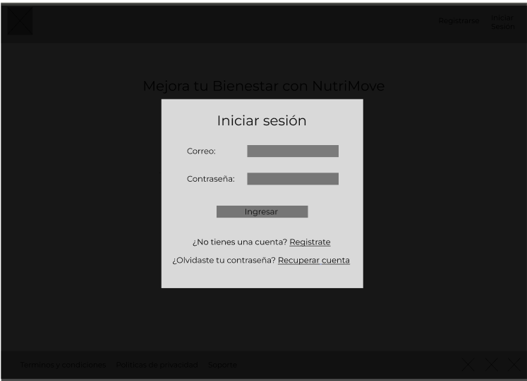

- **Home:** Aqui encontraremos frames que nos muestran las estadisticas del usuario.

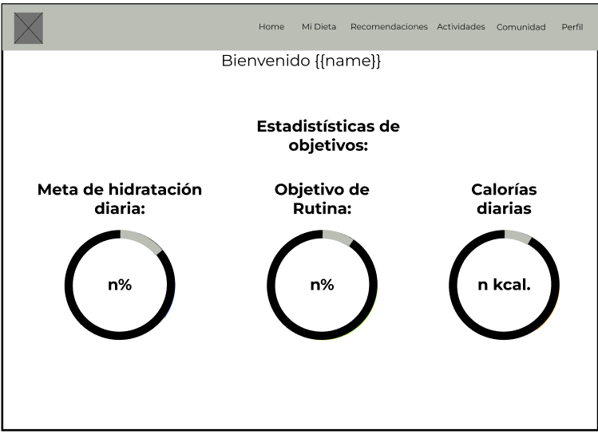
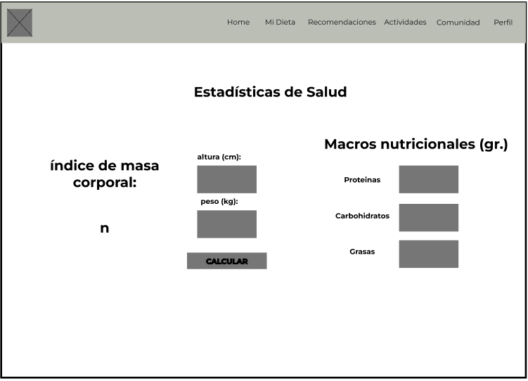

- **Dieta:** Aqui encontraremos el frame que muestra las dietas.

- **Recomendaciones:** Aqui encontraremos el frame que muestra recomendaciones a los usuarios.

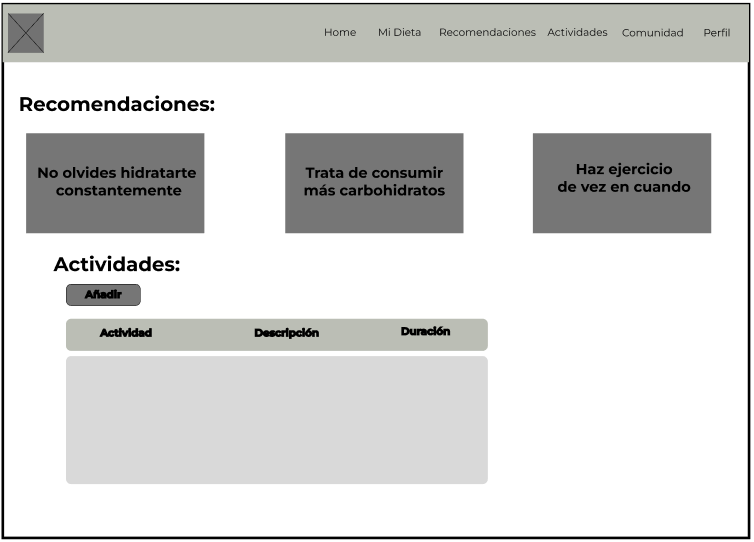

- **Comunidad:** Aqui encontraremos frames relacionados a la comunidad de NutriMove.

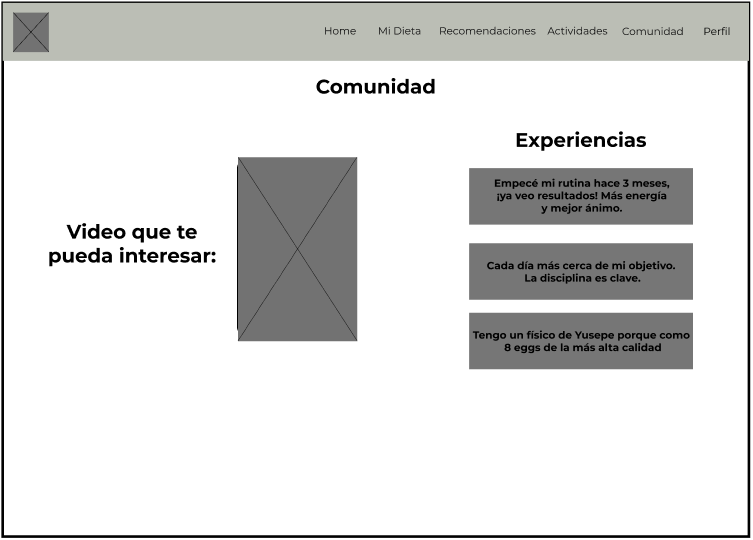

- **Perfil:** Aqui encontraremos frames relacionados al perfil del usuario.

#### Web Mobile Applications Wireframe::

- **Inicio:** Aqui encontraremos los frames de inicio de sesión, creación y recuperación de cuenta.

- **Home:** Aqui encontraremos frames que nos muestran las estadisticas del usuario.

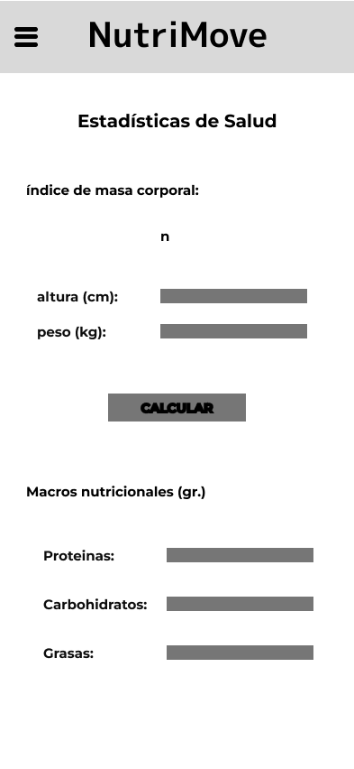

- **Dieta:** Aqui encontraremos el frame que muestra las dietas.

- **Recomendaciones:** Aqui encontraremos el frame que muestra recomendaciones a los usuarios.

- **Comunidad:** Aqui encontraremos frames relacionados a la comunidad de NutriMove.

- **Perfil:** Aqui encontraremos frames relacionados al perfil del usuario.

<h4>4.4.2. Web Applications Wireflow Diagrams.</h4>

Enlace Figma: https://www.figma.com/design/FOgDiEmlM9rOJs52AY86d9/Figma-Nutrimove?node-id=271-2  
User Goal: Registrar usuario  
  
User Goal: Escojo de planes  
  
Añadir dieta:  
  

<h4>4.4.3. Web Applications Mock-ups.</h4>

Enlace figma: https://www.figma.com/design/FOgDiEmlM9rOJs52AY86d9/Figma-Nutrimove?node-id=271-2&node-type=CANVAS&t=wF2yISmwEvN14sh4-0

#### Web Applications Mock-ups:

- **Inicio:** Aqui encontraremos los frames de inicio de sesión, creación y recuperación de cuenta.

- **Home:** Aqui encontraremos frames que nos muestran las estadisticas del usuario.

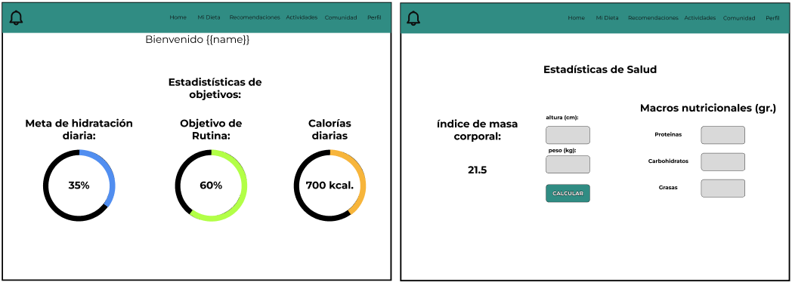

- **Dieta:** Aqui encontraremos el frame que muestra las dietas.

- **Recomendaciones:** Aqui encontraremos el frame que muestra recomendaciones a los usuarios.

- **Comunidad:** Aqui encontraremos frames relacionados a la comunidad de NutriMove.

- **Perfil:** Aqui encontraremos frames relacionados al perfil del usuario.

#### Web Mobile Applications Mobile Mock-ups:

- **Inicio:** Aqui encontraremos los frames de inicio de sesión, creación y recuperación de cuenta.

- **Home:** Aqui encontraremos frames que nos muestran las estadisticas del usuario.

- **Dieta:** Aqui encontraremos el frame que muestra las dietas.

- **Recomendaciones:** Aqui encontraremos el frame que muestra recomendaciones a los usuarios.

- **Comunidad:** Aqui encontraremos frames relacionados a la comunidad de NutriMove.

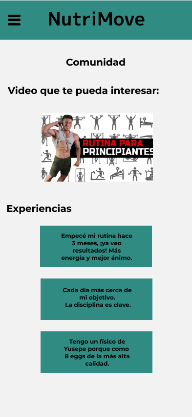

- **Perfil:** Aqui encontraremos frames relacionados al perfil del usuario.

<h4>4.4.4. Web Applications User Flow Diagrams.</h4>

User Goal: Registro e iniciar sesión  

User Goal: Escojo de plan  

<h3>4.5. Web Applications Prototyping.</h4>

Para diseñar los prototipos de la interfaz de usuario para Desktop y Mobile Web Browser, se siguieron varios criterios clave:

1. Claridad y Simplicidad: Se buscó que la navegación en la aplicación fuera intuitiva y fácil de entender, permitiendo a los usuarios comprender plenamente las funciones, como el registro de procesos y la visualización de informes estadísticos.
2. Diseño Responsivo: Se consideró esencial asegurar que la aplicación web fuera compatible con diferentes tamaños de pantalla, garantizando que los usuarios puedan acceder sin limitaciones, independientemente del dispositivo que utilicen.

3. Enfoque en la Información Relevante: El diseño prioriza la presentación de la información más importante para los usuarios del segmento objetivo, evitando sobrecargar la interfaz.
   

Link para el flujo: para acceder al flujo: https://www.figma.com/design/FOgDiEmlM9rOJs52AY86d9/Figma-Nutrimove?node-id=0-1&t=BB0xoxW9qrVogveU-1

<h3>4.6. Domain-Driven Software Architecture.</h4>

Para crear diagramas efectivos que representen la arquitectura de nuestro proyecto, es fundamental realizar un análisis exhaustivo del funcionamiento de la aplicación. Utilizaremos el modelo de lenguaje C4 en Structurizr para ofrecer una visión clara y detallada de la arquitectura de nuestro sistema. Este enfoque nos permitirá ilustrar de manera precisa cómo interactúan los distintos componentes y usuarios de la aplicación, asegurando una comprensión integral del diseño y facilitando la comunicación entre el equipo y las partes interesadas.

<h4>4.6.1. Software Architecture Context Diagram.</h4>

<h4>4.6.2. Software Architecture Container Diagrams.</h4>

<h4>4.6.3. Software Architecture Components Diagrams.</h4>

<h3>4.7. Software Object-Oriented Design.</h4>

<h4>4.7.1. Class Diagrams.</h4>

<h4>4.7.2. Class Dictionary.</h4>

| Nombre de atributo o método | Tipo de dato | Descripción                             |
| --------------------------- | ------------ | --------------------------------------- |
| id                          | int          | Identificador único de la suscripción   |
| inicio                      | date         | Fecha de inicio de la suscripción       |
| fin                         | date         | Fecha de finalización de la suscripción |
| precio                      | float        | Costo de la suscripción                 |
| plan_mensual                | bool         | Indica si la suscripción es mensual     |
| crear_suscripcion()         | método       | Crea una nueva suscripción              |
| cancelar_suscripcion()      | método       | Cancela la suscripción existente        |

| Nombre de atributo o método | Tipo de dato | Descripción                          |
| --------------------------- | ------------ | ------------------------------------ |
| id                          | int          | Identificador único del usuario      |
| username                    | str          | Nombre de usuario                    |
| password                    | str          | Contraseña del usuario               |
| email                       | str          | Correo electrónico del usuario       |
| peso                        | float        | Peso del usuario                     |
| altura                      | int          | Altura del usuario                   |
| edad                        | int          | Edad del usuario                     |
| registrar_usuario()         | método       | Registra un nuevo usuario            |
| actualizar_usuario()        | método       | Actualiza la información del usuario |

| Nombre de atributo o método     | Tipo de dato    | Descripción                                          |
| ------------------------------- | --------------- | ---------------------------------------------------- |
| id                              | int             | Identificador único del plan de rutina de ejercicio  |
| ejercicios                      | list[Ejercicio] | Lista de ejercicios asignados al plan                |
| asignar_ejercicio()             | método          | Asigna un ejercicio al plan                          |
| modificar_series_repeticiones() | método          | Modifica las series y repeticiones de los ejercicios |

| Nombre de atributo o método | Tipo de dato | Descripción                          |
| --------------------------- | ------------ | ------------------------------------ |
| id                          | int          | Identificador único del ejercicio    |
| nombre                      | str          | Nombre del ejercicio                 |
| repeticiones                | int          | Número de repeticiones del ejercicio |
| series                      | int          | Número de series del ejercicio       |
| crear_ejercicio()           | método       | Crea un nuevo ejercicio              |
| modificar_ejercicio()       | método       | Modifica un ejercicio existente      |

| Nombre de atributo o método | Tipo de dato | Descripción                      |
| --------------------------- | ------------ | -------------------------------- |
| id                          | int          | Identificador único de la rutina |
| nombre                      | str          | Nombre de la rutina              |
| crear_rutina()              | método       | Crea una nueva rutina            |
| eliminar_rutina()           | método       | Elimina una rutina existente     |

| Nombre de atributo o método | Tipo de dato   | Descripción                                    |
| --------------------------- | -------------- | ---------------------------------------------- |
| id                          | int            | Identificador único del plan de alimentación   |
| alimentos                   | list[Alimento] | Lista de alimentos asignados al plan           |
| asignar_alimento()          | método         | Asigna un alimento al plan                     |
| modificar_cantidad()        | método         | Modifica la cantidad de un alimento en el plan |

| Nombre de atributo o método | Tipo de dato | Descripción                            |
| --------------------------- | ------------ | -------------------------------------- |
| id                          | int          | Identificador único del alimento       |
| nombre                      | str          | Nombre del alimento                    |
| calorias                    | int          | Calorías del alimento                  |
| proteinas                   | float        | Cantidad de proteínas del alimento     |
| carbohidratos               | float        | Cantidad de carbohidratos del alimento |
| grasas                      | float        | Cantidad de grasas del alimento        |
| crear_alimento()            | método       | Crea un nuevo alimento                 |
| actualizar_alimento()       | método       | Actualiza un alimento existente        |
| eliminar_alimento()         | método       | Elimina un alimento existente          |

<h3>4.8. Database Design.</h4>

El diseño de la base de datos constituye un aspecto fundamental en la organización y gestión de la información. En este informe, se ha estructurado una base de datos que optimiza la eficiencia en el almacenamiento y recuperación de datos, asegurando la integridad y consistencia de la información. La implementación de relaciones bien definidas entre las tablas permite minimizar la redundancia y garantizar la escalabilidad del sistema, facilitando así el análisis y la generación de reportes precisos y confiables.

<h4>4.8.1. Database Diagram.</h4>

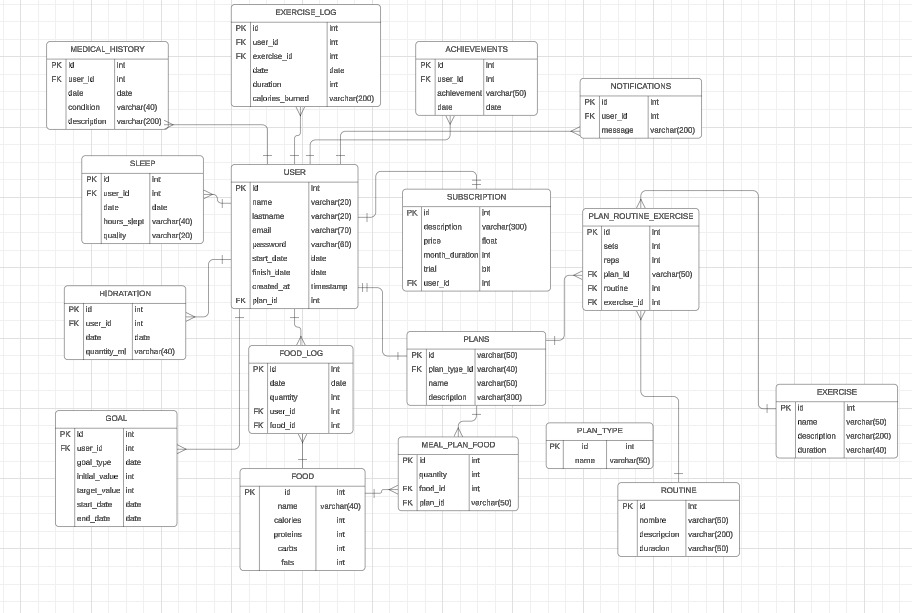

<h2>CAPÍTULO IV: PRODUCT IMPLEMENTATION, VALIDATION & DEPLOYMENT </h4>

<h3> 5.1. Software Configuration Management.</h3>

Controlar y rastrear los cambios que se realizan en el software durante el ciclo de vida. Asegura que el software se mantiene consistente, ordenado y controlado a medida que evoluciona desde su desarrollo inicial hasta su entrega y mantenimiento.

<h4> 5.1.1. Software Development Environment Configuration.</h4>

Se necesitarán varias herramientas tecnológicas para llevar a cabo el proyecto. Se utilizará la herramienta Figma para el diseño UI/UX, donde se definirá el "boceto" para la creación de nuestra landing page, así como las diferentes opciones, gestos de acceso a una excelente experiencia de usuario.  
Para desarrollar el código para la landing page, se necesitará un IDE (Integrated Development Environment) para implementar las tecnologías a utilizar; el equipo utilizará Visual Studio Code.
En el caso de Project Management, para la solución que abarcará Front-End, se hará uso del programa WebStorm, aplicación que permitirá programar un web application con el framework Angular.
Al crear una aplicación web, es fundamental utilizar el lenguaje de HTML5, ya que será la definición del "esqueleto" de la página, junto con CSS para estilizar los contenedores que se hayan creado, modificando los colores, la tipografía, el tamaño de las imágenes y JavaScript para interactuar con el usuario y crear una página web dinámica.
La implementación del código seguirá las buenas prácticas de programación, como reducir la cantidad de líneas de código, mantener una especificidad con CSS y una convención de nombre en las variables.

<h4> 5.1.2. Source Code Management.</h4>

El equipo decide utilizar GitHub como repositorio de lanzamiento principal. Desarrollo de proyectos. GitHub utiliza el sistema de control de versiones Git para facilitar las cosas
Colaboración entre diferentes miembros del equipo y permite la colaboración en uno.
al mismo tiempo.

El repositorio del proyecto tendrá dos ramas principales de seguimiento e implementación.
Número de versión: "main" será la rama master donde se podrán observar los cambios, y "gh-pages" será la rama requerida para implementar la versión adecuada. Páginas de GitHub que hacen que las páginas web estén disponibles y sean públicas.

En la rama "main" organizará carpetas que contienen estilos CSS, páginas HTML y validación en JavaScript, así como el desarrollo de nuestra página de aterrizaje. Además, se creará un repositorio separado para los criterios de aceptación y con Epics para analizar archivos ".feature".

Los cambios también serán visibles para el web application en WebStorm. Los proyectos colaborativos reflejados en los repositorios de Github como archivo principal.

Enlace al repositorio Gihub: https://github.com/TFOpenSource  
Enlace al landing page: https://tfopensource.github.io/Landing_Page/

<h4> 5.1.3. Source Code Style Guide & Conventions.</h4>

HTML:
Para lograr un código coherente, sostenible y bien organizado, es importante seguir estas prácticas:

1. Cerrar todos los elementos HTML: Por ejemplo, 
"Esto es un texto."

2. Aunque HTML permite mezclar mayúsculas y minúsculas en los nombres de elementos y atributos, es recomendable utilizar solo minúsculas para mantener el orden y mejorar la legibilidad.
3. Usar comillas cuando los atributos contengan espacios.
4. Especificar el texto alternativo (alt) y las dimensiones (width y height) de las imágenes para mejorar la accesibilidad del contenido.

CSS:
Algunas prácticas recomendadas son:

1. Los nombres de las clases deben ser cortos y descriptivos.
2. Separar los nombres de clases y IDs con guiones, por ejemplo: `#video-id` y `.hero-shadow{}`
3. Evitar especificar la unidad de medida después del valor 0.
4. Colocar las declaraciones y selectores en líneas separadas para mejorar la legibilidad.

Gherkin:
Gherkin es un lenguaje de dominio específico diseñado para resolver la comunicación entre el negocio y el equipo técnico en el desarrollo dirigido por comportamiento (BDD, por sus siglas en inglés). Para seguir buenas prácticas, se han utilizado saltos de línea para organizar mejor los distintos tipos de escenarios y diferenciarlos de manera más clara. Además, se emplearon las palabras clave "Given", "When", "Then" y "And" para estructurar los escenarios.

<h4> 5.1.4. Software Deployment Configuration.</h4>

Despliegue de la landing page:
Para desplegar la landing page, es necesario cumplir con ciertos requisitos previos, como tener una cuenta personal, una organización, y un repositorio donde cargar los archivos. Una vez que se cumplan estos requisitos, se puede proceder con el despliegue de la landing page siguiendo estos pasos:

1. Crear una carpeta llamada "docs" para almacenar la landing page.
2. Asegurarse de que los archivos sigan las convenciones de nombres: "index.html" para la página principal, "style.css" para los estilos, y una carpeta llamada "img" que contenga las imágenes.
3. Subir los archivos al repositorio mediante un commit.
4. Ir a Settings > Pages y seleccionar la rama correspondiente en la que se encuentra el proyecto, usualmente "main" o "master".
5. Especificar la carpeta "docs" como la fuente de la página.
6. Esperar a que GitHub realice las comprobaciones necesarias. Una vez finalizado el proceso, se generará un enlace que llevará a la landing page desplegada.

<h3> 5.2.  Landing Page, Services & Applications Implementation.</h3>

<h4> 5.2.1. Sprint #1.</h4>

<h5> 5.2.1.1. Sprint Planning #1.</h5>

En la siguiente sección, se presentará el sprint #1 con la primera versión del trabajo para la entrega del proyecto. Mostrando la organización, distribución y resultados del landing page.

<table><thead>
  <tr>
    <th>&nbsp;&nbsp;&nbsp; Sprint #&nbsp;&nbsp;&nbsp;&nbsp;</th>
    <th>&nbsp;&nbsp;&nbsp; Date&nbsp;&nbsp;&nbsp;&nbsp;</th>
    <th>&nbsp;&nbsp;&nbsp; Time&nbsp;&nbsp;&nbsp;&nbsp;</th>
    <th>&nbsp;&nbsp;&nbsp; Location&nbsp;&nbsp;&nbsp;&nbsp;</th>
    <th>&nbsp;&nbsp;&nbsp; Prepared By&nbsp;&nbsp;&nbsp;&nbsp;</th>
    <th>&nbsp;&nbsp;&nbsp; Attendees&nbsp;&nbsp;&nbsp;</th>
  </tr></thead>
<tbody>
  <tr>
    <td>&nbsp;&nbsp;&nbsp; 1&nbsp;&nbsp;&nbsp;</td>
    <td>&nbsp;&nbsp;&nbsp; 30/08/2024&nbsp;&nbsp;&nbsp;&nbsp;</td>
    <td>&nbsp;&nbsp;&nbsp; 09:00 AM&nbsp;&nbsp;&nbsp;&nbsp;</td>
    <td>&nbsp;&nbsp;&nbsp; Reunión virtual&nbsp;&nbsp;&nbsp;mediante la aplicación Discord&nbsp;&nbsp;&nbsp;&nbsp;</td>
    <td>&nbsp;&nbsp;&nbsp; Uribe Quispe,&nbsp;&nbsp;&nbsp;Jesús Guillermo&nbsp;&nbsp;&nbsp;&nbsp;</td>
    <td>&nbsp;&nbsp;&nbsp; Sebastian&nbsp;&nbsp;&nbsp;Bohorquez, Jose Luza, Melgar Jimenez, Sebastian Silva y Jesús Uribe&nbsp;&nbsp;&nbsp;&nbsp;</td>
  </tr>
  <tr>
    <td colspan="4">&nbsp;&nbsp;&nbsp; Sprint 1 Goal&nbsp;&nbsp;&nbsp;&nbsp;</td>
    <td>&nbsp;&nbsp;&nbsp; Sprint 1 Velocity&nbsp;&nbsp;&nbsp;&nbsp;</td>
    <td>&nbsp;&nbsp;&nbsp; Sum of Story Points&nbsp;&nbsp;&nbsp;</td>
  </tr>
  <tr>
    <td colspan="4">&nbsp;&nbsp;&nbsp; Crear y&nbsp;&nbsp;&nbsp;desarrollar el landing page informativa para la aplicación NutriMove&nbsp;&nbsp;&nbsp;</td>
    <td>&nbsp;&nbsp;&nbsp; 19  &nbsp;&nbsp;&nbsp;  &nbsp;&nbsp;&nbsp;</td>
    <td>&nbsp;&nbsp;&nbsp; 19&nbsp;&nbsp;&nbsp;&nbsp;</td>
  </tr>
</tbody></table>

<h5> 5.2.1.2.  Backlog #1.</h5>

En el primer backlog, el equipo se propuso iniciar y completar la landing page. Para organizar y gestionar al equipo, se utilizó el cuadro de , que permitió dividir las user stories en tareas manejables y asignarlas a los miembros según sus habilidades. El objetivo principal del fue construir una landing page completamente atractiva y funcional.

<table><thead>
  <tr>
    <th>&nbsp;&nbsp;&nbsp; # &nbsp;&nbsp;&nbsp;</th>
    <th colspan="7"> 1</th>
  </tr></thead>
<tbody>
  <tr>
    <td colspan="2">&nbsp;&nbsp;&nbsp; User Story&nbsp;&nbsp;&nbsp;</td>
    <td colspan="6">Work Item/Task</td>
  </tr>
  <tr>
    <td>&nbsp;&nbsp;&nbsp; Id&nbsp;&nbsp;&nbsp;</td>
    <td>&nbsp;&nbsp;&nbsp; Title&nbsp;&nbsp;&nbsp;</td>
    <td>&nbsp;&nbsp;&nbsp; Id&nbsp;&nbsp;&nbsp;</td>
    <td>&nbsp;&nbsp;&nbsp; Title&nbsp;&nbsp;&nbsp;</td>
    <td>&nbsp;&nbsp;&nbsp; Descripción&nbsp;&nbsp;&nbsp;</td>
    <td>&nbsp;&nbsp;&nbsp; Estimación (Hours)&nbsp;&nbsp;&nbsp;</td>
    <td>&nbsp;&nbsp;&nbsp; Assigned to&nbsp;&nbsp;&nbsp;</td>
    <td>&nbsp;&nbsp;&nbsp; Status (In&nbsp;&nbsp;&nbsp;-process / To - review / Done)&nbsp;&nbsp;&nbsp;</td>
  </tr>
  <tr>
    <td>&nbsp;&nbsp;&nbsp; HU21&nbsp;&nbsp;&nbsp;</td>
    <td>&nbsp;&nbsp;&nbsp; Registro de Cuenta&nbsp;&nbsp;&nbsp;</td>
    <td>&nbsp;&nbsp;&nbsp; UT01&nbsp;&nbsp;&nbsp;</td>
    <td>&nbsp;&nbsp;&nbsp; Página de registro de Cuenta&nbsp;&nbsp;&nbsp;</td>
    <td>&nbsp;&nbsp;&nbsp; Validación de datos de usuario y almacenamiento seguro.&nbsp;&nbsp;&nbsp;</td>
    <td>&nbsp;&nbsp;&nbsp; 1&nbsp;&nbsp;&nbsp;</td>
    <td>&nbsp;&nbsp;&nbsp; Jesús Uribe&nbsp;&nbsp;&nbsp;Bohorquez&nbsp;&nbsp;&nbsp;</td>
    <td>&nbsp;&nbsp;&nbsp; Done&nbsp;&nbsp;&nbsp;</td>
  </tr>
  <tr>
    <td>&nbsp;&nbsp;&nbsp; HU22&nbsp;&nbsp;&nbsp;</td>
    <td>&nbsp;&nbsp;&nbsp; Inicio de Sesión &nbsp;&nbsp;&nbsp;  &nbsp;&nbsp;&nbsp;</td>
    <td>&nbsp;&nbsp;&nbsp; UT02&nbsp;&nbsp;&nbsp;</td>
    <td>&nbsp;&nbsp;&nbsp; Página de inicio de sesión&nbsp;&nbsp;&nbsp;</td>
    <td>&nbsp;&nbsp;&nbsp; Implementación de autenticación segura.&nbsp;&nbsp;&nbsp;</td>
    <td>&nbsp;&nbsp;&nbsp; 2&nbsp;&nbsp;&nbsp;</td>
    <td>&nbsp;&nbsp;&nbsp; Jose Luza&nbsp;&nbsp;&nbsp;</td>
    <td>&nbsp;&nbsp;&nbsp; Done&nbsp;&nbsp;&nbsp;</td>
  </tr>
  <tr>
    <td>&nbsp;&nbsp;&nbsp; HU18&nbsp;&nbsp;&nbsp;</td>
    <td>&nbsp;&nbsp;&nbsp; Acceso a navegador web &nbsp;&nbsp;&nbsp;  &nbsp;&nbsp;&nbsp;</td>
    <td>&nbsp;&nbsp;&nbsp; UT03&nbsp;&nbsp;&nbsp;</td>
    <td>&nbsp;&nbsp;&nbsp; Creación de navegador web&nbsp;&nbsp;&nbsp;&nbsp;&nbsp;&nbsp;</td>
    <td>&nbsp;&nbsp;&nbsp; funcionalidad redirigir a la información fácilmente&nbsp;&nbsp;&nbsp;</td>
    <td>&nbsp;&nbsp;&nbsp; 3&nbsp;&nbsp;&nbsp;</td>
    <td>&nbsp;&nbsp;&nbsp; Sebastian Bohorquez&nbsp;&nbsp;&nbsp;</td>
    <td>&nbsp;&nbsp;&nbsp; Done&nbsp;&nbsp;&nbsp;</td>
  </tr>
  <tr>
    <td>&nbsp;&nbsp;&nbsp; HU19&nbsp;&nbsp;&nbsp;</td>
    <td>&nbsp;&nbsp;&nbsp; Cambio de idioma&nbsp;&nbsp;&nbsp;</td>
    <td>&nbsp;&nbsp;&nbsp; UT04&nbsp;&nbsp;&nbsp;</td>
    <td>&nbsp;&nbsp;&nbsp; Diseño de desplegable para cambio de idioma&nbsp;&nbsp;&nbsp;</td>
    <td>&nbsp;&nbsp;&nbsp; Funcionalidad para cambiar la landing page a distintos idiomas.&nbsp;&nbsp;&nbsp;</td>
    <td>&nbsp;&nbsp;&nbsp; 1&nbsp;&nbsp;&nbsp;</td>
    <td>&nbsp;&nbsp;&nbsp; Sebastián Silva&nbsp;&nbsp;&nbsp;</td>
    <td>&nbsp;&nbsp;&nbsp; Done&nbsp;&nbsp;&nbsp;</td>
  </tr>
  <tr>
    <td>&nbsp;&nbsp;&nbsp; HU20&nbsp;&nbsp;&nbsp;</td>
    <td>&nbsp;&nbsp;&nbsp; Visualización de formulario de contacto de&nbsp;&nbsp;&nbsp;progreso&nbsp;&nbsp;&nbsp;</td>
    <td>&nbsp;&nbsp;&nbsp; UT05&nbsp;&nbsp;&nbsp;</td>
    <td>&nbsp;&nbsp;&nbsp; Desarrollo de contenido principal y formulario de contacto&nbsp;&nbsp;&nbsp;</td>
    <td>&nbsp;&nbsp;&nbsp; Funcionalidad para resolver las dudas .&nbsp;&nbsp;&nbsp;</td>
    <td>&nbsp;&nbsp;&nbsp; 2&nbsp;&nbsp;&nbsp;</td>
    <td>&nbsp;&nbsp;&nbsp; Daniel Melgar&nbsp;&nbsp;&nbsp;</td>
    <td>&nbsp;&nbsp;&nbsp; Done&nbsp;&nbsp;&nbsp;</td>
  </tr>
  
</tbody></table>

<h5> 5.2.1.3. Development Evidence for  Review.</h5>

<table><thead>
  <tr>
    <th>&nbsp;&nbsp;&nbsp; Repository&nbsp;&nbsp;&nbsp;</th>
    <th>&nbsp;&nbsp;&nbsp; Branch&nbsp;&nbsp;&nbsp;</th>
    <th>&nbsp;&nbsp;&nbsp; Commit ID&nbsp;&nbsp;&nbsp;</th>
    <th>&nbsp;&nbsp;&nbsp; Commit &nbsp;&nbsp;&nbsp; Message&nbsp;&nbsp;&nbsp;</th>
    <th>&nbsp;&nbsp;&nbsp; Commit &nbsp;&nbsp;&nbsp; Message Body&nbsp;&nbsp;&nbsp;</th>
    <th>&nbsp;&nbsp;&nbsp; Committed on&nbsp;&nbsp;&nbsp;(Date)&nbsp;&nbsp;&nbsp;</th>
  </tr></thead>
<tbody>
  <tr>
    <td rowspan="10"><a href="https://tfopensource.github.io/Landing_Page/" target="_blank" rel="noopener noreferrer">https://tfopensource.github.io/Landing_Page/</a></td>
    <td>&nbsp;&nbsp;&nbsp; LandingPage/docs&nbsp;&nbsp;&nbsp;</td>
    <td>&nbsp;&nbsp;&nbsp; c200c25&nbsp;&nbsp;&nbsp;</td>
    <td>&nbsp;&nbsp;&nbsp; “Add initial structure for the landing page”&nbsp;&nbsp;&nbsp;</td>
    <td>&nbsp;&nbsp;&nbsp; Created index.html with basic HTML5 structure&nbsp;&nbsp;&nbsp;</td>
    <td>&nbsp;&nbsp;&nbsp; 05/09/2024&nbsp;&nbsp;&nbsp;</td>
  </tr>
  <tr>
    <td>&nbsp;&nbsp;&nbsp; LandingPage/docs&nbsp;&nbsp;&nbsp;</td>
    <td>&nbsp;&nbsp;&nbsp; 4aaa6ac&nbsp;&nbsp;&nbsp;</td>
    <td>&nbsp;&nbsp;&nbsp; “Implement responsive design for landing&nbsp;&nbsp;&nbsp;page”&nbsp;&nbsp;&nbsp;</td>
    <td>&nbsp;&nbsp;&nbsp; Added media queries for mobile and tablet&nbsp;&nbsp;&nbsp;views&nbsp;&nbsp;&nbsp;</td>
    <td>&nbsp;&nbsp;&nbsp; 05/09/2024&nbsp;&nbsp;&nbsp;</td>
  </tr>
  <tr>
    <td>&nbsp;&nbsp;&nbsp; LandingPage/docs&nbsp;&nbsp;&nbsp;</td>
    <td>&nbsp;&nbsp;&nbsp; ad0521b&nbsp;&nbsp;&nbsp;</td>
    <td>&nbsp;&nbsp;&nbsp; “Optimize images and improve page load speed”&nbsp;&nbsp;&nbsp;</td>
    <td>&nbsp;&nbsp;&nbsp; Compressed images without losing quality&nbsp;&nbsp;&nbsp;</td>
    <td>&nbsp;&nbsp;&nbsp; 05/09/2024&nbsp;&nbsp;&nbsp;</td>
  </tr>
  <tr>
    <td>&nbsp;&nbsp;&nbsp; LandingPage/docs&nbsp;&nbsp;&nbsp;</td>
    <td>&nbsp;&nbsp;&nbsp; 07c6a3f&nbsp;&nbsp;&nbsp;</td>
    <td>&nbsp;&nbsp;&nbsp; “Update content and add call-to-action&nbsp;&nbsp;&nbsp;buttons”&nbsp;&nbsp;&nbsp;</td>
    <td>&nbsp;&nbsp;&nbsp; Replaced placeholder text with actual content&nbsp;&nbsp;&nbsp;</td>
    <td>&nbsp;&nbsp;&nbsp; 05/09/2024&nbsp;&nbsp;&nbsp;</td>
  </tr>
  <tr>
    <td>&nbsp;&nbsp;&nbsp; LandingPage/docs&nbsp;&nbsp;&nbsp;</td>
    <td>&nbsp;&nbsp;&nbsp; 28e5277&nbsp;&nbsp;&nbsp;</td>
    <td>&nbsp;&nbsp;&nbsp; “Fix alignment issues in landing page”&nbsp;&nbsp;&nbsp;</td>
    <td>&nbsp;&nbsp;&nbsp; Corrected alignment of images in the features&nbsp;&nbsp;&nbsp;section&nbsp;&nbsp;&nbsp;</td>
    <td>&nbsp;&nbsp;&nbsp; 05/09/2024&nbsp;&nbsp;&nbsp;</td>
  </tr>
  <tr>
    <td>&nbsp;&nbsp;&nbsp; LandingPage/docs&nbsp;&nbsp;&nbsp;</td>
    <td>&nbsp;&nbsp;&nbsp; d77f8ed&nbsp;&nbsp;&nbsp;</td>
    <td>&nbsp;&nbsp;&nbsp; “home y pie de pagina”&nbsp;&nbsp;&nbsp;</td>
    <td>&nbsp;&nbsp;&nbsp; Added home and end of land&nbsp;&nbsp;&nbsp;readers&nbsp;&nbsp;&nbsp;</td>
    <td>&nbsp;&nbsp;&nbsp; 05/09/2024&nbsp;&nbsp;&nbsp;</td>
  </tr>
  <tr>
    <td>&nbsp;&nbsp;&nbsp; LandingPage/docs&nbsp;&nbsp;&nbsp;</td>
    <td>&nbsp;&nbsp;&nbsp; A7ZD6 &nbsp;&nbsp;&nbsp;  &nbsp;&nbsp;&nbsp;</td>
    <td>&nbsp;&nbsp;&nbsp; “detalles &nbsp;&nbsp;&nbsp;de suscripciones”&nbsp;&nbsp;&nbsp;</td>
    <td>&nbsp;&nbsp;&nbsp; Actualizar detalles de suscripciones&nbsp;&nbsp;&nbsp;information&nbsp;&nbsp;&nbsp;</td>
    <td>&nbsp;&nbsp;&nbsp; 05/09/2024&nbsp;&nbsp;&nbsp;</td>
  </tr>
  <tr>
    <td>&nbsp;&nbsp;&nbsp; LandingPage/docs&nbsp;&nbsp;&nbsp;</td>
    <td>&nbsp;&nbsp;&nbsp; 09H54 &nbsp;&nbsp;&nbsp;  &nbsp;&nbsp;&nbsp;</td>
    <td>&nbsp;&nbsp;&nbsp; “suscripciones”&nbsp;&nbsp;&nbsp;</td>
    <td>&nbsp;&nbsp;&nbsp; Implementar &nbsp;&nbsp;&nbsp;suscripciones&nbsp;&nbsp;&nbsp;</td>
    <td>&nbsp;&nbsp;&nbsp; 05/09/2024&nbsp;&nbsp;&nbsp;</td>
  </tr>
  <tr>
    <td>&nbsp;&nbsp;&nbsp; LandingPage/docs&nbsp;&nbsp;&nbsp;</td>
    <td>&nbsp;&nbsp;&nbsp; WM5KT &nbsp;&nbsp;&nbsp;  &nbsp;&nbsp;&nbsp;</td>
    <td>&nbsp;&nbsp;&nbsp; “formulario de contacto”&nbsp;&nbsp;&nbsp;</td>
    <td>&nbsp;&nbsp;&nbsp; Implementacion de formulario &nbsp;&nbsp;&nbsp;de contrato&nbsp;&nbsp;&nbsp;</td>
    <td>&nbsp;&nbsp;&nbsp; 05/09/2024&nbsp;&nbsp;&nbsp;</td>
  </tr>
  <tr>
    <td>&nbsp;&nbsp;&nbsp; LandingPage/docs&nbsp;&nbsp;&nbsp;</td>
    <td>&nbsp;&nbsp;&nbsp; 3Q2SV&nbsp;&nbsp;&nbsp;</td>
    <td>&nbsp;&nbsp;&nbsp; “inicio de sesion registro y cambio de &nbsp;&nbsp;&nbsp;idioma”&nbsp;&nbsp;&nbsp;</td>
    <td>&nbsp;&nbsp;&nbsp; Correciones de sesion de inicio de seisón y registro&nbsp;&nbsp;&nbsp;</td>
    <td>&nbsp;&nbsp;&nbsp; 05/09/2024&nbsp;&nbsp;&nbsp;</td>
  </tr>
</tbody></table>

<h5> 5.2.1.4. Testing Suite Evidence for  Review. </h5>

Para la entrega del 1, se buscó lograr el desarrollo, implementación, y despliegue completos de la landing page. Por esta razón, la sección de "Testing" se enfocó en implementar los archivos de características que componen nuestra landing page. Estas características se basan en las User Stories especificadas en el backlog y describen en detalle cada uno de los escenarios que planeamos desarrollar.

<table><thead>
  <tr>
    <th>&nbsp;&nbsp;&nbsp; Repository&nbsp;&nbsp;&nbsp;</th>
    <th>&nbsp;&nbsp;&nbsp; Branch&nbsp;&nbsp;&nbsp;</th>
    <th>&nbsp;&nbsp;&nbsp; Commit ID&nbsp;&nbsp;&nbsp;</th>
    <th>&nbsp;&nbsp;&nbsp; Commit &nbsp;&nbsp;&nbsp; Message&nbsp;&nbsp;&nbsp;</th>
    <th>&nbsp;&nbsp;&nbsp; Commit &nbsp;&nbsp;&nbsp; Message Body&nbsp;&nbsp;&nbsp;</th>
    <th>&nbsp;&nbsp;&nbsp; Committed on (Date)&nbsp;&nbsp;&nbsp;</th>
  </tr></thead>
<tbody>
  <tr>
    <td>    <a href="https://tfopensource.github.io/Landing_Page/" target="_blank" rel="noopener noreferrer">https://tfopensource.github.io/Landing_Page/</a>         </td>
    <td>&nbsp;&nbsp;&nbsp; LandingPage/Features&nbsp;&nbsp;&nbsp;&nbsp;&nbsp;&nbsp;</td>
    <td>&nbsp;&nbsp;&nbsp; 7387d5e&nbsp;&nbsp;&nbsp;&nbsp;</td>
    <td>&nbsp;&nbsp;&nbsp; chore: added  &nbsp;&nbsp;&nbsp;   &nbsp;&nbsp;&nbsp; aceptance probe1&nbsp;&nbsp;&nbsp;</td>
    <td>&nbsp;&nbsp;&nbsp; chore: added  &nbsp;&nbsp;&nbsp;   &nbsp;&nbsp;&nbsp; aceptance probe1&nbsp;&nbsp;&nbsp;</td>
    <td>&nbsp;&nbsp;&nbsp; 04/09/2024&nbsp;&nbsp;&nbsp;</td>
  </tr>
</tbody></table>

<h5> 5.2.1.5. Execution Evidence for  Review. </h5>

Durante el 1, se logró un desarrollo parcial en la implementación y despliegue de la landing page. La página incluye varias secciones en las que el usuario puede encontrar información relevante sobre el producto y la startup. A continuación, se presentan algunas evidencias.
Evidencia 1
  
Evidencia 2
  
Evidencia 3
  

<h5> 5.2.1.6. Services Documentation Evidence for  Review. </h5>

Pasos para realizar la landing page:

1. Crear cuenta en GitHub para crea un repositorio donde subir la página web.

2. Continuamos con los pasos para configurar el proyecto según nos indique el proveedor del repositorio.

3. Ir a nuestro perfil creado en la página web alojadora de repositorios y crear una nueva organización.

4. Seleccionamos un plan para nuestra organización que vamos a crear. Para casos prácticos escogemos el plan Free.

5. Le colocamos un nombre a la organización que acabamos de crear. Para nosotros le
   ponemos “NutriMove” y le damos a Continuar.

6. Agregamos colaboradores en caso lo queramos.

7. Terminamos de configurar la organización.

8. Creamos un nuevo repositorio.

9. Habilitamos la posibilidad de controlar las versiones de nuestro proyecto y lo vinculamos con el repositorio de github.

10. Para poder visualizar el estado de la página web, tenemos que acceder al link

<h5> 5.2.1.7. Software Deployment Evidence for  Review.</h5>

Landing Page:
  
  
  
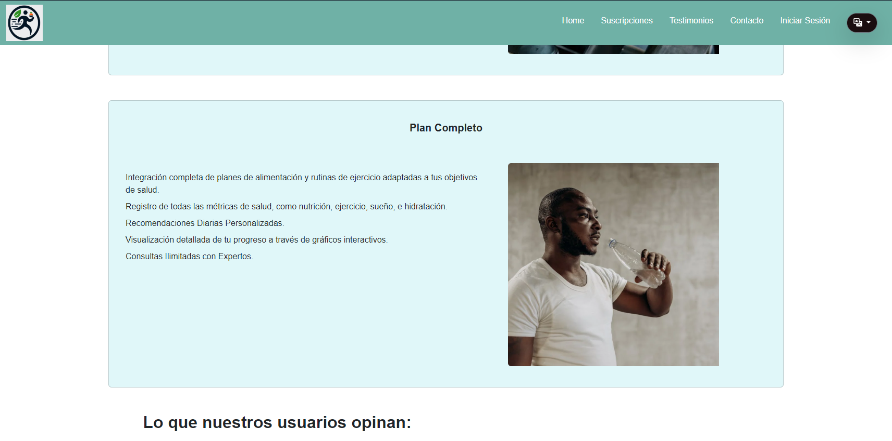  
  

<h5> 5.2.1.8. Team Collaboration Insights during . </h5>

| Alumno                               | Actividad                                                                                             |
| ------------------------------------ | ----------------------------------------------------------------------------------------------------- |
| Bohorquez Lerzundi Gerardo Sebastian | Implementación de la sección de encabezado de la landing page.                                        |
| Luza Carhuamaca, Jose Adrian         | Implementación de los tipos de servicio a elegir                                                      |
| Jimenez Melgar, Daniel Luciano       | Implementación de la sección principal y contact.                                                     |
| Silva Tirado, Sebastian Valentino    | Implementación de la sección de más información de los servicios, Implementación de cambio de idioma. |
| Uribe Quispe, Jesús Guillermo        | Implementación de la sección de modales de Login e información de servicios.                          |

  

  

  

<h4> 5.2.2.  #2.</h4>

<h5> 5.2.2.1. Planning 2.</h5>

<table class="tg"><thead>
  <tr>
    <th class="tg-0pky"> #</th>
    <th class="tg-0pky">Date</th>
    <th class="tg-0pky">Time</th>
    <th class="tg-0pky">Location</th>
    <th class="tg-0pky">Prepared By</th>
    <th class="tg-0pky">Attendees</th>
  </tr></thead>
<tbody>
  <tr>
    <td class="tg-0pky">2</td>
    <td class="tg-0pky">22/09/2024</td>
    <td class="tg-0pky">12:00 p.m.</td>
    <td class="tg-0pky">Reunión online por discord</td>
    <td class="tg-0pky">Jesús Uribe</td>
    <td class="tg-0pky">Sebastian Bohorquez, Jose Luza, Melgar Jimenez, Sebastian Silva y Jesús Uribe</td>
  </tr>
  <tr>
    <td class="tg-0pky" colspan="4"> 2 Goal</td>
    <td class="tg-mq6t"> 2 Velocity    </td>
    <td class="tg-mq6t">Sum of Story Points   </td>
  </tr>
  <tr>
    <td class="tg-0pky" colspan="4"> Actualizar el landing page y mostrando el API Fake siendo funcional y llamativa.</td>
    <td class="tg-0pky">25 </td>
    <td class="tg-0pky">25 </td>
  </tr>
</tbody>
</table>

<h5> 5.2.2.2. Backlog 2.</h5>

En el segundo backlog, como equipo continuamos trabajando en la landing page, actualizándola a una versión con Frontend Web Applications integrada con un API falso. Para garantizar una distribución equitativa de las tareas, utilizamos el board, dividiendo las user stories y asignándolas a los miembros del equipo.
Sin embargo no se llego a reportar un integrante para este y por ello que no está completo.

 
Link del Trello: https://trello.com/invite/b/66f42aaa2bee91bcb6821439/ATTI8306555e78cf5184b76e6f86e43628a5EF6834CA/-backlog-2 

<table><thead>
  <tr>
    <th>&nbsp;&nbsp;&nbsp; # &nbsp;&nbsp;&nbsp;</th>
    <th colspan="7"> 2</th>
  </tr></thead>
<tbody>
  <tr>
    <td colspan="2">&nbsp;&nbsp;&nbsp; User Story&nbsp;&nbsp;&nbsp;</td>
    <td colspan="6">Work Item/Task</td>
  </tr>
  <tr>
    <td>&nbsp;&nbsp;&nbsp; Id&nbsp;&nbsp;&nbsp;</td>
    <td>&nbsp;&nbsp;&nbsp; Title&nbsp;&nbsp;&nbsp;</td>
    <td>&nbsp;&nbsp;&nbsp; Id&nbsp;&nbsp;&nbsp;</td>
    <td>&nbsp;&nbsp;&nbsp; Title&nbsp;&nbsp;&nbsp;</td>
    <td>&nbsp;&nbsp;&nbsp; Descripción&nbsp;&nbsp;&nbsp;</td>
    <td>&nbsp;&nbsp;&nbsp; Estimación (Hours)&nbsp;&nbsp;&nbsp;</td>
    <td>&nbsp;&nbsp;&nbsp; Assigned to&nbsp;&nbsp;&nbsp;</td>
    <td>&nbsp;&nbsp;&nbsp; Status (In&nbsp;&nbsp;&nbsp;In-process / To - review / Done)&nbsp;&nbsp;&nbsp;</td>
  </tr>
  <tr>
    <td>&nbsp;&nbsp;&nbsp; HU01&nbsp;&nbsp;&nbsp;</td>
    <td>&nbsp;&nbsp;&nbsp; Registro de cuenta&nbsp;&nbsp;&nbsp;</td>
    <td>&nbsp;&nbsp;&nbsp; UT06&nbsp;&nbsp;&nbsp;</td>
    <td>&nbsp;&nbsp;&nbsp; Ruta de registro de cuenta&nbsp;&nbsp;&nbsp;</td>
    <td>&nbsp;&nbsp;&nbsp; Como usuario nuevo, quiero poder registrarme en la aplicación con mi correo electrónico y contraseña, para crear una cuenta y empezar a usar todas las funcionalidades disponibles.&nbsp;&nbsp;&nbsp;</td>
    <td>&nbsp;&nbsp;&nbsp; 4&nbsp;&nbsp;&nbsp;</td>
    <td>&nbsp;&nbsp;&nbsp; Jesús Uribe&nbsp;&nbsp;&nbsp;&nbsp;&nbsp;&nbsp;</td>
    <td>&nbsp;&nbsp;&nbsp; Done&nbsp;&nbsp;&nbsp;</td>
  </tr>
  <tr>
    <td>&nbsp;&nbsp;&nbsp; HU02&nbsp;&nbsp;&nbsp;</td>
    <td>&nbsp;&nbsp;&nbsp; Inicio de Sesión&nbsp;&nbsp;&nbsp;</td>
    <td>&nbsp;&nbsp;&nbsp; UT07&nbsp;&nbsp;&nbsp;</td>
    <td>&nbsp;&nbsp;&nbsp; Ruta de Iniciar sención&nbsp;&nbsp;&nbsp;</td>
    <td>&nbsp;&nbsp;&nbsp; Como usuario registrado, quiero poder iniciar sesión con mi correo electrónico y contraseña, para acceder a mi cuenta y utilizar todas las funcionalidades personalizadas de la aplicación.&nbsp;&nbsp;&nbsp;</td>
    <td>&nbsp;&nbsp;&nbsp; 3&nbsp;&nbsp;&nbsp;</td>
    <td>&nbsp;&nbsp;&nbsp; José Luza&nbsp;&nbsp;&nbsp;&nbsp;&nbsp;&nbsp;</td>
    <td>&nbsp;&nbsp;&nbsp; Done&nbsp;&nbsp;&nbsp;</td>
  </tr>
  <tr>
    <td>&nbsp;&nbsp;&nbsp; HU03&nbsp;&nbsp;&nbsp;</td>
    <td>&nbsp;&nbsp;&nbsp; Recuperación de cuenta&nbsp;&nbsp;&nbsp;</td>
    <td>&nbsp;&nbsp;&nbsp; UT08&nbsp;&nbsp;&nbsp;</td>
    <td>&nbsp;&nbsp;&nbsp; Ruta de recuperación de cuenta&nbsp;&nbsp;&nbsp;</td>
    <td>&nbsp;&nbsp;&nbsp; Como usuario registrado, quiero poder recuperar mi cuenta en caso de olvidar mi contraseña, para restablecer mi acceso sin perder mis datos e historial de uso.&nbsp;&nbsp;&nbsp;</td>
    <td>&nbsp;&nbsp;&nbsp; 3&nbsp;&nbsp;&nbsp;</td>
    <td>&nbsp;&nbsp;&nbsp; Sebastián Bohorquez &nbsp;&nbsp;&nbsp;&nbsp;&nbsp;&nbsp;</td>
    <td>&nbsp;&nbsp;&nbsp; In-process&nbsp;&nbsp;&nbsp;</td>
  </tr>
  <tr>
    <td>&nbsp;&nbsp;&nbsp; HU04&nbsp;&nbsp;&nbsp;</td>
    <td>&nbsp;&nbsp;&nbsp; Registro de actividades diarias&nbsp;&nbsp;&nbsp;</td>
    <td>&nbsp;&nbsp;&nbsp; UT09&nbsp;&nbsp;&nbsp;</td>
    <td>&nbsp;&nbsp;&nbsp; Ruta de registro de actividades&nbsp;&nbsp;&nbsp;</td>
    <td>&nbsp;&nbsp;&nbsp; Como usuario, quiero registrar mis actividades diarias de alimentación y ejercicio para llevar un seguimiento de mis hábitos de salud.&nbsp;&nbsp;&nbsp;</td>
    <td>&nbsp;&nbsp;&nbsp; 4&nbsp;&nbsp;&nbsp;</td>
    <td>&nbsp;&nbsp;&nbsp; Sebastian Silva &nbsp;&nbsp;&nbsp;&nbsp;&nbsp;&nbsp;</td>
    <td>&nbsp;&nbsp;&nbsp; In-process&nbsp;&nbsp;&nbsp;</td>
  </tr>
  <tr>
    <td>&nbsp;&nbsp;&nbsp; HU07&nbsp;&nbsp;&nbsp;</td>
    <td>&nbsp;&nbsp;&nbsp; Registro de ingesta de alimentos&nbsp;&nbsp;&nbsp;</td>
    <td>&nbsp;&nbsp;&nbsp; UT10&nbsp;&nbsp;&nbsp;</td>
    <td>&nbsp;&nbsp;&nbsp; Ruta de registro de alimentos&nbsp;&nbsp;&nbsp;</td>
    <td>&nbsp;&nbsp;&nbsp; Como usuario, quiero registrar mi ingesta de alimentos para controlar las calorías y nutrientes.&nbsp;&nbsp;&nbsp;</td>
    <td>&nbsp;&nbsp;&nbsp; 4&nbsp;&nbsp;&nbsp;</td>
    <td>&nbsp;&nbsp;&nbsp; Daniel Melgar &nbsp;&nbsp;&nbsp;&nbsp;&nbsp;&nbsp;</td>
    <td>&nbsp;&nbsp;&nbsp; To - review&nbsp;&nbsp;&nbsp;</td>
  </tr>
  
</tbody></table>

<h5> 5.2.2.3.Development Evidence for  Review.</h5>

<h6>Repositorio: <a href="https://github.com/TFOpenSource/Landing_Page" target="_blank" rel="noopener noreferrer">TFOpenSource / Landing_Page</a></h6>

<table><thead>
  <tr>
    <th>&nbsp;&nbsp;&nbsp; Repository&nbsp;&nbsp;&nbsp;</th>
    <th>&nbsp;&nbsp;&nbsp; Branch&nbsp;&nbsp;&nbsp;</th>
    <th>&nbsp;&nbsp;&nbsp; Commit ID&nbsp;&nbsp;&nbsp;</th>
    <th>&nbsp;&nbsp;&nbsp; Commit &nbsp;&nbsp;&nbsp; Message&nbsp;&nbsp;&nbsp;</th>
    <th>&nbsp;&nbsp;&nbsp; Commit &nbsp;&nbsp;&nbsp; Message Body&nbsp;&nbsp;&nbsp;</th>
    <th>&nbsp;&nbsp;&nbsp; Committed on&nbsp;&nbsp;&nbsp;(Date)&nbsp;&nbsp;&nbsp;</th>
  </tr></thead>
<tbody>
  <tr>
    <td rowspan="8"><a href="https://github.com/TFOpenSource/" target="_blank" rel="noopener noreferrer">https://github.com/TFOpenSource/Landing_Page</a></td>
    <td>&nbsp;&nbsp;&nbsp; main&nbsp;&nbsp;&nbsp;</td>
    <td>&nbsp;&nbsp;&nbsp; f50f5f6&nbsp;&nbsp;&nbsp;</td>
    <td>&nbsp;&nbsp;&nbsp; Add files via upload&nbsp;&nbsp;&nbsp;</td>
    <td>&nbsp;&nbsp;&nbsp; Initial upload of project files&nbsp;&nbsp;&nbsp;</td>
    <td>&nbsp;&nbsp;&nbsp; 25/09/2024&nbsp;&nbsp;&nbsp;</td>
  </tr>
  <tr>
    <td>&nbsp;&nbsp;&nbsp; main&nbsp;&nbsp;&nbsp;</td>
    <td>&nbsp;&nbsp;&nbsp; cc4497a&nbsp;&nbsp;&nbsp;</td>
    <td>&nbsp;&nbsp;&nbsp; Update index.html&nbsp;&nbsp;&nbsp;</td>
    <td>&nbsp;&nbsp;&nbsp; Fixed typos and updated the header&nbsp;&nbsp;&nbsp;</td>
    <td>&nbsp;&nbsp;&nbsp; 25/09/2024&nbsp;&nbsp;&nbsp;</td>
  </tr>
  <tr>
    <td>&nbsp;&nbsp;&nbsp; main&nbsp;&nbsp;&nbsp;</td>
    <td>&nbsp;&nbsp;&nbsp; 2cc6228&nbsp;&nbsp;&nbsp;</td>
    <td>&nbsp;&nbsp;&nbsp; Update index.html&nbsp;&nbsp;&nbsp;</td>
    <td>&nbsp;&nbsp;&nbsp; Enhanced page responsiveness&nbsp;&nbsp;&nbsp;</td>
    <td>&nbsp;&nbsp;&nbsp; 25/09/2024&nbsp;&nbsp;&nbsp;</td>
  </tr>
  <tr>
    <td>&nbsp;&nbsp;&nbsp; main&nbsp;&nbsp;&nbsp;</td>
    <td>&nbsp;&nbsp;&nbsp; 1f9054a&nbsp;&nbsp;&nbsp;</td>
    <td>&nbsp;&nbsp;&nbsp; Update index.html&nbsp;&nbsp;&nbsp;</td>
    <td>&nbsp;&nbsp;&nbsp; Added additional styling changes&nbsp;&nbsp;&nbsp;</td>
    <td>&nbsp;&nbsp;&nbsp; 25/09/2024&nbsp;&nbsp;&nbsp;</td>
  </tr>
  <tr>
    <td>&nbsp;&nbsp;&nbsp; main&nbsp;&nbsp;&nbsp;</td>
    <td>&nbsp;&nbsp;&nbsp; e5b6e8e&nbsp;&nbsp;&nbsp;</td>
    <td>&nbsp;&nbsp;&nbsp; Update index.html&nbsp;&nbsp;&nbsp;</td>
    <td>&nbsp;&nbsp;&nbsp; Refactored HTML structure for clarity&nbsp;&nbsp;&nbsp;</td>
    <td>&nbsp;&nbsp;&nbsp; 25/09/2024&nbsp;&nbsp;&nbsp;</td>
  </tr>
  <tr>
    <td>&nbsp;&nbsp;&nbsp; main&nbsp;&nbsp;&nbsp;</td>
    <td>&nbsp;&nbsp;&nbsp; fb220f7&nbsp;&nbsp;&nbsp;</td>
    <td>&nbsp;&nbsp;&nbsp; Custom Files&nbsp;&nbsp;&nbsp;</td>
    <td>&nbsp;&nbsp;&nbsp; Added custom CSS styles&nbsp;&nbsp;&nbsp;</td>
    <td>&nbsp;&nbsp;&nbsp; 25/09/2024&nbsp;&nbsp;&nbsp;</td>
  </tr>
  <tr>
    <td>&nbsp;&nbsp;&nbsp; main&nbsp;&nbsp;&nbsp;</td>
    <td>&nbsp;&nbsp;&nbsp; 1d6e304&nbsp;&nbsp;&nbsp;</td>
    <td>&nbsp;&nbsp;&nbsp; Add files via upload&nbsp;&nbsp;&nbsp;</td>
    <td>&nbsp;&nbsp;&nbsp; Uploaded additional assets&nbsp;&nbsp;&nbsp;</td>
    <td>&nbsp;&nbsp;&nbsp; 25/09/2024&nbsp;&nbsp;&nbsp;</td>
  </tr>
  <tr>
    <td>&nbsp;&nbsp;&nbsp; main&nbsp;&nbsp;&nbsp;</td>
    <td>&nbsp;&nbsp;&nbsp; cea96fb&nbsp;&nbsp;&nbsp;</td>
    <td>&nbsp;&nbsp;&nbsp; Add files via upload&nbsp;&nbsp;&nbsp;</td>
    <td>&nbsp;&nbsp;&nbsp; Added media files&nbsp;&nbsp;&nbsp;</td>
    <td>&nbsp;&nbsp;&nbsp; 25/09/2024&nbsp;&nbsp;&nbsp;</td>
  </tr>
</tbody></table>

<h6>Repositorio: <a href="https://github.com/TFOpenSource/NutriMoveTF" target="_blank" rel="noopener noreferrer">TFOpenSource / NutriMoveTF</a></h6>

<table style="border-collapse:collapse;border-spacing:0" class="tg"><thead>
<tr><th style="border-color:black;border-style:solid;border-width:1px;font-family:Arial, sans-serif;font-size:14px;font-weight:normal;overflow:hidden;padding:10px 5px;text-align:left;vertical-align:top;word-break:normal">    Repository   </th><th style="border-color:black;border-style:solid;border-width:1px;font-family:Arial, sans-serif;font-size:14px;font-weight:normal;overflow:hidden;padding:10px 5px;text-align:left;vertical-align:top;word-break:normal">    Branch   </th><th style="border-color:black;border-style:solid;border-width:1px;font-family:Arial, sans-serif;font-size:14px;font-weight:normal;overflow:hidden;padding:10px 5px;text-align:left;vertical-align:top;word-break:normal">    Commit ID   </th><th style="border-color:black;border-style:solid;border-width:1px;font-family:Arial, sans-serif;font-size:14px;font-weight:normal;overflow:hidden;padding:10px 5px;text-align:left;vertical-align:top;word-break:normal">    Commit     Message   </th>
<th style="border-color:black;border-style:solid;border-width:1px;font-family:Arial, sans-serif;font-size:14px;font-weight:normal;overflow:hidden;padding:10px 5px;text-align:left;vertical-align:top;word-break:normal">    Commit     Message Body   </th><th style="border-color:black;border-style:solid;border-width:1px;font-family:Arial, sans-serif;font-size:14px;font-weight:normal;overflow:hidden;padding:10px 5px;text-align:left;vertical-align:top;word-break:normal">    Committed on   (Date)   </th></tr>
</thead>
<tbody>
<tr><td style="border-color:black;border-style:solid;border-width:1px;font-family:Arial, sans-serif;font-size:14px;overflow:hidden;padding:10px 5px;text-align:left;vertical-align:top;word-break:normal" rowspan="9"><a href="https://github.com/TFOpenSource/NutriMoveTF">https://github.com/TFOpenSource/NutriMoveTF</a></td><td style="border-color:black;border-style:solid;border-width:1px;font-family:Arial, sans-serif;font-size:14px;overflow:hidden;padding:10px 5px;text-align:left;vertical-align:top;word-break:normal">    main   </td><td style="border-color:black;border-style:solid;border-width:1px;font-family:Arial, sans-serif;font-size:14px;overflow:hidden;padding:10px 5px;text-align:left;vertical-align:top;word-break:normal">    10a20f6   </td><td style="border-color:black;border-style:solid;border-width:1px;font-family:Arial, sans-serif;font-size:14px;overflow:hidden;padding:10px 5px;text-align:left;vertical-align:top;word-break:normal">    Toolbar and footer   </td>
<td style="border-color:black;border-style:solid;border-width:1px;font-family:Arial, sans-serif;font-size:14px;overflow:hidden;padding:10px 5px;text-align:left;vertical-align:top;word-break:normal">    Initial implementation of toolbar and footer   </td><td style="border-color:black;border-style:solid;border-width:1px;font-family:Arial, sans-serif;font-size:14px;overflow:hidden;padding:10px 5px;text-align:left;vertical-align:top;word-break:normal">    23/09/2024   </td></tr>
<tr><td style="border-color:black;border-style:solid;border-width:1px;font-family:Arial, sans-serif;font-size:14px;overflow:hidden;padding:10px 5px;text-align:left;vertical-align:top;word-break:normal">feature</td><td style="border-color:black;border-style:solid;border-width:1px;font-family:Arial, sans-serif;font-size:14px;overflow:hidden;padding:10px 5px;text-align:left;vertical-align:top;word-break:normal">    07d61fe   </td><td style="border-color:black;border-style:solid;border-width:1px;font-family:Arial, sans-serif;font-size:14px;overflow:hidden;padding:10px 5px;text-align:left;vertical-align:top;word-break:normal">    Add toolbar and footer, and DDD structure model   </td><td style="border-color:black;border-style:solid;border-width:1px;font-family:Arial, sans-serif;font-size:14px;overflow:hidden;padding:10px 5px;text-align:left;vertical-align:top;word-break:normal">    Toolbar, footer, and DDD structure integration   </td>
<td style="border-color:black;border-style:solid;border-width:1px;font-family:Arial, sans-serif;font-size:14px;overflow:hidden;padding:10px 5px;text-align:left;vertical-align:top;word-break:normal">    23/09/2024   </td></tr>
<tr><td style="border-color:black;border-style:solid;border-width:1px;font-family:Arial, sans-serif;font-size:14px;overflow:hidden;padding:10px 5px;text-align:left;vertical-align:top;word-break:normal">feature</td><td style="border-color:black;border-style:solid;border-width:1px;font-family:Arial, sans-serif;font-size:14px;overflow:hidden;padding:10px 5px;text-align:left;vertical-align:top;word-break:normal">    fd64a75   </td><td style="border-color:black;border-style:solid;border-width:1px;font-family:Arial, sans-serif;font-size:14px;overflow:hidden;padding:10px 5px;text-align:left;vertical-align:top;word-break:normal">    Initial commit   </td><td style="border-color:black;border-style:solid;border-width:1px;font-family:Arial, sans-serif;font-size:14px;overflow:hidden;padding:10px 5px;text-align:left;vertical-align:top;word-break:normal">    Initial project setup   </td>
<td style="border-color:black;border-style:solid;border-width:1px;font-family:Arial, sans-serif;font-size:14px;overflow:hidden;padding:10px 5px;text-align:left;vertical-align:top;word-break:normal">    23/09/2024   </td></tr>
<tr><td style="border-color:black;border-style:solid;border-width:1px;font-family:Arial, sans-serif;font-size:14px;overflow:hidden;padding:10px 5px;text-align:left;vertical-align:top;word-break:normal">feature</td><td style="border-color:black;border-style:solid;border-width:1px;font-family:Arial, sans-serif;font-size:14px;overflow:hidden;padding:10px 5px;text-align:left;vertical-align:top;word-break:normal">1f9054a</td><td style="border-color:black;border-style:solid;border-width:1px;font-family:Arial, sans-serif;font-size:14px;overflow:hidden;padding:10px 5px;text-align:left;vertical-align:top;word-break:normal">Feature login</td><td style="border-color:black;border-style:solid;border-width:1px;font-family:Arial, sans-serif;font-size:14px;overflow:hidden;padding:10px 5px;text-align:left;vertical-align:top;word-break:normal">Login</td>
<td style="border-color:black;border-style:solid;border-width:1px;font-family:Arial, sans-serif;font-size:14px;overflow:hidden;padding:10px 5px;text-align:left;vertical-align:top;word-break:normal">25/09/2024</td></tr>
<tr><td style="border-color:black;border-style:solid;border-width:1px;font-family:Arial, sans-serif;font-size:14px;overflow:hidden;padding:10px 5px;text-align:left;vertical-align:top;word-break:normal">feature</td><td style="border-color:black;border-style:solid;border-width:1px;font-family:Arial, sans-serif;font-size:14px;overflow:hidden;padding:10px 5px;text-align:left;vertical-align:top;word-break:normal">e5b6e8e</td><td style="border-color:black;border-style:solid;border-width:1px;font-family:Arial, sans-serif;font-size:14px;overflow:hidden;padding:10px 5px;text-align:left;vertical-align:top;word-break:normal">Commit Silva</td><td style="border-color:black;border-style:solid;border-width:1px;font-family:Arial, sans-serif;font-size:14px;overflow:hidden;padding:10px 5px;text-align:left;vertical-align:top;word-break:normal">Home</td>
<td style="border-color:black;border-style:solid;border-width:1px;font-family:Arial, sans-serif;font-size:14px;overflow:hidden;padding:10px 5px;text-align:left;vertical-align:top;word-break:normal">25/09/2024</td></tr>
<tr><td style="border-color:black;border-style:solid;border-width:1px;font-family:Arial, sans-serif;font-size:14px;overflow:hidden;padding:10px 5px;text-align:left;vertical-align:top;word-break:normal">feature</td><td style="border-color:black;border-style:solid;border-width:1px;font-family:Arial, sans-serif;font-size:14px;overflow:hidden;padding:10px 5px;text-align:left;vertical-align:top;word-break:normal">fb220f7</td><td style="border-color:black;border-style:solid;border-width:1px;font-family:Arial, sans-serif;font-size:14px;overflow:hidden;padding:10px 5px;text-align:left;vertical-align:top;word-break:normal">added routing and login feature</td><td style="border-color:black;border-style:solid;border-width:1px;font-family:Arial, sans-serif;font-size:14px;overflow:hidden;padding:10px 5px;text-align:left;vertical-align:top;word-break:normal">Route</td>
<td style="border-color:black;border-style:solid;border-width:1px;font-family:Arial, sans-serif;font-size:14px;overflow:hidden;padding:10px 5px;text-align:left;vertical-align:top;word-break:normal">25/09/2024</td></tr>
<tr><td style="border-color:black;border-style:solid;border-width:1px;font-family:Arial, sans-serif;font-size:14px;overflow:hidden;padding:10px 5px;text-align:left;vertical-align:top;word-break:normal">feature</td><td style="border-color:black;border-style:solid;border-width:1px;font-family:Arial, sans-serif;font-size:14px;overflow:hidden;padding:10px 5px;text-align:left;vertical-align:top;word-break:normal">1d6e304</td><td style="border-color:black;border-style:solid;border-width:1px;font-family:Arial, sans-serif;font-size:14px;overflow:hidden;padding:10px 5px;text-align:left;vertical-align:top;word-break:normal">mydiet page</td><td style="border-color:black;border-style:solid;border-width:1px;font-family:Arial, sans-serif;font-size:14px;overflow:hidden;padding:10px 5px;text-align:left;vertical-align:top;word-break:normal">Diet</td>
<td style="border-color:black;border-style:solid;border-width:1px;font-family:Arial, sans-serif;font-size:14px;overflow:hidden;padding:10px 5px;text-align:left;vertical-align:top;word-break:normal">25/09/2024</td></tr>
<tr><td style="border-color:black;border-style:solid;border-width:1px;font-family:Arial, sans-serif;font-size:14px;overflow:hidden;padding:10px 5px;text-align:left;vertical-align:top;word-break:normal">feature</td><td style="border-color:black;border-style:solid;border-width:1px;font-family:Arial, sans-serif;font-size:14px;overflow:hidden;padding:10px 5px;text-align:left;vertical-align:top;word-break:normal">cc4497a</td><td style="border-color:black;border-style:solid;border-width:1px;font-family:Arial, sans-serif;font-size:14px;overflow:hidden;padding:10px 5px;text-align:left;vertical-align:top;word-break:normal">fix toolbar home</td><td style="border-color:black;border-style:solid;border-width:1px;font-family:Arial, sans-serif;font-size:14px;overflow:hidden;padding:10px 5px;text-align:left;vertical-align:top;word-break:normal">Fix home</td>
<td style="border-color:black;border-style:solid;border-width:1px;font-family:Arial, sans-serif;font-size:14px;overflow:hidden;padding:10px 5px;text-align:left;vertical-align:top;word-break:normal">25/09/2024</td></tr>
<tr><td style="border-color:black;border-style:solid;border-width:1px;font-family:Arial, sans-serif;font-size:14px;overflow:hidden;padding:10px 5px;text-align:left;vertical-align:top;word-break:normal">feature</td><td style="border-color:black;border-style:solid;border-width:1px;font-family:Arial, sans-serif;font-size:14px;overflow:hidden;padding:10px 5px;text-align:left;vertical-align:top;word-break:normal">cea96fb</td><td style="border-color:black;border-style:solid;border-width:1px;font-family:Arial, sans-serif;font-size:14px;overflow:hidden;padding:10px 5px;text-align:left;vertical-align:top;word-break:normal">Commit Registro alimentos</td><td style="border-color:black;border-style:solid;border-width:1px;font-family:Arial, sans-serif;font-size:14px;overflow:hidden;padding:10px 5px;text-align:left;vertical-align:top;word-break:normal">Foods</td>
<td style="border-color:black;border-style:solid;border-width:1px;font-family:Arial, sans-serif;font-size:14px;overflow:hidden;padding:10px 5px;text-align:left;vertical-align:top;word-break:normal">25/09/2024</td></tr>
</tbody></table>

<h5> 5.2.2.4.Testing Suite Evidence for Sprint Review.</h5>

   
<table><thead>
  <tr>
    <th>&nbsp;&nbsp;&nbsp; Repository&nbsp;&nbsp;&nbsp;</th>
    <th>&nbsp;&nbsp;&nbsp; Branch&nbsp;&nbsp;&nbsp;</th>
    <th>&nbsp;&nbsp;&nbsp; Commit ID&nbsp;&nbsp;&nbsp;</th>
    <th>&nbsp;&nbsp;&nbsp; Commit &nbsp;&nbsp;&nbsp; Message&nbsp;&nbsp;&nbsp;</th>
    <th>&nbsp;&nbsp;&nbsp; Commit &nbsp;&nbsp;&nbsp; Message Body&nbsp;&nbsp;&nbsp;</th>
    <th>&nbsp;&nbsp;&nbsp; Committed on&nbsp;&nbsp;&nbsp;(Date)&nbsp;&nbsp;&nbsp;</th>
  </tr></thead>
<tbody>
  <tr>
    <td rowspan="5"><a href="https://github.com/TFOpenSource/Documentation-TF" target="_blank" rel="noopener noreferrer">https://github.com/TFOpenSource/Documentation-TF</a></td>
    <td>&nbsp;&nbsp;&nbsp; main&nbsp;&nbsp;&nbsp;</td>
    <td>&nbsp;&nbsp;&nbsp; 2502e3559023158e81b9a5566cc8da9d2fc1f74e&nbsp;&nbsp;&nbsp;</td>
    <td>&nbsp;&nbsp;&nbsp; files: Update HU02 - HU04
&nbsp;&nbsp;&nbsp;</td>
    <td>&nbsp;&nbsp;&nbsp; files: Update HU02 - HU04
&nbsp;&nbsp;&nbsp;</td>
    <td>&nbsp;&nbsp;&nbsp; 06/09/2024&nbsp;&nbsp;&nbsp;</td>
  </tr>
  
  <tr>
    <td>&nbsp;&nbsp;&nbsp; main&nbsp;&nbsp;&nbsp;</td>
    <td>&nbsp;&nbsp;&nbsp; 611799f3aac9a8c39e33d9f9c91f5a5dfebc38f5&nbsp;&nbsp;&nbsp;</td>
    <td>&nbsp;&nbsp;&nbsp;  files: Update HU05 - HU17&nbsp;&nbsp;&nbsp;</td>
    <td>&nbsp;&nbsp;&nbsp; files: Update HU02 - HU04&nbsp;&nbsp;&nbsp;</td>
    <td>&nbsp;&nbsp;&nbsp; 06/09/2024&nbsp;&nbsp;&nbsp;</td>
  </tr>
</tbody></table>

<h5> 5.2.2.5.Execution Evidence for Sprint Review.</h5>

Durante el sprint 2, se logró completar el desarrollo de la implementación de la landing page, que incluye diversas secciones en las que el usuario puede acceder a información relevante sobre el producto y la startup, disponible tanto en inglés como en español. Paralelamente, se avanzó parcialmente en el desarrollo de la aplicación web, permitiendo a los usuarios interactuar con algunas de sus funcionalidades. A continuación, se presentan algunas evidencias.

- HU01

  

- HU02

  

- HU19

   
  

<h5> 5.2.2.6.Services Documentation Evidence for Sprint Review.</h5>

En el sprint 2, se planificó enfocarse exclusivamente en la landing page y el front-end. Para evitar limitaciones al probar las funcionalidades sin un back-end disponible, se decidió utilizar una API simulada. Al principio, se trabajó con un servidor JSON de manera local, y posteriormente se implementó My Json Server, que ahora está integrado en la aplicación web de Front-End desplegada. 
A continuación, se proporciona el enlace para acceder a <a href="https://my-json-server.typicode.com/" target="_blank" rel="noopener noreferrer">My Json Server</a>.

<table class="tg"><thead>
  <tr>
    <th class="tg-0pky" colspan="2">Endpoint </th>
    <th class="tg-0pky" colspan="4">Details</th>
  </tr></thead>
<tbody>
  <tr>
    <td class="tg-0pky" colspan="2">/users</td>
    <td class="tg-0pky" colspan="4">Fetches a list of all users in the system</td>
  </tr>
  <tr>
    <td class="tg-0pky" colspan="2">/products</td>
    <td class="tg-0pky" colspan="4">Returns all available products</td>
  </tr>
  <tr>
    <td class="tg-0pky" colspan="2">/orders</td>
    <td class="tg-0pky" colspan="4">Provides order details for a specific user</td>
  </tr>
  <tr>
    <td class="tg-0pky" colspan="2">/reviews</td>
    <td class="tg-0pky" colspan="4">Displays product reviews and ratings</td>
  </tr>
  <tr>
    <td class="tg-0pky">Repository</td>
    <td class="tg-0pky">Branch</td>
    <td class="tg-0pky">Commit Id</td>
    <td class="tg-0pky">Commit message</td>
    <td class="tg-0pky">Commit message body</td>
    <td class="tg-0pky">Committed on (Date)</td>
  </tr>
  <tr>
    <td class="tg-0pky" rowspan="3"><a href="https://github.com/TFOpenSource/NutriMoveTF" target="_blank" rel="noopener noreferrer">https://github.com/TFOpenSource/NutriMoveTF</a></td>
    <td class="tg-0pky">main</td>
    <td class="tg-0pky">f50f5f6</td>
    <td class="tg-0pky">Add files via upload</td>
    <td class="tg-0pky">Uploaded initial project files with API documentation</td>
    <td class="tg-0pky">25/09/2024</td>
  </tr>
  <tr>
    <td class="tg-0pky">main</td>
    <td class="tg-0pky">cc4497a</td>
    <td class="tg-0pky">Update index.html</td>
    <td class="tg-0pky">Included endpoint details in the documentation</td>
    <td class="tg-0pky">25/09/2024</td>
  </tr>
  <tr>
    <td class="tg-0pky">main</td>
    <td class="tg-0pky">fb220f7</td>
    <td class="tg-0pky">Custom Files</td>
    <td class="tg-0pky">Added documentation for simulated API usage</td>
    <td class="tg-0pky">25/09/2024</td>
  </tr>
</tbody></table>

<h5> 5.2.2.7.Software Deployment Evidence for Sprint Review.</h5>

En la entrega del segundo sprint, se implementó la landing page completamente funcional, cumpliendo con las user stories asociadas a este entregable. Asimismo, se lanzó una versión parcial de la aplicación web.  
Link del Web Aplication: https://thunderous-phoenix-31b1f9.netlify.app/

Capturas de pantalla landing page:

  

  

  

  

  

  

Web Application:

  

  

  

  

<h5> 5.2.2.8.Team Collaboration Insights during Sprint.</h5>

<table>
  <thead>
    <tr>
      <th>Alumno</th>
      <th>Actividad</th>
    </tr>
  </thead>
  <tbody>
    <tr>
      <td>Bohórquez Lerzundi, Gerardo Sebastián</td>
      <td>Implementación, Sprint 2, Execution Evidence for Sprint Review</td>
    </tr>
    <tr>
      <td>Jimenez Melgar, Daniel Luciano</td>
      <td>Implementación, Sprint Planning 2, Services Documentation Evidence for Sprint Review</td>
    </tr>
    <tr>
      <td>Luza Carhuamaca, Jose Adrian</td>
      <td>Implementación, Sprint Backlog 2, Software Deployment Evidence for Sprint Review</td>
    </tr>
    <tr>
      <td>Silva Tirado, Sebastian Valentino</td>
      <td>Implementación, Development Evidence for Sprint Review, Team Collaboration Insights during Sprint</td>
    </tr>
    <tr>
      <td>Uribe Quispe, Jesús Guillermo</td>
      <td>Implementación, Testing Suite Evidence for Sprint Review, Team Collaboration Insights during Sprint</td>
    </tr>
  </tbody>
</table>

  

  

  

  

  

  

<h4> 5.2.3. Sprint #3.</h4>

<h5> 5.2.3.1. Sprint Planning 3.</h5>

<table style="border-collapse:collapse;border-spacing:0" class="tg"><thead>
<tr><th style="border-color:black;border-style:solid;border-width:1px;font-family:Arial, sans-serif;font-size:14px;font-weight:normal;overflow:hidden;padding:10px 5px;text-align:left;vertical-align:top;word-break:normal">Sprint #</th><th style="border-color:black;border-style:solid;border-width:1px;font-family:Arial, sans-serif;font-size:14px;font-weight:normal;overflow:hidden;padding:10px 5px;text-align:left;vertical-align:top;word-break:normal">Date</th><th style="border-color:black;border-style:solid;border-width:1px;font-family:Arial, sans-serif;font-size:14px;font-weight:normal;overflow:hidden;padding:10px 5px;text-align:left;vertical-align:top;word-break:normal">Time</th>
<th style="border-color:black;border-style:solid;border-width:1px;font-family:Arial, sans-serif;font-size:14px;font-weight:normal;overflow:hidden;padding:10px 5px;text-align:left;vertical-align:top;word-break:normal">Location</th><th style="border-color:black;border-style:solid;border-width:1px;font-family:Arial, sans-serif;font-size:14px;font-weight:normal;overflow:hidden;padding:10px 5px;text-align:left;vertical-align:top;word-break:normal">Prepared By</th><th style="border-color:black;border-style:solid;border-width:1px;font-family:Arial, sans-serif;font-size:14px;font-weight:normal;overflow:hidden;padding:10px 5px;text-align:left;vertical-align:top;word-break:normal">Attendees</th></tr>
</thead>
<tbody>
<tr><td style="border-color:black;border-style:solid;border-width:1px;font-family:Arial, sans-serif;font-size:14px;overflow:hidden;padding:10px 5px;text-align:left;vertical-align:top;word-break:normal">3</td><td style="border-color:black;border-style:solid;border-width:1px;font-family:Arial, sans-serif;font-size:14px;overflow:hidden;padding:10px 5px;text-align:left;vertical-align:top;word-break:normal">22/10/2024</td><td style="border-color:black;border-style:solid;border-width:1px;font-family:Arial, sans-serif;font-size:14px;overflow:hidden;padding:10px 5px;text-align:left;vertical-align:top;word-break:normal">12:00 p.m.</td><td style="border-color:black;border-style:solid;border-width:1px;font-family:Arial, sans-serif;font-size:14px;overflow:hidden;padding:10px 5px;text-align:left;vertical-align:top;word-break:normal">Reunión online por discord</td>
<td style="border-color:black;border-style:solid;border-width:1px;font-family:Arial, sans-serif;font-size:14px;overflow:hidden;padding:10px 5px;text-align:left;vertical-align:top;word-break:normal">Jesús Uribe</td><td style="border-color:black;border-style:solid;border-width:1px;font-family:Arial, sans-serif;font-size:14px;overflow:hidden;padding:10px 5px;text-align:left;vertical-align:top;word-break:normal">Sebastian Bohorquez, Jose Luza, Sebastian Silva y Jesús Uribe</td></tr>
<tr><td style="border-color:black;border-style:solid;border-width:1px;font-family:Arial, sans-serif;font-size:14px;overflow:hidden;padding:10px 5px;text-align:left;vertical-align:top;word-break:normal" colspan="4">Sprint 3 Goal</td><td style="border-color:black;border-style:solid;border-width:1px;font-family:Arial, sans-serif;font-size:14px;overflow:hidden;padding:10px 5px;text-align:left;vertical-align:top;word-break:normal">Sprint 3 Velocity    </td><td style="border-color:black;border-style:solid;border-width:1px;font-family:Arial, sans-serif;font-size:14px;overflow:hidden;padding:10px 5px;text-align:left;vertical-align:top;word-break:normal">Sum of Story Points   </td></tr>
<tr><td style="border-color:black;border-style:solid;border-width:1px;font-family:Arial, sans-serif;font-size:14px;overflow:hidden;padding:10px 5px;text-align:left;vertical-align:top;word-break:normal" colspan="4">Actualizar el Aplication Web y conectado con la base de datos y back-end.</td><td style="border-color:black;border-style:solid;border-width:1px;font-family:Arial, sans-serif;font-size:14px;overflow:hidden;padding:10px 5px;text-align:left;vertical-align:top;word-break:normal">36</td><td style="border-color:black;border-style:solid;border-width:1px;font-family:Arial, sans-serif;font-size:14px;overflow:hidden;padding:10px 5px;text-align:left;vertical-align:top;word-break:normal">36</td></tr></tbody></table>

<h5> 5.2.3.2.Sprint Backlog 3.</h5>

En el tercer sprint backlog, como equipo continuamos trabajando en la actualización del Frontend Web Applications integrada con el back end y base de datos. Para garantizar una distribución equitativa de las tareas, utilizamos el sprint board, dividiendo las user stories y asignándolas a los miembros del equipo.

 
Link del Trello: https://trello.com/invite/b/6726a07c47b9adf3dc50e14c/ATTIbae9e1f62df90ec3c5e293e9be9b4b9378688F4D/sprint-backlog-3 

<table style="border-collapse:collapse;border-spacing:0" class="tg"><thead><tr><th style="border-color:black;border-style:solid;border-width:1px;font-family:Arial, sans-serif;font-size:14px;font-weight:normal;overflow:hidden;padding:10px 5px;text-align:left;vertical-align:top;word-break:normal">    # Sprint   </th><th style="border-color:black;border-style:solid;border-width:1px;font-family:Arial, sans-serif;font-size:14px;font-weight:normal;overflow:hidden;padding:10px 5px;text-align:left;vertical-align:top;word-break:normal" colspan="7">Sprint 3</th></tr></thead>
<tbody><tr><td style="border-color:black;border-style:solid;border-width:1px;font-family:Arial, sans-serif;font-size:14px;overflow:hidden;padding:10px 5px;text-align:left;vertical-align:top;word-break:normal" colspan="2">    User Story   </td><td style="border-color:black;border-style:solid;border-width:1px;font-family:Arial, sans-serif;font-size:14px;overflow:hidden;padding:10px 5px;text-align:left;vertical-align:top;word-break:normal" colspan="6">Work Item/Task</td></tr>
<tr><td style="border-color:black;border-style:solid;border-width:1px;font-family:Arial, sans-serif;font-size:14px;overflow:hidden;padding:10px 5px;text-align:left;vertical-align:top;word-break:normal">    Id   </td><td style="border-color:black;border-style:solid;border-width:1px;font-family:Arial, sans-serif;font-size:14px;overflow:hidden;padding:10px 5px;text-align:left;vertical-align:top;word-break:normal">    Title   </td><td style="border-color:black;border-style:solid;border-width:1px;font-family:Arial, sans-serif;font-size:14px;overflow:hidden;padding:10px 5px;text-align:left;vertical-align:top;word-break:normal">    Id   </td><td style="border-color:black;border-style:solid;border-width:1px;font-family:Arial, sans-serif;font-size:14px;overflow:hidden;padding:10px 5px;text-align:left;vertical-align:top;word-break:normal">    Title   </td>
<td style="border-color:black;border-style:solid;border-width:1px;font-family:Arial, sans-serif;font-size:14px;overflow:hidden;padding:10px 5px;text-align:left;vertical-align:top;word-break:normal">    Descripción   </td><td style="border-color:black;border-style:solid;border-width:1px;font-family:Arial, sans-serif;font-size:14px;overflow:hidden;padding:10px 5px;text-align:left;vertical-align:top;word-break:normal">    Estimación (Hours)   </td><td style="border-color:black;border-style:solid;border-width:1px;font-family:Arial, sans-serif;font-size:14px;overflow:hidden;padding:10px 5px;text-align:left;vertical-align:top;word-break:normal">    Assigned to   </td><td style="border-color:black;border-style:solid;border-width:1px;font-family:Arial, sans-serif;font-size:14px;overflow:hidden;padding:10px 5px;text-align:left;vertical-align:top;word-break:normal">    Status (In   -process / To - review / Done)   </td></tr>
<tr><td style="border-color:black;border-style:solid;border-width:1px;font-family:Arial, sans-serif;font-size:14px;overflow:hidden;padding:10px 5px;text-align:left;vertical-align:top;word-break:normal">HU05</td><td style="border-color:black;border-style:solid;border-width:1px;font-family:Arial, sans-serif;font-size:14px;overflow:hidden;padding:10px 5px;text-align:left;vertical-align:top;word-break:normal">Visualización de gráficos de progreso</td><td style="border-color:black;border-style:solid;border-width:1px;font-family:Arial, sans-serif;font-size:14px;overflow:hidden;padding:10px 5px;text-align:left;vertical-align:top;word-break:normal">UT11</td><td style="border-color:black;border-style:solid;border-width:1px;font-family:Arial, sans-serif;font-size:14px;overflow:hidden;padding:10px 5px;text-align:left;vertical-align:top;word-break:normal">Gráfico de progreso a tiempo real</td>
<td style="border-color:black;border-style:solid;border-width:1px;font-family:Arial, sans-serif;font-size:14px;overflow:hidden;padding:10px 5px;text-align:left;vertical-align:top;word-break:normal">Como usuario, quiero visualizar gráficos de progreso para entender mejor mis avances en términos de salud y ejercicio.</td><td style="border-color:black;border-style:solid;border-width:1px;font-family:Arial, sans-serif;font-size:14px;overflow:hidden;padding:10px 5px;text-align:left;vertical-align:top;word-break:normal">3</td><td style="border-color:black;border-style:solid;border-width:1px;font-family:Arial, sans-serif;font-size:14px;overflow:hidden;padding:10px 5px;text-align:left;vertical-align:top;word-break:normal">    Jesús Uribe      </td><td style="border-color:black;border-style:solid;border-width:1px;font-family:Arial, sans-serif;font-size:14px;overflow:hidden;padding:10px 5px;text-align:left;vertical-align:top;word-break:normal">Done</td></tr>
<tr><td style="border-color:black;border-style:solid;border-width:1px;font-family:Arial, sans-serif;font-size:14px;overflow:hidden;padding:10px 5px;text-align:left;vertical-align:top;word-break:normal">HU06</td><td style="border-color:black;border-style:solid;border-width:1px;font-family:Arial, sans-serif;font-size:14px;overflow:hidden;padding:10px 5px;text-align:left;vertical-align:top;word-break:normal">Recomendaciones personalizadas</td><td style="border-color:black;border-style:solid;border-width:1px;font-family:Arial, sans-serif;font-size:14px;overflow:hidden;padding:10px 5px;text-align:left;vertical-align:top;word-break:normal">UT11</td><td style="border-color:black;border-style:solid;border-width:1px;font-family:Arial, sans-serif;font-size:14px;overflow:hidden;padding:10px 5px;text-align:left;vertical-align:top;word-break:normal">Ruta de recomendaciones</td>
<td style="border-color:black;border-style:solid;border-width:1px;font-family:Arial, sans-serif;font-size:14px;overflow:hidden;padding:10px 5px;text-align:left;vertical-align:top;word-break:normal">Como usuario, quiero recibir recomendaciones personalizadas basadas en mis actividades registradas para mejorar mi salud.</td><td style="border-color:black;border-style:solid;border-width:1px;font-family:Arial, sans-serif;font-size:14px;overflow:hidden;padding:10px 5px;text-align:left;vertical-align:top;word-break:normal">    3   </td><td style="border-color:black;border-style:solid;border-width:1px;font-family:Arial, sans-serif;font-size:14px;overflow:hidden;padding:10px 5px;text-align:left;vertical-align:top;word-break:normal">    José Luza      </td><td style="border-color:black;border-style:solid;border-width:1px;font-family:Arial, sans-serif;font-size:14px;overflow:hidden;padding:10px 5px;text-align:left;vertical-align:top;word-break:normal">    Done   </td></tr>
<tr><td style="border-color:black;border-style:solid;border-width:1px;font-family:Arial, sans-serif;font-size:14px;overflow:hidden;padding:10px 5px;text-align:left;vertical-align:top;word-break:normal">HU08</td><td style="border-color:black;border-style:solid;border-width:1px;font-family:Arial, sans-serif;font-size:14px;overflow:hidden;padding:10px 5px;text-align:left;vertical-align:top;word-break:normal">Actualización de datos un perfil de usuario</td><td style="border-color:black;border-style:solid;border-width:1px;font-family:Arial, sans-serif;font-size:14px;overflow:hidden;padding:10px 5px;text-align:left;vertical-align:top;word-break:normal">UT11</td><td style="border-color:black;border-style:solid;border-width:1px;font-family:Arial, sans-serif;font-size:14px;overflow:hidden;padding:10px 5px;text-align:left;vertical-align:top;word-break:normal">Cambiar datos del usuario</td>
<td style="border-color:black;border-style:solid;border-width:1px;font-family:Arial, sans-serif;font-size:14px;overflow:hidden;padding:10px 5px;text-align:left;vertical-align:top;word-break:normal">Como usuario, quiero actualizar los datos personales para obtener recomendaciones y análisis precisos.</td><td style="border-color:black;border-style:solid;border-width:1px;font-family:Arial, sans-serif;font-size:14px;overflow:hidden;padding:10px 5px;text-align:left;vertical-align:top;word-break:normal">    3   </td><td style="border-color:black;border-style:solid;border-width:1px;font-family:Arial, sans-serif;font-size:14px;overflow:hidden;padding:10px 5px;text-align:left;vertical-align:top;word-break:normal">    Sebastián Bohorquez       </td><td style="border-color:black;border-style:solid;border-width:1px;font-family:Arial, sans-serif;font-size:14px;overflow:hidden;padding:10px 5px;text-align:left;vertical-align:top;word-break:normal">    Done   </td></tr>
<tr><td style="border-color:black;border-style:solid;border-width:1px;font-family:Arial, sans-serif;font-size:14px;overflow:hidden;padding:10px 5px;text-align:left;vertical-align:top;word-break:normal">HU09</td><td style="border-color:black;border-style:solid;border-width:1px;font-family:Arial, sans-serif;font-size:14px;overflow:hidden;padding:10px 5px;text-align:left;vertical-align:top;word-break:normal">Configuración de objetivos de salud.</td><td style="border-color:black;border-style:solid;border-width:1px;font-family:Arial, sans-serif;font-size:14px;overflow:hidden;padding:10px 5px;text-align:left;vertical-align:top;word-break:normal">UT12</td><td style="border-color:black;border-style:solid;border-width:1px;font-family:Arial, sans-serif;font-size:14px;overflow:hidden;padding:10px 5px;text-align:left;vertical-align:top;word-break:normal">Establecimiento de objetivos de salud alcanzables.</td>
<td style="border-color:black;border-style:solid;border-width:1px;font-family:Arial, sans-serif;font-size:14px;overflow:hidden;padding:10px 5px;text-align:left;vertical-align:top;word-break:normal">Como usuario, quiero configurar mis objetivos de salud para que la aplicación me ayude a alcanzarlos.</td><td style="border-color:black;border-style:solid;border-width:1px;font-family:Arial, sans-serif;font-size:14px;overflow:hidden;padding:10px 5px;text-align:left;vertical-align:top;word-break:normal">    4   </td><td style="border-color:black;border-style:solid;border-width:1px;font-family:Arial, sans-serif;font-size:14px;overflow:hidden;padding:10px 5px;text-align:left;vertical-align:top;word-break:normal">    Sebastian Silva       </td><td style="border-color:black;border-style:solid;border-width:1px;font-family:Arial, sans-serif;font-size:14px;overflow:hidden;padding:10px 5px;text-align:left;vertical-align:top;word-break:normal">    Done   </td></tr>
<tr><td style="border-color:black;border-style:solid;border-width:1px;font-family:Arial, sans-serif;font-size:14px;overflow:hidden;padding:10px 5px;text-align:left;vertical-align:top;word-break:normal">HU10</td><td style="border-color:black;border-style:solid;border-width:1px;font-family:Arial, sans-serif;font-size:14px;overflow:hidden;padding:10px 5px;text-align:left;vertical-align:top;word-break:normal">Recepción de notificaciones de recordatorio.</td><td style="border-color:black;border-style:solid;border-width:1px;font-family:Arial, sans-serif;font-size:14px;overflow:hidden;padding:10px 5px;text-align:left;vertical-align:top;word-break:normal">UT12</td><td style="border-color:black;border-style:solid;border-width:1px;font-family:Arial, sans-serif;font-size:14px;overflow:hidden;padding:10px 5px;text-align:left;vertical-align:top;word-break:normal">Recibo de recordatorios oportunos.</td>
<td style="border-color:black;border-style:solid;border-width:1px;font-family:Arial, sans-serif;font-size:14px;overflow:hidden;padding:10px 5px;text-align:left;vertical-align:top;word-break:normal">Como usuario, quiero recibir notificaciones de recordatorio para registrar mis actividades diarias de salud.</td><td style="border-color:black;border-style:solid;border-width:1px;font-family:Arial, sans-serif;font-size:14px;overflow:hidden;padding:10px 5px;text-align:left;vertical-align:top;word-break:normal">    4   </td><td style="border-color:black;border-style:solid;border-width:1px;font-family:Arial, sans-serif;font-size:14px;overflow:hidden;padding:10px 5px;text-align:left;vertical-align:top;word-break:normal">    Jesús Uribe      </td><td style="border-color:black;border-style:solid;border-width:1px;font-family:Arial, sans-serif;font-size:14px;overflow:hidden;padding:10px 5px;text-align:left;vertical-align:top;word-break:normal">    Done   </td></tr>
<tr><td style="border-color:black;border-style:solid;border-width:1px;font-family:Arial, sans-serif;font-size:14px;overflow:hidden;padding:10px 5px;text-align:left;vertical-align:top;word-break:normal">HU11</td><td style="border-color:black;border-style:solid;border-width:1px;font-family:Arial, sans-serif;font-size:14px;overflow:hidden;padding:10px 5px;text-align:left;vertical-align:top;word-break:normal">Seguimiento de hidratación diaria.</td><td style="border-color:black;border-style:solid;border-width:1px;font-family:Arial, sans-serif;font-size:14px;overflow:hidden;padding:10px 5px;text-align:left;vertical-align:top;word-break:normal">UT12</td><td style="border-color:black;border-style:solid;border-width:1px;font-family:Arial, sans-serif;font-size:14px;overflow:hidden;padding:10px 5px;text-align:left;vertical-align:top;word-break:normal">Monitoreo del consumo diario de agua.</td>
<td style="border-color:black;border-style:solid;border-width:1px;font-family:Arial, sans-serif;font-size:14px;overflow:hidden;padding:10px 5px;text-align:left;vertical-align:top;word-break:normal">Como usuario, quiero llevar un seguimiento de mi consumo de agua diario para mantenerse hidratado.</td><td style="border-color:black;border-style:solid;border-width:1px;font-family:Arial, sans-serif;font-size:14px;overflow:hidden;padding:10px 5px;text-align:left;vertical-align:top;word-break:normal">3</td><td style="border-color:black;border-style:solid;border-width:1px;font-family:Arial, sans-serif;font-size:14px;overflow:hidden;padding:10px 5px;text-align:left;vertical-align:top;word-break:normal">    José Luza      </td><td style="border-color:black;border-style:solid;border-width:1px;font-family:Arial, sans-serif;font-size:14px;overflow:hidden;padding:10px 5px;text-align:left;vertical-align:top;word-break:normal">    Done   </td></tr>
<tr><td style="border-color:black;border-style:solid;border-width:1px;font-family:Arial, sans-serif;font-size:14px;overflow:hidden;padding:10px 5px;text-align:left;vertical-align:top;word-break:normal">HU12</td><td style="border-color:black;border-style:solid;border-width:1px;font-family:Arial, sans-serif;font-size:14px;overflow:hidden;padding:10px 5px;text-align:left;vertical-align:top;word-break:normal">Revisión de historial de actividades</td><td style="border-color:black;border-style:solid;border-width:1px;font-family:Arial, sans-serif;font-size:14px;overflow:hidden;padding:10px 5px;text-align:left;vertical-align:top;word-break:normal">UT13</td><td style="border-color:black;border-style:solid;border-width:1px;font-family:Arial, sans-serif;font-size:14px;overflow:hidden;padding:10px 5px;text-align:left;vertical-align:top;word-break:normal">Consulta del historial de actividad física.</td>
<td style="border-color:black;border-style:solid;border-width:1px;font-family:Arial, sans-serif;font-size:14px;overflow:hidden;padding:10px 5px;text-align:left;vertical-align:top;word-break:normal">Como usuario, quiero revisar mi historial de actividades para evaluar la consistencia y progreso a lo largo del tiempo</td><td style="border-color:black;border-style:solid;border-width:1px;font-family:Arial, sans-serif;font-size:14px;overflow:hidden;padding:10px 5px;text-align:left;vertical-align:top;word-break:normal">3</td><td style="border-color:black;border-style:solid;border-width:1px;font-family:Arial, sans-serif;font-size:14px;overflow:hidden;padding:10px 5px;text-align:left;vertical-align:top;word-break:normal">    Sebastián Bohorquez       </td><td style="border-color:black;border-style:solid;border-width:1px;font-family:Arial, sans-serif;font-size:14px;overflow:hidden;padding:10px 5px;text-align:left;vertical-align:top;word-break:normal">    Done   </td></tr>
<tr><td style="border-color:black;border-style:solid;border-width:1px;font-family:Arial, sans-serif;font-size:14px;overflow:hidden;padding:10px 5px;text-align:left;vertical-align:top;word-break:normal">HU13</td><td style="border-color:black;border-style:solid;border-width:1px;font-family:Arial, sans-serif;font-size:14px;overflow:hidden;padding:10px 5px;text-align:left;vertical-align:top;word-break:normal">Visualización de estadísticas de salud</td><td style="border-color:black;border-style:solid;border-width:1px;font-family:Arial, sans-serif;font-size:14px;overflow:hidden;padding:10px 5px;text-align:left;vertical-align:top;word-break:normal">UT13</td><td style="border-color:black;border-style:solid;border-width:1px;font-family:Arial, sans-serif;font-size:14px;overflow:hidden;padding:10px 5px;text-align:left;vertical-align:top;word-break:normal">Visualización de datos de salud relevantes.</td>
<td style="border-color:black;border-style:solid;border-width:1px;font-family:Arial, sans-serif;font-size:14px;overflow:hidden;padding:10px 5px;text-align:left;vertical-align:top;word-break:normal">Como usuario, quiero ver estadísticas detalladas de mi salud para entender mejor mis patrones y ajustar mis hábitos en consecuencia.</td><td style="border-color:black;border-style:solid;border-width:1px;font-family:Arial, sans-serif;font-size:14px;overflow:hidden;padding:10px 5px;text-align:left;vertical-align:top;word-break:normal">3</td><td style="border-color:black;border-style:solid;border-width:1px;font-family:Arial, sans-serif;font-size:14px;overflow:hidden;padding:10px 5px;text-align:left;vertical-align:top;word-break:normal">    Sebastian Silva       </td><td style="border-color:black;border-style:solid;border-width:1px;font-family:Arial, sans-serif;font-size:14px;overflow:hidden;padding:10px 5px;text-align:left;vertical-align:top;word-break:normal">    Done   </td></tr>
<tr><td style="border-color:black;border-style:solid;border-width:1px;font-family:Arial, sans-serif;font-size:14px;overflow:hidden;padding:10px 5px;text-align:left;vertical-align:top;word-break:normal">HU14</td><td style="border-color:black;border-style:solid;border-width:1px;font-family:Arial, sans-serif;font-size:14px;overflow:hidden;padding:10px 5px;text-align:left;vertical-align:top;word-break:normal">Acceso a la comunidad de usuarios</td><td style="border-color:black;border-style:solid;border-width:1px;font-family:Arial, sans-serif;font-size:14px;overflow:hidden;padding:10px 5px;text-align:left;vertical-align:top;word-break:normal">UT13</td><td style="border-color:black;border-style:solid;border-width:1px;font-family:Arial, sans-serif;font-size:14px;overflow:hidden;padding:10px 5px;text-align:left;vertical-align:top;word-break:normal">Participación en una comunidad de usuarios.</td>
<td style="border-color:black;border-style:solid;border-width:1px;font-family:Arial, sans-serif;font-size:14px;overflow:hidden;padding:10px 5px;text-align:left;vertical-align:top;word-break:normal">Como usuario, quiero acceder a una comunidad de usuarios para compartir experiencias y obtener apoyo en mi camino hacia la salud.</td><td style="border-color:black;border-style:solid;border-width:1px;font-family:Arial, sans-serif;font-size:14px;overflow:hidden;padding:10px 5px;text-align:left;vertical-align:top;word-break:normal">2</td><td style="border-color:black;border-style:solid;border-width:1px;font-family:Arial, sans-serif;font-size:14px;overflow:hidden;padding:10px 5px;text-align:left;vertical-align:top;word-break:normal">    Jesús Uribe      </td><td style="border-color:black;border-style:solid;border-width:1px;font-family:Arial, sans-serif;font-size:14px;overflow:hidden;padding:10px 5px;text-align:left;vertical-align:top;word-break:normal">    Done   </td></tr>
<tr><td style="border-color:black;border-style:solid;border-width:1px;font-family:Arial, sans-serif;font-size:14px;overflow:hidden;padding:10px 5px;text-align:left;vertical-align:top;word-break:normal">HU15</td><td style="border-color:black;border-style:solid;border-width:1px;font-family:Arial, sans-serif;font-size:14px;overflow:hidden;padding:10px 5px;text-align:left;vertical-align:top;word-break:normal">Configuración de privacidad del perfil.</td><td style="border-color:black;border-style:solid;border-width:1px;font-family:Arial, sans-serif;font-size:14px;overflow:hidden;padding:10px 5px;text-align:left;vertical-align:top;word-break:normal">UT14</td><td style="border-color:black;border-style:solid;border-width:1px;font-family:Arial, sans-serif;font-size:14px;overflow:hidden;padding:10px 5px;text-align:left;vertical-align:top;word-break:normal">Configuración de preferencias de privacidad.</td>
<td style="border-color:black;border-style:solid;border-width:1px;font-family:Arial, sans-serif;font-size:14px;overflow:hidden;padding:10px 5px;text-align:left;vertical-align:top;word-break:normal">Como usuario, quiero configurar la privacidad de mi perfil para controlar quién puede ver mi información personal.</td><td style="border-color:black;border-style:solid;border-width:1px;font-family:Arial, sans-serif;font-size:14px;overflow:hidden;padding:10px 5px;text-align:left;vertical-align:top;word-break:normal">2</td><td style="border-color:black;border-style:solid;border-width:1px;font-family:Arial, sans-serif;font-size:14px;overflow:hidden;padding:10px 5px;text-align:left;vertical-align:top;word-break:normal">    José Luza      </td><td style="border-color:black;border-style:solid;border-width:1px;font-family:Arial, sans-serif;font-size:14px;overflow:hidden;padding:10px 5px;text-align:left;vertical-align:top;word-break:normal">    Done   </td></tr>
<tr><td style="border-color:black;border-style:solid;border-width:1px;font-family:Arial, sans-serif;font-size:14px;overflow:hidden;padding:10px 5px;text-align:left;vertical-align:top;word-break:normal">HU16</td><td style="border-color:black;border-style:solid;border-width:1px;font-family:Arial, sans-serif;font-size:14px;overflow:hidden;padding:10px 5px;text-align:left;vertical-align:top;word-break:normal">Acceso a contenido educativo.</td><td style="border-color:black;border-style:solid;border-width:1px;font-family:Arial, sans-serif;font-size:14px;overflow:hidden;padding:10px 5px;text-align:left;vertical-align:top;word-break:normal">UT14</td><td style="border-color:black;border-style:solid;border-width:1px;font-family:Arial, sans-serif;font-size:14px;overflow:hidden;padding:10px 5px;text-align:left;vertical-align:top;word-break:normal">Exploración de recursos educativos.</td>
<td style="border-color:black;border-style:solid;border-width:1px;font-family:Arial, sans-serif;font-size:14px;overflow:hidden;padding:10px 5px;text-align:left;vertical-align:top;word-break:normal">Como usuario, quiero acceder a contenido educativo sobre salud y bienestar para aprender a mejorar mi estilo de vida.</td><td style="border-color:black;border-style:solid;border-width:1px;font-family:Arial, sans-serif;font-size:14px;overflow:hidden;padding:10px 5px;text-align:left;vertical-align:top;word-break:normal">3</td><td style="border-color:black;border-style:solid;border-width:1px;font-family:Arial, sans-serif;font-size:14px;overflow:hidden;padding:10px 5px;text-align:left;vertical-align:top;word-break:normal">    Sebastián Bohorquez       </td><td style="border-color:black;border-style:solid;border-width:1px;font-family:Arial, sans-serif;font-size:14px;overflow:hidden;padding:10px 5px;text-align:left;vertical-align:top;word-break:normal">Done</td></tr>
<tr><td style="border-color:black;border-style:solid;border-width:1px;font-family:Arial, sans-serif;font-size:14px;overflow:hidden;padding:10px 5px;text-align:left;vertical-align:top;word-break:normal">HU17</td><td style="border-color:black;border-style:solid;border-width:1px;font-family:Arial, sans-serif;font-size:14px;overflow:hidden;padding:10px 5px;text-align:left;vertical-align:top;word-break:normal">Acceso rutinas de ejercicio</td><td style="border-color:black;border-style:solid;border-width:1px;font-family:Arial, sans-serif;font-size:14px;overflow:hidden;padding:10px 5px;text-align:left;vertical-align:top;word-break:normal">UT14</td><td style="border-color:black;border-style:solid;border-width:1px;font-family:Arial, sans-serif;font-size:14px;overflow:hidden;padding:10px 5px;text-align:left;vertical-align:top;word-break:normal">Realización de rutinas de entrenamiento personalizadas.</td>
<td style="border-color:black;border-style:solid;border-width:1px;font-family:Arial, sans-serif;font-size:14px;overflow:hidden;padding:10px 5px;text-align:left;vertical-align:top;word-break:normal">Como usuario, quiero acceder a contenido sobre rutinas de ejercicio en base a mis propósitos y metas.</td><td style="border-color:black;border-style:solid;border-width:1px;font-family:Arial, sans-serif;font-size:14px;overflow:hidden;padding:10px 5px;text-align:left;vertical-align:top;word-break:normal">2</td><td style="border-color:black;border-style:solid;border-width:1px;font-family:Arial, sans-serif;font-size:14px;overflow:hidden;padding:10px 5px;text-align:left;vertical-align:top;word-break:normal">    Sebastian Silva       </td><td style="border-color:black;border-style:solid;border-width:1px;font-family:Arial, sans-serif;font-size:14px;overflow:hidden;padding:10px 5px;text-align:left;vertical-align:top;word-break:normal">    Done   </td></tr>
<tr><td style="border-color:black;border-style:solid;border-width:1px;font-family:Arial, sans-serif;font-size:14px;overflow:hidden;padding:10px 5px;text-align:left;vertical-align:top;word-break:normal">TS16</td><td style="border-color:black;border-style:solid;border-width:1px;font-family:Arial, sans-serif;font-size:14px;overflow:hidden;padding:10px 5px;text-align:left;vertical-align:top;word-break:normal">API para enviar y recibir información de actividades físicas</td><td style="border-color:black;border-style:solid;border-width:1px;font-family:Arial, sans-serif;font-size:14px;overflow:hidden;padding:10px 5px;text-align:left;vertical-align:top;word-break:normal">UT22</td><td style="border-color:black;border-style:solid;border-width:1px;font-family:Arial, sans-serif;font-size:14px;overflow:hidden;padding:10px 5px;text-align:left;vertical-align:top;word-break:normal">API para recibir y enviar información</td>
<td style="border-color:black;border-style:solid;border-width:1px;font-family:Arial, sans-serif;font-size:14px;overflow:hidden;padding:10px 5px;text-align:left;vertical-align:top;word-break:normal">Como usuario, quiero que se guarde la información de mis actividades físicas una vez lo escriba y se muestre.</td><td style="border-color:black;border-style:solid;border-width:1px;font-family:Arial, sans-serif;font-size:14px;overflow:hidden;padding:10px 5px;text-align:left;vertical-align:top;word-break:normal">3</td><td style="border-color:black;border-style:solid;border-width:1px;font-family:Arial, sans-serif;font-size:14px;overflow:hidden;padding:10px 5px;text-align:left;vertical-align:top;word-break:normal">    Jesús Uribe      </td><td style="border-color:black;border-style:solid;border-width:1px;font-family:Arial, sans-serif;font-size:14px;overflow:hidden;padding:10px 5px;text-align:left;vertical-align:top;word-break:normal">    Done   </td></tr>
<tr><td style="border-color:black;border-style:solid;border-width:1px;font-family:Arial, sans-serif;font-size:14px;overflow:hidden;padding:10px 5px;text-align:left;vertical-align:top;word-break:normal">TS17</td><td style="border-color:black;border-style:solid;border-width:1px;font-family:Arial, sans-serif;font-size:14px;overflow:hidden;padding:10px 5px;text-align:left;vertical-align:top;word-break:normal">API para enviar y recibir información de suscripciones</td><td style="border-color:black;border-style:solid;border-width:1px;font-family:Arial, sans-serif;font-size:14px;overflow:hidden;padding:10px 5px;text-align:left;vertical-align:top;word-break:normal">UT22</td><td style="border-color:black;border-style:solid;border-width:1px;font-family:Arial, sans-serif;font-size:14px;overflow:hidden;padding:10px 5px;text-align:left;vertical-align:top;word-break:normal">API para recibir y enviar información</td>
<td style="border-color:black;border-style:solid;border-width:1px;font-family:Arial, sans-serif;font-size:14px;overflow:hidden;padding:10px 5px;text-align:left;vertical-align:top;word-break:normal">Como usuario, quiero que se guarde la información del plan que estoy activo y se muestre en mi perfil.</td><td style="border-color:black;border-style:solid;border-width:1px;font-family:Arial, sans-serif;font-size:14px;overflow:hidden;padding:10px 5px;text-align:left;vertical-align:top;word-break:normal">3</td><td style="border-color:black;border-style:solid;border-width:1px;font-family:Arial, sans-serif;font-size:14px;overflow:hidden;padding:10px 5px;text-align:left;vertical-align:top;word-break:normal">    José Luza      </td><td style="border-color:black;border-style:solid;border-width:1px;font-family:Arial, sans-serif;font-size:14px;overflow:hidden;padding:10px 5px;text-align:left;vertical-align:top;word-break:normal">    Done   </td></tr>
</tbody></table>

<h5> 5.2.3.3.Development Evidence for Sprint Review.</h5>

<h6>Repositorio: <a href="https://github.com/TFOpenSource/NutriMoveTF" target="_blank" rel="noopener noreferrer">TFOpenSource / NutriMoveTF</a></h6>

<table style="border-collapse:collapse;border-spacing:0" class="tg"><thead>
<tr><th style="border-color:inherit;border-style:solid;border-width:1px;font-family:Arial, sans-serif;font-size:14px;font-weight:normal;overflow:hidden;padding:10px 5px;text-align:left;vertical-align:top;word-break:normal">    Repository   </th><th style="border-color:inherit;border-style:solid;border-width:1px;font-family:Arial, sans-serif;font-size:14px;font-weight:normal;overflow:hidden;padding:10px 5px;text-align:left;vertical-align:top;word-break:normal">    Branch   </th><th style="border-color:inherit;border-style:solid;border-width:1px;font-family:Arial, sans-serif;font-size:14px;font-weight:normal;overflow:hidden;padding:10px 5px;text-align:left;vertical-align:top;word-break:normal">    Commit ID   </th><th style="border-color:inherit;border-style:solid;border-width:1px;font-family:Arial, sans-serif;font-size:14px;font-weight:normal;overflow:hidden;padding:10px 5px;text-align:left;vertical-align:top;word-break:normal">    Commit     Message   </th>
<th style="border-color:inherit;border-style:solid;border-width:1px;font-family:Arial, sans-serif;font-size:14px;font-weight:normal;overflow:hidden;padding:10px 5px;text-align:left;vertical-align:top;word-break:normal">    Commit     Message Body   </th><th style="border-color:inherit;border-style:solid;border-width:1px;font-family:Arial, sans-serif;font-size:14px;font-weight:normal;overflow:hidden;padding:10px 5px;text-align:left;vertical-align:top;word-break:normal">    Committed on   (Date)   </th></tr>
</thead>
<tbody>
<tr><td style="border-color:inherit;border-style:solid;border-width:1px;font-family:Arial, sans-serif;font-size:14px;overflow:hidden;padding:10px 5px;text-align:left;vertical-align:top;word-break:normal" rowspan="12"><a href="https://github.com/TFOpenSource/NutriMoveTF">https://github.com/TFOpenSource/NutriMoveTF</a></td><td style="border-color:inherit;border-style:solid;border-width:1px;font-family:Arial, sans-serif;font-size:14px;overflow:hidden;padding:10px 5px;text-align:left;vertical-align:top;word-break:normal">feature-mydiet</td><td style="border-color:inherit;border-style:solid;border-width:1px;font-family:Arial, sans-serif;font-size:14px;overflow:hidden;padding:10px 5px;text-align:left;vertical-align:top;word-break:normal">470d043</td><td style="border-color:inherit;border-style:solid;border-width:1px;font-family:Arial, sans-serif;font-size:14px;overflow:hidden;padding:10px 5px;text-align:left;vertical-align:top;word-break:normal">Commit mydiet</td>
<td style="border-color:inherit;border-style:solid;border-width:1px;font-family:Arial, sans-serif;font-size:14px;overflow:hidden;padding:10px 5px;text-align:left;vertical-align:top;word-break:normal">Commit mydiet</td><td style="border-color:inherit;border-style:solid;border-width:1px;font-family:Arial, sans-serif;font-size:14px;overflow:hidden;padding:10px 5px;text-align:left;vertical-align:top;word-break:normal">    18/10/2024   </td></tr>
<tr><td style="border-color:inherit;border-style:solid;border-width:1px;font-family:Arial, sans-serif;font-size:14px;overflow:hidden;padding:10px 5px;text-align:left;vertical-align:top;word-break:normal">release</td><td style="border-color:inherit;border-style:solid;border-width:1px;font-family:Arial, sans-serif;font-size:14px;overflow:hidden;padding:10px 5px;text-align:left;vertical-align:top;word-break:normal">82afef1</td><td style="border-color:inherit;border-style:solid;border-width:1px;font-family:Arial, sans-serif;font-size:14px;overflow:hidden;padding:10px 5px;text-align:left;vertical-align:top;word-break:normal">Update authen-api.service.ts</td><td style="border-color:inherit;border-style:solid;border-width:1px;font-family:Arial, sans-serif;font-size:14px;overflow:hidden;padding:10px 5px;text-align:left;vertical-align:top;word-break:normal">Update authen-api.service.ts</td>
<td style="border-color:inherit;border-style:solid;border-width:1px;font-family:Arial, sans-serif;font-size:14px;overflow:hidden;padding:10px 5px;text-align:left;vertical-align:top;word-break:normal">    25/10/2024   </td></tr>
<tr><td style="border-color:inherit;border-style:solid;border-width:1px;font-family:Arial, sans-serif;font-size:14px;overflow:hidden;padding:10px 5px;text-align:left;vertical-align:top;word-break:normal">feature-rutines</td><td style="border-color:inherit;border-style:solid;border-width:1px;font-family:Arial, sans-serif;font-size:14px;overflow:hidden;padding:10px 5px;text-align:left;vertical-align:top;word-break:normal">9cf5e2f</td><td style="border-color:inherit;border-style:solid;border-width:1px;font-family:Arial, sans-serif;font-size:14px;overflow:hidden;padding:10px 5px;text-align:left;vertical-align:top;word-break:normal">Commit rutines</td><td style="border-color:inherit;border-style:solid;border-width:1px;font-family:Arial, sans-serif;font-size:14px;overflow:hidden;padding:10px 5px;text-align:left;vertical-align:top;word-break:normal">Commit rutines</td>
<td style="border-color:inherit;border-style:solid;border-width:1px;font-family:Arial, sans-serif;font-size:14px;overflow:hidden;padding:10px 5px;text-align:left;vertical-align:top;word-break:normal">    26/10/2024   </td></tr>
<tr><td style="border-color:inherit;border-style:solid;border-width:1px;font-family:Arial, sans-serif;font-size:14px;overflow:hidden;padding:10px 5px;text-align:left;vertical-align:top;word-break:normal">feature-perfil</td><td style="border-color:inherit;border-style:solid;border-width:1px;font-family:Arial, sans-serif;font-size:14px;overflow:hidden;padding:10px 5px;text-align:left;vertical-align:top;word-break:normal">6a8e619</td><td style="border-color:inherit;border-style:solid;border-width:1px;font-family:Arial, sans-serif;font-size:14px;overflow:hidden;padding:10px 5px;text-align:left;vertical-align:top;word-break:normal">fix(Web): Fixed Login Endpoint</td><td style="border-color:inherit;border-style:solid;border-width:1px;font-family:Arial, sans-serif;font-size:14px;overflow:hidden;padding:10px 5px;text-align:left;vertical-align:top;word-break:normal">fix(Web): Fixed Login Endpoint</td>
<td style="border-color:inherit;border-style:solid;border-width:1px;font-family:Arial, sans-serif;font-size:14px;overflow:hidden;padding:10px 5px;text-align:left;vertical-align:top;word-break:normal">27/10/2024</td></tr>
<tr><td style="border-color:inherit;border-style:solid;border-width:1px;font-family:Arial, sans-serif;font-size:14px;overflow:hidden;padding:10px 5px;text-align:left;vertical-align:top;word-break:normal">feature-nutrition</td><td style="border-color:inherit;border-style:solid;border-width:1px;font-family:Arial, sans-serif;font-size:14px;overflow:hidden;padding:10px 5px;text-align:left;vertical-align:top;word-break:normal">9ee3d34</td><td style="border-color:inherit;border-style:solid;border-width:1px;font-family:Arial, sans-serif;font-size:14px;overflow:hidden;padding:10px 5px;text-align:left;vertical-align:top;word-break:normal">Commit nutrition</td><td style="border-color:inherit;border-style:solid;border-width:1px;font-family:Arial, sans-serif;font-size:14px;overflow:hidden;padding:10px 5px;text-align:left;vertical-align:top;word-break:normal">Commit nutrition</td>
<td style="border-color:inherit;border-style:solid;border-width:1px;font-family:Arial, sans-serif;font-size:14px;overflow:hidden;padding:10px 5px;text-align:left;vertical-align:top;word-break:normal">28/10/2024</td></tr>
<tr><td style="border-color:inherit;border-style:solid;border-width:1px;font-family:Arial, sans-serif;font-size:14px;overflow:hidden;padding:10px 5px;text-align:left;vertical-align:top;word-break:normal">feature-comunidad</td><td style="border-color:inherit;border-style:solid;border-width:1px;font-family:Arial, sans-serif;font-size:14px;overflow:hidden;padding:10px 5px;text-align:left;vertical-align:top;word-break:normal">b7f079e</td><td style="border-color:inherit;border-style:solid;border-width:1px;font-family:Arial, sans-serif;font-size:14px;overflow:hidden;padding:10px 5px;text-align:left;vertical-align:top;word-break:normal">fix(Web): Play Videos</td><td style="border-color:inherit;border-style:solid;border-width:1px;font-family:Arial, sans-serif;font-size:14px;overflow:hidden;padding:10px 5px;text-align:left;vertical-align:top;word-break:normal">fix(Web): Play Videos</td>
<td style="border-color:inherit;border-style:solid;border-width:1px;font-family:Arial, sans-serif;font-size:14px;overflow:hidden;padding:10px 5px;text-align:left;vertical-align:top;word-break:normal">28/10/2024</td></tr>
<tr><td style="border-color:inherit;border-style:solid;border-width:1px;font-family:Arial, sans-serif;font-size:14px;overflow:hidden;padding:10px 5px;text-align:left;vertical-align:top;word-break:normal">feature-activities</td><td style="border-color:inherit;border-style:solid;border-width:1px;font-family:Arial, sans-serif;font-size:14px;overflow:hidden;padding:10px 5px;text-align:left;vertical-align:top;word-break:normal">0c0243c</td><td style="border-color:inherit;border-style:solid;border-width:1px;font-family:Arial, sans-serif;font-size:14px;overflow:hidden;padding:10px 5px;text-align:left;vertical-align:top;word-break:normal">Implementacion de la pagina activities</td><td style="border-color:inherit;border-style:solid;border-width:1px;font-family:Arial, sans-serif;font-size:14px;overflow:hidden;padding:10px 5px;text-align:left;vertical-align:top;word-break:normal">Implementacion de la pagina activities</td>
<td style="border-color:inherit;border-style:solid;border-width:1px;font-family:Arial, sans-serif;font-size:14px;overflow:hidden;padding:10px 5px;text-align:left;vertical-align:top;word-break:normal">28/10/2024</td></tr>
<tr><td style="border-color:inherit;border-style:solid;border-width:1px;font-family:Arial, sans-serif;font-size:14px;overflow:hidden;padding:10px 5px;text-align:left;vertical-align:top;word-break:normal">features</td><td style="border-color:inherit;border-style:solid;border-width:1px;font-family:Arial, sans-serif;font-size:14px;overflow:hidden;padding:10px 5px;text-align:left;vertical-align:top;word-break:normal">e795c81</td><td style="border-color:inherit;border-style:solid;border-width:1px;font-family:Arial, sans-serif;font-size:14px;overflow:hidden;padding:10px 5px;text-align:left;vertical-align:top;word-break:normal">Upload NutriMove Project</td><td style="border-color:inherit;border-style:solid;border-width:1px;font-family:Arial, sans-serif;font-size:14px;overflow:hidden;padding:10px 5px;text-align:left;vertical-align:top;word-break:normal">Upload NutriMove Project</td>
<td style="border-color:inherit;border-style:solid;border-width:1px;font-family:Arial, sans-serif;font-size:14px;overflow:hidden;padding:10px 5px;text-align:left;vertical-align:top;word-break:normal">28/10/2024</td></tr>
<tr><td style="border-color:inherit;border-style:solid;border-width:1px;font-family:Arial, sans-serif;font-size:14px;overflow:hidden;padding:10px 5px;text-align:left;vertical-align:top;word-break:normal">release-v1.1.1</td><td style="border-color:inherit;border-style:solid;border-width:1px;font-family:Arial, sans-serif;font-size:14px;overflow:hidden;padding:10px 5px;text-align:left;vertical-align:top;word-break:normal">6285353</td><td style="border-color:inherit;border-style:solid;border-width:1px;font-family:Arial, sans-serif;font-size:14px;overflow:hidden;padding:10px 5px;text-align:left;vertical-align:top;word-break:normal">add Features to develop</td><td style="border-color:inherit;border-style:solid;border-width:1px;font-family:Arial, sans-serif;font-size:14px;overflow:hidden;padding:10px 5px;text-align:left;vertical-align:top;word-break:normal">add Features to develop</td>
<td style="border-color:inherit;border-style:solid;border-width:1px;font-family:Arial, sans-serif;font-size:14px;overflow:hidden;padding:10px 5px;text-align:left;vertical-align:top;word-break:normal">28/10/2024</td></tr>
<tr><td style="border-color:inherit;border-style:solid;border-width:1px;font-family:Arial, sans-serif;font-size:14px;overflow:hidden;padding:10px 5px;text-align:left;vertical-align:top;word-break:normal">hotfix-styles</td><td style="border-color:inherit;border-style:solid;border-width:1px;font-family:Arial, sans-serif;font-size:14px;overflow:hidden;padding:10px 5px;text-align:left;vertical-align:top;word-break:normal">f68fcaa</td><td style="border-color:inherit;border-style:solid;border-width:1px;font-family:Arial, sans-serif;font-size:14px;overflow:hidden;padding:10px 5px;text-align:left;vertical-align:top;word-break:normal">Add metrics based on data of the FakeAPI</td><td style="border-color:inherit;border-style:solid;border-width:1px;font-family:Arial, sans-serif;font-size:14px;overflow:hidden;padding:10px 5px;text-align:left;vertical-align:top;word-break:normal">Add metrics based on data of the FakeAPI</td>
<td style="border-color:inherit;border-style:solid;border-width:1px;font-family:Arial, sans-serif;font-size:14px;overflow:hidden;padding:10px 5px;text-align:left;vertical-align:top;word-break:normal">29/10/2024</td></tr>
<tr><td style="border-color:inherit;border-style:solid;border-width:1px;font-family:Arial, sans-serif;font-size:14px;overflow:hidden;padding:10px 5px;text-align:left;vertical-align:top;word-break:normal">develop</td><td style="border-color:inherit;border-style:solid;border-width:1px;font-family:Arial, sans-serif;font-size:14px;overflow:hidden;padding:10px 5px;text-align:left;vertical-align:top;word-break:normal">2773ee0</td><td style="border-color:inherit;border-style:solid;border-width:1px;font-family:Arial, sans-serif;font-size:14px;overflow:hidden;padding:10px 5px;text-align:left;vertical-align:top;word-break:normal">fixed metrics on dashboard, internationalization, routine features and styles of public components</td>
<td style="border-color:inherit;border-style:solid;border-width:1px;font-family:Arial, sans-serif;font-size:14px;overflow:hidden;padding:10px 5px;text-align:left;vertical-align:top;word-break:normal">fixed metrics on dashboard, internationalization, routine features and styles of public components</td><td style="border-color:inherit;border-style:solid;border-width:1px;font-family:Arial, sans-serif;font-size:14px;overflow:hidden;padding:10px 5px;text-align:left;vertical-align:top;word-break:normal">29/10/2024</td></tr>
<tr><td style="border-color:inherit;border-style:solid;border-width:1px;font-family:Arial, sans-serif;font-size:14px;overflow:hidden;padding:10px 5px;text-align:left;vertical-align:top;word-break:normal">main</td><td style="border-color:inherit;border-style:solid;border-width:1px;font-family:Arial, sans-serif;font-size:14px;overflow:hidden;padding:10px 5px;text-align:left;vertical-align:top;word-break:normal">97e0e22</td><td style="border-color:inherit;border-style:solid;border-width:1px;font-family:Arial, sans-serif;font-size:14px;overflow:hidden;padding:10px 5px;text-align:left;vertical-align:top;word-break:normal">Release v1.1.2</td><td style="border-color:inherit;border-style:solid;border-width:1px;font-family:Arial, sans-serif;font-size:14px;overflow:hidden;padding:10px 5px;text-align:left;vertical-align:top;word-break:normal">Release v1.1.2</td>
<td style="border-color:inherit;border-style:solid;border-width:1px;font-family:Arial, sans-serif;font-size:14px;overflow:hidden;padding:10px 5px;text-align:left;vertical-align:top;word-break:normal">29/10/2024</td></tr>

</tbody></table>

  

<h6>Repositorio: <a href="https://github.com/TFOpenSource/BackEnd" target="_blank" rel="noopener noreferrer">TFOpenSource / BackEnd</a></h6>

<table style="border-collapse:collapse;border-spacing:0" class="tg"><thead>
<tr><th style="border-color:inherit;border-style:solid;border-width:1px;font-family:Arial, sans-serif;font-size:14px;font-weight:normal;overflow:hidden;padding:10px 5px;text-align:left;vertical-align:top;word-break:normal">    Repository   </th><th style="border-color:inherit;border-style:solid;border-width:1px;font-family:Arial, sans-serif;font-size:14px;font-weight:normal;overflow:hidden;padding:10px 5px;text-align:left;vertical-align:top;word-break:normal">    Branch   </th><th style="border-color:inherit;border-style:solid;border-width:1px;font-family:Arial, sans-serif;font-size:14px;font-weight:normal;overflow:hidden;padding:10px 5px;text-align:left;vertical-align:top;word-break:normal">    Commit ID   </th><th style="border-color:inherit;border-style:solid;border-width:1px;font-family:Arial, sans-serif;font-size:14px;font-weight:normal;overflow:hidden;padding:10px 5px;text-align:left;vertical-align:top;word-break:normal">    Commit     Message   </th>
<th style="border-color:inherit;border-style:solid;border-width:1px;font-family:Arial, sans-serif;font-size:14px;font-weight:normal;overflow:hidden;padding:10px 5px;text-align:left;vertical-align:top;word-break:normal">    Commit     Message Body   </th><th style="border-color:inherit;border-style:solid;border-width:1px;font-family:Arial, sans-serif;font-size:14px;font-weight:normal;overflow:hidden;padding:10px 5px;text-align:left;vertical-align:top;word-break:normal">    Committed on   (Date)   </th></tr>
</thead>
<tbody>
<tr>
<td style="border-color:inherit;border-style:solid;border-width:1px;font-family:Arial, sans-serif;font-size:14px;overflow:hidden;padding:10px 5px;text-align:left;vertical-align:top;word-break:normal"><a href="https://github.com/TFOpenSource/BackEnd">https://github.com/TFOpenSource/BackEnd</td>
<td style="border-color:inherit;border-style:solid;border-width:1px;font-family:Arial, sans-serif;font-size:14px;overflow:hidden;padding:10px 5px;text-align:left;vertical-align:top;word-break:normal">feature-subscriptions</td>
<td style="border-color:inherit;border-style:solid;border-width:1px;font-family:Arial, sans-serif;font-size:14px;overflow:hidden;padding:10px 5px;text-align:left;vertical-align:top;word-break:normal">b0be41a6abde8239af6fd531d89a79b32d363442</td>
<td style="border-color:inherit;border-style:solid;border-width:1px;font-family:Arial, sans-serif;font-size:14px;overflow:hidden;padding:10px 5px;text-align:left;vertical-align:top;word-break:normal">Feature suscriptions</td>
<td style="border-color:inherit;border-style:solid;border-width:1px;font-family:Arial, sans-serif;font-size:14px;overflow:hidden;padding:10px 5px;text-align:left;vertical-align:top;word-break:normal">Feature suscriptions</td>
<td style="border-color:inherit;border-style:solid;border-width:1px;font-family:Arial, sans-serif;font-size:14px;overflow:hidden;padding:10px 5px;text-align:left;vertical-align:top;word-break:normal">2/11/2024</td>
</tr>

</tbody></table>

<h5> 5.2.3.4.Testing Suite Evidence for Sprint Review.</h5>

   
<table><thead>
  <tr>
    <th>&nbsp;&nbsp;&nbsp; Repository&nbsp;&nbsp;&nbsp;</th>
    <th>&nbsp;&nbsp;&nbsp; Branch&nbsp;&nbsp;&nbsp;</th>
    <th>&nbsp;&nbsp;&nbsp; Commit ID&nbsp;&nbsp;&nbsp;</th>
    <th>&nbsp;&nbsp;&nbsp; Commit &nbsp;&nbsp;&nbsp; Message&nbsp;&nbsp;&nbsp;</th>
    <th>&nbsp;&nbsp;&nbsp; Commit &nbsp;&nbsp;&nbsp; Message Body&nbsp;&nbsp;&nbsp;</th>
    <th>&nbsp;&nbsp;&nbsp; Committed on&nbsp;&nbsp;&nbsp;(Date)&nbsp;&nbsp;&nbsp;</th>
  </tr></thead>
<tbody>
  <tr>
    <td rowspan="5"><a href="https://github.com/TFOpenSource/Documentation-TF" target="_blank" rel="noopener noreferrer">https://github.com/TFOpenSource/Documentation-TF</a></td>
    <td>&nbsp;&nbsp;&nbsp; main&nbsp;&nbsp;&nbsp;</td>
    <td>&nbsp;&nbsp;&nbsp; 611799f3aac9a8c39e33d9f9c91f5a5dfebc38f5&nbsp;&nbsp;&nbsp;</td>
    <td>&nbsp;&nbsp;&nbsp;  files: Update HU05 - HU17&nbsp;&nbsp;&nbsp;</td>
    <td>&nbsp;&nbsp;&nbsp;  files: Update HU05 - HU17&nbsp;&nbsp;&nbsp;</td>
    <td>&nbsp;&nbsp;&nbsp; 06/09/2024&nbsp;&nbsp;&nbsp;</td>
  </tr>

</tbody></table>

<h5> 5.2.3.5.Execution Evidence for Sprint Review.</h5>

Durante el sprint 3, se logró completar el desarrollo de la implementación del Web Aplication, que incluye diversas secciones en las que el usuario puede acceder como a su perfil, balanza, alimentos, entre otros. Paralelamente, se avanzó parcialmente en el desarrollo del back end, permitiendo que se conectará a la base de datos. A continuación, se presentan evidencias de las importantes y nuevas funcionalidades implementadas.

 
<h4>LANDING PAGE:</h4>

- Actualización de sección About The Product:

Link de video: <a href="https://upcedupe-my.sharepoint.com/:v:/g/personal/u202221876_upc_edu_pe/Ee8-0hdstgdNoQdtL7dZpTcB12wvDd75_IcArEmatnA3PA?e=jlGRGQ&nav=eyJyZWZlcnJhbEluZm8iOnsicmVmZXJyYWxBcHAiOiJTdHJlYW1XZWJBcHAiLCJyZWZlcnJhbFZpZXciOiJTaGFyZURpYWxvZy1MaW5rIiwicmVmZXJyYWxBcHBQbGF0Zm9ybSI6IldlYiIsInJlZmVycmFsTW9kZSI6InZpZXcifX0%3D">https://upcedupe-my.sharepoint.com/: v:/g/personal/u202221876_upc_edu_pe/Ee8-0hdstgdNoQdtL7dZpTcB12wvDd75_IcArEmatnA3PA?e=jlGRGQ&nav=eyJyZWZlcnJhbEluZm8iOnsicmVmZXJyYWxBcHAiOiJTdHJlYW1XZWJBcHAiLCJyZWZlcnJhbFZpZXciOiJTaGFyZURpYWxvZy1MaW5rIiwicmVmZXJyYWxBcHBQbGF0Zm9ybSI6IldlYiIsInJlZmVycmFsTW9kZSI6InZpZXcifX0%3D</a>

<h4>APLICACIÓN WEB:</h4>

- Dashboard:
  

- Dieta:
  

- Actividades:
  

- Workout:
  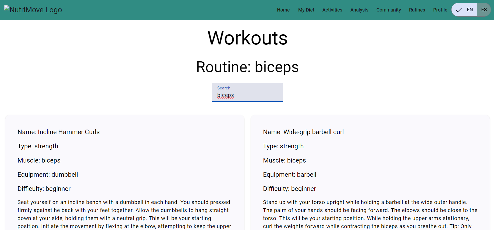

- Analisis:
  

Link de video: <a href="https://upcedupe-my.sharepoint.com/:v:/g/personal/u202221876_upc_edu_pe/Ebb3TGgroQ1Bgn21WYoMV8MBURrio-_EditrYrF5_e42wA?e=GaMPO1">https://upcedupe-my.sharepoint.com/:v:/g/personal/u202221876_upc_edu_pe/Ebb3TGgroQ1Bgn21WYoMV8MBURrio-\_EditrYrF5_e42wA?e=GaMPO1</a>

<h4>WEB SERVICES:</h4>

<h5>Activities:</h5>

- Metodo Post:

 

- Metodo Get:

- Metodo Get(id):

- Metodo Delete(id):

<h5>Subscriptions:</h5>

- Metodo Post:

 

- Metodo Get:

- Metodo Get(id):

  
<h5>Link de video:</h5> <a href="https://upcedupe-my.sharepoint.com/:v:/g/personal/u202221876_upc_edu_pe/ESIK97fbad5Ip0ZWxfwa9MQBV2KhH3GUEK9eMfEQfP2NgQ?e=fQOn0s&nav=eyJyZWZlcnJhbEluZm8iOnsicmVmZXJyYWxBcHAiOiJTdHJlYW1XZWJBcHAiLCJyZWZlcnJhbFZpZXciOiJTaGFyZURpYWxvZy1MaW5rIiwicmVmZXJyYWxBcHBQbGF0Zm9ybSI6IldlYiIsInJlZmVycmFsTW9kZSI6InZpZXcifX0%3D">https://upcedupe-my.sharepoint.com/:v:/g/personal/u202221876_upc_edu_pe/ESIK97fbad5Ip0ZWxfwa9MQBV2KhH3GUEK9eMfEQfP2NgQ?e=fQOn0s&nav=eyJyZWZlcnJhbEluZm8iOnsicmVmZXJyYWxBcHAiOiJTdHJlYW1XZWJBcHAiLCJyZWZlcnJhbFZpZXciOiJTaGFyZURpYWxvZy1MaW5rIiwicmVmZXJyYWxBcHBQbGF0Zm9ybSI6IldlYiIsInJlZmVycmFsTW9kZSI6InZpZXcifX0%3D</a>

<h5> 5.2.3.6.Services Documentation Evidence for Sprint Review.</h5>

En el sprint 3, se planificó enfocarse exclusivamente en el back end y por parte en mejorar el Web App. Haciendo la conexión de la base de datos con el back end y front end. Al principio, se trabajó de manera local, y posteriormente se implementó en un host, que ahora está integrado en la aplicación web de Front-End desplegada.
A continuación, se proporciona el enlace para acceder a [Enlace].

<table class="tg"><thead>
  <tr>
    <th class="tg-0pky" colspan="2">Endpoint </th>
    <th class="tg-0pky" colspan="4">Details</th>
  </tr></thead>
<tbody>
  <tr>
    <td class="tg-0pky" colspan="2">activity</td>
    <td class="tg-0pky" colspan="4">Se implementó el método GET, POST y DELETE para este endpoint. En el caso del método GET, se implementaron 2 tipos, uno para obtener los datos por medio del id, y otro para obtener los datos por medio de parámetros como Usuario</td>
  </tr>
  <tr>
    <td class="tg-0pky" colspan="2">Subscriptions</td>
    <td class="tg-0pky" colspan="4">Se implementó el método GET y POST para este endpoint. En el caso del método GET, se implementaron 2 tipos, uno para obtener los datos por medio del id, y otro para obtener los datos por medio de parámetros como Usuario</td>
  </tr>
  
  <tr>
    <td class="tg-0pky">Repository</td>
    <td class="tg-0pky">Branch</td>
    <td class="tg-0pky">Commit Id</td>
    <td class="tg-0pky">Commit message</td>
    <td class="tg-0pky">Commit message body</td>
    <td class="tg-0pky">Commited on (Date)</td>
  </tr>
  <tr><td style="border-color:inherit;border-style:solid;border-width:1px;font-family:Arial, sans-serif;font-size:14px;overflow:hidden;padding:10px 5px;text-align:left;vertical-align:top;word-break:normal" rowspan="12"><a href="https://github.com/TFOpenSource/NutriMoveTF">"https://github.com/TFOpenSource/BackEnd</a></td><td style="border-color:inherit;border-style:solid;border-width:1px;font-family:Arial, sans-serif;font-size:14px;overflow:hidden;padding:10px 5px;text-align:left;vertical-align:top;word-break:normal">feature-activity</td><td style="border-color:inherit;border-style:solid;border-width:1px;font-family:Arial, sans-serif;font-size:14px;overflow:hidden;padding:10px 5px;text-align:left;vertical-align:top;word-break:normal">4fe4aaa</td><td style="border-color:inherit;border-style:solid;border-width:1px;font-family:Arial, sans-serif;font-size:14px;overflow:hidden;padding:10px 5px;text-align:left;vertical-align:top;word-break:normal">create model Activity</td>
<td style="border-color:inherit;border-style:solid;border-width:1px;font-family:Arial, sans-serif;font-size:14px;overflow:hidden;padding:10px 5px;text-align:left;vertical-align:top;word-break:normal">create model Activity</td><td style="border-color:inherit;border-style:solid;border-width:1px;font-family:Arial, sans-serif;font-size:14px;overflow:hidden;padding:10px 5px;text-align:left;vertical-align:top;word-break:normal">    2/11/2024   </td></tr>
<tr><td style="border-color:inherit;border-style:solid;border-width:1px;font-family:Arial, sans-serif;font-size:14px;overflow:hidden;padding:10px 5px;text-align:left;vertical-align:top;word-break:normal">feature-activity</td><td style="border-color:inherit;border-style:solid;border-width:1px;font-family:Arial, sans-serif;font-size:14px;overflow:hidden;padding:10px 5px;text-align:left;vertical-align:top;word-break:normal">3aa29b5</td><td style="border-color:inherit;border-style:solid;border-width:1px;font-family:Arial, sans-serif;font-size:14px;overflow:hidden;padding:10px 5px;text-align:left;vertical-align:top;word-break:normal">declaration and implementation of Commands And Queries</td><td style="border-color:inherit;border-style:solid;border-width:1px;font-family:Arial, sans-serif;font-size:14px;overflow:hidden;padding:10px 5px;text-align:left;vertical-align:top;word-break:normal">declaration and implementation of Commands And Queries</td>
<td style="border-color:inherit;border-style:solid;border-width:1px;font-family:Arial, sans-serif;font-size:14px;overflow:hidden;padding:10px 5px;text-align:left;vertical-align:top;word-break:normal">    2/11/2024   </td></tr>
<tr><td style="border-color:inherit;border-style:solid;border-width:1px;font-family:Arial, sans-serif;font-size:14px;overflow:hidden;padding:10px 5px;text-align:left;vertical-align:top;word-break:normal">feature-activity</td><td style="border-color:inherit;border-style:solid;border-width:1px;font-family:Arial, sans-serif;font-size:14px;overflow:hidden;padding:10px 5px;text-align:left;vertical-align:top;word-break:normal">e296358</td><td style="border-color:inherit;border-style:solid;border-width:1px;font-family:Arial, sans-serif;font-size:14px;overflow:hidden;padding:10px 5px;text-align:left;vertical-align:top;word-break:normal">declaration and implementation of REST interfaces</td><td style="border-color:inherit;border-style:solid;border-width:1px;font-family:Arial, sans-serif;font-size:14px;overflow:hidden;padding:10px 5px;text-align:left;vertical-align:top;word-break:normal">declaration and implementation of REST interfaces</td>
<td style="border-color:inherit;border-style:solid;border-width:1px;font-family:Arial, sans-serif;font-size:14px;overflow:hidden;padding:10px 5px;text-align:left;vertical-align:top;word-break:normal">    2/11/2024   </td></tr>
<tr><td style="border-color:inherit;border-style:solid;border-width:1px;font-family:Arial, sans-serif;font-size:14px;overflow:hidden;padding:10px 5px;text-align:left;vertical-align:top;word-break:normal">feature-activity</td><td style="border-color:inherit;border-style:solid;border-width:1px;font-family:Arial, sans-serif;font-size:14px;overflow:hidden;padding:10px 5px;text-align:left;vertical-align:top;word-break:normal">caefc04</td><td style="border-color:inherit;border-style:solid;border-width:1px;font-family:Arial, sans-serif;font-size:14px;overflow:hidden;padding:10px 5px;text-align:left;vertical-align:top;word-break:normal">add dependencies</td><td style="border-color:inherit;border-style:solid;border-width:1px;font-family:Arial, sans-serif;font-size:14px;overflow:hidden;padding:10px 5px;text-align:left;vertical-align:top;word-break:normal">add dependencies</td>
<td style="border-color:inherit;border-style:solid;border-width:1px;font-family:Arial, sans-serif;font-size:14px;overflow:hidden;padding:10px 5px;text-align:left;vertical-align:top;word-break:normal">2/11/2024</td></tr>
<tr><td style="border-color:inherit;border-style:solid;border-width:1px;font-family:Arial, sans-serif;font-size:14px;overflow:hidden;padding:10px 5px;text-align:left;vertical-align:top;word-break:normal">feature-activity</td><td style="border-color:inherit;border-style:solid;border-width:1px;font-family:Arial, sans-serif;font-size:14px;overflow:hidden;padding:10px 5px;text-align:left;vertical-align:top;word-break:normal">a8e9f98</td><td style="border-color:inherit;border-style:solid;border-width:1px;font-family:Arial, sans-serif;font-size:14px;overflow:hidden;padding:10px 5px;text-align:left;vertical-align:top;word-break:normal">the controller of Activity endpoint has been added</td><td style="border-color:inherit;border-style:solid;border-width:1px;font-family:Arial, sans-serif;font-size:14px;overflow:hidden;padding:10px 5px;text-align:left;vertical-align:top;word-break:normal">the controller of Activity endpoint has been added</td>
<td style="border-color:inherit;border-style:solid;border-width:1px;font-family:Arial, sans-serif;font-size:14px;overflow:hidden;padding:10px 5px;text-align:left;vertical-align:top;word-break:normal">2/11/2024</td></tr>
<tr><td style="border-color:inherit;border-style:solid;border-width:1px;font-family:Arial, sans-serif;font-size:14px;overflow:hidden;padding:10px 5px;text-align:left;vertical-align:top;word-break:normal">feature-subscriptions</td><td style="border-color:inherit;border-style:solid;border-width:1px;font-family:Arial, sans-serif;font-size:14px;overflow:hidden;padding:10px 5px;text-align:left;vertical-align:top;word-break:normal">b0be41a6abde8239af6fd531d89a79b32d363442</td><td style="border-color:inherit;border-style:solid;border-width:1px;font-family:Arial, sans-serif;font-size:14px;overflow:hidden;padding:10px 5px;text-align:left;vertical-align:top;word-break:normal">Feature suscriptions</td><td style="border-color:inherit;border-style:solid;border-width:1px;font-family:Arial, sans-serif;font-size:14px;overflow:hidden;padding:10px 5px;text-align:left;vertical-align:top;word-break:normal">Feature suscriptions</td>
<td style="border-color:inherit;border-style:solid;border-width:1px;font-family:Arial, sans-serif;font-size:14px;overflow:hidden;padding:10px 5px;text-align:left;vertical-align:top;word-break:normal">2/11/2024</td></tr>
</tbody></table>

<h5> 5.2.3.7.Software Deployment Evidence for Sprint Review.</h5>

En la entrega del tercer sprint, se implementó el web aplication completamente funcional, cumpliendo con las user stories asociadas a este entregable. Asimismo, se lanzó una versión parcial del back end.

Despliegue de Landing Page en Github Pages:

Link de Landing Page: <a href="https://tfopensource.github.io/Landing_Page/">https://tfopensource.github.io/Landing_Page/</a>

Despliegue de Web Application en Netlify:

Link de Web Application: <a href="https://thunderous-phoenix-31b1f9.netlify.app/">https://thunderous-phoenix-31b1f9.netlify.app/</a>

<h5> 5.2.3.8.Team Collaboration Insights during Sprint.</h5>

| Alumno                               | Actividad                                                                                                                                                                            |
| ------------------------------------ | ------------------------------------------------------------------------------------------------------------------------------------------------------------------------------------ |
| Bohorquez Lerzundi Gerardo Sebastian | Sprint Planning #3 - Services Documentation Evidence for Sprint Review - Registro de Entrevistas - Video About-the-Team                                                              |
| Luza Carhuamaca, Jose Adrian         | Sprint Backlog #3 - Software Deployment Evidence for Sprint Review - Evaluaciones según heurísticas - Funcionalidad Actividades - Funcionalidad de Perfil - funcionalidad de rutinas |
| Silva Tirado, Sebastian Valentino    | Testing Suite Evidence for Sprint Review - Team Collaboration Insights during Sprint - Video About-the-Product - Funcionalidad de Dieta - Funcionalidad de rutinas                   |
| Uribe Quispe, Jesús Guillermo        | Execution Evidence for Sprint Review - Diseño de Entrevistas - Conclusiones y recomendaciones - Funcionalidad de análisis - Funcionalidad Dashboard                                  |

<h3>Insights: </h3>

<h4>Repositorio Front End</h4>

<h4>Repositorio Back End</h4>

<h4> 5.2.4. Sprint #4.</h4>

<h5> 5.2.4.1. Sprint Planning 4.</h5>

<table style="border-collapse:collapse;border-spacing:0" class="tg"><thead>
<tr><th style="border-color:black;border-style:solid;border-width:1px;font-family:Arial, sans-serif;font-size:14px;font-weight:normal;overflow:hidden;padding:10px 5px;text-align:left;vertical-align:top;word-break:normal">Sprint #</th><th style="border-color:black;border-style:solid;border-width:1px;font-family:Arial, sans-serif;font-size:14px;font-weight:normal;overflow:hidden;padding:10px 5px;text-align:left;vertical-align:top;word-break:normal">Date</th><th style="border-color:black;border-style:solid;border-width:1px;font-family:Arial, sans-serif;font-size:14px;font-weight:normal;overflow:hidden;padding:10px 5px;text-align:left;vertical-align:top;word-break:normal">Time</th>
<th style="border-color:black;border-style:solid;border-width:1px;font-family:Arial, sans-serif;font-size:14px;font-weight:normal;overflow:hidden;padding:10px 5px;text-align:left;vertical-align:top;word-break:normal">Location</th><th style="border-color:black;border-style:solid;border-width:1px;font-family:Arial, sans-serif;font-size:14px;font-weight:normal;overflow:hidden;padding:10px 5px;text-align:left;vertical-align:top;word-break:normal">Prepared By</th><th style="border-color:black;border-style:solid;border-width:1px;font-family:Arial, sans-serif;font-size:14px;font-weight:normal;overflow:hidden;padding:10px 5px;text-align:left;vertical-align:top;word-break:normal">Attendees</th></tr>
</thead>
<tbody>
<tr><td style="border-color:black;border-style:solid;border-width:1px;font-family:Arial, sans-serif;font-size:14px;overflow:hidden;padding:10px 5px;text-align:left;vertical-align:top;word-break:normal">4</td><td style="border-color:black;border-style:solid;border-width:1px;font-family:Arial, sans-serif;font-size:14px;overflow:hidden;padding:10px 5px;text-align:left;vertical-align:top;word-break:normal">08/11/2024</td><td style="border-color:black;border-style:solid;border-width:1px;font-family:Arial, sans-serif;font-size:14px;overflow:hidden;padding:10px 5px;text-align:left;vertical-align:top;word-break:normal">12:00 p.m.</td><td style="border-color:black;border-style:solid;border-width:1px;font-family:Arial, sans-serif;font-size:14px;overflow:hidden;padding:10px 5px;text-align:left;vertical-align:top;word-break:normal">Reunión online por discord</td>
<td style="border-color:black;border-style:solid;border-width:1px;font-family:Arial, sans-serif;font-size:14px;overflow:hidden;padding:10px 5px;text-align:left;vertical-align:top;word-break:normal">Jesús Uribe</td><td style="border-color:black;border-style:solid;border-width:1px;font-family:Arial, sans-serif;font-size:14px;overflow:hidden;padding:10px 5px;text-align:left;vertical-align:top;word-break:normal">Sebastian Bohorquez, Jose Luza, Sebastian Silva y Jesús Uribe</td></tr>
<tr><td style="border-color:black;border-style:solid;border-width:1px;font-family:Arial, sans-serif;font-size:14px;overflow:hidden;padding:10px 5px;text-align:left;vertical-align:top;word-break:normal" colspan="4">Sprint 4 Goal</td><td style="border-color:black;border-style:solid;border-width:1px;font-family:Arial, sans-serif;font-size:14px;overflow:hidden;padding:10px 5px;text-align:left;vertical-align:top;word-break:normal">Sprint 4 Velocity    </td><td style="border-color:black;border-style:solid;border-width:1px;font-family:Arial, sans-serif;font-size:14px;overflow:hidden;padding:10px 5px;text-align:left;vertical-align:top;word-break:normal">Sum of Story Points   </td></tr>
<tr><td style="border-color:black;border-style:solid;border-width:1px;font-family:Arial, sans-serif;font-size:14px;overflow:hidden;padding:10px 5px;text-align:left;vertical-align:top;word-break:normal" colspan="4">Actualizar el app web, conexión con la base de datos y back-end.</td><td style="border-color:black;border-style:solid;border-width:1px;font-family:Arial, sans-serif;font-size:14px;overflow:hidden;padding:10px 5px;text-align:left;vertical-align:top;word-break:normal">53</td><td style="border-color:black;border-style:solid;border-width:1px;font-family:Arial, sans-serif;font-size:14px;overflow:hidden;padding:10px 5px;text-align:left;vertical-align:top;word-break:normal">53</td></tr></tbody></table>

<h5> 5.2.4.2.Sprint Backlog 4.</h5>

En el cuarto y útlimo sprint backlog, seguimos trabajando en equipo y por la finalización del back end y base de datos. Para garantizar una distribución equitativa de las tareas, utilizamos el sprint board, dividiendo las user stories y asignándolas a los miembros del equipo.

 
Link del Trello: https://trello.com/invite/b/6739561e601b5da9203356c6/ATTIac5d383706e792e5a08b88b846b37bc338B3DDB7/sprint-backlog-4 

<table style="border-collapse:collapse;border-spacing:0" class="tg"><thead><tr><th style="border-color:black;border-style:solid;border-width:1px;font-family:Arial, sans-serif;font-size:14px;font-weight:normal;overflow:hidden;padding:10px 5px;text-align:left;vertical-align:top;word-break:normal">    # Sprint   </th><th style="border-color:black;border-style:solid;border-width:1px;font-family:Arial, sans-serif;font-size:14px;font-weight:normal;overflow:hidden;padding:10px 5px;text-align:left;vertical-align:top;word-break:normal" colspan="7">Sprint 4</th></tr></thead>
<tbody><tr><td style="border-color:black;border-style:solid;border-width:1px;font-family:Arial, sans-serif;font-size:14px;overflow:hidden;padding:10px 5px;text-align:left;vertical-align:top;word-break:normal" colspan="2">    User Story   </td><td style="border-color:black;border-style:solid;border-width:1px;font-family:Arial, sans-serif;font-size:14px;overflow:hidden;padding:10px 5px;text-align:left;vertical-align:top;word-break:normal" colspan="6">Work Item/Task</td></tr>
<tr><td style="border-color:black;border-style:solid;border-width:1px;font-family:Arial, sans-serif;font-size:14px;overflow:hidden;padding:10px 5px;text-align:left;vertical-align:top;word-break:normal">    Id   </td><td style="border-color:black;border-style:solid;border-width:1px;font-family:Arial, sans-serif;font-size:14px;overflow:hidden;padding:10px 5px;text-align:left;vertical-align:top;word-break:normal">    Title   </td><td style="border-color:black;border-style:solid;border-width:1px;font-family:Arial, sans-serif;font-size:14px;overflow:hidden;padding:10px 5px;text-align:left;vertical-align:top;word-break:normal">    Id   </td><td style="border-color:black;border-style:solid;border-width:1px;font-family:Arial, sans-serif;font-size:14px;overflow:hidden;padding:10px 5px;text-align:left;vertical-align:top;word-break:normal">    Title   </td>
<td style="border-color:black;border-style:solid;border-width:1px;font-family:Arial, sans-serif;font-size:14px;overflow:hidden;padding:10px 5px;text-align:left;vertical-align:top;word-break:normal">    Descripción   </td><td style="border-color:black;border-style:solid;border-width:1px;font-family:Arial, sans-serif;font-size:14px;overflow:hidden;padding:10px 5px;text-align:left;vertical-align:top;word-break:normal">    Estimación (Hours)   </td><td style="border-color:black;border-style:solid;border-width:1px;font-family:Arial, sans-serif;font-size:14px;overflow:hidden;padding:10px 5px;text-align:left;vertical-align:top;word-break:normal">    Assigned to   </td><td style="border-color:black;border-style:solid;border-width:1px;font-family:Arial, sans-serif;font-size:14px;overflow:hidden;padding:10px 5px;text-align:left;vertical-align:top;word-break:normal">    Status (In   -process / To - review / Done)   </td></tr>
<tr><td style="border-color:black;border-style:solid;border-width:1px;font-family:Arial, sans-serif;font-size:14px;overflow:hidden;padding:10px 5px;text-align:left;vertical-align:top;word-break:normal">TS001</td><td style="border-color:black;border-style:solid;border-width:1px;font-family:Arial, sans-serif;font-size:14px;overflow:hidden;padding:10px 5px;text-align:left;vertical-align:top;word-break:normal">API para obtener información nutricional de un alimento</td><td style="border-color:black;border-style:solid;border-width:1px;font-family:Arial, sans-serif;font-size:14px;overflow:hidden;padding:10px 5px;text-align:left;vertical-align:top;word-break:normal">UT16</td><td style="border-color:black;border-style:solid;border-width:1px;font-family:Arial, sans-serif;font-size:14px;overflow:hidden;padding:10px 5px;text-align:left;vertical-align:top;word-break:normal">Desarrollo de API</td>
<td style="border-color:black;border-style:solid;border-width:1px;font-family:Arial, sans-serif;font-size:14px;overflow:hidden;padding:10px 5px;text-align:left;vertical-align:top;word-break:normal">Como desarrollador que trabaja en la aplicación de NutriMove, quiero implementar una API que permita obtener información nutricional de alimentos específicos, para que los usuarios puedan conocer los valores nutricionales de los alimentos que consumen.</td><td style="border-color:black;border-style:solid;border-width:1px;font-family:Arial, sans-serif;font-size:14px;overflow:hidden;padding:10px 5px;text-align:left;vertical-align:top;word-break:normal">3</td><td style="border-color:black;border-style:solid;border-width:1px;font-family:Arial, sans-serif;font-size:14px;overflow:hidden;padding:10px 5px;text-align:left;vertical-align:top;word-break:normal">    Jesús Uribe      </td>
<td style="border-color:black;border-style:solid;border-width:1px;font-family:Arial, sans-serif;font-size:14px;overflow:hidden;padding:10px 5px;text-align:left;vertical-align:top;word-break:normal">    Done   </td></tr>
<tr><td style="border-color:black;border-style:solid;border-width:1px;font-family:Arial, sans-serif;font-size:14px;overflow:hidden;padding:10px 5px;text-align:left;vertical-align:top;word-break:normal">TS002</td><td style="border-color:black;border-style:solid;border-width:1px;font-family:Arial, sans-serif;font-size:14px;overflow:hidden;padding:10px 5px;text-align:left;vertical-align:top;word-break:normal">API para registrar nuevos usuarios en la plataforma</td><td style="border-color:black;border-style:solid;border-width:1px;font-family:Arial, sans-serif;font-size:14px;overflow:hidden;padding:10px 5px;text-align:left;vertical-align:top;word-break:normal">UT16</td><td style="border-color:black;border-style:solid;border-width:1px;font-family:Arial, sans-serif;font-size:14px;overflow:hidden;padding:10px 5px;text-align:left;vertical-align:top;word-break:normal">Desarrollo de API</td>
<td style="border-color:black;border-style:solid;border-width:1px;font-family:Arial, sans-serif;font-size:14px;overflow:hidden;padding:10px 5px;text-align:left;vertical-align:top;word-break:normal">Como desarrollador que trabaja en la aplicación de NutriMove, quiero implementar una API que permita registrar nuevos usuarios en la plataforma, para que puedan acceder a todas las funcionalidades de la aplicación.</td><td style="border-color:black;border-style:solid;border-width:1px;font-family:Arial, sans-serif;font-size:14px;overflow:hidden;padding:10px 5px;text-align:left;vertical-align:top;word-break:normal">    3   </td><td style="border-color:black;border-style:solid;border-width:1px;font-family:Arial, sans-serif;font-size:14px;overflow:hidden;padding:10px 5px;text-align:left;vertical-align:top;word-break:normal">    José Luza      </td>
<td style="border-color:black;border-style:solid;border-width:1px;font-family:Arial, sans-serif;font-size:14px;overflow:hidden;padding:10px 5px;text-align:left;vertical-align:top;word-break:normal">    Done   </td></tr>
<tr><td style="border-color:black;border-style:solid;border-width:1px;font-family:Arial, sans-serif;font-size:14px;overflow:hidden;padding:10px 5px;text-align:left;vertical-align:top;word-break:normal">TS003</td><td style="border-color:black;border-style:solid;border-width:1px;font-family:Arial, sans-serif;font-size:14px;overflow:hidden;padding:10px 5px;text-align:left;vertical-align:top;word-break:normal">API para actualizar información de perfil de usuario</td><td style="border-color:black;border-style:solid;border-width:1px;font-family:Arial, sans-serif;font-size:14px;overflow:hidden;padding:10px 5px;text-align:left;vertical-align:top;word-break:normal">UT16</td><td style="border-color:black;border-style:solid;border-width:1px;font-family:Arial, sans-serif;font-size:14px;overflow:hidden;padding:10px 5px;text-align:left;vertical-align:top;word-break:normal">Desarrollo de API</td>
<td style="border-color:black;border-style:solid;border-width:1px;font-family:Arial, sans-serif;font-size:14px;overflow:hidden;padding:10px 5px;text-align:left;vertical-align:top;word-break:normal">Como desarrollador que trabaja en la aplicación de NutriMove, quiero implementar una API que permita a los usuarios actualizar la información de su perfil, para mantener sus datos personales al día.</td><td style="border-color:black;border-style:solid;border-width:1px;font-family:Arial, sans-serif;font-size:14px;overflow:hidden;padding:10px 5px;text-align:left;vertical-align:top;word-break:normal">    3   </td><td style="border-color:black;border-style:solid;border-width:1px;font-family:Arial, sans-serif;font-size:14px;overflow:hidden;padding:10px 5px;text-align:left;vertical-align:top;word-break:normal">    Sebastián Bohorquez       </td>
<td style="border-color:black;border-style:solid;border-width:1px;font-family:Arial, sans-serif;font-size:14px;overflow:hidden;padding:10px 5px;text-align:left;vertical-align:top;word-break:normal">    Done   </td></tr>
<tr><td style="border-color:black;border-style:solid;border-width:1px;font-family:Arial, sans-serif;font-size:14px;overflow:hidden;padding:10px 5px;text-align:left;vertical-align:top;word-break:normal">TS004</td><td style="border-color:black;border-style:solid;border-width:1px;font-family:Arial, sans-serif;font-size:14px;overflow:hidden;padding:10px 5px;text-align:left;vertical-align:top;word-break:normal">API para inicio de sesión de usuarios</td><td style="border-color:black;border-style:solid;border-width:1px;font-family:Arial, sans-serif;font-size:14px;overflow:hidden;padding:10px 5px;text-align:left;vertical-align:top;word-break:normal">UT16</td><td style="border-color:black;border-style:solid;border-width:1px;font-family:Arial, sans-serif;font-size:14px;overflow:hidden;padding:10px 5px;text-align:left;vertical-align:top;word-break:normal">Desarrollo de API</td>
<td style="border-color:black;border-style:solid;border-width:1px;font-family:Arial, sans-serif;font-size:14px;overflow:hidden;padding:10px 5px;text-align:left;vertical-align:top;word-break:normal">Como desarrollador que trabaja en la aplicación de NutriMove, quiero implementar una API que permita a los usuarios iniciar sesión en la plataforma, para que puedan acceder a sus cuentas y funcionalidades personalizadas.</td><td style="border-color:black;border-style:solid;border-width:1px;font-family:Arial, sans-serif;font-size:14px;overflow:hidden;padding:10px 5px;text-align:left;vertical-align:top;word-break:normal">    4   </td><td style="border-color:black;border-style:solid;border-width:1px;font-family:Arial, sans-serif;font-size:14px;overflow:hidden;padding:10px 5px;text-align:left;vertical-align:top;word-break:normal">    Sebastian Silva       </td>
<td style="border-color:black;border-style:solid;border-width:1px;font-family:Arial, sans-serif;font-size:14px;overflow:hidden;padding:10px 5px;text-align:left;vertical-align:top;word-break:normal">    Done   </td></tr>
<tr><td style="border-color:black;border-style:solid;border-width:1px;font-family:Arial, sans-serif;font-size:14px;overflow:hidden;padding:10px 5px;text-align:left;vertical-align:top;word-break:normal">TS005</td><td style="border-color:black;border-style:solid;border-width:1px;font-family:Arial, sans-serif;font-size:14px;overflow:hidden;padding:10px 5px;text-align:left;vertical-align:top;word-break:normal">API para recomendaciones personalizadas</td><td style="border-color:black;border-style:solid;border-width:1px;font-family:Arial, sans-serif;font-size:14px;overflow:hidden;padding:10px 5px;text-align:left;vertical-align:top;word-break:normal">UT16</td><td style="border-color:black;border-style:solid;border-width:1px;font-family:Arial, sans-serif;font-size:14px;overflow:hidden;padding:10px 5px;text-align:left;vertical-align:top;word-break:normal">Desarrollo de API</td>
<td style="border-color:black;border-style:solid;border-width:1px;font-family:Arial, sans-serif;font-size:14px;overflow:hidden;padding:10px 5px;text-align:left;vertical-align:top;word-break:normal">Como desarrollador que trabaja en la aplicación de NutriMove, quiero implementar una API que ofrezca recomendaciones personalizadas de planes de alimentación y actividad física, basadas en los datos del usuario, para mejorar su bienestar.</td><td style="border-color:black;border-style:solid;border-width:1px;font-family:Arial, sans-serif;font-size:14px;overflow:hidden;padding:10px 5px;text-align:left;vertical-align:top;word-break:normal">    4   </td><td style="border-color:black;border-style:solid;border-width:1px;font-family:Arial, sans-serif;font-size:14px;overflow:hidden;padding:10px 5px;text-align:left;vertical-align:top;word-break:normal">    Jesús Uribe      </td>
<td style="border-color:black;border-style:solid;border-width:1px;font-family:Arial, sans-serif;font-size:14px;overflow:hidden;padding:10px 5px;text-align:left;vertical-align:top;word-break:normal">    Done   </td></tr>
<tr><td style="border-color:black;border-style:solid;border-width:1px;font-family:Arial, sans-serif;font-size:14px;overflow:hidden;padding:10px 5px;text-align:left;vertical-align:top;word-break:normal">TS006</td><td style="border-color:black;border-style:solid;border-width:1px;font-family:Arial, sans-serif;font-size:14px;overflow:hidden;padding:10px 5px;text-align:left;vertical-align:top;word-break:normal">API para rutina de ejercicios personalizada</td><td style="border-color:black;border-style:solid;border-width:1px;font-family:Arial, sans-serif;font-size:14px;overflow:hidden;padding:10px 5px;text-align:left;vertical-align:top;word-break:normal">UT16</td><td style="border-color:black;border-style:solid;border-width:1px;font-family:Arial, sans-serif;font-size:14px;overflow:hidden;padding:10px 5px;text-align:left;vertical-align:top;word-break:normal">Desarrollo de API</td>
<td style="border-color:black;border-style:solid;border-width:1px;font-family:Arial, sans-serif;font-size:14px;overflow:hidden;padding:10px 5px;text-align:left;vertical-align:top;word-break:normal">Como desarrollador que trabaja en la aplicación de NutriMove, quiero implementar una API que proporcione rutinas de ejercicios personalizadas basadas en los datos del usuario, para mejorar su condición física de manera adecuada.</td><td style="border-color:black;border-style:solid;border-width:1px;font-family:Arial, sans-serif;font-size:14px;overflow:hidden;padding:10px 5px;text-align:left;vertical-align:top;word-break:normal">2</td><td style="border-color:black;border-style:solid;border-width:1px;font-family:Arial, sans-serif;font-size:14px;overflow:hidden;padding:10px 5px;text-align:left;vertical-align:top;word-break:normal">    José Luza      </td>
<td style="border-color:black;border-style:solid;border-width:1px;font-family:Arial, sans-serif;font-size:14px;overflow:hidden;padding:10px 5px;text-align:left;vertical-align:top;word-break:normal">    Done   </td></tr>
<tr><td style="border-color:black;border-style:solid;border-width:1px;font-family:Arial, sans-serif;font-size:14px;overflow:hidden;padding:10px 5px;text-align:left;vertical-align:top;word-break:normal">TS007</td><td style="border-color:black;border-style:solid;border-width:1px;font-family:Arial, sans-serif;font-size:14px;overflow:hidden;padding:10px 5px;text-align:left;vertical-align:top;word-break:normal">API para recuperación de contraseña</td><td style="border-color:black;border-style:solid;border-width:1px;font-family:Arial, sans-serif;font-size:14px;overflow:hidden;padding:10px 5px;text-align:left;vertical-align:top;word-break:normal">UT16</td><td style="border-color:black;border-style:solid;border-width:1px;font-family:Arial, sans-serif;font-size:14px;overflow:hidden;padding:10px 5px;text-align:left;vertical-align:top;word-break:normal">Desarrollo de API</td>
<td style="border-color:black;border-style:solid;border-width:1px;font-family:Arial, sans-serif;font-size:14px;overflow:hidden;padding:10px 5px;text-align:left;vertical-align:top;word-break:normal">Como desarrollador que trabaja en la aplicación de NutriMove, quiero implementar una API que permita a los usuarios recuperar su contraseña en caso de olvido, para que puedan restablecer su acceso a la cuenta de forma segura.</td><td style="border-color:black;border-style:solid;border-width:1px;font-family:Arial, sans-serif;font-size:14px;overflow:hidden;padding:10px 5px;text-align:left;vertical-align:top;word-break:normal">3</td><td style="border-color:black;border-style:solid;border-width:1px;font-family:Arial, sans-serif;font-size:14px;overflow:hidden;padding:10px 5px;text-align:left;vertical-align:top;word-break:normal">    Sebastián Bohorquez       </td>
<td style="border-color:black;border-style:solid;border-width:1px;font-family:Arial, sans-serif;font-size:14px;overflow:hidden;padding:10px 5px;text-align:left;vertical-align:top;word-break:normal">    Done   </td></tr>
<tr><td style="border-color:black;border-style:solid;border-width:1px;font-family:Arial, sans-serif;font-size:14px;overflow:hidden;padding:10px 5px;text-align:left;vertical-align:top;word-break:normal">TS008</td><td style="border-color:black;border-style:solid;border-width:1px;font-family:Arial, sans-serif;font-size:14px;overflow:hidden;padding:10px 5px;text-align:left;vertical-align:top;word-break:normal">API para gráficos de progreso del usuario</td><td style="border-color:black;border-style:solid;border-width:1px;font-family:Arial, sans-serif;font-size:14px;overflow:hidden;padding:10px 5px;text-align:left;vertical-align:top;word-break:normal">UT16</td><td style="border-color:black;border-style:solid;border-width:1px;font-family:Arial, sans-serif;font-size:14px;overflow:hidden;padding:10px 5px;text-align:left;vertical-align:top;word-break:normal">Desarrollo de API</td>
<td style="border-color:black;border-style:solid;border-width:1px;font-family:Arial, sans-serif;font-size:14px;overflow:hidden;padding:10px 5px;text-align:left;vertical-align:top;word-break:normal">Como desarrollador que trabaja en la aplicación de NutriMove, quiero implementar una API que proporcione gráficos de progreso visuales basados en los datos de entrenamiento y nutrición del usuario, para que los usuarios puedan monitorear su avance.</td><td style="border-color:black;border-style:solid;border-width:1px;font-family:Arial, sans-serif;font-size:14px;overflow:hidden;padding:10px 5px;text-align:left;vertical-align:top;word-break:normal">3</td><td style="border-color:black;border-style:solid;border-width:1px;font-family:Arial, sans-serif;font-size:14px;overflow:hidden;padding:10px 5px;text-align:left;vertical-align:top;word-break:normal">    Sebastian Silva       </td>
<td style="border-color:black;border-style:solid;border-width:1px;font-family:Arial, sans-serif;font-size:14px;overflow:hidden;padding:10px 5px;text-align:left;vertical-align:top;word-break:normal">    Done   </td></tr>
</tbody></table>

<h5> 5.2.4.3.Development Evidence for Sprint Review.</h5>

<h6>Repositorio: <a href="https://github.com/TFOpenSource/NutriMoveTF" target="_blank" rel="noopener noreferrer">TFOpenSource / NutriMoveTF</a></h6>

<table style="border-collapse:collapse;border-spacing:0" class="tg"><thead>
<tr><th style="border-color:black;border-style:solid;border-width:1px;font-family:Arial, sans-serif;font-size:14px;font-weight:normal;overflow:hidden;padding:10px 5px;text-align:left;vertical-align:top;word-break:normal">    Repository   </th><th style="border-color:black;border-style:solid;border-width:1px;font-family:Arial, sans-serif;font-size:14px;font-weight:normal;overflow:hidden;padding:10px 5px;text-align:left;vertical-align:top;word-break:normal">    Branch   </th><th style="border-color:black;border-style:solid;border-width:1px;font-family:Arial, sans-serif;font-size:14px;font-weight:normal;overflow:hidden;padding:10px 5px;text-align:left;vertical-align:top;word-break:normal">    Commit ID   </th>
<th style="border-color:black;border-style:solid;border-width:1px;font-family:Arial, sans-serif;font-size:14px;font-weight:normal;overflow:hidden;padding:10px 5px;text-align:left;vertical-align:top;word-break:normal">    Commit     Message   </th><th style="border-color:black;border-style:solid;border-width:1px;font-family:Arial, sans-serif;font-size:14px;font-weight:normal;overflow:hidden;padding:10px 5px;text-align:left;vertical-align:top;word-break:normal">    Commit     Message Body   </th>
<th style="border-color:black;border-style:solid;border-width:1px;font-family:Arial, sans-serif;font-size:14px;font-weight:normal;overflow:hidden;padding:10px 5px;text-align:left;vertical-align:top;word-break:normal">    Committed on   (Date)   </th></tr>
</thead>
<tbody>
<tr><td style="border-color:black;border-style:solid;border-width:1px;font-family:Arial, sans-serif;font-size:14px;overflow:hidden;padding:10px 5px;text-align:left;vertical-align:top;word-break:normal" rowspan="12"><a href="https://github.com/TFOpenSource/NutriMoveTF" target="_blank" rel="noopener noreferrer">https://github.com/TFOpenSource/BackEnd</a></td><td style="border-color:black;border-style:solid;border-width:1px;font-family:Arial, sans-serif;font-size:14px;overflow:hidden;padding:10px 5px;text-align:left;vertical-align:top;word-break:normal">feature-activity</td><td style="border-color:black;border-style:solid;border-width:1px;font-family:Arial, sans-serif;font-size:14px;overflow:hidden;padding:10px 5px;text-align:left;vertical-align:top;word-break:normal">4fe4aaa</td>
<td style="border-color:black;border-style:solid;border-width:1px;font-family:Arial, sans-serif;font-size:14px;overflow:hidden;padding:10px 5px;text-align:left;vertical-align:top;word-break:normal">create model Activity</td><td style="border-color:black;border-style:solid;border-width:1px;font-family:Arial, sans-serif;font-size:14px;overflow:hidden;padding:10px 5px;text-align:left;vertical-align:top;word-break:normal">create model Activity</td><td style="border-color:black;border-style:solid;border-width:1px;font-family:Arial, sans-serif;font-size:14px;overflow:hidden;padding:10px 5px;text-align:left;vertical-align:top;word-break:normal">    2/11/2024   </td></tr>
<tr><td style="border-color:black;border-style:solid;border-width:1px;font-family:Arial, sans-serif;font-size:14px;overflow:hidden;padding:10px 5px;text-align:left;vertical-align:top;word-break:normal">feature-activity</td><td style="border-color:black;border-style:solid;border-width:1px;font-family:Arial, sans-serif;font-size:14px;overflow:hidden;padding:10px 5px;text-align:left;vertical-align:top;word-break:normal">3aa29b5</td><td style="border-color:black;border-style:solid;border-width:1px;font-family:Arial, sans-serif;font-size:14px;overflow:hidden;padding:10px 5px;text-align:left;vertical-align:top;word-break:normal">declaration and implementation of Commands And Queries</td><td style="border-color:black;border-style:solid;border-width:1px;font-family:Arial, sans-serif;font-size:14px;overflow:hidden;padding:10px 5px;text-align:left;vertical-align:top;word-break:normal">declaration and implementation of Commands And Queries</td>
<td style="border-color:black;border-style:solid;border-width:1px;font-family:Arial, sans-serif;font-size:14px;overflow:hidden;padding:10px 5px;text-align:left;vertical-align:top;word-break:normal">    2/11/2024   </td></tr>
<tr><td style="border-color:black;border-style:solid;border-width:1px;font-family:Arial, sans-serif;font-size:14px;overflow:hidden;padding:10px 5px;text-align:left;vertical-align:top;word-break:normal">feature-activity</td><td style="border-color:black;border-style:solid;border-width:1px;font-family:Arial, sans-serif;font-size:14px;overflow:hidden;padding:10px 5px;text-align:left;vertical-align:top;word-break:normal">e296358</td><td style="border-color:black;border-style:solid;border-width:1px;font-family:Arial, sans-serif;font-size:14px;overflow:hidden;padding:10px 5px;text-align:left;vertical-align:top;word-break:normal">declaration and implementation of REST interfaces</td><td style="border-color:black;border-style:solid;border-width:1px;font-family:Arial, sans-serif;font-size:14px;overflow:hidden;padding:10px 5px;text-align:left;vertical-align:top;word-break:normal">declaration and implementation of REST interfaces</td>
<td style="border-color:black;border-style:solid;border-width:1px;font-family:Arial, sans-serif;font-size:14px;overflow:hidden;padding:10px 5px;text-align:left;vertical-align:top;word-break:normal">    2/11/2024   </td></tr>
<tr><td style="border-color:black;border-style:solid;border-width:1px;font-family:Arial, sans-serif;font-size:14px;overflow:hidden;padding:10px 5px;text-align:left;vertical-align:top;word-break:normal">feature-activity</td><td style="border-color:black;border-style:solid;border-width:1px;font-family:Arial, sans-serif;font-size:14px;overflow:hidden;padding:10px 5px;text-align:left;vertical-align:top;word-break:normal">caefc04</td><td style="border-color:black;border-style:solid;border-width:1px;font-family:Arial, sans-serif;font-size:14px;overflow:hidden;padding:10px 5px;text-align:left;vertical-align:top;word-break:normal">add dependencies</td><td style="border-color:black;border-style:solid;border-width:1px;font-family:Arial, sans-serif;font-size:14px;overflow:hidden;padding:10px 5px;text-align:left;vertical-align:top;word-break:normal">add dependencies</td>
<td style="border-color:black;border-style:solid;border-width:1px;font-family:Arial, sans-serif;font-size:14px;overflow:hidden;padding:10px 5px;text-align:left;vertical-align:top;word-break:normal">2/11/2024</td></tr>
<tr><td style="border-color:black;border-style:solid;border-width:1px;font-family:Arial, sans-serif;font-size:14px;overflow:hidden;padding:10px 5px;text-align:left;vertical-align:top;word-break:normal">feature-activity</td><td style="border-color:black;border-style:solid;border-width:1px;font-family:Arial, sans-serif;font-size:14px;overflow:hidden;padding:10px 5px;text-align:left;vertical-align:top;word-break:normal">a8e9f98</td><td style="border-color:black;border-style:solid;border-width:1px;font-family:Arial, sans-serif;font-size:14px;overflow:hidden;padding:10px 5px;text-align:left;vertical-align:top;word-break:normal">the controller of Activity endpoint has been added</td><td style="border-color:black;border-style:solid;border-width:1px;font-family:Arial, sans-serif;font-size:14px;overflow:hidden;padding:10px 5px;text-align:left;vertical-align:top;word-break:normal">the controller of Activity endpoint has been added</td>
<td style="border-color:black;border-style:solid;border-width:1px;font-family:Arial, sans-serif;font-size:14px;overflow:hidden;padding:10px 5px;text-align:left;vertical-align:top;word-break:normal">2/11/2024</td></tr>
<tr><td style="border-color:black;border-style:solid;border-width:1px;font-family:Arial, sans-serif;font-size:14px;overflow:hidden;padding:10px 5px;text-align:left;vertical-align:top;word-break:normal">feature-subscriptions</td><td style="border-color:black;border-style:solid;border-width:1px;font-family:Arial, sans-serif;font-size:14px;overflow:hidden;padding:10px 5px;text-align:left;vertical-align:top;word-break:normal">b0be41a6abde8239af6fd531d89a79b32d363442</td><td style="border-color:black;border-style:solid;border-width:1px;font-family:Arial, sans-serif;font-size:14px;overflow:hidden;padding:10px 5px;text-align:left;vertical-align:top;word-break:normal">Feature suscriptions</td><td style="border-color:black;border-style:solid;border-width:1px;font-family:Arial, sans-serif;font-size:14px;overflow:hidden;padding:10px 5px;text-align:left;vertical-align:top;word-break:normal">Feature suscriptions</td>
<td style="border-color:black;border-style:solid;border-width:1px;font-family:Arial, sans-serif;font-size:14px;overflow:hidden;padding:10px 5px;text-align:left;vertical-align:top;word-break:normal">2/11/2024</td></tr>
<tr><td style="border-color:black;border-style:solid;border-width:1px;font-family:Arial, sans-serif;font-size:14px;overflow:hidden;padding:10px 5px;text-align:left;vertical-align:top;word-break:normal"></td><td style="border-color:black;border-style:solid;border-width:1px;font-family:Arial, sans-serif;font-size:14px;overflow:hidden;padding:10px 5px;text-align:left;vertical-align:top;word-break:normal"></td><td style="border-color:black;border-style:solid;border-width:1px;font-family:Arial, sans-serif;font-size:14px;overflow:hidden;padding:10px 5px;text-align:left;vertical-align:top;word-break:normal"></td><td style="border-color:black;border-style:solid;border-width:1px;font-family:Arial, sans-serif;font-size:14px;overflow:hidden;padding:10px 5px;text-align:left;vertical-align:top;word-break:normal"></td>
<td style="border-color:black;border-style:solid;border-width:1px;font-family:Arial, sans-serif;font-size:14px;overflow:hidden;padding:10px 5px;text-align:left;vertical-align:top;word-break:normal"></td></tr>
<tr><td style="border-color:black;border-style:solid;border-width:1px;font-family:Arial, sans-serif;font-size:14px;overflow:hidden;padding:10px 5px;text-align:left;vertical-align:top;word-break:normal"></td><td style="border-color:black;border-style:solid;border-width:1px;font-family:Arial, sans-serif;font-size:14px;overflow:hidden;padding:10px 5px;text-align:left;vertical-align:top;word-break:normal"></td><td style="border-color:black;border-style:solid;border-width:1px;font-family:Arial, sans-serif;font-size:14px;overflow:hidden;padding:10px 5px;text-align:left;vertical-align:top;word-break:normal"></td><td style="border-color:black;border-style:solid;border-width:1px;font-family:Arial, sans-serif;font-size:14px;overflow:hidden;padding:10px 5px;text-align:left;vertical-align:top;word-break:normal"></td>
<td style="border-color:black;border-style:solid;border-width:1px;font-family:Arial, sans-serif;font-size:14px;overflow:hidden;padding:10px 5px;text-align:left;vertical-align:top;word-break:normal"></td></tr>
<tr><td style="border-color:black;border-style:solid;border-width:1px;font-family:Arial, sans-serif;font-size:14px;overflow:hidden;padding:10px 5px;text-align:left;vertical-align:top;word-break:normal">release-v1.1.1</td><td style="border-color:black;border-style:solid;border-width:1px;font-family:Arial, sans-serif;font-size:14px;overflow:hidden;padding:10px 5px;text-align:left;vertical-align:top;word-break:normal">6285353</td><td style="border-color:black;border-style:solid;border-width:1px;font-family:Arial, sans-serif;font-size:14px;overflow:hidden;padding:10px 5px;text-align:left;vertical-align:top;word-break:normal">add Features to develop</td><td style="border-color:black;border-style:solid;border-width:1px;font-family:Arial, sans-serif;font-size:14px;overflow:hidden;padding:10px 5px;text-align:left;vertical-align:top;word-break:normal">add Features to develop</td>
<td style="border-color:black;border-style:solid;border-width:1px;font-family:Arial, sans-serif;font-size:14px;overflow:hidden;padding:10px 5px;text-align:left;vertical-align:top;word-break:normal">28/10/2024</td></tr>
<tr><td style="border-color:black;border-style:solid;border-width:1px;font-family:Arial, sans-serif;font-size:14px;overflow:hidden;padding:10px 5px;text-align:left;vertical-align:top;word-break:normal">hotfix-styles</td><td style="border-color:black;border-style:solid;border-width:1px;font-family:Arial, sans-serif;font-size:14px;overflow:hidden;padding:10px 5px;text-align:left;vertical-align:top;word-break:normal">f68fcaa</td><td style="border-color:black;border-style:solid;border-width:1px;font-family:Arial, sans-serif;font-size:14px;overflow:hidden;padding:10px 5px;text-align:left;vertical-align:top;word-break:normal">Add metrics based on data of the FakeAPI</td><td style="border-color:black;border-style:solid;border-width:1px;font-family:Arial, sans-serif;font-size:14px;overflow:hidden;padding:10px 5px;text-align:left;vertical-align:top;word-break:normal">Add metrics based on data of the FakeAPI</td>
<td style="border-color:black;border-style:solid;border-width:1px;font-family:Arial, sans-serif;font-size:14px;overflow:hidden;padding:10px 5px;text-align:left;vertical-align:top;word-break:normal">29/10/2024</td></tr>
<tr><td style="border-color:black;border-style:solid;border-width:1px;font-family:Arial, sans-serif;font-size:14px;overflow:hidden;padding:10px 5px;text-align:left;vertical-align:top;word-break:normal">develop</td><td style="border-color:black;border-style:solid;border-width:1px;font-family:Arial, sans-serif;font-size:14px;overflow:hidden;padding:10px 5px;text-align:left;vertical-align:top;word-break:normal">2773ee0</td><td style="border-color:black;border-style:solid;border-width:1px;font-family:Arial, sans-serif;font-size:14px;overflow:hidden;padding:10px 5px;text-align:left;vertical-align:top;word-break:normal">fixed metrics on dashboard, internationalization, routine features and styles of public components</td>
<td style="border-color:black;border-style:solid;border-width:1px;font-family:Arial, sans-serif;font-size:14px;overflow:hidden;padding:10px 5px;text-align:left;vertical-align:top;word-break:normal">fixed metrics on dashboard, internationalization, routine features and styles of public components</td><td style="border-color:black;border-style:solid;border-width:1px;font-family:Arial, sans-serif;font-size:14px;overflow:hidden;padding:10px 5px;text-align:left;vertical-align:top;word-break:normal">29/10/2024</td></tr>
<tr><td style="border-color:black;border-style:solid;border-width:1px;font-family:Arial, sans-serif;font-size:14px;overflow:hidden;padding:10px 5px;text-align:left;vertical-align:top;word-break:normal">main</td><td style="border-color:black;border-style:solid;border-width:1px;font-family:Arial, sans-serif;font-size:14px;overflow:hidden;padding:10px 5px;text-align:left;vertical-align:top;word-break:normal">97e0e22</td><td style="border-color:black;border-style:solid;border-width:1px;font-family:Arial, sans-serif;font-size:14px;overflow:hidden;padding:10px 5px;text-align:left;vertical-align:top;word-break:normal">Release v1.1.2</td><td style="border-color:black;border-style:solid;border-width:1px;font-family:Arial, sans-serif;font-size:14px;overflow:hidden;padding:10px 5px;text-align:left;vertical-align:top;word-break:normal">Release v1.1.2</td>
<td style="border-color:black;border-style:solid;border-width:1px;font-family:Arial, sans-serif;font-size:14px;overflow:hidden;padding:10px 5px;text-align:left;vertical-align:top;word-break:normal">29/10/2024</td></tr>
</tbody></table>

<h5> 5.2.4.4.Testing Suite Evidence for Sprint Review.</h5>

   
<table style="border-collapse:collapse;border-spacing:0" class="tg"><thead>
<tr><th style="border-color:black;border-style:solid;border-width:1px;font-family:Arial, sans-serif;font-size:14px;font-weight:normal;overflow:hidden;padding:10px 5px;text-align:left;vertical-align:top;word-break:normal">    Repository   </th><th style="border-color:black;border-style:solid;border-width:1px;font-family:Arial, sans-serif;font-size:14px;font-weight:normal;overflow:hidden;padding:10px 5px;text-align:left;vertical-align:top;word-break:normal">    Branch   </th><th style="border-color:black;border-style:solid;border-width:1px;font-family:Arial, sans-serif;font-size:14px;font-weight:normal;overflow:hidden;padding:10px 5px;text-align:left;vertical-align:top;word-break:normal">    Commit ID   </th><th style="border-color:black;border-style:solid;border-width:1px;font-family:Arial, sans-serif;font-size:14px;font-weight:normal;overflow:hidden;padding:10px 5px;text-align:left;vertical-align:top;word-break:normal">    Commit     Message   </th>
<th style="border-color:black;border-style:solid;border-width:1px;font-family:Arial, sans-serif;font-size:14px;font-weight:normal;overflow:hidden;padding:10px 5px;text-align:left;vertical-align:top;word-break:normal">    Commit     Message Body   </th><th style="border-color:black;border-style:solid;border-width:1px;font-family:Arial, sans-serif;font-size:14px;font-weight:normal;overflow:hidden;padding:10px 5px;text-align:left;vertical-align:top;word-break:normal">    Committed on   (Date)   </th></tr>
</thead>
<tbody>
<tr><td style="border-color:black;border-style:solid;border-width:1px;font-family:Arial, sans-serif;font-size:14px;overflow:hidden;padding:10px 5px;text-align:left;vertical-align:top;word-break:normal" rowspan="5"><a href="https://github.com/TFOpenSource/Documentation-TF">https://github.com/TFOpenSource/Documentation-TF</a></td><td style="border-color:black;border-style:solid;border-width:1px;font-family:Arial, sans-serif;font-size:14px;overflow:hidden;padding:10px 5px;text-align:left;vertical-align:top;word-break:normal">    main   </td><td style="border-color:black;border-style:solid;border-width:1px;font-family:Arial, sans-serif;font-size:14px;overflow:hidden;padding:10px 5px;text-align:left;vertical-align:top;word-break:normal"></td><td style="border-color:black;border-style:solid;border-width:1px;font-family:Arial, sans-serif;font-size:14px;overflow:hidden;padding:10px 5px;text-align:left;vertical-align:top;word-break:normal"></td>
<td style="border-color:black;border-style:solid;border-width:1px;font-family:Arial, sans-serif;font-size:14px;overflow:hidden;padding:10px 5px;text-align:left;vertical-align:top;word-break:normal"></td><td style="border-color:black;border-style:solid;border-width:1px;font-family:Arial, sans-serif;font-size:14px;overflow:hidden;padding:10px 5px;text-align:left;vertical-align:top;word-break:normal"></td></tr>
</tbody></table>

<h5> 5.2.4.5.Execution Evidence for Sprint Review.</h5>

Durante el sprint 4, se logró completar el back end que incluye varios endpoints como el de usuario, historial medico, sueño, logros, entre otros. Además, se hizo la conexión con el front end. A continuación se presenta las evidencias.

* Landing page:

* Web Application:

* Back-end:

<h5> 5.2.4.6.Services Documentation Evidence for Sprint Review.</h5>

En el seprint 4, se planificó enfocarse totalmente en el back end. Haciendo la conexión con el front end. Actualmente se conectan ambos estando desplegados.
A continuación, se proporciona el enlace para acceder a [Enlace].

<table style="border-collapse:collapse;border-spacing:0" class="tg"><thead><tr><th style="border-color:inherit;border-style:solid;border-width:1px;font-family:Arial, sans-serif;font-size:14px;font-weight:normal;overflow:hidden;padding:10px 5px;text-align:left;vertical-align:top;word-break:normal" colspan="2">Endpoint </th><th style="border-color:inherit;border-style:solid;border-width:1px;font-family:Arial, sans-serif;font-size:14px;font-weight:normal;overflow:hidden;padding:10px 5px;text-align:left;vertical-align:top;word-break:normal" colspan="4">Details</th></tr></thead>
<tbody><tr><td style="border-color:inherit;border-style:solid;border-width:1px;font-family:Arial, sans-serif;font-size:14px;overflow:hidden;padding:10px 5px;text-align:left;vertical-align:top;word-break:normal" colspan="2">Activity</td><td style="border-color:inherit;border-style:solid;border-width:1px;font-family:Arial, sans-serif;font-size:14px;overflow:hidden;padding:10px 5px;text-align:left;vertical-align:top;word-break:normal" colspan="4">Se implementó el método GET, POST y DELETE para este endpoint. En el caso del método GET, se implementaron 2 tipos, uno para obtener los datos por medio del id, y otro para obtener los datos por medio de parámetros como Usuario</td></tr>
<tr><td style="border-color:inherit;border-style:solid;border-width:1px;font-family:Arial, sans-serif;font-size:14px;overflow:hidden;padding:10px 5px;text-align:left;vertical-align:top;word-break:normal" colspan="2">Achievements</td><td style="border-color:inherit;border-style:solid;border-width:1px;font-family:Arial, sans-serif;font-size:14px;overflow:hidden;padding:10px 5px;text-align:left;vertical-align:top;word-break:normal" colspan="4">Se implementó el método GET, PUT, POST y DELETE para este endpoint. En el caso del método GET, se implementaron 2 tipos, uno para obtener los datos por medio del id, y otro para obtener los datos por medio de parámetros como Usuario</td></tr>
<tr><td style="border-color:inherit;border-style:solid;border-width:1px;font-family:Arial, sans-serif;font-size:14px;overflow:hidden;padding:10px 5px;text-align:left;vertical-align:top;word-break:normal" colspan="2">Goals</td><td style="border-color:inherit;border-style:solid;border-width:1px;font-family:Arial, sans-serif;font-size:14px;overflow:hidden;padding:10px 5px;text-align:left;vertical-align:top;word-break:normal" colspan="4">Se implementó el método GET, PUT, POST y DELETE para este endpoint. En el caso del método GET, se implementaron 2 tipos, uno para obtener los datos por medio del id, y otro para obtener los datos por medio de parámetros como Usuario</td></tr>
<tr><td style="border-color:inherit;border-style:solid;border-width:1px;font-family:Arial, sans-serif;font-size:14px;overflow:hidden;padding:10px 5px;text-align:left;vertical-align:top;word-break:normal" colspan="2">Subscriptions</td><td style="border-color:inherit;border-style:solid;border-width:1px;font-family:Arial, sans-serif;font-size:14px;overflow:hidden;padding:10px 5px;text-align:left;vertical-align:top;word-break:normal" colspan="4">Se implementó el método GET y POST para este endpoint. En el caso del método GET, se implementaron 2 tipos, uno para obtener los datos por medio del id, y otro para obtener los datos por medio de parámetros como Usuario</td></tr>
<tr><td style="border-color:inherit;border-style:solid;border-width:1px;font-family:Arial, sans-serif;font-size:14px;overflow:hidden;padding:10px 5px;text-align:left;vertical-align:top;word-break:normal" colspan="2">Hydrations</td><td style="border-color:inherit;border-style:solid;border-width:1px;font-family:Arial, sans-serif;font-size:14px;overflow:hidden;padding:10px 5px;text-align:left;vertical-align:top;word-break:normal" colspan="4">Se implementó el método GET, PUT, POST y DELETE para este endpoint. En el caso del método GET, se implementaron 2 tipos, uno para obtener los datos por medio del id, y otro para obtener los datos por medio de parámetros como Usuario</td></tr>
<tr><td style="border-color:inherit;border-style:solid;border-width:1px;font-family:Arial, sans-serif;font-size:14px;overflow:hidden;padding:10px 5px;text-align:left;vertical-align:top;word-break:normal" colspan="2">Medical</td><td style="border-color:inherit;border-style:solid;border-width:1px;font-family:Arial, sans-serif;font-size:14px;overflow:hidden;padding:10px 5px;text-align:left;vertical-align:top;word-break:normal" colspan="4">Se implementó el método GET, PUT, POST y DELETE para este endpoint. En el caso del método GET, se implementaron 2 tipos, uno para obtener los datos por medio del id, y otro para obtener los datos por medio de parámetros como Usuario</td></tr>
<tr><td style="border-color:inherit;border-style:solid;border-width:1px;font-family:Arial, sans-serif;font-size:14px;overflow:hidden;padding:10px 5px;text-align:left;vertical-align:top;word-break:normal" colspan="2">Sleep</td><td style="border-color:inherit;border-style:solid;border-width:1px;font-family:Arial, sans-serif;font-size:14px;overflow:hidden;padding:10px 5px;text-align:left;vertical-align:top;word-break:normal" colspan="4">Se implementó el método GET, PUT, POST y DELETE para este endpoint. En el caso del método GET, se implementaron 2 tipos, uno para obtener los datos por medio del id, y otro para obtener los datos por medio de parámetros como Usuario</td></tr>
<tr><td style="border-color:inherit;border-style:solid;border-width:1px;font-family:Arial, sans-serif;font-size:14px;overflow:hidden;padding:10px 5px;text-align:left;vertical-align:top;word-break:normal" colspan="2">User</td><td style="border-color:inherit;border-style:solid;border-width:1px;font-family:Arial, sans-serif;font-size:14px;overflow:hidden;padding:10px 5px;text-align:left;vertical-align:top;word-break:normal" colspan="4">Se implementó el método GET, PUT, POST y DELETE para este endpoint. En el caso del método GET, se implementaron 2 tipos, uno para obtener los datos por medio del id, y otro para obtener los datos por medio de parámetros como Usuario</td></tr>
<tr><td style="border-color:inherit;border-style:solid;border-width:1px;font-family:Arial, sans-serif;font-size:14px;overflow:hidden;padding:10px 5px;text-align:left;vertical-align:top;word-break:normal">Repository</td><td style="border-color:inherit;border-style:solid;border-width:1px;font-family:Arial, sans-serif;font-size:14px;overflow:hidden;padding:10px 5px;text-align:left;vertical-align:top;word-break:normal">Branch</td><td style="border-color:inherit;border-style:solid;border-width:1px;font-family:Arial, sans-serif;font-size:14px;overflow:hidden;padding:10px 5px;text-align:left;vertical-align:top;word-break:normal">Commit Id</td><td style="border-color:inherit;border-style:solid;border-width:1px;font-family:Arial, sans-serif;font-size:14px;overflow:hidden;padding:10px 5px;text-align:left;vertical-align:top;word-break:normal">Commit message</td>
<td style="border-color:inherit;border-style:solid;border-width:1px;font-family:Arial, sans-serif;font-size:14px;overflow:hidden;padding:10px 5px;text-align:left;vertical-align:top;word-break:normal">Commit message body</td><td style="border-color:inherit;border-style:solid;border-width:1px;font-family:Arial, sans-serif;font-size:14px;overflow:hidden;padding:10px 5px;text-align:left;vertical-align:top;word-break:normal">Commited on (Date)</td></tr>
<tr><td style="border-color:inherit;border-style:solid;border-width:1px;font-family:Arial, sans-serif;font-size:14px;overflow:hidden;padding:10px 5px;text-align:left;vertical-align:top;word-break:normal" rowspan="12"><a href="https://github.com/TFOpenSource/NutriMoveTF">"https://github.com/TFOpenSource/BackEnd</a></td><td style="border-color:inherit;border-style:solid;border-width:1px;font-family:Arial, sans-serif;font-size:14px;overflow:hidden;padding:10px 5px;text-align:left;vertical-align:top;word-break:normal"></td><td style="border-color:inherit;border-style:solid;border-width:1px;font-family:Arial, sans-serif;font-size:14px;overflow:hidden;padding:10px 5px;text-align:left;vertical-align:top;word-break:normal"></td><td style="border-color:inherit;border-style:solid;border-width:1px;font-family:Arial, sans-serif;font-size:14px;overflow:hidden;padding:10px 5px;text-align:left;vertical-align:top;word-break:normal"></td>
<td style="border-color:inherit;border-style:solid;border-width:1px;font-family:Arial, sans-serif;font-size:14px;overflow:hidden;padding:10px 5px;text-align:left;vertical-align:top;word-break:normal"></td><td style="border-color:inherit;border-style:solid;border-width:1px;font-family:Arial, sans-serif;font-size:14px;overflow:hidden;padding:10px 5px;text-align:left;vertical-align:top;word-break:normal"></td></tr>
<tr><td style="border-color:inherit;border-style:solid;border-width:1px;font-family:Arial, sans-serif;font-size:14px;overflow:hidden;padding:10px 5px;text-align:left;vertical-align:top;word-break:normal"></td><td style="border-color:inherit;border-style:solid;border-width:1px;font-family:Arial, sans-serif;font-size:14px;overflow:hidden;padding:10px 5px;text-align:left;vertical-align:top;word-break:normal"></td><td style="border-color:inherit;border-style:solid;border-width:1px;font-family:Arial, sans-serif;font-size:14px;overflow:hidden;padding:10px 5px;text-align:left;vertical-align:top;word-break:normal"></td><td style="border-color:inherit;border-style:solid;border-width:1px;font-family:Arial, sans-serif;font-size:14px;overflow:hidden;padding:10px 5px;text-align:left;vertical-align:top;word-break:normal"></td>
<td style="border-color:inherit;border-style:solid;border-width:1px;font-family:Arial, sans-serif;font-size:14px;overflow:hidden;padding:10px 5px;text-align:left;vertical-align:top;word-break:normal"></td></tr>
<tr><td style="border-color:inherit;border-style:solid;border-width:1px;font-family:Arial, sans-serif;font-size:14px;overflow:hidden;padding:10px 5px;text-align:left;vertical-align:top;word-break:normal"></td><td style="border-color:inherit;border-style:solid;border-width:1px;font-family:Arial, sans-serif;font-size:14px;overflow:hidden;padding:10px 5px;text-align:left;vertical-align:top;word-break:normal"></td><td style="border-color:inherit;border-style:solid;border-width:1px;font-family:Arial, sans-serif;font-size:14px;overflow:hidden;padding:10px 5px;text-align:left;vertical-align:top;word-break:normal"></td><td style="border-color:inherit;border-style:solid;border-width:1px;font-family:Arial, sans-serif;font-size:14px;overflow:hidden;padding:10px 5px;text-align:left;vertical-align:top;word-break:normal"></td>
<td style="border-color:inherit;border-style:solid;border-width:1px;font-family:Arial, sans-serif;font-size:14px;overflow:hidden;padding:10px 5px;text-align:left;vertical-align:top;word-break:normal"></td></tr>
<tr><td style="border-color:inherit;border-style:solid;border-width:1px;font-family:Arial, sans-serif;font-size:14px;overflow:hidden;padding:10px 5px;text-align:left;vertical-align:top;word-break:normal"></td><td style="border-color:inherit;border-style:solid;border-width:1px;font-family:Arial, sans-serif;font-size:14px;overflow:hidden;padding:10px 5px;text-align:left;vertical-align:top;word-break:normal"></td><td style="border-color:inherit;border-style:solid;border-width:1px;font-family:Arial, sans-serif;font-size:14px;overflow:hidden;padding:10px 5px;text-align:left;vertical-align:top;word-break:normal"></td><td style="border-color:inherit;border-style:solid;border-width:1px;font-family:Arial, sans-serif;font-size:14px;overflow:hidden;padding:10px 5px;text-align:left;vertical-align:top;word-break:normal"></td>
<td style="border-color:inherit;border-style:solid;border-width:1px;font-family:Arial, sans-serif;font-size:14px;overflow:hidden;padding:10px 5px;text-align:left;vertical-align:top;word-break:normal"></td></tr>
<tr><td style="border-color:inherit;border-style:solid;border-width:1px;font-family:Arial, sans-serif;font-size:14px;overflow:hidden;padding:10px 5px;text-align:left;vertical-align:top;word-break:normal"></td><td style="border-color:inherit;border-style:solid;border-width:1px;font-family:Arial, sans-serif;font-size:14px;overflow:hidden;padding:10px 5px;text-align:left;vertical-align:top;word-break:normal"></td><td style="border-color:inherit;border-style:solid;border-width:1px;font-family:Arial, sans-serif;font-size:14px;overflow:hidden;padding:10px 5px;text-align:left;vertical-align:top;word-break:normal"></td><td style="border-color:inherit;border-style:solid;border-width:1px;font-family:Arial, sans-serif;font-size:14px;overflow:hidden;padding:10px 5px;text-align:left;vertical-align:top;word-break:normal"></td>
<td style="border-color:inherit;border-style:solid;border-width:1px;font-family:Arial, sans-serif;font-size:14px;overflow:hidden;padding:10px 5px;text-align:left;vertical-align:top;word-break:normal"></td></tr>
<tr><td style="border-color:inherit;border-style:solid;border-width:1px;font-family:Arial, sans-serif;font-size:14px;overflow:hidden;padding:10px 5px;text-align:left;vertical-align:top;word-break:normal"></td><td style="border-color:inherit;border-style:solid;border-width:1px;font-family:Arial, sans-serif;font-size:14px;overflow:hidden;padding:10px 5px;text-align:left;vertical-align:top;word-break:normal"></td><td style="border-color:inherit;border-style:solid;border-width:1px;font-family:Arial, sans-serif;font-size:14px;overflow:hidden;padding:10px 5px;text-align:left;vertical-align:top;word-break:normal"></td><td style="border-color:inherit;border-style:solid;border-width:1px;font-family:Arial, sans-serif;font-size:14px;overflow:hidden;padding:10px 5px;text-align:left;vertical-align:top;word-break:normal"></td>
<td style="border-color:inherit;border-style:solid;border-width:1px;font-family:Arial, sans-serif;font-size:14px;overflow:hidden;padding:10px 5px;text-align:left;vertical-align:top;word-break:normal"></td></tr>
</tbody></table>

<h5> 5.2.4.7.Software Deployment Evidence for Sprint Review.</h5>

En la entrega del cuarto sprint, se culminó con el back end completamente funcional y el deploy, cumpliendo con las user stories a esta entrega. 

Back-end:

<h5> 5.2.4.8.Team Collaboration Insights during Sprint.</h5>

| Alumno  | Actividad |
| -------- | -------- |
| Bohórquez Lerzundi, Gerardo Sebastián | Sprint Planning 4, Services Documentation Evidence for Sprint Review.   |
| Luza Carhuamaca, Jose Adrian          | Development Evidence for Sprint Review, Team Collaboration Insights during Sprint   |
| Silva Tirado, Sebastian Valentino     | Testing Suite Evidence for Sprint Review, Team Collaboration Insights during Sprint   |
| Uribe Quispe, Jesús Guillermo         | Sprint Backlog 4, Software Deployment Evidence for Sprint Review.   |
| Integrante                            | Tareas Asignadas                                                                    |

<h3>Insights: </h3>

<h4>Repositorio Back End</h4>

<h3> 5.3. Validation Interviews.</h3>

En la sección "Validation Interviews" de nuestro proyecto, nos concentramos en mejorar la página web diseñada para los usuarios estén más comprometidos con su físico y salud. Esta fase esencial del proyecto involucra un diálogo activo con nuestros principales usuarios: dieta balancada y ejercicios. Mediante entrevistas estructuradas, buscamos captar sus opiniones y sugerencias. Esto asegura que la web no solo cumpla con los requisitos técnicos, sino que también se alinee con las dinámicas operativas y las expectativas del personal de planta. A continuación, se detallan los objetivos de usuario necesarios para realizar las entrevistas:

<h4> 5.3.1. Diseño de Entrevistas.</h4>

En esta sección se especifican los objetivos de usuario que guiarán nuestras entrevistas, los cuales son fundamentales para asegurar que la app de dietas y ejercicios responda a las necesidades reales de sus usuarios. A continuación, se presentan los user goals:

**User Goal: Iniciar sesión**  
**User persona:** Usuarios generales.  
**Explicación del flujo:** El usuario accederá a la aplicación e introducirá su correo electrónico y contraseña en el formulario de inicio de sesión. Si las credenciales son correctas, será redirigido al dashboard principal. Si no lo son, se le pedirá que reintroduzca los datos.

**User Goal: Navegar por el dashboard**  
**User persona:** Usuarios generales.  
**Explicación del flujo:** Después de iniciar sesión, el usuario llegará al dashboard, donde podrá acceder a diferentes secciones, como actividades físicas, plan de dieta, nutrición y su perfil personal.

**User Goal: Actividades**  
**User persona:** Usuarios interesados en fitness.  
**Explicación del flujo:** Desde el dashboard, el usuario seleccionará la opción "Actividades" para acceder a su plan de ejercicios personalizado. Podrá ver las rutinas, marcarlas como completadas y recibir recomendaciones según su progreso.

**User Goal: Dieta y nutrición**  
**User persona:** Usuarios interesados en mejorar su alimentación.  
**Explicación del flujo:** El usuario podrá acceder a la sección de "Dieta y Nutrición", donde encontrará su plan alimenticio personalizado. Además, podrá registrar sus comidas diarias, recibir alertas sobre sus hábitos alimenticios y hacer ajustes en base a sus necesidades nutricionales.

**User Goal: Mi perfil**  
**User persona:** Usuarios generales.  
**Explicación del flujo:** El usuario puede acceder a su perfil a través de la barra superior de la app. Allí, podrá ver y modificar su información personal, sus preferencias y ajustar las configuraciones de notificaciones y objetivos de salud.

<h4> 5.3.2. Registro de Entrevistas.</h4>

<table><thead>
  <tr>
    <th colspan="3">     Segmento objetivo: Dieta saludable, comer bien, bajar de peso.    </th>
  </tr></thead>
<tbody>
  <tr>
    <td colspan="3">    Entrevista 1:   </td>
  </tr>
  <tr>
    <td>    Screenshot:   </td>
    <td>    Datos personales del entrevistado   </td>
    <td>    URL del   video en OneDrive:    </td>
  </tr>
  <tr>
    <td>  </td>
    <td>Entrevistado N°1: Alejandra Neyra  Sexo: Femenino Edad: 19 Domicilio: Surco </td>
    <td>Link: <a href="https://upcedupe-my.sharepoint.com/:v:/g/personal/u202213404_upc_edu_pe/Ecwsjeqs2axPqb3CJgeX-s0BOKeLcBFKNEIUgALwBUOBMA?nav=eyJyZWZlcnJhbEluZm8iOnsicmVmZXJyYWxBcHAiOiJTdHJlYW1XZWJBcHAiLCJyZWZlcnJhbFZpZXciOiJTaGFyZURpYWxvZy1MaW5rIiwicmVmZXJyYWxBcHBQbGF0Zm9ybSI6IldlYiIsInJlZmVycmFsTW9kZSI6InZpZXcifX0%3D&e=1WhkSH">Entrevista #1</a></td>
  </tr>
  <tr>
    <td colspan="3">    Resumen   de la entrevista:   </td>
  </tr>
  <tr>
    <td colspan="3">La joven Alejandra solía seguir dietas no tan equilibradas, por lo tanto el objetivo de bajar de peso no fue tan sencillo, por lo tanto quiere guiarse y tener mejor ayuda con sus objetivos, le gusta que le den los platos que deberia comer y la ayuda en consejos, le agrada la idea de una app que le exija y apoye en su dieta.</td>
  </tr>
  <tr>
    <td colspan="3">    Entrevista 2:    </td>
  </tr>
  <tr>
    <td>    Screenshot:   </td>
    <td>    Datos personales del entrevistado   </td>
    <td>    URL del   video en OneDrive:    </td>
  </tr>
  <tr>
    <td> </td>
    <td>Entrevistado N°2: Fabrisio Belahonia Sexo: Masculino Edad: 22 Domicilio: San Juan de Lurigancho</td>
    <td>Link: <a href="https://upcedupe-my.sharepoint.com/:v:/g/personal/u202224149_upc_edu_pe/Ee_Fh_tLp3NPne2AQ3msCbABwVM-SRUcJP4Wec7mJBguLw?e=tWt7ur&nav=eyJyZWZlcnJhbEluZm8iOnsicmVmZXJyYWxBcHAiOiJTdHJlYW1XZWJBcHAiLCJyZWZlcnJhbFZpZXciOiJTaGFyZURpYWxvZy1MaW5rIiwicmVmZXJyYWxBcHBQbGF0Zm9ybSI6IldlYiIsInJlZmVycmFsTW9kZSI6InZpZXcifX0%3D" target="_blank" rel="noopener noreferrer">Entrevista #2</a></td>
  </tr>
  <tr>
    <td colspan="3">    Resumen   de la entrevista:   </td>
  </tr>
  <tr>
    <td colspan="3">El joven Fabrisio comenta que le parece eficiente una aplicación que le ayude a medir las calorías que consume, ya que considera fundamental controlar su ingesta. Además, sugiere que la estética de la aplicación podría mejorarse para hacerla más atractiva visualmente.</td>
  </tr>
  <tr>
    <td colspan="3">    Entrevista 3:    </td>
  </tr>
  <tr>
    <td>    Screenshot:   </td>
    <td>    Datos   personales del entrevistado   </td>
    <td>    URL del   video en OneDrive:    </td>
  </tr>
  <tr>
    <td> </td>
    <td>Entrevistado N°3: Diego Bastidas Sexo: Masculino Edad: 22 Domicilio: Comas </td>
    <td>Link: <a href="https://upcedupe-my.sharepoint.com/:v:/g/personal/u20211g296_upc_edu_pe/EZRPhAS_yHBInZpQAgR0ivsBRpquT5axvxmIx84dwzkSkA?nav=eyJyZWZlcnJhbEluZm8iOnsicmVmZXJyYWxBcHAiOiJPbmVEcml2ZUZvckJ1c2luZXNzIiwicmVmZXJyYWxBcHBQbGF0Zm9ybSI6IldlYiIsInJlZmVycmFsTW9kZSI6InZpZXciLCJyZWZlcnJhbFZpZXciOiJNeUZpbGVzTGlua0NvcHkifX0&e=yn7wGo">Entrevista #3</a></td>
  </tr>
  <tr>
    <td colspan="3">    Resumen   de la entrevista:   </td>
  </tr>
  <tr>
    <td colspan="3">El joven Diego estuvo interesado en nuestra página web por sus funcionalidades que tiene, pero también agrega funcionalidades como una respuesta al medir nuesto indice de masa corporal y que se llegara a ver mejor visualmente. Le gustó poder agregar dietas, tener su promedio de cada uno y el poder actualizar su perfil.</td>
  </tr>
</tbody></table>

<table><thead>
  <tr>
    <th colspan="3">Segmento objetivo: Hacer ejercicio, rutinas.</th>
  </tr></thead>
<tbody>
  <tr>
    <td colspan="3">    Entrevista 1:   </td>
  </tr>
  <tr>
    <td>    Screenshot:   </td>
    <td>    Datos personales del entrevistado   </td>
    <td>    URL del   video en OneDrive:    </td>
  </tr>
  <tr>
    <td>  </td>
    <td>Entrevistado N°1: Ernie Cossio Sexo: Masculino Edad: 19 Domicilio: Ate </td>
    <td>Link: <a href="https://upcedupe-my.sharepoint.com/:v:/g/personal/u202213404_upc_edu_pe/EUCv8g1gq1dDn2zGQBHdiG8BMiMjIa6GSl3EiEKwE8kUMA?nav=eyJyZWZlcnJhbEluZm8iOnsicmVmZXJyYWxBcHAiOiJTdHJlYW1XZWJBcHAiLCJyZWZlcnJhbFZpZXciOiJTaGFyZURpYWxvZy1MaW5rIiwicmVmZXJyYWxBcHBQbGF0Zm9ybSI6IldlYiIsInJlZmVycmFsTW9kZSI6InZpZXcifX0%3D&e=3Pf4rr">Entrevista #1</a></td>
  </tr>
  <tr>
    <td colspan="3">    Resumen   de la entrevista:   </td>
  </tr>
  <tr>
    <td colspan="3">El Joven Ernie es una persona con sus metas de avance fisico claro y opina que una aplicacion asi seria de ayuda ya que al ser una pagina web puede ingresar desde el telefono.   </td>
  </tr>
  <tr>
    <td colspan="3">    Entrevista 2:    </td>
  </tr>
  <tr>
    <td>    Screenshot:   </td>
    <td>    Datos personales del entrevistado   </td>
    <td>    URL del   video en OneDrive:    </td>
  </tr>
  <tr>
    <td> </td>
    <td>Entrevistado N°2: Angel Gabriel Sexo: Masculino Edad: 22 Domicilio: San Juan de Miraflores.</td>
    <td>Link: <a href="https://upcedupe-my.sharepoint.com/:v:/g/personal/u202224149_upc_edu_pe/EURNUPP7aVJNgjrHqp1YfqQBvBo9Y5LimHf9-_N8ktsZ9g?e=LWhBJ0&nav=eyJyZWZlcnJhbEluZm8iOnsicmVmZXJyYWxBcHAiOiJTdHJlYW1XZWJBcHAiLCJyZWZlcnJhbFZpZXciOiJTaGFyZURpYWxvZy1MaW5rIiwicmVmZXJyYWxBcHBQbGF0Zm9ybSI6IldlYiIsInJlZmVycmFsTW9kZSI6InZpZXcifX0%3D">Entrevista #2</a></td>
  </tr>
  <tr>
    <td colspan="3">    Resumen   de la entrevista:   </td>
  </tr>
  <tr>
    <td colspan="3">El joven Ángel aclara que la aplicación le parece muy eficiente para controlar, sugerir y planificar ejercicios o planes alimenticios, lo cual considera un punto a favor. Sin embargo, opina que el aspecto estético podría mejorar y que la página podría ser más didáctica.</td>
  </tr>
  <tr>
    <td colspan="3">    Entrevista 3:    </td>
  </tr>
  <tr>
    <td>    Screenshot:   </td>
    <td>    Datos   personales del entrevistado   </td>
    <td>    URL del   video en OneDrive:    </td>
  </tr>
  <tr>
    <td> </td>
    <td>Entrevistado N°3: Sebastian Escobar Sexo:  Masculino Edad: 20 Domicilio: Santa Anita</td>
    <td>Link: <a href="https://upcedupe-my.sharepoint.com/:v:/g/personal/u20211g296_upc_edu_pe/Ea8ffOcWO8RNsINTHP5b0AcBf9V7oUZYxeTRkooggjxpeg?nav=eyJyZWZlcnJhbEluZm8iOnsicmVmZXJyYWxBcHAiOiJPbmVEcml2ZUZvckJ1c2luZXNzIiwicmVmZXJyYWxBcHBQbGF0Zm9ybSI6IldlYiIsInJlZmVycmFsTW9kZSI6InZpZXciLCJyZWZlcnJhbFZpZXciOiJNeUZpbGVzTGlua0NvcHkifX0&e=BQfsak">Entrevista #3</a></td>
  </tr>
  <tr>
    <td colspan="3">    Resumen   de la entrevista:   </td>
  </tr>
  <tr>
    <td colspan="3">El joven Sebastian le agradó la página Web con sus funcionalidades de actividades físicas y al poder promediar el índice de masa corporal. Recomendó sobretodo los estilos y diseños, un poco más de variedad en rutinas de ejercicios.</td>
  </tr>
</tbody></table>

<h4> 5.3.3. Evaluaciones según heurísticas.</h4>

<h4>SITE o APP A EVALUAR:</h4>

NutriMove

Objetivo: El objetivo principal de esta evaluación es identificar los problemas presentes en la aplicación web NutriMove.

Método: Los hallazgos en la aplicación se obtendrán utilizando la Lista de Heurísticas de Nielsen, inicialmente investigada y desarrollada por Jakob Nielsen.

<h4>TAREAS A EVALUAR:</h4>

El alcance de esta evaluación incluye la revisión de la usabilidad de las siguientes tareas:

1. Registro de un usuario nuevo
2. Busqueda de Rutinas
3. Acceso rutinas de ejercicio
4. Cambio de idioma
5. API para rutina de ejercicios personalizada
6. Visualizacion y Analisis de Progreso
7. Registro de ingesta de alimentos
8. API para obtener información nutricional de un alimento

No están incluidas en esta versión de la evaluación las siguientes tareas:

1. Exportar datos
2. Alerta de precaución
3. Calendario de actividades
4. Historial

<h4>ESCALA DE SEVERIDAD:</h4>

Los errores serán puntuados tomando en cuenta la siguiente escala de severidad.

<table style="border-collapse:collapse;border-spacing:0" class="tg"><thead><tr><th style="border-color:black;border-style:solid;border-width:1px;font-family:Arial, sans-serif;font-size:14px;font-weight:normal;overflow:hidden;padding:10px 5px;text-align:left;vertical-align:top;word-break:normal">Nivel</th><th style="border-color:black;border-style:solid;border-width:1px;font-family:Arial, sans-serif;font-size:14px;font-weight:normal;overflow:hidden;padding:10px 5px;text-align:left;vertical-align:top;word-break:normal">Descripción</th></tr></thead>
<tbody><tr><td style="border-color:black;border-style:solid;border-width:1px;font-family:Arial, sans-serif;font-size:14px;overflow:hidden;padding:10px 5px;text-align:left;vertical-align:top;word-break:normal">1</td><td style="border-color:black;border-style:solid;border-width:1px;font-family:Arial, sans-serif;font-size:14px;overflow:hidden;padding:10px 5px;text-align:left;vertical-align:top;word-break:normal">Problema superficial: puede ser fácilmente superador por el usuario ó&nbsp;&nbsp;&nbsp;ocurre con muy poco frecuencia. No necesita ser arreglado a no ser que exista&nbsp;&nbsp;&nbsp;disponibilidad de tiempo</td></tr>
<tr><td style="border-color:black;border-style:solid;border-width:1px;font-family:Arial, sans-serif;font-size:14px;overflow:hidden;padding:10px 5px;text-align:left;vertical-align:top;word-break:normal">2</td><td style="border-color:black;border-style:solid;border-width:1px;font-family:Arial, sans-serif;font-size:14px;overflow:hidden;padding:10px 5px;text-align:left;vertical-align:top;word-break:normal">Problema menor: puede ocurrir un poco más frecuentemente o es un poco más&nbsp;&nbsp;&nbsp;difícil de superar para el usuario. Se le debería asignar una prioridad baja&nbsp;&nbsp;&nbsp;resolverlo de cara al siguiente reléase</td></tr>
<tr><td style="border-color:black;border-style:solid;border-width:1px;font-family:Arial, sans-serif;font-size:14px;overflow:hidden;padding:10px 5px;text-align:left;vertical-align:top;word-break:normal">3</td><td style="border-color:black;border-style:solid;border-width:1px;font-family:Arial, sans-serif;font-size:14px;overflow:hidden;padding:10px 5px;text-align:left;vertical-align:top;word-break:normal">Problema mayor: ocurre frecuentemente o los usuarios no son capaces de&nbsp;&nbsp;&nbsp;resolverlos. Es importante que sean corregidos y se les debe asignar una&nbsp;&nbsp;&nbsp;prioridad alta.</td></tr>
<tr><td style="border-color:black;border-style:solid;border-width:1px;font-family:Arial, sans-serif;font-size:14px;overflow:hidden;padding:10px 5px;text-align:left;vertical-align:top;word-break:normal">4</td><td style="border-color:black;border-style:solid;border-width:1px;font-family:Arial, sans-serif;font-size:14px;overflow:hidden;padding:10px 5px;text-align:left;vertical-align:top;word-break:normal">Problema muy grave: un error de gran impacto que impide al usuario&nbsp;&nbsp;&nbsp;continuar con el uso de la herramienta. Es imperativo que sea corregido antes&nbsp;&nbsp;&nbsp;del lanzamiento.</td></tr></tbody></table>

<h4>TABLA RESUMEN:</h4>

<table style="border-collapse:collapse;border-spacing:0" class="tg"><thead>
<tr><th style="border-color:inherit;border-style:solid;border-width:1px;font-family:Arial, sans-serif;font-size:14px;font-weight:normal;overflow:hidden;padding:10px 5px;text-align:left;vertical-align:top;word-break:normal">#</th><th style="border-color:inherit;border-style:solid;border-width:1px;font-family:Arial, sans-serif;font-size:14px;font-weight:normal;overflow:hidden;padding:10px 5px;text-align:left;vertical-align:top;word-break:normal">Problema</th><th style="border-color:inherit;border-style:solid;border-width:1px;font-family:Arial, sans-serif;font-size:14px;font-weight:normal;overflow:hidden;padding:10px 5px;text-align:left;vertical-align:top;word-break:normal">Escala de severidad </th>
<th style="border-color:inherit;border-style:solid;border-width:1px;font-family:Arial, sans-serif;font-size:14px;font-weight:normal;overflow:hidden;padding:10px 5px;text-align:left;vertical-align:top;word-break:normal">Heurística/Principio violada(o)</th></tr>
</thead>
<tbody><tr><td style="border-color:inherit;border-style:solid;border-width:1px;font-family:Arial, sans-serif;font-size:14px;overflow:hidden;padding:10px 5px;text-align:left;vertical-align:top;word-break:normal">1</td><td style="border-color:inherit;border-style:solid;border-width:1px;font-family:Arial, sans-serif;font-size:14px;overflow:hidden;padding:10px 5px;text-align:left;vertical-align:top;word-break:normal">Falta de confirmación visual para el registro exitoso de compra</td><td style="border-color:inherit;border-style:solid;border-width:1px;font-family:Arial, sans-serif;font-size:14px;overflow:hidden;padding:10px 5px;text-align:left;vertical-align:top;word-break:normal">2</td><td style="border-color:inherit;border-style:solid;border-width:1px;font-family:Arial, sans-serif;font-size:14px;overflow:hidden;padding:10px 5px;text-align:left;vertical-align:top;word-break:normal">Visability: Del estado del sistema</td></tr>
<tr><td style="border-color:inherit;border-style:solid;border-width:1px;font-family:Arial, sans-serif;font-size:14px;overflow:hidden;padding:10px 5px;text-align:left;vertical-align:top;word-break:normal">2</td><td style="border-color:inherit;border-style:solid;border-width:1px;font-family:Arial, sans-serif;font-size:14px;overflow:hidden;padding:10px 5px;text-align:left;vertical-align:top;word-break:normal">No hay opción de búsqueda avanzada para las rutinas</td><td style="border-color:inherit;border-style:solid;border-width:1px;font-family:Arial, sans-serif;font-size:14px;overflow:hidden;padding:10px 5px;text-align:left;vertical-align:top;word-break:normal">3</td><td style="border-color:inherit;border-style:solid;border-width:1px;font-family:Arial, sans-serif;font-size:14px;overflow:hidden;padding:10px 5px;text-align:left;vertical-align:top;word-break:normal">Efficiency: El sistema debe permitir personalización y atajos que agilicen el uso, especialmente para usuarios avanzados.</td>
</tr>
<tr><td style="border-color:inherit;border-style:solid;border-width:1px;font-family:Arial, sans-serif;font-size:14px;overflow:hidden;padding:10px 5px;text-align:left;vertical-align:top;word-break:normal">3</td><td style="border-color:inherit;border-style:solid;border-width:1px;font-family:Arial, sans-serif;font-size:14px;overflow:hidden;padding:10px 5px;text-align:left;vertical-align:top;word-break:normal">No hay confirmacion de ingreso</td><td style="border-color:inherit;border-style:solid;border-width:1px;font-family:Arial, sans-serif;font-size:14px;overflow:hidden;padding:10px 5px;text-align:left;vertical-align:top;word-break:normal">2</td><td style="border-color:inherit;border-style:solid;border-width:1px;font-family:Arial, sans-serif;font-size:14px;overflow:hidden;padding:10px 5px;text-align:left;vertical-align:top;word-break:normal">Visibilidad del estado del sistema</td></tr>
<tr><td style="border-color:inherit;border-style:solid;border-width:1px;font-family:Arial, sans-serif;font-size:14px;overflow:hidden;padding:10px 5px;text-align:left;vertical-align:top;word-break:normal">4</td><td style="border-color:inherit;border-style:solid;border-width:1px;font-family:Arial, sans-serif;font-size:14px;overflow:hidden;padding:10px 5px;text-align:left;vertical-align:top;word-break:normal">Cambio de idioma parcial</td><td style="border-color:inherit;border-style:solid;border-width:1px;font-family:Arial, sans-serif;font-size:14px;overflow:hidden;padding:10px 5px;text-align:left;vertical-align:top;word-break:normal">3</td><td style="border-color:inherit;border-style:solid;border-width:1px;font-family:Arial, sans-serif;font-size:14px;overflow:hidden;padding:10px 5px;text-align:left;vertical-align:top;word-break:normal">Consistencia y estándares</td></tr>
<tr><td style="border-color:inherit;border-style:solid;border-width:1px;font-family:Arial, sans-serif;font-size:14px;overflow:hidden;padding:10px 5px;text-align:left;vertical-align:top;word-break:normal">5</td><td style="border-color:inherit;border-style:solid;border-width:1px;font-family:Arial, sans-serif;font-size:14px;overflow:hidden;padding:10px 5px;text-align:left;vertical-align:top;word-break:normal">API de rutinas basica</td><td style="border-color:inherit;border-style:solid;border-width:1px;font-family:Arial, sans-serif;font-size:14px;overflow:hidden;padding:10px 5px;text-align:left;vertical-align:top;word-break:normal">3</td><td style="border-color:inherit;border-style:solid;border-width:1px;font-family:Arial, sans-serif;font-size:14px;overflow:hidden;padding:10px 5px;text-align:left;vertical-align:top;word-break:normal">Flexibilidad y eficiencia de uso</td></tr>
<tr><td style="border-color:inherit;border-style:solid;border-width:1px;font-family:Arial, sans-serif;font-size:14px;overflow:hidden;padding:10px 5px;text-align:left;vertical-align:top;word-break:normal">6</td><td style="border-color:inherit;border-style:solid;border-width:1px;font-family:Arial, sans-serif;font-size:14px;overflow:hidden;padding:10px 5px;text-align:left;vertical-align:top;word-break:normal">La visualizacion del progreso no es clara y evidente</td><td style="border-color:inherit;border-style:solid;border-width:1px;font-family:Arial, sans-serif;font-size:14px;overflow:hidden;padding:10px 5px;text-align:left;vertical-align:top;word-break:normal">4</td><td style="border-color:inherit;border-style:solid;border-width:1px;font-family:Arial, sans-serif;font-size:14px;overflow:hidden;padding:10px 5px;text-align:left;vertical-align:top;word-break:normal">Ayuda al usuario a reconocer, diagnosticar y recuperarse de errores</td></tr>
<tr><td style="border-color:inherit;border-style:solid;border-width:1px;font-family:Arial, sans-serif;font-size:14px;overflow:hidden;padding:10px 5px;text-align:left;vertical-align:top;word-break:normal">7</td><td style="border-color:inherit;border-style:solid;border-width:1px;font-family:Arial, sans-serif;font-size:14px;overflow:hidden;padding:10px 5px;text-align:left;vertical-align:top;word-break:normal">Registro de ingesta de alimentos</td><td style="border-color:inherit;border-style:solid;border-width:1px;font-family:Arial, sans-serif;font-size:14px;overflow:hidden;padding:10px 5px;text-align:left;vertical-align:top;word-break:normal">2</td><td style="border-color:inherit;border-style:solid;border-width:1px;font-family:Arial, sans-serif;font-size:14px;overflow:hidden;padding:10px 5px;text-align:left;vertical-align:top;word-break:normal">Visibilidad del estado del sistema</td></tr>
<tr><td style="border-color:inherit;border-style:solid;border-width:1px;font-family:Arial, sans-serif;font-size:14px;overflow:hidden;padding:10px 5px;text-align:left;vertical-align:top;word-break:normal">8</td><td style="border-color:inherit;border-style:solid;border-width:1px;font-family:Arial, sans-serif;font-size:14px;overflow:hidden;padding:10px 5px;text-align:left;vertical-align:top;word-break:normal">API para obtener información nutricional de un alimento</td><td style="border-color:inherit;border-style:solid;border-width:1px;font-family:Arial, sans-serif;font-size:14px;overflow:hidden;padding:10px 5px;text-align:left;vertical-align:top;word-break:normal">1</td><td style="border-color:inherit;border-style:solid;border-width:1px;font-family:Arial, sans-serif;font-size:14px;overflow:hidden;padding:10px 5px;text-align:left;vertical-align:top;word-break:normal">Flexibilidad y eficiencia de uso</td></tr></tbody></table>

<h4>DESCRIPCIÓN DE PROBLEMAS:</h4>
 
* PROBLEMA #1:  Falta de confirmación visual para el registro exitoso
- Severidad: 2
Heurística violada: Visibilidad del estado del sistema
- Problema:
Al momento de completar el registro de un nuevo usuario, no se muestra un mensaje o indicación visual de éxito o error. Esto puede generar confusión en el usuario al no saber si el registro se ha realizado correctamente o si necesita hacer alguna corrección en los datos ingresados.

- Recomendación:
  Incorporar un mensaje de confirmación visual claramente visible, indicando si el registro fue exitoso o si hubo algún error. Esto puede incluir una alerta emergente, un cambio de pantalla o un mensaje en el mismo formulario.

---

- PROBLEMA #2: No hay opción de búsqueda avanzada para las rutinas

* Severidad: 3
  Heurística violada: Flexibilidad y eficiencia de uso
* Problema:
  Actualmente, la parte de rutinas en la aplicación no ofrece opciones avanzadas de filtro. Los usuarios no pueden personalizar su búsqueda para especificar criterios como el nivel de dificultad o el tipo de rutina, lo cual limita la capacidad de encontrar rutinas específicas según sus necesidades.

- Recomendación:
  Añadir una opción de búsqueda avanzada que permita filtrar las rutinas por criterios relevantes, como nivel de dificultad, duración o tipo de entrenamiento (cardio, fuerza, etc.). Esto mejorará la experiencia de usuario al permitir búsquedas más precisas y personalizadas.

---

- PROBLEMA #3: No hay confirmacion de ingreso
- Severidad: 2
  Heurística violada: Visibilidad del estado del sistema

* Problema:
  Al acceder a la sección de rutinas de ejercicio, los usuarios no reciben confirmación visual que indique si han ingresado correctamente o si hay un error en la carga. Esto puede causar confusión, especialmente si el acceso es lento o la carga falla sin notificación.

- Recomendación:
Incorporar una animación o mensaje de carga mientras se accede a las rutinas. En caso de error, mostrar un mensaje claro que indique el problema y sugiera acciones, como volver a intentar o contactar soporte.

---

- PROBLEMA #4: Cambio de idioma parcial

* Severidad: 3
  Heurística violada: Consistencia y estándares
* Problema:
  El cambio de idioma en la aplicación no se aplica inmediatamente a todas las secciones, o algunas secciones quedan parcialmente traducidas. Esto genera una experiencia inconsistente para usuarios que dependen del cambio de idioma para comprender el contenido.

- Recomendación:
  Garantizar que al cambiar el idioma, todas las secciones se actualicen inmediatamente y de manera coherente. Implementar pruebas para verificar que todos los textos se carguen en el idioma correcto al realizar el cambio.

---

- PROBLEMA #5: API de rutinas basica

* Severidad: 3
  Heurística violada: Flexibilidad y eficiencia de uso
* Problema:
  La API no ofrece suficiente personalización para los usuarios avanzados que desean rutinas específicas según criterios como nivel de dificultad, duración, o tipo de entrenamiento. Esto limita la experiencia de usuarios que buscan adaptar las rutinas a sus necesidades individuales.

- Recomendación:
  Agregar opciones de filtrado avanzadas en la API para que los usuarios puedan solicitar rutinas personalizadas según criterios específicos. Esto permitiría a los usuarios encontrar rutinas más adecuadas y aumentaría la relevancia de las recomendaciones.

---

- PROBLEMA #6: La visualizacion del progreso no es clara y evidente

* Severidad: 4
  Heurística violada: Ayuda al usuario a reconocer, diagnosticar y recuperarse de errores
* Problema:
  La funcionalidad de visualización y análisis de progreso no permite a los usuarios comprender fácilmente sus avances, ya que carece de indicadores visuales claros (gráficos, comparativas de semanas previas, etc.) y opciones de interpretación de datos. Esto puede frustrar al usuario y hacer que abandone el seguimiento de su progreso.

- Recomendación:
  Incorporar gráficos claros y fáciles de interpretar, junto con indicadores y comparativas que resuman el progreso de manera visual. Incluir recomendaciones o análisis automáticos que sugieran próximas metas o evaluaciones basadas en los datos obtenidos.

---

- PROBLEMA #7: No se ve los nombres al registrar nuevos alimentos y tampoco la suma de cada valor del alimento.

* Severidad: 2
  Heurística violada: Visibilidad del estado del sistema
* Problema:
  La aplicación debería mostrar que es cada item en cada recuadro para que el usuario sepa mejor que colocar en cada uno y poder agregar el alimento, a la vez que se sume en cada columna y llevar mejor control.

- Recomendación:
  Para mejorar la experiencia de usuario sería actualizar o agregar un titulo encima para saber que se refiere cada item y al final de la tabla colocar la suma total de lo agregado hasta el momento.

---

- PROBLEMA #8: No se visualiza bien para el usuario el API para obtener información nutricional de un alimento

* Severidad: 1
  Heurística violada: Flexibilidad y eficiencia de uso
* Problema:
  Si los usuarios necesitan frecuentemente verificar la información nutricional de alimentos, la API debe responder de manera rápida y mejor visualmente, no solamente texto donde el usuario se puede perder.

- Recomendación:
  Para mejorar la experiencia de usuario se agregaría estilos o algo característico en cada card para hacerlo más intuitivo.

<h3> 5.4. Video About-the-Product</h3>

A continuación, se muestra el video "About the product", que destaca el propósito, los beneficios y las características clave de la aplicación. Además, incluye testimonios de los principales usuarios, quienes validan la calidad del software desarrollado.

<table style="font-size: 12px;">
  <tr>
    <th>Sección</th>
    <th>Características del video</th>
    <th>Sobre el contenido</th>
    <th>Integración y entrega</th>
  </tr>
  <tr>
    <td>About The Product</td>
    <td>
      <strong>Cantidad de videos</strong>: 1 
      <strong>Nomenclatura</strong>: upc-pre-202402-sI729-SW51-NutriMove-about-the-product-sprint-1 
      <strong>Formato</strong>: .mp4 
      <strong>Duración</strong>: 6:03 min
    </td>
    <td>
      Video relacionado acerca de las funcionalidades y descripciones del producto.
    </td>
    <td>
      Screenshot:  
       
      Link: <a href="https://upcedupe-my.sharepoint.com/:v:/g/personal/u20211g296_upc_edu_pe/Ebu5LeRO781EqJRn4B3ju0kBJoBVrnTz_UFKHSUmok-i_g?nav=eyJyZWZlcnJhbEluZm8iOnsicmVmZXJyYWxBcHAiOiJPbmVEcml2ZUZvckJ1c2luZXNzIiwicmVmZXJyYWxBcHBQbGF0Zm9ybSI6IldlYiIsInJlZmVycmFsTW9kZSI6InZpZXciLCJyZWZlcnJhbFZpZXciOiJNeUZpbGVzTGlua0NvcHkifX0&e=TsoP5f
      ">https://upcedupe-my.sharepoint.com/:v:/g/personal/u20211g296_upc_edu_pe/Ebu5LeRO781EqJRn4B3ju0kBJoBVrnTz_UFKHSUmok-i_g?nav=eyJyZWZlcnJhbEluZm8iOnsicmVmZXJyYWxBcHAiOiJPbmVEcml2ZUZvckJ1c2luZXNzIiwicmVmZXJyYWxBcHBQbGF0Zm9ybSI6IldlYiIsInJlZmVycmFsTW9kZSI6InZpZXciLCJyZWZlcnJhbFZpZXciOiJNeUZpbGVzTGlua0NvcHkifX0&e=TsoP5f
      </a>
      Link (YouTube): <a href="https://youtu.be/VWNUbbYGRvk">https://youtu.be/VWNUbbYGRvk</a>
    </td>
  </tr>
  </table>

<h2>CAPÍTULO VI: CONCLUSIONES </h2>

<h3> 6.1.  Conclusiones y Recomendaciones.</h3>

**TB1** 
En este primer entregable, el equipo VidaActiva ha logrado cumplir con los objetivos planteados, desarrollando un informe detallado que refleja el progreso del proyecto NutriMove y creando una landing page funcional y visualmente atractiva. A través de un enfoque claro y organizado, se ha podido transmitir de manera efectiva los beneficios del producto a los usuarios, lo que sienta una base sólida para el éxito futuro del proyecto. Este primer paso asegura que la estructura y visión de NutriMove se comuniquen con claridad, permitiendo avanzar hacia fases más complejas.

**TP1** 
El segundo entregable del proyecto NutriMove representó un avance significativo en la implementación técnica del producto. Durante el Sprint #2, se logró desarrollar una aplicación web utilizando Angular y WebStorm, apoyada en una FAKE API con JSON Server para simular la interacción con datos reales. Este entregable no solo permitió consolidar las funcionalidades básicas del sistema, sino también garantizar que la aplicación fuera robusta y escalable para futuras iteraciones. La integración efectiva de herramientas modernas y una arquitectura organizada fueron clave para cumplir con los objetivos de este sprint.

**TB2** 
El tercer entregable del proyecto NutriMove marca un hito importante en la evolución del producto. Durante el Sprint #3, el equipo se concentró en robustecer la experiencia del usuario y sentar las bases para una interacción más dinámica con los datos. Se realizaron actualizaciones significativas en el front-end, optimizando la interfaz de usuario y mejorando la usabilidad general. Paralelamente, se dio inicio al desarrollo del back-end, implementando una API robusta utilizando Node.js y una base de datos MySQL para almacenar y gestionar los datos de manera eficiente. Esta integración de front-end y back-end permitió conectar las funcionalidades de la aplicación y garantizar una sincronización fluida entre las diferentes capas del sistema. El resultado de este sprint es una aplicación más sólida y escalable, preparada para enfrentar los desafíos de las próximas etapas del proyecto.

**TF1** 
Con la culminación del Sprint #4 y del proyecto Nutrimove, no solo hemos entregado un producto, sino que también hemos enriquecido nuestras habilidades y conocimientos en front end, back end, deploy y conexiónes. A lo largo de este proceso, hemos aprendido a trabajar en equipo, distribuyendo y organizandonos para cada sprint, resolver problemas, mejorar la comunicación y trabajar con el patron DDD. Este proyecto ha sido una valiosa experiencia que nos permitirá afrontar futuros desafíos con mayor confianza y eficacia.

<h3> 6.2.  Video About-the-Team.</h3>

<table style="font-size: 12px;">
  <tr>
    <th>Sección</th>
    <th>Características del video</th>
    <th>Sobre el contenido</th>
    <th>Integración y entrega</th>
  </tr>
  <tr>
    <td>About The Team</td>
    <td>
      <strong>Cantidad de videos</strong>: 1 
      <strong>Nomenclatura</strong>: upc-pre-202402-sI729-SW51-NutriMove-about-the-team-sprint-1 
      <strong>Formato</strong>: .mp4 
      <strong>Duración</strong>: min
    </td>
    <td>
      Video relacionado acerca de los integrantes, sus funciones en el proyecto y conclusiones.
    </td>
    <td>
      Screenshot:  
       
      Link: <a href="https://upcedupe-my.sharepoint.com/personal/u202221876_upc_edu_pe/_layouts/15/stream.aspx?id=%2Fpersonal%2Fu202221876%5Fupc%5Fedu%5Fpe%2FDocuments%2FABOUT%20THE%20TEAM%2Emp4&nav=eyJyZWZlcnJhbEluZm8iOnsicmVmZXJyYWxBcHAiOiJTdHJlYW1XZWJBcHAiLCJyZWZlcnJhbFZpZXciOiJTaGFyZURpYWxvZy1MaW5rIiwicmVmZXJyYWxBcHBQbGF0Zm9ybSI6IldlYiIsInJlZmVycmFsTW9kZSI6InZpZXcifX0&ga=1&referrer=StreamWebApp%2EWeb&referrerScenario=AddressBarCopied%2Eview%2E69955698%2Daafc%2D4745%2Da1c2%2D6bb0b8868a0c">Video Nube
      </a>
      Link (YouTube): <a href="https://youtu.be/9YHGh0dZDtk">Video Youtube</a>
    </td>
  </tr>
  </table>

<h2>CAPÍTULO VII: BIBLIOGRAFIA </h2>

Us, B. T. W. (n.d.). Home page. Open Source Initiative. Retrieved September 3, 2024, from https://opensource.org

Fernández, Y. (2024, June 29). Las 17 mejores apps para hacer ejercicio. Xataka.com; Xataka Basics. https://www.xataka.com/basics/17-mejores-apps-para-hacer-ejercicio

Durán, E. D. (2022, August 27). Nutrición Antiinflamatoria. Vivo Sano. https://www.vivosano.org/nutricion-antiinflamatoria/?gad_source=1&gclid=CjwKCAjwxNW2BhAkEiwA24Cm9BmNT4TQKR2wFyH0CNqxQZKLX3UXj0HZ0bqp7YttmdjR4Xvb37-rlhoCkswQAvD_BwE

<h2>CAPÍTULO VIII: ANEXOS </h2>

| Descripción | Enlace |
|---------------------------------|----------------------------------------------------------------------------------------------------------------------------------------------------------------------------------------------------------------------------------------------------------------------------------------------------------------------------------------------------------------------------------------------------------------------------------------------------------------------------------------------------------|
| **URL del Repositorio**         | [https://github.com/TFOpenSource](https://github.com/TFOpenSource)                                                                                                                                                                                                                                                                                                                                                                                                                                       |
| **Repositorio Landing Page**    | [https://github.com/TFOpenSource/Landing_Page](https://github.com/TFOpenSource/Landing_Page)                                                                                                                                                                                                                                                                                                                                                                                                             |
| **Repositorio Web Application** | [https://github.com/TFOpenSource/NutriMoveTF](https://github.com/TFOpenSource/NutriMoveTF)                                                                                                                                                                                                                                                                                                                                                                                                               |
| **Repositorio Back-end**        | [https://github.com/TFOpenSource/BackEnd](https://github.com/TFOpenSource/BackEnd)                                                                                                                                                                                                                                                                                                                                                                                                                       |
| **Development Landing**         | [https://tfopensource.github.io/Landing_Page/](https://tfopensource.github.io/Landing_Page/)                                                                                                                                                                                                                                                                                                                                                                                                             |
| **Development Web Application** | [https://thunderous-phoenix-31b1f9.netlify.app/](https://thunderous-phoenix-31b1f9.netlify.app/)                                                                                                                                                                                                                                                                                                                                                                                                         |
| **Development Back-end**        |                                                                                                                                                                                                                                                                                                                                                                                                                                                                                                          |
| **About The Product**           | [Ver video](https://upcedupe-my.sharepoint.com/:v:/g/personal/u20211g296_upc_edu_pe/Ebu5LeRO781EqJRn4B3ju0kBJoBVrnTz_UFKHSUmok-i_g?nav=eyJyZWZlcnJhbEluZm8iOnsicmVmZXJyYWxBcHAiOiJPbmVEcml2ZUZvckJ1c2luZXNzIiwicmVmZXJyYWxBcHBQbGF0Zm9ybSI6IldlYiIsInJlZmVycmFsTW9kZSI6InZpZXciLCJyZWZlcnJhbFZpZXciOiJNeUZpbGVzTGlua0NvcHkifX0&e=TsoP5f)                                                                                                                                                                 |
| **About The Team**              | [Ver video](https://upcedupe-my.sharepoint.com/personal/u202221876_upc_edu_pe/_layouts/15/stream.aspx?id=%2Fpersonal%2Fu202221876%5Fupc%5Fedu%5Fpe%2FDocuments%2FABOUT%20THE%20TEAM%2Emp4&nav=eyJyZWZlcnJhbEluZm8iOnsicmVmZXJyYWxBcHAiOiJTdHJlYW1XZWJBcHAiLCJyZWZlcnJhbFZpZXciOiJTaGFyZURpYWxvZy1MaW5rIiwicmVmZXJyYWxBcHBQbGF0Zm9ybSI6IldlYiIsInJlZmVycmFsTW9kZSI6InZpZXcifX0&ga=1&referrer=StreamWebApp%2EWeb&referrerScenario=AddressBarCopied%2Eview%2E69955698%2Daafc%2D4745%2Da1c2%2D6bb0b8868a0c") |
| **Video Exposición TB1**        | [Ver video](https://upcedupe-my.sharepoint.com/:v:/g/personal/u20211g296_upc_edu_pe/ES5UupezJyZHj-hO5xYHGgABJ-2emfkJ0m4Q1FrpTV6_bw?nav=eyJyZWZlcnJhbEluZm8iOnsicmVmZXJyYWxBcHAiOiJPbmVEcml2ZUZvckJ1c2luZXNzIiwicmVmZXJyYWxBcHBQbGF0Zm9ybSI6IldlYiIsInJlZmVycmFsTW9kZSI6InZpZXciLCJyZWZlcnJhbFZpZXciOiJNeUZpbGVzTGlua0NvcHkifX0&e=vCzAZ5)                                                                                                                                                                 |
| **Video Exposición TP1**        | [Ver video](https://upcedupe-my.sharepoint.com/:v:/g/personal/u20211g296_upc_edu_pe/EWCeLBysn21Dj19wV0eNZaYB0LmFEm7eEBmmRPCwxXcx6g?nav=eyJyZWZlcnJhbEluZm8iOnsicmVmZXJyYWxBcHAiOiJPbmVEcml2ZUZvckJ1c2luZXNzIiwicmVmZXJyYWxBcHBQbGF0Zm9ybSI6IldlYiIsInJlZmVycmFsTW9kZSI6InZpZXciLCJyZWZlcnJhbFZpZXciOiJNeUZpbGVzTGlua0NvcHkifX0&e=rKwpPV)                                                                                                                                                                 |
| **Video Exposición TB2**        | [Ver video](https://upcedupe-my.sharepoint.com/:v:/g/personal/u202221876_upc_edu_pe/EWNhPes3PXFJn38AswC-1NwBBpi20WsR0gj-5-qZzyOZHQ?e=98Lt3L&nav=eyJyZWZlcnJhbEluZm8iOnsicmVmZXJyYWxBcHAiOiJTdHJlYW1XZWJBcHAiLCJyZWZlcnJhbFZpZXciOiJTaGFyZURpYWxvZy1MaW5rIiwicmVmZXJyYWxBcHBQbGF0Zm9ybSI6IldlYiIsInJlZmVycmFsTW9kZSI6InZpZXcifX0%3D)                                                                                                                                                                      |
| **Video Exposición TF1**        | [Ver video]()                                                                                                                                                                                                                                                                                                                                                                                                                                                                                            |
| **Diapositivas TF1**            | [https://www.canva.com/design/DAGP5St_4a4/s05jE28ymOdB1giTGQYRQA/edit](https://www.canva.com/design/DAGP5St_4a4/s05jE28ymOdB1giTGQYRQA/edit)                                                                                                                                                                                                                                                                                                                                                             |
| **As-Is Scenario Mapping**      | [https://www.figma.com/design/urPCgABvckNHizpcQwv44Q/%5BAs-is-Scenario-Map%5D-template-(Community)?t=N8I9BTsdEllEMynj-1](https://www.figma.com/design/urPCgABvckNHizpcQwv44Q/%5BAs-is-Scenario-Map%5D-template-(Community)?t=N8I9BTsdEllEMynj-1)                                                                                                                                                                                                                                                         |
| **Figma NutriMove**             | [https://www.figma.com/design/FOgDiEmlM9rOJs52AY86d9/Figma-Nutrimove?node-id=0-1&t=B8x2siu0y942tqO1-1](https://www.figma.com/design/FOgDiEmlM9rOJs52AY86d9/Figma-Nutrimove?node-id=0-1&t=B8x2siu0y942tqO1-1)                                                                                                                                                                                                                                                                                             |
